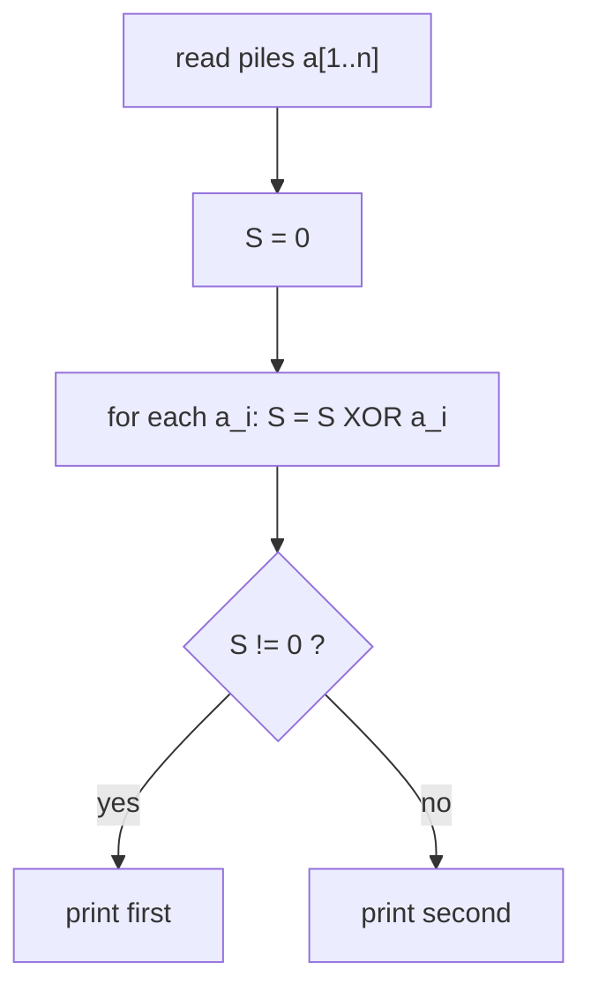
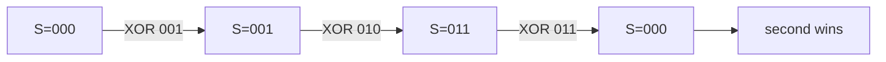

# Nim Game — Classic XOR Test

| | |
|---|---|
| **Source** | CSES Problem Set — Game Theory (Nim) |
| **Difficulty** | Easy |
| **Topics** | Game theory, Nim, Bouton's theorem, Bitwise XOR |
| **Link** | https://cses.fi/problemset/ |

---

## Problem Statement

There are $n$ piles of stones with sizes $a_1, a_2, \dots, a_n$. Two players alternate turns; the player to move picks **one** pile and removes **any positive number** of stones from it. The player who **cannot move** (all piles empty) **loses**. Both play optimally and the **first player** moves first.

For each test case, decide who wins: print `first` if the first player wins, otherwise `second`.

**Constraints**

$$
1 \le t \le 2 \times 10^5, \qquad 1 \le n \le 2 \times 10^5, \qquad 1 \le a_i \le 10^9.
$$

```
Input
3
3
1 2 3
2
2 2
1
7

Output
second
second
first
```

For piles $\{1,2,3\}$ the Nim-sum is $1 \oplus 2 \oplus 3 = 0$, so the first player loses. For $\{2,2\}$ it is $2 \oplus 2 = 0$ — also a loss. A single pile $\{7\}$ has Nim-sum $7 \ne 0$, so the first player simply takes all $7$ stones and wins.

---

## Approach (WHY)

This is textbook **Nim**, solved by **Bouton's theorem**: the position is a losing (P) position for the mover **iff** the bitwise XOR (the *Nim-sum*) of all pile sizes is $0$.

$$
S = a_1 \oplus a_2 \oplus \cdots \oplus a_n, \qquad \text{first player wins} \iff S \ne 0.
$$

Why: if $S = 0$, *any* move you make changes exactly one pile and forces $S \ne 0$ (you cannot keep two distinct values XOR-equal). If $S \ne 0$, you can always reduce the pile holding the top set bit of $S$ to make the Nim-sum $0$, handing your opponent a losing position. Since the game is finite and the all-zero terminal state has $S = 0$, induction finishes the argument.



---

## Solution

### Python

```python
import sys

def main() -> None:
    data = sys.stdin.buffer.read().split()
    idx = 0
    t = int(data[idx]); idx += 1
    out = []
    for _ in range(t):
        n = int(data[idx]); idx += 1
        nim_sum = 0
        for _ in range(n):
            nim_sum ^= int(data[idx]); idx += 1
        out.append("first" if nim_sum != 0 else "second")
    sys.stdout.write("\n".join(out) + "\n")

if __name__ == "__main__":
    main()
```

### C++

```cpp
#include <bits/stdc++.h>
using namespace std;

int main() {
    ios::sync_with_stdio(false);
    cin.tie(nullptr);

    int t;
    cin >> t;
    while (t--) {
        int n;
        cin >> n;
        long long nim_sum = 0;
        for (int i = 0; i < n; ++i) {
            long long a;
            cin >> a;
            nim_sum ^= a;
        }
        cout << (nim_sum != 0 ? "first" : "second") << '\n';
    }
    return 0;
}
```

---

## Iteration Trace

Piles $\{1, 2, 3\}$, accumulating the Nim-sum:

| Step | Stone count $a_i$ | $a_i$ in binary | Running $S$ | $S$ in binary |
|---|---|---|---|---|
| start | — | — | 0 | 000 |
| 1 | 1 | 001 | 1 | 001 |
| 2 | 2 | 010 | 3 | 011 |
| 3 | 3 | 011 | 0 | 000 |

Final $S = 0 \Rightarrow$ **second** player wins.



---

## Complexity

Let $N = \sum n$ be the total number of piles across all test cases.

$$
\text{Time } = O(N), \qquad \text{Space } = O(1) \text{ beyond input.}
$$

| Aspect | Cost |
|---|---|
| Per test case | $O(n)$ |
| Total | $O(N)$ |
| Extra space | $O(1)$ |

---

## Takeaway

Nim is decided by a single XOR. Memorize **Bouton's rule**: *first player wins iff the Nim-sum is non-zero*. Pile sizes up to $10^9$ fit comfortably in a 64-bit accumulator, and the entire solution is one streaming pass.
