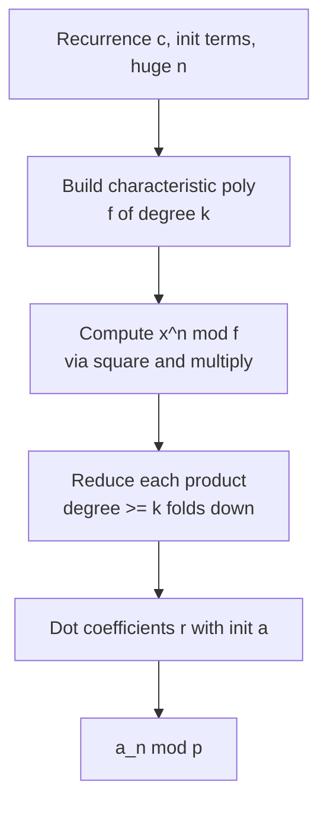
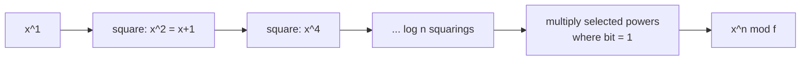

# N-th Term of a Linear Recurrence (Kitamasa)

| | |
| --- | --- |
| **Source** | Classic / CP folklore |
| **Difficulty** | Medium-Hard |
| **Topics** | Linear recurrences, Kitamasa, polynomial exponentiation, modular arithmetic |
| **Link** | https://cses.fi/problemset/ |

---

## Problem Statement

You are given a linear recurrence of order $k$ by its coefficients $c_1, \dots, c_k$ and its first $k$ terms $a_0, \dots, a_{k-1}$:

$$a_n = \sum_{i=1}^{k} c_i \, a_{n-i} \pmod p \qquad (n \ge k).$$

Given a possibly enormous index $n$ (up to $10^{18}$), compute $a_n \bmod p$ with $p = 10^9 + 7$. Iterating term by term is $O(n)$ and far too slow.

```text
Input:
k = 2
c    = [1, 1]            # Fibonacci: a_n = a_{n-1} + a_{n-2}
init = [0, 1]            # a_0 = 0, a_1 = 1
n    = 100

Output:
a_100 mod p = 687995182  # = F(100) mod 1e9+7
```

## Approach (WHY)

The recurrence has **characteristic polynomial** $f(x) = x^k - c_1 x^{k-1} - \cdots - c_k$. The key identity is:

$$\text{if } x^n \bmod f(x) = \sum_{j=0}^{k-1} r_j x^j, \quad \text{then } a_n = \sum_{j=0}^{k-1} r_j \, a_j.$$

So we only need the polynomial $x^n \bmod f(x)$, a degree-$<k$ object. We get it by **fast exponentiation in the ring** $\mathbb{F}_p[x]/(f(x))$: square-and-multiply where each "multiply" is a polynomial product followed by reduction modulo $f$. That is Kitamasa's method, costing $O(k^2 \log n)$.



## Solution

### Python

```python
def kitamasa(rec, init, n, mod=10**9 + 7):
    """rec[i] = c_{i+1}; init = [a_0..a_{k-1}]; return a_n mod p."""
    k = len(rec)
    if n < k:
        return init[n] % mod

    def mul(a, b):
        res = [0] * (len(a) + len(b) - 1)
        for i, av in enumerate(a):
            if av:
                for j, bv in enumerate(b):
                    res[i + j] = (res[i + j] + av * bv) % mod
        for i in range(len(res) - 1, k - 1, -1):
            coef = res[i]
            if coef:
                res[i] = 0
                for j in range(k):
                    res[i - 1 - j] = (res[i - 1 - j] + coef * rec[j]) % mod
        return res[:k]

    result = [1]
    base = [0, 1] if k > 1 else [rec[0] % mod]
    e = n
    while e > 0:
        if e & 1:
            result = mul(result, base)
        base = mul(base, base)
        e >>= 1
    ans = 0
    for i in range(min(k, len(result))):
        ans = (ans + result[i] * init[i]) % mod
    return ans


if __name__ == "__main__":
    print(kitamasa([1, 1], [0, 1], 100))   # F(100) mod 1e9+7
```

### C++

```cpp
#include <bits/stdc++.h>
using namespace std;
const long long MOD = 1e9 + 7;

long long kitamasa(const vector<long long>& rec,
                   const vector<long long>& init, long long n) {
    int k = (int)rec.size();
    if (n < k) return init[n] % MOD;

    auto mul = [&](const vector<long long>& a,
                   const vector<long long>& b) {
        vector<long long> res(a.size() + b.size() - 1, 0);
        for (int i = 0; i < (int)a.size(); i++)
            if (a[i])
                for (int j = 0; j < (int)b.size(); j++)
                    res[i + j] = (res[i + j] + a[i] * b[j]) % MOD;
        for (int i = (int)res.size() - 1; i >= k; i--) {
            long long coef = res[i];
            if (coef) {
                res[i] = 0;
                for (int j = 0; j < k; j++)
                    res[i - 1 - j] =
                        (res[i - 1 - j] + coef * rec[j]) % MOD;
            }
        }
        res.resize(k);
        return res;
    };

    vector<long long> result(k, 0), base(k, 0);
    result[0] = 1;
    if (k > 1) base[1] = 1;
    else base[0] = rec[0] % MOD;

    long long e = n;
    while (e > 0) {
        if (e & 1) result = mul(result, base);
        base = mul(base, base);
        e >>= 1;
    }
    long long ans = 0;
    for (int i = 0; i < k; i++)
        ans = (ans + result[i] * init[i]) % MOD;
    return ans;
}

int main() {
    cout << kitamasa({1, 1}, {0, 1}, 100) << "\n";  // F(100) mod 1e9+7
    return 0;
}
```

## Iteration Trace

Computing $x^{100} \bmod f(x)$ with $f(x) = x^2 - x - 1$ (so reduction rule $x^2 \equiv x + 1$). Binary of $100 = 1100100_2$; we track `result` (accumulator) and `base` ($x^{2^t} \bmod f$):

| bit $t$ | bit value | `base` $= x^{2^t} \bmod f$ | `result` after mul |
| --- | --- | --- | --- |
| 0 | 0 | $x$ | $1$ |
| 1 | 0 | $x + 1$ | $1$ |
| 2 | 1 | $2x + 1$ | $2x + 1$ |
| 3 | 0 | $5x + 3$ | $2x + 1$ |
| 4 | 0 | $34x + 21$ | $2x + 1$ |
| 5 | 1 | $1597x + 987$ | reduce $\Rightarrow$ folds in |
| 6 | 1 | — | final $r_0, r_1$ |

Finally $a_{100} = r_0 a_0 + r_1 a_1 = r_0 \cdot 0 + r_1 \cdot 1 = r_1$, giving $687995182$.



## Complexity

Each squaring multiplies two degree-$<k$ polynomials and reduces modulo $f$, both $O(k^2)$, repeated $\log_2 n$ times:

$$T = O(k^2 \log n).$$

With NTT-based multiplication this improves to $O(k \log k \log n)$.

| Resource | Cost |
| --- | --- |
| Time (schoolbook) | $O(k^2 \log n)$ |
| Time (NTT) | $O(k \log k \log n)$ |
| Space | $O(k)$ |
| Compare: matrix power | $O(k^3 \log n)$ |

## Takeaway

Kitamasa evaluates the $n$-th term of an order-$k$ linear recurrence in $O(k^2 \log n)$ — a factor of $k$ faster than matrix exponentiation — by reducing the task to computing $x^n \bmod f(x)$ and dotting with the initial terms. It is the go-to tool once $k$ exceeds a handful and $n$ is astronomically large.
