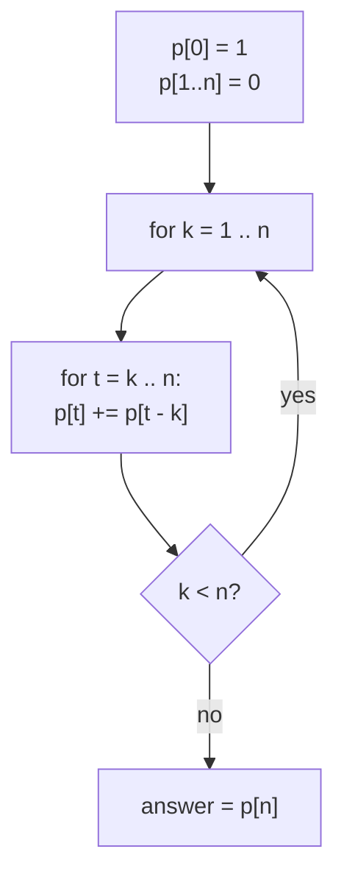
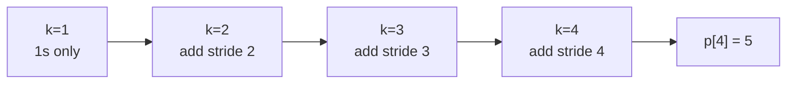

# Integer Partitions of n (Generating Functions)

| | |
|---|---|
| **Source** | Classic — Partition Function $p(n)$ |
| **Difficulty** | Medium |
| **Topics** | Generating functions, OGF, partitions, Euler product |
| **Link** | https://cses.fi/problemset/ |

---

## Problem Statement

A **partition** of a positive integer $n$ is a way of writing $n$ as a sum of positive integers where order does not matter. For example, the partitions of $4$ are

$$4,\quad 3+1,\quad 2+2,\quad 2+1+1,\quad 1+1+1+1,$$

so $p(4) = 5$. Given $n$, compute the partition number $p(n)$ modulo $10^9 + 7$.

**Constraints**

$$
1 \le n \le 10^5.
$$

```
Input
4

Output
5
```

For $n = 4$ there are exactly $5$ partitions listed above. (For reference, $p(0)=1$, $p(1)=1$, $p(2)=2$, $p(3)=3$, $p(5)=7$.)

---

## Approach (WHY)

A partition chooses, for each part size $k \in \{1, 2, 3, \dots\}$, how many copies of $k$ to include — independently. Using $m$ copies of part $k$ contributes value $mk$. The choices for part size $k$ are encoded by

$$1 + x^{k} + x^{2k} + x^{3k} + \cdots = \frac{1}{1 - x^{k}}.$$

Because part sizes are chosen independently, multiply over all $k$ to get **Euler's partition generating function**:

$$P(x) = \prod_{k \ge 1} \frac{1}{1 - x^{k}} = \sum_{n \ge 0} p(n)\, x^n.$$

The answer is $[x^n]P(x)$. As with coin counting, we multiply factor by factor truncating to degree $n$, but here the "denominations" are *all* integers $1, 2, \dots, n$ (parts larger than $n$ cannot appear). Multiplying the running series by $\frac{1}{1 - x^{k}}$ is the recurrence $p[t] \mathrel{+}= p[t-k]$ for $t = k \dots n$.



This $O(n^2)$ method comes straight from the Euler product. A faster $O(n\sqrt n)$ route uses Euler's **pentagonal number theorem**, the reciprocal series $\prod(1-x^k) = \sum_{j} (-1)^j x^{j(3j-1)/2}$, giving the recurrence
$$p(n) = \sum_{j \ge 1} (-1)^{j-1}\left[p\!\left(n - \tfrac{j(3j-1)}{2}\right) + p\!\left(n - \tfrac{j(3j+1)}{2}\right)\right],$$
but the product form below is the clearest generating-function statement.

## Solution

### Python

```python
import sys

def partition_count(n, mod=10**9 + 7):
    # p[t] = [x^t] prod_{k=1}^{n} 1/(1 - x^k)
    p = [0] * (n + 1)
    p[0] = 1
    for k in range(1, n + 1):
        for t in range(k, n + 1):
            p[t] = (p[t] + p[t - k]) % mod
    return p[n]

def main():
    n = int(sys.stdin.readline())
    print(partition_count(n))

if __name__ == "__main__":
    main()
```

### C++

```cpp
#include <bits/stdc++.h>
using namespace std;
const long long MOD = 1e9 + 7;

long long partition_count(int n) {
    // p[t] = [x^t] prod_{k=1}^{n} 1/(1 - x^k)
    vector<long long> p(n + 1, 0);
    p[0] = 1;
    for (int k = 1; k <= n; ++k)
        for (int t = k; t <= n; ++t)
            p[t] = (p[t] + p[t - k]) % MOD;
    return p[n];
}

int main() {
    ios::sync_with_stdio(false);
    cin.tie(nullptr);
    int n;
    cin >> n;
    cout << partition_count(n) << "\n";
    return 0;
}
```

## Iteration Trace

Computing $p(4)$. Showing `p[0..4]` after multiplying in each factor $\frac{1}{1-x^k}$.

| After part size | p[0..4] | Meaning |
|---|---|---|
| init | `1 0 0 0 0` | empty partition only |
| $k=1$ | `1 1 1 1 1` | parts all equal to 1 |
| $k=2$ | `1 1 2 2 3` | allow parts 1 and 2 |
| $k=3$ | `1 1 2 3 4` | allow parts 1,2,3 |
| $k=4$ | `1 1 2 3 5` | allow parts 1,2,3,4 |

The final `p[4] = 5`, matching the five partitions of $4$.



The double loop runs $\sum_{k=1}^{n}(n-k+1) = \tfrac{n(n+1)}{2}$ times, hence

$$T(n) = O(n^2).$$

## Complexity

| Aspect | Cost |
|---|---|
| Time | $O(n^2)$ (Euler product) |
| Space | $O(n)$ |
| Faster alternative | $O(n\sqrt n)$ via pentagonal recurrence |

## Takeaway

The partition function is the coefficient sequence of Euler's product $\prod_{k\ge1}\frac{1}{1-x^k}$. Multiplying the factors one part size at a time is the generating-function realization of the partition DP — and recognizing the reciprocal as the pentagonal series unlocks the faster $O(n\sqrt n)$ recurrence.
