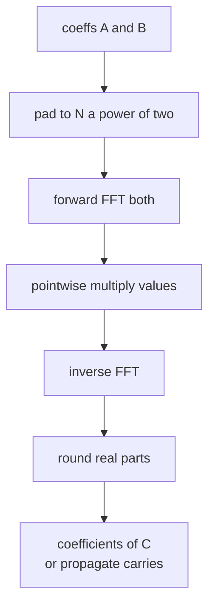
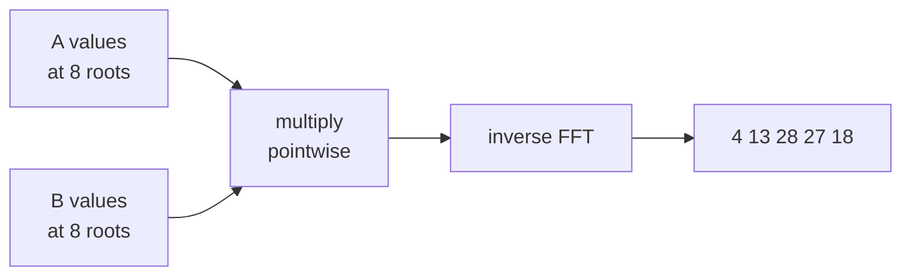

# Polynomial Multiplication / Big-Integer Multiply via FFT

| | |
| --- | --- |
| **Source** | Classic (CSES Polynomial Multiplication style) |
| **Difficulty** | Medium–Hard |
| **Topics** | FFT, Convolution, Polynomials, Big Integers |
| **Link** | https://cses.fi/problemset/ |

---

## Problem Statement

You are given two polynomials by their coefficient arrays:

$$A(x) = \sum_{i=0}^{n-1} a_i x^i, \qquad B(x) = \sum_{j=0}^{m-1} b_j x^j.$$

Compute the coefficients of the product $C(x) = A(x)B(x)$, where

$$c_k = \sum_{i=0}^{k} a_i \, b_{k-i}, \qquad k = 0, 1, \dots, n + m - 2.$$

The same routine multiplies two large integers: write each integer's digits as coefficients (least-significant first), convolve, then propagate carries.

Coefficients fit in 32-bit integers and $n, m \le 2 \times 10^5$, so an $O(nm)$ method is too slow. Use FFT for $O((n+m)\log(n+m))$.

```text
Input:
A = [1, 2, 3]        # 1 + 2x + 3x^2
B = [4, 5, 6]        # 4 + 5x + 6x^2

Output:
C = [4, 13, 28, 27, 18]
# (1+2x+3x^2)(4+5x+6x^2) = 4 + 13x + 28x^2 + 27x^3 + 18x^4
```

## Approach (WHY)

Multiplying in coefficient form costs $O(nm)$ because every pair $(a_i, b_j)$ contributes. But in **point-value form** multiplication is pointwise and $O(n)$. The FFT lets us evaluate at $2^t$ roots of unity and interpolate back, each in $O(n\log n)$:

1. Pad $A, B$ to a power-of-two length $N \ge n + m - 1$.
2. Forward FFT both into point-value form.
3. Multiply values pointwise.
4. Inverse FFT to recover coefficients; round to nearest integer.

For big integers, after step 4 sweep low-to-high propagating carries in base $10$ (or base $10^k$).



## Solution

### Python

```python
import cmath

def fft(a, invert):
    n = len(a)
    j = 0
    for i in range(1, n):
        bit = n >> 1
        while j & bit:
            j ^= bit
            bit >>= 1
        j ^= bit
        if i < j:
            a[i], a[j] = a[j], a[i]
    length = 2
    while length <= n:
        angle = (2 * cmath.pi / length) * (-1 if invert else 1)
        wlen = cmath.exp(1j * angle)
        for start in range(0, n, length):
            w = 1 + 0j
            for k in range(length // 2):
                u = a[start + k]
                v = a[start + k + length // 2] * w
                a[start + k] = u + v
                a[start + k + length // 2] = u - v
                w *= wlen
        length <<= 1
    if invert:
        for i in range(n):
            a[i] /= n
    return a

def multiply_fft(a, b):
    result_size = len(a) + len(b) - 1
    n = 1
    while n < result_size:
        n <<= 1
    fa = [complex(x) for x in a] + [0j] * (n - len(a))
    fb = [complex(x) for x in b] + [0j] * (n - len(b))
    fft(fa, False)
    fft(fb, False)
    for i in range(n):
        fa[i] *= fb[i]
    fft(fa, True)
    return [round(fa[i].real) for i in range(result_size)]

def multiply_big_integers(num1, num2):
    a = [int(d) for d in reversed(num1)]
    b = [int(d) for d in reversed(num2)]
    c = multiply_fft(a, b)
    carry = 0
    for i in range(len(c)):
        c[i] += carry
        carry = c[i] // 10
        c[i] %= 10
    while carry:
        c.append(carry % 10)
        carry //= 10
    while len(c) > 1 and c[-1] == 0:
        c.pop()
    return "".join(str(d) for d in reversed(c))

if __name__ == "__main__":
    print(multiply_fft([1, 2, 3], [4, 5, 6]))   # [4, 13, 28, 27, 18]
    print(multiply_big_integers("123", "456"))   # 56088
```

### C++

```cpp
#include <bits/stdc++.h>
using namespace std;

void fft(vector<complex<double>>& a, bool invert) {
    int n = (int)a.size();
    for (int i = 1, j = 0; i < n; ++i) {
        int bit = n >> 1;
        for (; j & bit; bit >>= 1)
            j ^= bit;
        j ^= bit;
        if (i < j)
            swap(a[i], a[j]);
    }
    for (int len = 2; len <= n; len <<= 1) {
        double ang = 2 * acos(-1.0) / len * (invert ? -1 : 1);
        complex<double> wlen(cos(ang), sin(ang));
        for (int start = 0; start < n; start += len) {
            complex<double> w(1, 0);
            for (int k = 0; k < len / 2; ++k) {
                complex<double> u = a[start + k];
                complex<double> v = a[start + k + len / 2] * w;
                a[start + k] = u + v;
                a[start + k + len / 2] = u - v;
                w *= wlen;
            }
        }
    }
    if (invert)
        for (complex<double>& x : a)
            x /= n;
}

vector<long long> multiply_fft(const vector<long long>& a,
                               const vector<long long>& b) {
    int result_size = (int)a.size() + (int)b.size() - 1;
    int n = 1;
    while (n < result_size)
        n <<= 1;
    vector<complex<double>> fa(a.begin(), a.end());
    vector<complex<double>> fb(b.begin(), b.end());
    fa.resize(n);
    fb.resize(n);
    fft(fa, false);
    fft(fb, false);
    for (int i = 0; i < n; ++i)
        fa[i] *= fb[i];
    fft(fa, true);
    vector<long long> c(result_size);
    for (int i = 0; i < result_size; ++i)
        c[i] = llround(fa[i].real());
    return c;
}

string multiply_big_integers(const string& num1, const string& num2) {
    vector<long long> a, b;
    for (int i = (int)num1.size() - 1; i >= 0; --i) a.push_back(num1[i] - '0');
    for (int i = (int)num2.size() - 1; i >= 0; --i) b.push_back(num2[i] - '0');
    vector<long long> c = multiply_fft(a, b);
    long long carry = 0;
    for (size_t i = 0; i < c.size(); ++i) {
        c[i] += carry;
        carry = c[i] / 10;
        c[i] %= 10;
    }
    while (carry) {
        c.push_back(carry % 10);
        carry /= 10;
    }
    while (c.size() > 1 && c.back() == 0)
        c.pop_back();
    string s;
    for (int i = (int)c.size() - 1; i >= 0; --i)
        s += char('0' + c[i]);
    return s;
}

int main() {
    vector<long long> r = multiply_fft({1, 2, 3}, {4, 5, 6});
    for (long long x : r) cout << x << ' ';   // 4 13 28 27 18
    cout << '\n';
    cout << multiply_big_integers("123", "456") << '\n';  // 56088
    return 0;
}
```

## Iteration Trace

Multiplying $A = [1,2,3]$ by $B = [4,5,6]$. Result size $= 5$, so pad to $N = 8$. The convolution sums:

| $k$ | Contributing products | $c_k$ |
| --- | --- | --- |
| 0 | $a_0 b_0 = 1\cdot4$ | 4 |
| 1 | $a_0 b_1 + a_1 b_0 = 5 + 8$ | 13 |
| 2 | $a_0 b_2 + a_1 b_1 + a_2 b_0 = 6 + 10 + 12$ | 28 |
| 3 | $a_1 b_2 + a_2 b_1 = 12 + 15$ | 27 |
| 4 | $a_2 b_2 = 18$ | 18 |

FFT computes these same values via evaluate → pointwise multiply → interpolate, but in $O(N\log N)$ rather than by the table above.



## Complexity

Let $N$ be the padded power-of-two length with $N < 2(n+m)$.

$$T(N) = O(N \log N), \qquad S(N) = O(N).$$

| Aspect | Cost |
| --- | --- |
| Time | $O((n+m)\log(n+m))$ |
| Space | $O(n+m)$ |
| Naive baseline | $O(nm)$ |

## Takeaway

FFT turns the $O(nm)$ coefficient convolution into three $O(N\log N)$ transforms plus an $O(N)$ pointwise multiply. Use `double` FFT when $N \cdot \max|a| \cdot \max|b| \lesssim 10^{15}$; beyond that, switch to NTT or split coefficients. Big-integer multiplication is just convolution of digit arrays followed by carry propagation.
