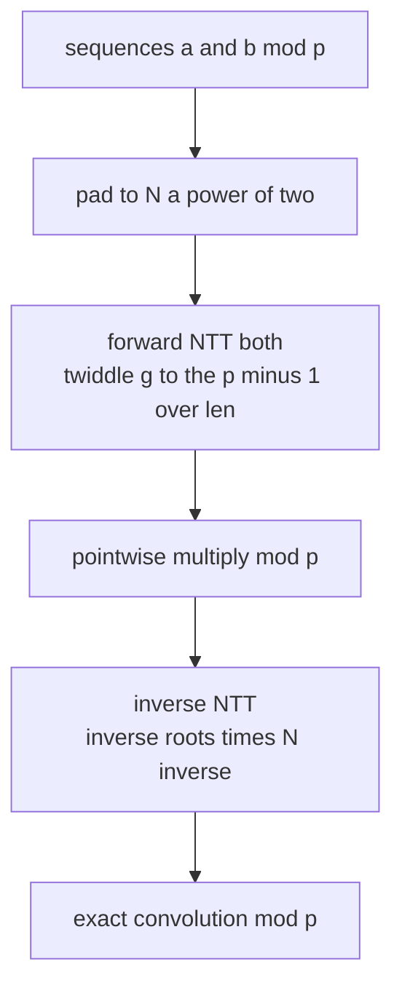
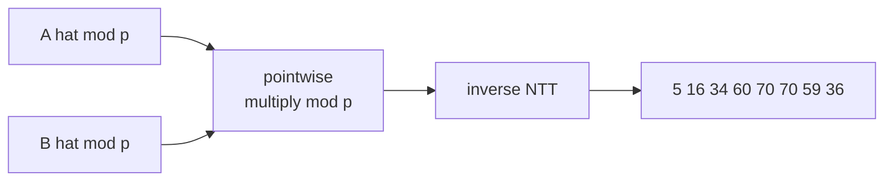

# Exact Polynomial Multiplication mod 998244353 (NTT)

| | |
| --- | --- |
| **Source** | Classic (AtCoder / Library Checker convolution) |
| **Difficulty** | Medium–Hard |
| **Topics** | NTT, Modular Arithmetic, Convolution, Polynomials |
| **Link** | https://cses.fi/problemset/ |

---

## Problem Statement

You are given two sequences $a_0, \dots, a_{n-1}$ and $b_0, \dots, b_{m-1}$ of non-negative integers. Compute their convolution **exactly modulo** the prime

$$p = 998244353 = 119 \cdot 2^{23} + 1,$$

that is, output

$$c_k = \left( \sum_{i=0}^{k} a_i \, b_{k-i} \right) \bmod p, \qquad k = 0, 1, \dots, n + m - 2.$$

Because the answer must be exact mod a prime and coefficients can be large, `double` FFT is unsafe. Use the **Number Theoretic Transform** with primitive root $g = 3$.

```text
Input:
A = [1, 2, 3, 4]
B = [5, 6, 7, 8, 9]

Output (mod 998244353):
C = [5, 16, 34, 60, 70, 70, 59, 36]
# Plain integer convolution; all values are < p so no reduction is visible here.
```

## Approach (WHY)

The NTT mirrors the FFT but works inside the finite field $\mathbb{Z}_p$. Since $p - 1 = 119 \cdot 2^{23}$ is divisible by a large power of two, $\mathbb{Z}_p$ contains $2^k$-th roots of unity for every $k \le 23$. The primitive root $g = 3$ generates them: a primitive $2^k$-th root is $g^{(p-1)/2^k} \bmod p$.

This gives the **same** butterfly algorithm as FFT, but every operation is modular — so results are exact integers mod $p$, with no floating-point rounding.

1. Pad both inputs to a power of two $N \ge n + m - 1$ (and $N \le 2^{23}$).
2. Forward NTT both.
3. Multiply pointwise mod $p$.
4. Inverse NTT (uses inverse roots and multiplies by $N^{-1} \bmod p$).



## Solution

### Python

```python
MOD = 998244353
G = 3

def ntt(a, invert):
    n = len(a)
    j = 0
    for i in range(1, n):
        bit = n >> 1
        while j & bit:
            j ^= bit
            bit >>= 1
        j ^= bit
        if i < j:
            a[i], a[j] = a[j], a[i]
    length = 2
    while length <= n:
        if invert:
            wlen = pow(G, MOD - 1 - (MOD - 1) // length, MOD)
        else:
            wlen = pow(G, (MOD - 1) // length, MOD)
        for start in range(0, n, length):
            w = 1
            for k in range(length // 2):
                u = a[start + k]
                v = a[start + k + length // 2] * w % MOD
                a[start + k] = (u + v) % MOD
                a[start + k + length // 2] = (u - v) % MOD
                w = w * wlen % MOD
        length <<= 1
    if invert:
        n_inv = pow(n, MOD - 2, MOD)
        for i in range(n):
            a[i] = a[i] * n_inv % MOD
    return a

def multiply_ntt(a, b):
    result_size = len(a) + len(b) - 1
    n = 1
    while n < result_size:
        n <<= 1
    fa = [x % MOD for x in a] + [0] * (n - len(a))
    fb = [x % MOD for x in b] + [0] * (n - len(b))
    ntt(fa, False)
    ntt(fb, False)
    for i in range(n):
        fa[i] = fa[i] * fb[i] % MOD
    ntt(fa, True)
    return [fa[i] % MOD for i in range(result_size)]

if __name__ == "__main__":
    print(multiply_ntt([1, 2, 3, 4], [5, 6, 7, 8, 9]))
    # [5, 16, 34, 60, 70, 70, 59, 36]
```

### C++

```cpp
#include <bits/stdc++.h>
using namespace std;

const long long MOD = 998244353;
const long long G = 3;

long long power_mod(long long base, long long exp, long long mod) {
    long long result = 1 % mod;
    base %= mod;
    while (exp > 0) {
        if (exp & 1)
            result = result * base % mod;
        base = base * base % mod;
        exp >>= 1;
    }
    return result;
}

void ntt(vector<long long>& a, bool invert) {
    int n = (int)a.size();
    for (int i = 1, j = 0; i < n; ++i) {
        int bit = n >> 1;
        for (; j & bit; bit >>= 1)
            j ^= bit;
        j ^= bit;
        if (i < j)
            swap(a[i], a[j]);
    }
    for (int len = 2; len <= n; len <<= 1) {
        long long wlen = invert
            ? power_mod(G, MOD - 1 - (MOD - 1) / len, MOD)
            : power_mod(G, (MOD - 1) / len, MOD);
        for (int start = 0; start < n; start += len) {
            long long w = 1;
            for (int k = 0; k < len / 2; ++k) {
                long long u = a[start + k];
                long long v = a[start + k + len / 2] * w % MOD;
                a[start + k] = (u + v) % MOD;
                a[start + k + len / 2] = (u - v % MOD + MOD) % MOD;
                w = w * wlen % MOD;
            }
        }
    }
    if (invert) {
        long long n_inv = power_mod(n, MOD - 2, MOD);
        for (long long& x : a)
            x = x * n_inv % MOD;
    }
}

vector<long long> multiply_ntt(const vector<long long>& a,
                               const vector<long long>& b) {
    int result_size = (int)a.size() + (int)b.size() - 1;
    int n = 1;
    while (n < result_size)
        n <<= 1;
    vector<long long> fa(n, 0), fb(n, 0);
    for (size_t i = 0; i < a.size(); ++i) fa[i] = ((a[i] % MOD) + MOD) % MOD;
    for (size_t i = 0; i < b.size(); ++i) fb[i] = ((b[i] % MOD) + MOD) % MOD;
    ntt(fa, false);
    ntt(fb, false);
    for (int i = 0; i < n; ++i)
        fa[i] = fa[i] * fb[i] % MOD;
    ntt(fa, true);
    fa.resize(result_size);
    return fa;
}

int main() {
    vector<long long> c = multiply_ntt({1, 2, 3, 4}, {5, 6, 7, 8, 9});
    for (long long x : c) cout << x << ' ';   // 5 16 34 60 70 70 59 36
    cout << '\n';
    return 0;
}
```

## Iteration Trace

Convolving $A = [1,2,3,4]$ with $B = [5,6,7,8,9]$. Result size $= 8$, already a power of two so $N = 8$.

| $k$ | Sum $\sum_i a_i b_{k-i}$ | $c_k \bmod p$ |
| --- | --- | --- |
| 0 | $1\cdot5$ | 5 |
| 1 | $1\cdot6 + 2\cdot5$ | 16 |
| 2 | $1\cdot7 + 2\cdot6 + 3\cdot5$ | 34 |
| 3 | $1\cdot8 + 2\cdot7 + 3\cdot6 + 4\cdot5$ | 60 |
| 4 | $1\cdot9 + 2\cdot8 + 3\cdot7 + 4\cdot6$ | 70 |
| 5 | $2\cdot9 + 3\cdot8 + 4\cdot7$ | 70 |
| 6 | $3\cdot9 + 4\cdot8$ | 59 |
| 7 | $4\cdot9$ | 36 |

NTT reaches these exact values through modular butterflies; here all are below $p$ so the mod is invisible, but for large inputs each $c_k$ is reduced mod $998244353$.



## Complexity

With padded length $N$ (a power of two, $N \le 2^{23}$):

$$T(N) = O(N \log N), \qquad S(N) = O(N).$$

| Aspect | Cost |
| --- | --- |
| Time | $O((n+m)\log(n+m))$ |
| Space | $O(n+m)$ |
| Naive baseline | $O(nm)$ |
| Max transform size | $2^{23} = 8388608$ |

## Takeaway

NTT is FFT done in a finite field: same butterflies, but with modular roots of unity $g^{(p-1)/\text{len}}$ instead of complex ones. With $p = 998244353$ and $g = 3$ it yields **exact** convolutions mod a prime, free of floating-point error — the go-to tool when answers must be modular or coefficients exceed the safe `double` FFT range. For transforms larger than $2^{23}$ or other moduli, combine several NTT primes via CRT.
