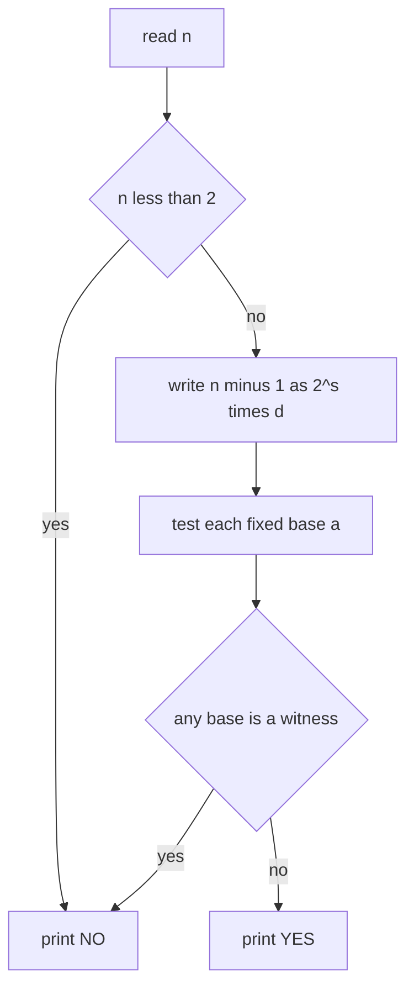

# Primality Testing for Large Numbers with Miller-Rabin

| Field | Value |
|---|---|
| Source | Self-contained (classic: SPOJ PON / primality) |
| Difficulty | Medium |
| Topics | Miller-Rabin, modular exponentiation, primality |
| Link | https://www.spoj.com/problems/PON/ |

---

## Problem Statement

You are given $q$ queries. Each query is an integer $n$ with $1 \le n \le 10^{18}$. For each query, print `YES` if $n$ is prime and `NO` otherwise.

A prime is an integer $n \ge 2$ whose only positive divisors are $1$ and $n$.

Constraints: $1 \le q \le 10^5$, $1 \le n \le 10^{18}$.

```text
Input:
5
1
2
1000000007
1000000000000000000
1000000000000000003

Output:
NO
YES
YES
NO
YES
```

Here $1$ is not prime, $2$ and $10^9+7$ are prime, $10^{18} = 2^{18}\cdot 5^{18}$ is composite, and $10^{18}+3$ is prime.

## Approach (WHY)

Trial division to $\sqrt n \approx 10^9$ per query, times $10^5$ queries, is impossible. But primality does **not** require finding a factor — the **deterministic Miller-Rabin** test answers it in $O(\log^3 n)$ per query.

Write $n - 1 = 2^s \cdot d$ with $d$ odd. For each base $a$, check whether the chain $a^d, a^{2d}, \dots, a^{2^{s-1}d} \pmod n$ ever exhibits a square root of $1$ other than $\pm 1$; if so, $a$ witnesses that $n$ is composite. Testing the fixed base set $\{2,3,5,7,11,13,17,19,23,29,31,37\}$ is **provably correct for all $n < 2^{64}$**.

The only 64-bit subtlety: $a^2 \bmod n$ with $a$ near $2^{64}$ overflows, so C++ multiplies through a 128-bit intermediate (`__int128`); Python's big ints handle it natively.



## Solution

### Python

```python
import sys


def is_prime(n: int) -> bool:
    if n < 2:
        return False
    small = (2, 3, 5, 7, 11, 13, 17, 19, 23, 29, 31, 37)
    for p in small:
        if n == p:
            return True
        if n % p == 0:
            return False
    d, s = n - 1, 0
    while d % 2 == 0:
        d //= 2
        s += 1
    for a in small:
        x = pow(a, d, n)            # fast modular exponentiation
        if x == 1 or x == n - 1:
            continue
        for _ in range(s - 1):
            x = x * x % n
            if x == n - 1:
                break
        else:
            return False           # a is a witness => composite
    return True


def solve() -> None:
    data = sys.stdin.buffer.read().split()
    q = int(data[0])
    out = []
    for i in range(1, q + 1):
        n = int(data[i])
        out.append("YES" if is_prime(n) else "NO")
    sys.stdout.write("\n".join(out) + "\n")


if __name__ == "__main__":
    solve()
```

### C++

```cpp
#include <bits/stdc++.h>
using namespace std;

using u64 = uint64_t;
using u128 = __uint128_t;

u64 mulmod(u64 a, u64 b, u64 n) { return (u64)((u128)a * b % n); }

u64 powmod(u64 a, u64 e, u64 n) {
    u64 r = 1; a %= n;
    while (e) { if (e & 1) r = mulmod(r, a, n); a = mulmod(a, a, n); e >>= 1; }
    return r;
}

bool is_prime(u64 n) {
    if (n < 2) return false;
    for (u64 p : {2, 3, 5, 7, 11, 13, 17, 19, 23, 29, 31, 37}) {
        if (n == p) return true;
        if (n % p == 0) return false;
    }
    u64 d = n - 1; int s = 0;
    while ((d & 1) == 0) { d >>= 1; ++s; }
    for (u64 a : {2, 3, 5, 7, 11, 13, 17, 19, 23, 29, 31, 37}) {
        u64 x = powmod(a, d, n);
        if (x == 1 || x == n - 1) continue;
        bool composite = true;
        for (int i = 0; i < s - 1; ++i) {
            x = mulmod(x, x, n);
            if (x == n - 1) { composite = false; break; }
        }
        if (composite) return false;   // a is a witness
    }
    return true;
}

int main() {
    ios_base::sync_with_stdio(false);
    cin.tie(nullptr);
    int q; 
    if (!(cin >> q)) return 0;
    while (q--) {
        u64 n; cin >> n;
        cout << (is_prime(n) ? "YES" : "NO") << "\n";
    }
    return 0;
}
```

## Iteration Trace

Testing $n = 561$ (a Carmichael number, $561 = 3 \times 11 \times 17$) with base $a = 2$. Here $n - 1 = 560 = 2^4 \cdot 35$, so $s = 4$, $d = 35$.

| Stage | Value computed | Result |
|---|---|---|
| $x = 2^{35} \bmod 561$ | $263$ | not $1$, not $560$ |
| square once | $263^2 \bmod 561 = 166$ | not $560$ |
| square twice | $166^2 \bmod 561 = 67$ | not $560$ |
| square thrice | $67^2 \bmod 561 = 1$ | reached $1$ without passing $560$ |

Because a $1$ appeared whose previous value ($67$) was not $\pm 1$, base $2$ is a **witness**: $561$ is composite. Fermat's test alone would be fooled here, but Miller-Rabin catches it.


## Complexity

Each test runs $12$ bases, each costing one $O(\log n)$ exponentiation plus up to $s = O(\log n)$ squarings:

$$
T(n) = O(\log^3 n) \text{ per query}, \qquad O(q \log^3 n) \text{ total}.
$$

| Aspect | Complexity |
|---|---|
| `powmod` per base | $O(\log n)$ multiplications |
| Miller-Rabin per number | $O(\log^3 n)$ |
| All $q$ queries | $O(q \log^3 n)$ |
| Extra space | $O(1)$ |

## Takeaway

To test primality of huge numbers, **never look for a factor** — run deterministic Miller-Rabin with the fixed 12-base witness set, valid for every $n < 2^{64}$. The one trap is 64-bit overflow during $a \cdot a \bmod n$: route it through `__int128` in C++ (Python big ints are immune).
