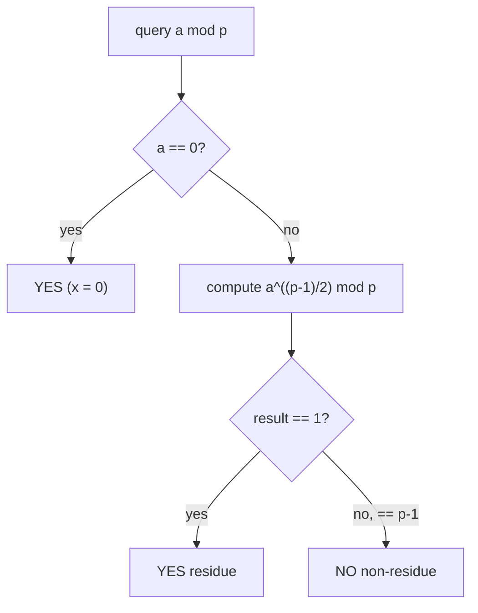
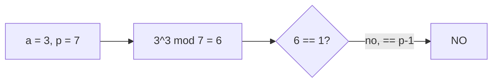

# Quadratic Residue Check (Euler Criterion)

| | |
| --- | --- |
| **Source** | Classic number theory (CSES-style queries) |
| **Difficulty** | Easy–Medium |
| **Topics** | Modular arithmetic, quadratic residues, Euler criterion, Legendre symbol |
| **Link** | https://cses.fi/problemset/ |

---

## Problem Statement

You are given an odd prime $p$ and $Q$ queries. Each query gives an integer $a$ ($0 \le a < p$). For each query, output `YES` if $a$ is a **quadratic residue** modulo $p$ — i.e. there exists $x$ with $x^{2} \equiv a \pmod p$ — and `NO` otherwise.

By convention $a = 0$ is a residue ($x = 0$).

Constraints (typical): $p$ prime, $2 < p < 10^{18}$, $1 \le Q \le 2\cdot 10^{5}$.

```
Input
  p Q
  a_1
  a_2
  ...
  a_Q

Output
  YES / NO for each query

Example
  Input:
    7 4
    0
    1
    2
    3
  Output:
    YES      (0 = 0^2)
    YES      (1 = 1^2)
    YES      (2 = 3^2 = 9 = 2 mod 7)
    NO       (3 is a non-residue mod 7)
```

## Approach (WHY)

Among the non-zero residues mod an odd prime $p$, exactly half are quadratic residues. **Euler's criterion** gives an $O(\log p)$ membership test without ever computing a square root:

$$a^{(p-1)/2} \equiv \begin{cases} +1 \pmod p & a \text{ is a quadratic residue},\\ -1 \pmod p & a \text{ is a non-residue},\end{cases}$$

for $a \not\equiv 0$. The value equals the Legendre symbol $\left(\frac{a}{p}\right)$. The case $a \equiv 0$ is a residue by definition. Each query is therefore a single modular exponentiation.



## Solution

### Python

```python
import sys

def is_quadratic_residue(a, p):
    """True if a is a QR mod odd prime p (a may be 0)."""
    a %= p
    if a == 0:
        return True
    return pow(a, (p - 1) // 2, p) == 1

def main():
    data = sys.stdin.read().split()
    idx = 0
    p = int(data[idx]); idx += 1
    q = int(data[idx]); idx += 1
    out = []
    for _ in range(q):
        a = int(data[idx]); idx += 1
        out.append("YES" if is_quadratic_residue(a, p) else "NO")
    print("\n".join(out))

if __name__ == "__main__":
    main()
```

### C++

```cpp
#include <bits/stdc++.h>
using namespace std;

long long pmod(long long b, long long e, long long m) {
    long long r = 1 % m;
    b %= m;
    while (e) {
        if (e & 1) r = (__int128)r * b % m;
        b = (__int128)b * b % m;
        e >>= 1;
    }
    return r;
}

// True if a is a QR mod odd prime p (a may be 0).
bool is_quadratic_residue(long long a, long long p) {
    a %= p;
    if (a == 0) return true;
    return pmod(a, (p - 1) / 2, p) == 1;
}

int main() {
    ios::sync_with_stdio(false);
    cin.tie(nullptr);
    long long p;
    int q;
    if (!(cin >> p >> q)) return 0;
    string out;
    for (int i = 0; i < q; ++i) {
        long long a;
        cin >> a;
        out += is_quadratic_residue(a, p) ? "YES\n" : "NO\n";
    }
    cout << out;
    return 0;
}
```

## Iteration Trace

Example: $p = 7$, exponent $(p-1)/2 = 3$. We evaluate $a^{3} \bmod 7$:

| $a$ | $a^{3} \bmod 7$ | meaning | output |
| --- | --- | --- | --- |
| 0 | — | special: $0 = 0^2$ | YES |
| 1 | $1$ | $+1$ → residue | YES |
| 2 | $8 \equiv 1$ | $+1$ → residue | YES |
| 3 | $27 \equiv 6$ | $-1$ → non-residue | NO |
| 4 | $64 \equiv 1$ | $+1$ → residue | YES |
| 5 | $125 \equiv 6$ | $-1$ → non-residue | NO |
| 6 | $216 \equiv 6$ | $-1$ → non-residue | NO |

The residues mod 7 are $\{0, 1, 2, 4\}$ — exactly $1 + (p-1)/2 = 4$ values, matching the "half are residues" rule.



## Complexity

Each query is one modular exponentiation; reading input dominates only the constant factor.

$$T = O(Q \log p), \qquad S = O(1)\ \text{(excluding output buffer)}.$$

| Aspect | Cost |
| --- | --- |
| Per query (Euler criterion) | $O(\log p)$ |
| All $Q$ queries | $O(Q \log p)$ |
| Extra space | $O(1)$ |

## Takeaway

Euler's criterion answers "is $a$ a square mod $p$?" in a single $O(\log p)$ exponentiation, returning $+1$ for residues and $-1$ for non-residues (the Legendre symbol). Treat $a \equiv 0$ as a residue. This is the cheap feasibility gate you run before any square-root construction such as Tonelli–Shanks, and in C++ guard modular products with `__int128` for large primes.
