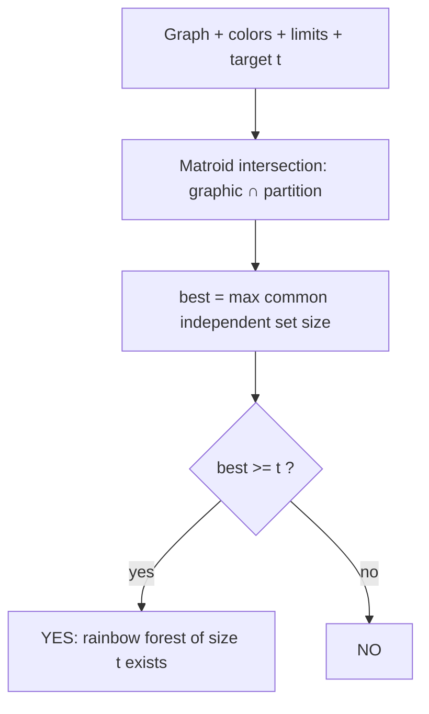
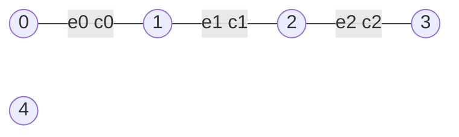

# Rainbow Forest Feasibility

| Field | Value |
| --- | --- |
| Source | Matroid intersection (graphic ∩ partition), rainbow structures |
| Difficulty | Hard |
| Topics | Matroids, Matroid Intersection, Graphic Matroid, Partition Matroid, DSU, BFS, Feasibility |
| Link | [Matroid intersection — Wikipedia](https://en.wikipedia.org/wiki/Matroid_intersection) |

---

## Problem Statement

You are given an undirected graph with $n$ vertices and $m$ colored edges. Edge $i$ has color $c_i \in \{0, \dots, k-1\}$. For each color $j$ there is a limit $d_j$ on how many edges of that color may be used.

Given a target size $t$, decide whether there exists a **forest** (acyclic edge set) of **exactly $t$ edges** that respects every per-color limit (at most $d_j$ edges of color $j$). Such a forest is called a **rainbow forest** when the limits are $1$.

Output `YES` if a feasible forest of size $t$ exists, otherwise `NO`.

Model on the edge ground set:

- $M_1$ = **graphic matroid** (forest / acyclic).
- $M_2$ = **partition matroid** by color with capacities $d_j$.

A feasible forest of size $t$ exists iff the largest common independent set has size $\ge t$:

$$
\text{feasible}(t) \iff \max_{S \in \mathcal{I}_1 \cap \mathcal{I}_2} |S| \;\ge\; t .
$$

(The hereditary axiom guarantees that if a common independent set of size $\ge t$ exists, one of size *exactly* $t$ exists by dropping elements.)

```text
Input:
n = 5, m = 6, k = 3
edges:  e0: 0-1 c0   e1: 1-2 c1   e2: 2-3 c2
        e3: 3-4 c0   e4: 0-2 c1   e5: 1-3 c2
limits: d = [1, 1, 1]
t = 3

Output:
YES
(max common independent set has size 3 >= t)
```

## Approach (WHY)

"Acyclic" is independence in the **graphic matroid**; "at most $d_j$ edges of color $j$" is independence in a **partition matroid**. A set satisfying both of size $t$ is a common independent set. Compute the **maximum** common independent set via matroid intersection, then compare to $t$. Because both matroids are hereditary, any size between $0$ and the maximum is also achievable, so checking $\max \ge t$ is sufficient and necessary.



## Solution

### Python

```python
from collections import deque
from typing import List, Optional, Tuple


class DSU:
    def __init__(self, n: int):
        self.p = list(range(n))

    def find(self, x: int) -> int:
        while self.p[x] != x:
            self.p[x] = self.p[self.p[x]]
            x = self.p[x]
        return x

    def union(self, a: int, b: int) -> bool:
        ra, rb = self.find(a), self.find(b)
        if ra == rb:
            return False
        self.p[ra] = rb
        return True


def is_forest(edges: List[Tuple[int, int]], n: int, subset: List[int]) -> bool:
    dsu = DSU(n)
    for i in subset:
        u, v = edges[i]
        if not dsu.union(u, v):
            return False
    return True


def color_ok(colors: List[int], limit: List[int], subset: List[int]) -> bool:
    used = [0] * len(limit)
    for i in subset:
        c = colors[i]
        used[c] += 1
        if used[c] > limit[c]:
            return False
    return True


def max_rainbow_forest(n: int, edges: List[Tuple[int, int]],
                       colors: List[int], limit: List[int]) -> int:
    m = len(edges)
    S = [False] * m

    def subset(extra: Optional[int], removed: Optional[int]) -> List[int]:
        s = [i for i in range(m) if S[i] and i != removed]
        if extra is not None:
            s.append(extra)
        return s

    def indep1(extra, removed):
        return is_forest(edges, n, subset(extra, removed))

    def indep2(extra, removed):
        return color_ok(colors, limit, subset(extra, removed))

    while True:
        in_set = [i for i in range(m) if S[i]]
        out_set = [i for i in range(m) if not S[i]]

        X1 = [x for x in out_set if indep1(x, None)]
        X2 = set(x for x in out_set if indep2(x, None))

        adj = {i: [] for i in range(m)}
        for y in in_set:
            for x in out_set:
                if indep1(x, y):      # y -> x
                    adj[y].append(x)
                if indep2(x, y):      # x -> y
                    adj[x].append(y)

        prev = {s: -1 for s in X1}
        dq = deque(X1)
        found = -1
        while dq:
            u = dq.popleft()
            if u in X2:
                found = u
                break
            for w in adj[u]:
                if w not in prev:
                    prev[w] = u
                    dq.append(w)
        if found == -1:
            break

        node = found
        while node != -1:
            S[node] = not S[node]
            node = prev[node]

    return sum(S)


def rainbow_forest_feasible(n: int, edges: List[Tuple[int, int]],
                            colors: List[int], limit: List[int], t: int) -> bool:
    return max_rainbow_forest(n, edges, colors, limit) >= t


if __name__ == "__main__":
    n = 5
    edges = [(0, 1), (1, 2), (2, 3), (3, 4), (0, 2), (1, 3)]
    colors = [0, 1, 2, 0, 1, 2]
    limit = [1, 1, 1]
    t = 3
    print("YES" if rainbow_forest_feasible(n, edges, colors, limit, t) else "NO")
```

### C++

```cpp
#include <bits/stdc++.h>
using namespace std;

struct DSU {
    vector<int> p;
    explicit DSU(int n) : p(n) { iota(p.begin(), p.end(), 0); }
    int find(int x) {
        while (p[x] != x) { p[x] = p[p[x]]; x = p[x]; }
        return x;
    }
    bool unite(int a, int b) {
        int ra = find(a), rb = find(b);
        if (ra == rb) return false;
        p[ra] = rb;
        return true;
    }
};

static bool isForest(const vector<pair<int,int>>& edges, int n,
                     const vector<int>& subset) {
    DSU dsu(n);
    for (int i : subset)
        if (!dsu.unite(edges[i].first, edges[i].second)) return false;
    return true;
}

static bool colorOk(const vector<int>& colors, const vector<int>& limit,
                    const vector<int>& subset) {
    vector<int> used(limit.size(), 0);
    for (int i : subset) {
        int c = colors[i];
        if (++used[c] > limit[c]) return false;
    }
    return true;
}

int maxRainbowForest(int n, const vector<pair<int,int>>& edges,
                     const vector<int>& colors, const vector<int>& limit) {
    int m = static_cast<int>(edges.size());
    vector<char> S(m, 0);

    auto subset = [&](int extra, int removed) {
        vector<int> s;
        for (int i = 0; i < m; ++i)
            if (S[i] && i != removed) s.push_back(i);
        if (extra != -1) s.push_back(extra);
        return s;
    };
    auto indep1 = [&](int extra, int removed) {
        return isForest(edges, n, subset(extra, removed));
    };
    auto indep2 = [&](int extra, int removed) {
        return colorOk(colors, limit, subset(extra, removed));
    };

    while (true) {
        vector<int> inSet, outSet;
        for (int i = 0; i < m; ++i) (S[i] ? inSet : outSet).push_back(i);

        vector<int> X1;
        vector<char> isX2(m, 0);
        for (int x : outSet) {
            if (indep1(x, -1)) X1.push_back(x);
            if (indep2(x, -1)) isX2[x] = 1;
        }

        vector<vector<int>> adj(m);
        for (int y : inSet)
            for (int x : outSet) {
                if (indep1(x, y)) adj[y].push_back(x);  // y -> x
                if (indep2(x, y)) adj[x].push_back(y);  // x -> y
            }

        vector<int> prev(m, -2);
        queue<int> q;
        for (int s : X1) { prev[s] = -1; q.push(s); }
        int found = -1;
        while (!q.empty()) {
            int u = q.front(); q.pop();
            if (isX2[u]) { found = u; break; }
            for (int w : adj[u])
                if (prev[w] == -2) { prev[w] = u; q.push(w); }
        }
        if (found == -1) break;

        for (int node = found; node != -1; node = prev[node])
            S[node] = !S[node];
    }

    int sz = 0;
    for (char b : S) sz += b;
    return sz;
}

bool rainbowForestFeasible(int n, const vector<pair<int,int>>& edges,
                           const vector<int>& colors,
                           const vector<int>& limit, int t) {
    return maxRainbowForest(n, edges, colors, limit) >= t;
}

int main() {
    int n = 5;
    vector<pair<int,int>> edges = {{0,1},{1,2},{2,3},{3,4},{0,2},{1,3}};
    vector<int> colors = {0,1,2,0,1,2};
    vector<int> limit = {1,1,1};
    int t = 3;
    cout << (rainbowForestFeasible(n, edges, colors, limit, t) ? "YES" : "NO")
         << "\n";
    return 0;
}
```

## Iteration Trace

Edges `e0..e5`, colors `[0,1,2,0,1,2]`, limits `[1,1,1]`, target $t = 3$.

| Phase | $S$ before | $X_1$ | $X_2$ | Path | $S$ after | $|S|$ |
| --- | --- | --- | --- | --- | --- | --- |
| 1 | $\{\}$ | all | all | e0 | $\{e0\}$ | 1 |
| 2 | $\{e0\}$ | e1,e2,e3,e4,e5 | e1,e2 (colors 1,2 free) | e1 | $\{e0,e1\}$ | 2 |
| 3 | $\{e0,e1\}$ | e2,e3,e5 | e2 | e2 | $\{e0,e1,e2\}$ | 3 |
| stop | $\{e0,e1,e2\}$ | — | colors 0,1,2 all full | — | — | 3 |

Max common independent set size $= 3 \ge t = 3 \Rightarrow$ **YES**. With limits $[1,1,1]$ the color budget caps the forest at $3$ edges total (one per color), matching the target.



## Complexity

Let $r^{\*} = \max |S| \le \min(n-1, \sum_j d_j)$. The algorithm runs $O(r^{\*})$ phases; each builds an exchange graph with $O(m^2)$ oracle calls of cost $O(m\,\alpha(n))$:

$$
T = O\big(r^{\*} \cdot m^2 \cdot m\,\alpha(n)\big) = O(r^{\*}\,m^3\,\alpha(n)) \subseteq O(n\,m^3\,\alpha(n)).
$$

| Aspect | Complexity |
| --- | --- |
| Phases | $O(r^{\*}) = O(\min(n-1, \sum_j d_j))$ |
| Exchange graph build | $O(m^2)$ oracle calls |
| Oracle cost | $O(m\,\alpha(n))$ |
| BFS per phase | $O(m^2)$ |
| Total time | $O(n\,m^3\,\alpha(n))$ |
| Space | $O(m^2)$ |

## Takeaway

Feasibility of a size-$t$ rainbow forest reduces to a single **matroid intersection** computation: build the maximum common independent set of the graphic and color-partition matroids, then test $\max \ge t$. The hereditary property of matroids makes the "$\ge t$" test equivalent to "exactly $t$ achievable."
