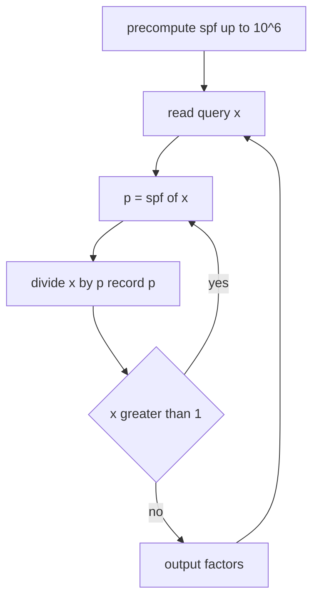

# Fast Prime-Factorization Queries with an SPF Sieve

| Field | Value |
|---|---|
| Source | Self-contained |
| Difficulty | Medium |
| Topics | Smallest prime factor, sieve, factorization |
| Link | https://cses.fi/problemset/ |

---

## Problem Statement

You are given $q$ queries. Each query is an integer $x$ with $2 \le x \le 10^6$. For each query, output the prime factorization of $x$ as a sorted list of primes with multiplicity.

Formally, for each $x$ output primes $p_1 \le p_2 \le \dots \le p_k$ such that

$$
x = p_1 \cdot p_2 \cdots p_k.
$$

Constraints: $1 \le q \le 10^5$, $2 \le x \le 10^6$.

```text
Input:
3
84
1000000
17

Output:
2 2 3 7
2 2 2 2 2 2 5 5 5 5 5 5
17
```

For example $84 = 2^2 \cdot 3 \cdot 7$ and $10^6 = 2^6 \cdot 5^6$.

## Approach (WHY)

With up to $10^5$ queries and values up to $10^6$, per-query trial division costs $O(\sqrt x) = O(10^3)$, for $10^8$ operations worst case — borderline. We can do far better by **precomputing the smallest prime factor (SPF)** of every number up to the maximum bound once.

Build `spf[x]` = the smallest prime dividing $x$ using a modified sieve. Then factorizing any $x$ is: repeatedly take $p = \text{spf}[x]$, divide it out, repeat. Each division removes at least one prime factor, so a number $x$ has at most $\log_2 x$ factors — giving $O(\log x)$ per query.



The SPF sieve mirrors Eratosthenes: when prime $p$ sweeps its multiples, it claims `spf[multiple] = p` only if that multiple has not already been claimed by a smaller prime.

## Solution

### Python

```python
import sys

MAX_N = 10**6


def build_spf(limit: int) -> list[int]:
    spf = list(range(limit + 1))  # spf[x] starts as x
    p = 2
    while p * p <= limit:
        if spf[p] == p:  # p is prime
            for multiple in range(p * p, limit + 1, p):
                if spf[multiple] == multiple:
                    spf[multiple] = p
        p += 1
    return spf


def solve() -> None:
    data = sys.stdin.buffer.read().split()
    if not data:
        return
    q = int(data[0])
    spf = build_spf(MAX_N)
    out = []
    for i in range(1, q + 1):
        x = int(data[i])
        factors = []
        while x > 1:
            p = spf[x]
            while x % p == 0:
                factors.append(p)
                x //= p
        out.append(" ".join(map(str, factors)))
    sys.stdout.write("\n".join(out) + "\n")


if __name__ == "__main__":
    solve()
```

### C++

```cpp
#include <bits/stdc++.h>
using namespace std;

const int MAX_N = 1000000;

vector<int> build_spf(int limit) {
    vector<int> spf(limit + 1);
    iota(spf.begin(), spf.end(), 0);  // spf[x] = x
    for (long long p = 2; p * p <= limit; ++p) {
        if (spf[p] == p) {  // p is prime
            for (long long multiple = p * p; multiple <= limit; multiple += p)
                if (spf[multiple] == multiple)
                    spf[multiple] = (int)p;
        }
    }
    return spf;
}

int main() {
    ios::sync_with_stdio(false);
    cin.tie(nullptr);

    int q;
    if (!(cin >> q)) return 0;

    vector<int> spf = build_spf(MAX_N);

    string out;
    for (int i = 0; i < q; ++i) {
        int x;
        cin >> x;
        bool first = true;
        while (x > 1) {
            int p = spf[x];
            while (x % p == 0) {
                if (!first) out += ' ';
                out += to_string(p);
                first = false;
                x /= p;
            }
        }
        out += '\n';
    }
    cout << out;
    return 0;
}
```

## Iteration Trace

Factorizing $x = 84$ using the SPF table:

| Step | Current $x$ | $\text{spf}[x]$ | Action | Factors so far |
|---|---|---|---|---|
| 1 | 84 | 2 | divide by 2 | 2 |
| 2 | 42 | 2 | divide by 2 | 2, 2 |
| 3 | 21 | 3 | divide by 3 | 2, 2, 3 |
| 4 | 7 | 7 | divide by 7 | 2, 2, 3, 7 |
| 5 | 1 | — | stop | 2, 2, 3, 7 |

Result: $84 = 2 \cdot 2 \cdot 3 \cdot 7$.


Each query removes one prime per step, and a value $x$ has at most $\log_2 x$ prime factors, so a query costs

$$
O(\log x),
$$

after the one-time precompute of

$$
O(n \log \log n).
$$

## Complexity

| Aspect | Cost |
|---|---|
| Precompute SPF | $O(n \log \log n)$ |
| Per query | $O(\log x)$ |
| Total | $O(n \log \log n + q \log x)$ |
| Space | $O(n)$ |

## Takeaway

When many factorization queries share a fixed bound, precompute the smallest prime factor once. Repeatedly dividing by `spf[x]` turns each factorization into an $O(\log x)$ walk — dramatically faster than independent $O(\sqrt x)$ trial divisions across all queries.
