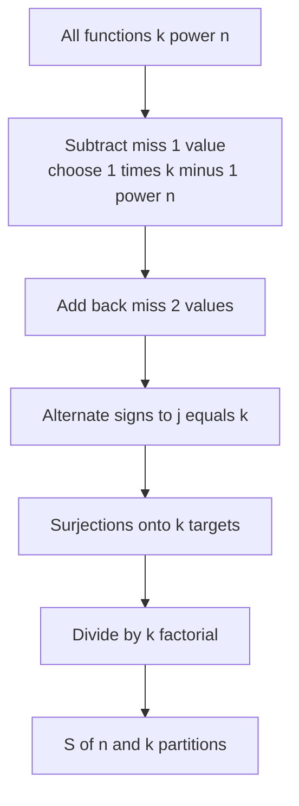
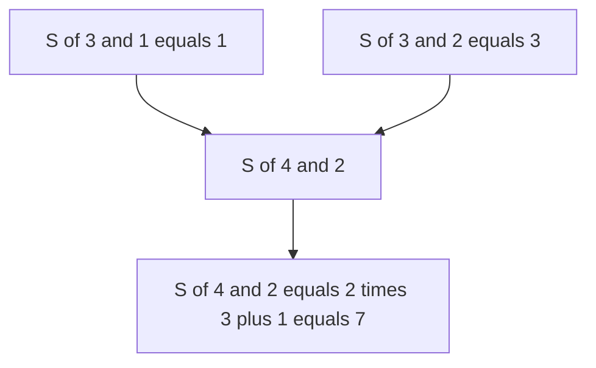

# Set Partitions and Surjections via Stirling Numbers of the Second Kind

| Field | Value |
| --- | --- |
| Source | Classic combinatorics exercise (self-contained) |
| Difficulty | Medium |
| Topics | Stirling Numbers (Second Kind), Surjections, Inclusion-Exclusion, Modular Arithmetic |
| Link | https://en.wikipedia.org/wiki/Stirling_numbers_of_the_second_kind |

---

## Problem Statement

You are given $q$ queries. Each query provides two integers $n$ and $k$. For each query output two values modulo $10^9 + 7$:

1. $S(n, k)$ — the number of ways to **partition a set of $n$ labelled elements into exactly $k$ non-empty, unlabelled blocks**.
2. $\text{Surj}(n, k) = k!\,S(n, k)$ — the number of **surjective (onto) functions** from an $n$-element domain onto a $k$-element codomain.

Constraints: $1 \le q \le 10^5$, $0 \le k \le n \le 10^6$.

The recurrence for the Stirling number of the second kind is

$$
S(n, k) = k\, S(n-1, k) + S(n-1, k-1), \qquad S(0,0)=1,
$$

and the explicit inclusion-exclusion formula (which is what we use for large $n, k$) is

$$
S(n, k) = \frac{1}{k!}\sum_{j=0}^{k} (-1)^{j}\binom{k}{j}(k-j)^{n},
\qquad
\text{Surj}(n, k) = \sum_{j=0}^{k} (-1)^{j}\binom{k}{j}(k-j)^{n}.
$$

```
Input:
3
4 2
3 3
5 0

Output:
7 14
1 6
0 0
```

For $n=4, k=2$: there are $S(4,2)=7$ partitions, and $\text{Surj}(4,2) = 2! \cdot 7 = 14$ onto functions. For $n=3, k=3$ every element is its own block: $S(3,3)=1$ and $\text{Surj} = 3! = 6$. For $k=0$ with $n>0$ both are $0$.

---

## Approach (WHY)

The $O(nk)$ recurrence table is too large when $n, k$ reach $10^6$ across many queries, so we use the **inclusion-exclusion** closed form per query.

*Why the formula counts surjections:* count **all** functions $f: [n] \to [k]$, which is $k^n$, then remove those that miss at least one codomain value. Let $A_i$ be the functions that never hit value $i$. By inclusion-exclusion, the functions that miss none (the surjections) number

$$
\sum_{j=0}^{k} (-1)^{j}\binom{k}{j}(k-j)^{n},
$$

since choosing $j$ forbidden values leaves $(k-j)^n$ functions into the remaining $k-j$ values. Dividing by $k!$ (the orderings of the blocks) turns labelled surjection targets into unlabelled blocks, giving $S(n,k)$.



Each query is $O(k \log n)$ (the modular power $(k-j)^n$ dominates), after an $O(n)$ precompute of factorials and inverse factorials shared across all queries. Handle edge cases up front: $k > n$ or $k = 0 < n$ gives $0$; $n = k = 0$ gives $S = 1$.

---

## Solution

### Python

```python
import sys

MOD = 10**9 + 7

def main() -> None:
    data = sys.stdin.buffer.read().split()
    idx = 0
    q = int(data[idx]); idx += 1
    queries = []
    max_n = 1
    for _ in range(q):
        n = int(data[idx]); k = int(data[idx + 1]); idx += 2
        queries.append((n, k))
        max_n = max(max_n, n, k)

    fact = [1] * (max_n + 1)
    for i in range(1, max_n + 1):
        fact[i] = fact[i - 1] * i % MOD
    inv_fact = [1] * (max_n + 1)
    inv_fact[max_n] = pow(fact[max_n], MOD - 2, MOD)
    for i in range(max_n - 1, -1, -1):
        inv_fact[i] = inv_fact[i + 1] * (i + 1) % MOD

    def nCr(n: int, r: int) -> int:
        if r < 0 or r > n or n < 0:
            return 0
        return fact[n] * inv_fact[r] % MOD * inv_fact[n - r] % MOD

    out = []
    for n, k in queries:
        if k == 0:
            out.append("1 1" if n == 0 else "0 0")
            continue
        if k > n:
            out.append("0 0")
            continue
        surj = 0
        for j in range(k + 1):
            term = nCr(k, j) * pow(k - j, n, MOD) % MOD
            surj = (surj + (term if j % 2 == 0 else -term)) % MOD
        surj %= MOD
        stirling = surj * inv_fact[k] % MOD
        out.append(f"{stirling} {surj}")
    sys.stdout.write("\n".join(out) + "\n")

main()
```

### C++

```cpp
#include <bits/stdc++.h>
using namespace std;

const long long MOD = 1e9 + 7;

long long modpow(long long base, long long exp, long long mod) {
    long long result = 1 % mod;
    base %= mod;
    while (exp > 0) {
        if (exp & 1) result = result * base % mod;
        base = base * base % mod;
        exp >>= 1;
    }
    return result;
}

int main() {
    ios::sync_with_stdio(false);
    cin.tie(nullptr);

    int q;
    cin >> q;
    vector<pair<long long, long long>> queries(q);
    long long maxN = 1;
    for (auto& [n, k] : queries) {
        cin >> n >> k;
        maxN = max({maxN, n, k});
    }

    vector<long long> fact(maxN + 1), invFact(maxN + 1);
    fact[0] = 1;
    for (long long i = 1; i <= maxN; ++i) fact[i] = fact[i - 1] * i % MOD;
    invFact[maxN] = modpow(fact[maxN], MOD - 2, MOD);
    for (long long i = maxN - 1; i >= 0; --i) invFact[i] = invFact[i + 1] * (i + 1) % MOD;

    auto nCr = [&](long long n, long long r) -> long long {
        if (r < 0 || r > n || n < 0) return 0;
        return fact[n] * invFact[r] % MOD * invFact[n - r] % MOD;
    };

    string out;
    for (auto& [n, k] : queries) {
        if (k == 0) {
            out += (n == 0 ? "1 1\n" : "0 0\n");
            continue;
        }
        if (k > n) {
            out += "0 0\n";
            continue;
        }
        long long surj = 0;
        for (long long j = 0; j <= k; ++j) {
            long long term = nCr(k, j) * modpow(k - j, n, MOD) % MOD;
            if (j % 2 == 0) surj = (surj + term) % MOD;
            else surj = (surj - term + MOD) % MOD;
        }
        long long stirling = surj * invFact[k] % MOD;
        out += to_string(stirling) + " " + to_string(surj) + "\n";
    }
    cout << out;
    return 0;
}
```

---

## Iteration Trace

Computing $\text{Surj}(4, 2)$ via the IE sum $\sum_{j=0}^{2}(-1)^j\binom{2}{j}(2-j)^4$:

| $j$ | $\binom{2}{j}$ | $(2-j)^4$ | sign | term contribution |
| --- | --- | --- | --- | --- |
| 0 | 1 | $16$ | $+$ | $+16$ |
| 1 | 2 | $1$ | $-$ | $-2$ |
| 2 | 1 | $0$ | $+$ | $0$ |
| — | — | — | sum | $14 = \text{Surj}(4,2)$ |

Then $S(4,2) = \text{Surj}(4,2) / 2! = 14 / 2 = 7$. ✔ Cross-check with the recurrence: $S(4,2) = 2\,S(3,2) + S(3,1) = 2\cdot 3 + 1 = 7$.



Per query the cost is the $k+1$ terms each with a modular exponentiation:

$$
T_{\text{query}}(n, k) = O(k \log n), \qquad T_{\text{total}} = O\!\left(n_{\max} + \sum k_i \log n_i\right).
$$

---

## Complexity

| Aspect | Cost |
| --- | --- |
| Precompute (factorials) | $O(n_{\max})$ |
| Per query | $O(k \log n)$ |
| Space | $O(n_{\max})$ |

---

## Takeaway

Partitioning $n$ labelled items into $k$ unlabelled non-empty blocks is counted by the **Stirling number of the second kind** $S(n,k)$, and onto functions (surjections) onto $k$ labelled targets are exactly $k!\,S(n,k)$. The inclusion-exclusion form $\sum_j (-1)^j\binom{k}{j}(k-j)^n$ computes the surjection count directly; divide by $k!$ for the partition count. Watch the alternating signs under the modulus and handle the $k=0$ and $k>n$ edge cases explicitly.
