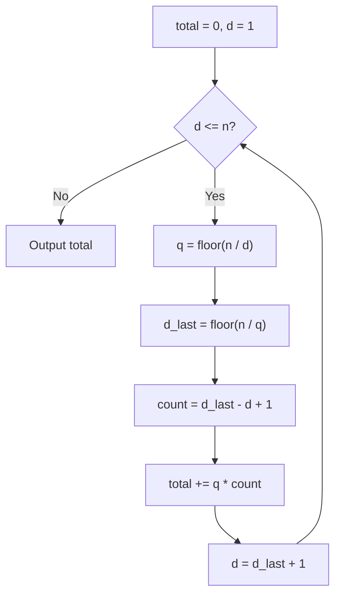
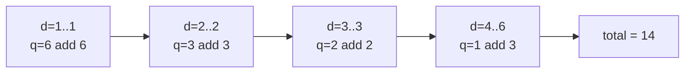

# Sum of Divisor Counts from 1 to N

| | |
| --- | --- |
| **Source** | Classic number theory / divisor-summatory (self-contained) |
| **Difficulty** | Medium |
| **Topics** | Number theory, divisor sieve, hyperbola trick, floor sums |
| **Link** | — (self-contained) |

---

## Problem Statement

Given a positive integer $n$, compute the **divisor-summatory function**

$$D(n) = \sum_{i=1}^{n} d(i),$$

where $d(i)$ is the number of divisors of $i$. In words: add up the divisor counts of every integer from $1$ to $n$.

There is a beautiful reformulation. Count, over all pairs, how often each $d$ appears as a divisor:

$$D(n) = \sum_{i=1}^{n} d(i) = \sum_{d=1}^{n} \left\lfloor \frac{n}{d} \right\rfloor,$$

because divisor $d$ divides exactly $\lfloor n/d \rfloor$ of the numbers $1, 2, \dots, n$ (namely $d, 2d, \dots$).

**Constraints.** $1 \le n \le 10^{12}$. Use 64-bit integers in C++.

> The same machinery computes $\sum_{i=1}^{n} \sigma(i) = \sum_{d=1}^{n} d \cdot \lfloor n/d \rfloor$; we focus on $D(n)$ and note the $\sigma$ variant where relevant.

```text
Input:  6
Output: 14

Breakdown:
d(1)=1, d(2)=2, d(3)=2, d(4)=3, d(5)=2, d(6)=4
sum = 1 + 2 + 2 + 3 + 2 + 4 = 14
also  floor(6/1)+...+floor(6/6) = 6+3+2+1+1+1 = 14
```

---

## Approach (WHY)

**Small $n$ (sieve).** If $n$ is up to a few million, the **divisor sieve** computes every $d(i)$: for each $d$ from $1$ to $n$, add $1$ to all multiples of $d$, then sum the array. Cost $O(n \log n)$.

**Large $n$ (hyperbola trick).** For $n$ up to $10^{12}$ a per-$i$ sieve is impossible. Use $D(n) = \sum_{d=1}^{n} \lfloor n/d \rfloor$ and the key observation that $\lfloor n/d \rfloor$ takes only $O(\sqrt{n})$ **distinct values**. As $d$ ranges over a block, the quotient $q = \lfloor n/d \rfloor$ stays constant; the largest $d$ giving that same quotient is $\lfloor n/q \rfloor$. So we jump block by block:

- start at $d = 1$;
- let $q = \lfloor n/d \rfloor$ and $d_{\text{last}} = \lfloor n/q \rfloor$;
- every index in $[d, d_{\text{last}}]$ contributes $q$, so add $q \cdot (d_{\text{last}} - d + 1)$;
- continue from $d = d_{\text{last}} + 1$.

This runs in $O(\sqrt{n})$.



---

## Solution

Both a simple sieve (good for small $n$, easy to trust) and the $O(\sqrt{n})$ hyperbola method are shown.

### Python

```python
def divisor_count_sum_sieve(n: int) -> int:
    # O(n log n): direct divisor sieve, good for small n
    total = 0
    for d in range(1, n + 1):
        total += n // d            # d divides floor(n/d) numbers in 1..n
    return total


def divisor_count_sum(n: int) -> int:
    # O(sqrt(n)) hyperbola trick using blocks of equal floor(n/d)
    total = 0
    d = 1
    while d <= n:
        q = n // d                 # constant quotient on this block
        d_last = n // q            # last index with the same quotient
        count = d_last - d + 1
        total += q * count
        d = d_last + 1
    return total


def divisor_sum_sigma(n: int) -> int:
    # variant: sum of sigma(i) = sum_d d * floor(n/d), also O(sqrt(n))
    total = 0
    d = 1
    while d <= n:
        q = n // d
        d_last = n // q
        # sum of d over [d, d_last] times the shared quotient q
        block_sum = (d + d_last) * (d_last - d + 1) // 2
        total += q * block_sum
        d = d_last + 1
    return total


if __name__ == "__main__":
    n = int(input())
    print(divisor_count_sum(n))
```

```cpp
#include <bits/stdc++.h>
using namespace std;

long long divisor_count_sum_sieve(long long n) {
    // O(n log n): direct, good for small n
    long long total = 0;
    for (long long d = 1; d <= n; ++d) {
        total += n / d;            // d divides floor(n/d) numbers in 1..n
    }
    return total;
}

long long divisor_count_sum(long long n) {
    // O(sqrt(n)) hyperbola trick using blocks of equal floor(n/d)
    long long total = 0;
    long long d = 1;
    while (d <= n) {
        long long q = n / d;       // constant quotient on this block
        long long d_last = n / q;  // last index with the same quotient
        long long count = d_last - d + 1;
        total += q * count;
        d = d_last + 1;
    }
    return total;
}

long long divisor_sum_sigma(long long n) {
    // variant: sum of sigma(i) = sum_d d * floor(n/d), also O(sqrt(n))
    long long total = 0;
    long long d = 1;
    while (d <= n) {
        long long q = n / d;
        long long d_last = n / q;
        long long block_sum = (d + d_last) * (d_last - d + 1) / 2;
        total += q * block_sum;
        d = d_last + 1;
    }
    return total;
}

int main() {
    ios::sync_with_stdio(false);
    cin.tie(nullptr);

    long long n;
    cin >> n;
    cout << divisor_count_sum(n) << '\n';
    return 0;
}
```

---

## Iteration Trace

Hyperbola trick on $n = 6$. Each row is one block of equal quotient.

| $d$ | $q = \lfloor 6/d \rfloor$ | $d_{\text{last}} = \lfloor 6/q \rfloor$ | count | contribution $q \cdot \text{count}$ | running total |
| --- | --- | --- | --- | --- | --- |
| 1 | 6 | 1 | 1 | $6 \cdot 1 = 6$ | 6 |
| 2 | 3 | 2 | 1 | $3 \cdot 1 = 3$ | 9 |
| 3 | 2 | 3 | 1 | $2 \cdot 1 = 2$ | 11 |
| 4 | 1 | 6 | 3 | $1 \cdot 3 = 3$ | 14 |
| 7 | stop ($d > n$) | — | — | — | **14** |

Notice the last block $d \in [4, 6]$ collapses three indices into one step — that is the $O(\sqrt{n})$ saving. Result $D(6) = 14$, matching the direct sum.



---

## Complexity

The distinct values of $\lfloor n/d \rfloor$ number $O(\sqrt{n})$: for $d \le \sqrt{n}$ there are at most $\sqrt{n}$ values, and for $d > \sqrt{n}$ the quotient is below $\sqrt{n}$, giving at most $\sqrt{n}$ more. Hence

$$T_{\text{hyperbola}}(n) = O(\sqrt{n}), \qquad T_{\text{sieve}}(n) = O(n \log n).$$

| Method | Time | Space | Best for |
| --- | --- | --- | --- |
| Divisor sieve | $O(n \log n)$ | $O(1)$ (counting form) or $O(n)$ (array form) | small $n$, also yields each $d(i)$ |
| Hyperbola trick | $O(\sqrt{n})$ | $O(1)$ | very large $n$ up to $10^{12}$ |

## Takeaway

The identity $\sum_{i=1}^{n} d(i) = \sum_{d=1}^{n} \lfloor n/d \rfloor$ converts a per-number divisor count into a **floor sum**. Since $\lfloor n/d \rfloor$ has only $O(\sqrt{n})$ distinct values, group equal-quotient blocks and jump with $d_{\text{last}} = \lfloor n/q \rfloor$. Weight each block by $d$ instead of $1$ to get $\sum \sigma(i)$.
