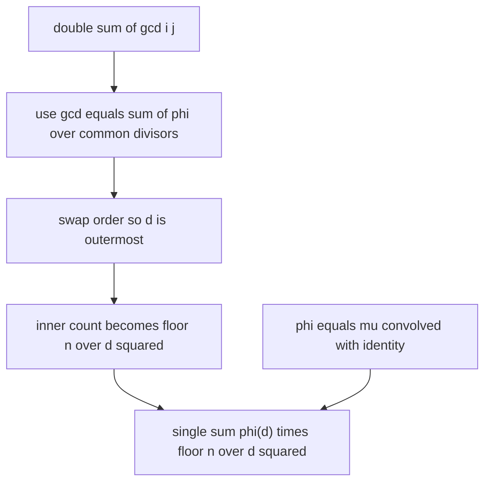
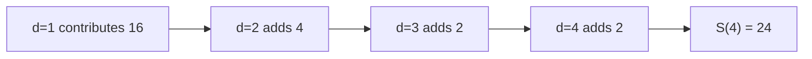

# Sum of Pairwise GCDs

| Field | Value |
| --- | --- |
| Source | Classic number-theory / competitive-programming exercise |
| Difficulty | Medium–Hard |
| Topics | Number Theory, Möbius Function, Euler Totient, Divisor Sums |
| Link | https://cses.fi/problemset/ |

---

## Problem Statement

Given an integer $n$, compute the sum of greatest common divisors over **all ordered pairs** $(i, j)$ with $1 \le i, j \le n$:

$$
S(n) = \sum_{i=1}^{n} \sum_{j=1}^{n} \gcd(i, j).
$$

Constraints: $1 \le n \le 10^{7}$.

```
Input:
4

Output:
24
```

For $n = 4$ the gcd table is

| $\gcd$ | $j=1$ | $j=2$ | $j=3$ | $j=4$ | row sum |
| --- | --- | --- | --- | --- | --- |
| $i=1$ | 1 | 1 | 1 | 1 | 4 |
| $i=2$ | 1 | 2 | 1 | 2 | 6 |
| $i=3$ | 1 | 1 | 3 | 1 | 6 |
| $i=4$ | 1 | 2 | 1 | 4 | 8 |

Summing all 16 entries gives $4 + 6 + 6 + 8 = 24$.

---

## Approach (WHY)

The cleanest route uses the totient divisor-sum identity

$$
\sum_{d \mid m} \varphi(d) = m,
$$

so that, substituting $m = \gcd(i, j)$,

$$
\gcd(i, j) = \sum_{d \mid \gcd(i, j)} \varphi(d) = \sum_{d \mid i,\; d \mid j} \varphi(d).
$$

Plugging this in and swapping the order of summation so that $d$ is outermost:

$$
S(n) = \sum_{i=1}^{n} \sum_{j=1}^{n} \sum_{d \mid i,\; d \mid j} \varphi(d)
= \sum_{d=1}^{n} \varphi(d) \left\lfloor \frac{n}{d} \right\rfloor^{2}.
$$

The inner count is $\lfloor n/d \rfloor^2$ because, for a fixed $d$, the number of $i \in [1, n]$ divisible by $d$ is $\lfloor n/d \rfloor$, and likewise for $j$ — independently, hence the square.

**Where Möbius enters.** The totient is itself a Möbius convolution, $\varphi = \mu * \mathrm{id}$, i.e.

$$
\varphi(d) = \sum_{e \mid d} e \, \mu\!\left(\frac{d}{e}\right).
$$

So $S(n) = \sum_d \varphi(d)\lfloor n/d\rfloor^2$ is exactly what you obtain by expanding the coprimality indicator with $\mu$ and then collapsing the inner Möbius sum back into $\varphi$. This is the **Möbius-to-totient bridge**: recognizing the convolution lets you drop one summation layer.



---

## Solution

### Python

```python
import sys

def sum_gcd_pairs(n: int) -> int:
    # Euler totient via a sieve: phi[m] starts as m, divide out each prime.
    phi = list(range(n + 1))
    for p in range(2, n + 1):
        if phi[p] == p:                 # p is prime
            for m in range(p, n + 1, p):
                phi[m] -= phi[m] // p
    total = 0
    for d in range(1, n + 1):
        q = n // d
        total += phi[d] * q * q
    return total

def main() -> None:
    n = int(sys.stdin.readline())
    print(sum_gcd_pairs(n))

main()
```

### C++

```cpp
#include <bits/stdc++.h>
using namespace std;

long long sum_gcd_pairs(int n) {
    vector<long long> phi(n + 1);
    for (int i = 0; i <= n; ++i) phi[i] = i;
    for (int p = 2; p <= n; ++p) {
        if (phi[p] == p) {              // p is prime
            for (int m = p; m <= n; m += p)
                phi[m] -= phi[m] / p;
        }
    }
    long long total = 0;
    for (int d = 1; d <= n; ++d) {
        long long q = n / d;
        total += phi[d] * q * q;
    }
    return total;
}

int main() {
    ios::sync_with_stdio(false);
    cin.tie(nullptr);

    int n;
    cin >> n;
    cout << sum_gcd_pairs(n) << '\n';
    return 0;
}
```

---

## Iteration Trace

For $n = 4$, first compute the totients: $\varphi(1)=1,\ \varphi(2)=1,\ \varphi(3)=2,\ \varphi(4)=2$. Then accumulate $\varphi(d)\lfloor 4/d \rfloor^2$:

| $d$ | $\varphi(d)$ | $\lfloor 4/d \rfloor$ | $\lfloor 4/d \rfloor^2$ | $\varphi(d)\lfloor 4/d \rfloor^2$ | running total |
| --- | --- | --- | --- | --- | --- |
| 1 | 1 | 4 | 16 | 16 | 16 |
| 2 | 1 | 2 | 4 | 4 | 20 |
| 3 | 2 | 1 | 1 | 2 | 22 |
| 4 | 2 | 1 | 1 | 2 | 24 |

Final total $= 16 + 4 + 2 + 2 = 24$, matching the brute-force gcd table. ✓

Reading it as inclusion of contributions: $d = 1$ accounts for the "everyone shares divisor 1" baseline (16), and each larger $d$ adds the extra gcd weight from pairs that share the common divisor $d$.



---

The cost is dominated by the totient sieve (harmonic over primes) plus a linear accumulation:

$$
\sum_{p \le n} \frac{n}{p} = O(n \log \log n) \text{ time}, \qquad O(n) \text{ space}.
$$

## Complexity

| Aspect | Complexity |
| --- | --- |
| Euler totient sieve | $O(n \log \log n)$ |
| Accumulation loop | $O(n)$ |
| Total | $O(n \log \log n)$ |
| Space | $O(n)$ |

---

## Takeaway

Sums of $\gcd(i, j)$ collapse through the Möbius-to-totient bridge. Start from $\gcd(i,j) = \sum_{d \mid i,\, d \mid j} \varphi(d)$ (equivalently expand $\mu$ and refold via $\varphi = \mu * \mathrm{id}$), swap summation order, and the double sum becomes the single sum $\sum_d \varphi(d)\lfloor n/d \rfloor^2$. Precompute $\varphi$ with a sieve and accumulate in $O(n)$. Always sanity-check the closed form against a small brute-force table to pin down the exact weighting.
