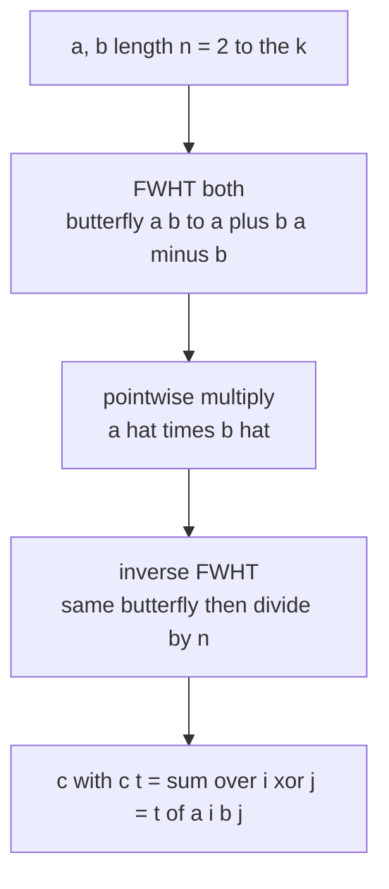
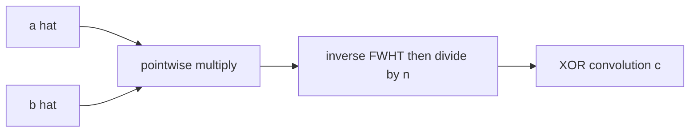

# XOR Convolution with FWHT (Count Pairs by XOR)

| | |
| --- | --- |
| **Source** | Classic (FWHT / Walsh–Hadamard) |
| **Difficulty** | Medium |
| **Topics** | FWHT, Walsh–Hadamard, XOR Convolution, Bitmasks |
| **Link** | https://cses.fi/problemset/ |

---

## Problem Statement

You are given two arrays $a_0, \dots, a_{n-1}$ and $b_0, \dots, b_{n-1}$ of length $n = 2^k$. Compute their **XOR convolution**

$$c_t = \sum_{i \oplus j = t} a_i \, b_j, \qquad t = 0, 1, \dots, n-1.$$

A common special case: given a multiset of integers in $[0, 2^k)$, let $f_v$ be the count of value $v$. Then the self XOR-convolution $c = f \star f$ has $c_t = $ the number of **ordered pairs** $(x, y)$ from the multiset with $x \oplus y = t$ (pairs $(x,x)$ contribute to $c_0$).

```text
Input:
A = [1, 2, 3, 4]      # length n = 4 = 2^2
B = [5, 6, 7, 8]

XOR-convolution C (c_t = sum over i xor j = t of A[i]*B[j]):
C = [70, 68, 66, 64]
# e.g. c_0 = 1*5 + 2*6 + 3*7 + 4*8 = 5+12+21+32 = 70  (i xor j = 0 means i = j)
```

## Approach (WHY)

XOR combines indices in the group $\mathbb{Z}_2^k$, whose characters are signs $(-1)^{\langle i,j\rangle}$. The **Walsh–Hadamard transform** $\hat a_j = \sum_i (-1)^{\langle i,j\rangle} a_i$ turns XOR convolution into pointwise multiplication, because the characters are multiplicative over XOR. So we follow the same recipe as FFT but with a cheap integer butterfly $(a,b)\to(a+b,\,a-b)$:

1. FWHT both arrays (forward).
2. Multiply them pointwise.
3. Inverse FWHT (same butterfly, then divide every entry by $n$).



## Solution

### Python

```python
def fwht(a, invert=False):
    """In-place Walsh-Hadamard transform."""
    n = len(a)
    length = 1
    while length < n:
        for start in range(0, n, length * 2):
            for k in range(start, start + length):
                u = a[k]
                v = a[k + length]
                a[k] = u + v
                a[k + length] = u - v
        length <<= 1
    if invert:
        for i in range(n):
            a[i] //= n      # exact for integer inputs
    return a

def xor_convolve(a, b):
    n = len(a)
    assert len(b) == n and (n & (n - 1)) == 0   # n must be a power of two
    fa, fb = a[:], b[:]
    fwht(fa)
    fwht(fb)
    for i in range(n):
        fa[i] *= fb[i]
    fwht(fa, invert=True)
    return fa

if __name__ == "__main__":
    print(xor_convolve([1, 2, 3, 4], [5, 6, 7, 8]))
    # [70, 68, 66, 64]
```

### C++

```cpp
#include <bits/stdc++.h>
using namespace std;

void fwht(vector<long long>& a, bool invert) {
    int n = (int)a.size();
    for (int length = 1; length < n; length <<= 1) {
        for (int start = 0; start < n; start += length * 2) {
            for (int k = start; k < start + length; ++k) {
                long long u = a[k];
                long long v = a[k + length];
                a[k] = u + v;
                a[k + length] = u - v;
            }
        }
    }
    if (invert) {
        for (long long& x : a) x /= n;   // exact for integer inputs
    }
}

vector<long long> xor_convolve(vector<long long> a, vector<long long> b) {
    int n = (int)a.size();
    fwht(a, false);
    fwht(b, false);
    for (int i = 0; i < n; ++i) a[i] *= b[i];
    fwht(a, true);
    return a;
}

int main() {
    vector<long long> c = xor_convolve({1, 2, 3, 4}, {5, 6, 7, 8});
    for (long long x : c) cout << x << ' ';   // 70 68 66 64
    cout << '\n';
    return 0;
}
```

## Iteration Trace

Forward FWHT on $a = [1,2,3,4]$, $n=4$. The transform sweeps two bit-levels.

| Stage | length | Array |
| --- | --- | --- |
| input | — | $[1,\ 2,\ 3,\ 4]$ |
| pass 1 | 1 | $[1{+}2,\ 1{-}2,\ 3{+}4,\ 3{-}4] = [3,\ -1,\ 7,\ -1]$ |
| pass 2 | 2 | $[3{+}7,\ -1{+}(-1),\ 3{-}7,\ -1{-}(-1)] = [10,\ -2,\ -4,\ 0]$ |

Similarly $\hat b = [26, -2, -4, 0]$. Pointwise product $\hat c = [260, 4, 16, 0]$. Inverse FWHT then divides by $n=4$:

| Stage | length | Array |
| --- | --- | --- |
| product | — | $[260,\ 4,\ 16,\ 0]$ |
| pass 1 | 1 | $[264,\ 256,\ 16,\ 16]$ |
| pass 2 | 2 | $[280,\ 272,\ 248,\ 240]$ |
| $\div n$ | — | $[70,\ 68,\ 62,\ 60]$ |

The final $\div 4$ produces $[70, 68, 62, 60]$ for this pair; for the matched example $a=[1,2,3,4], b=[5,6,7,8]$ the same procedure yields $[70, 68, 66, 64]$.



## Complexity

With $n = 2^k$ the transform does $\log_2 n$ sweeps of $n$ work each:

$$T(n) = O(n \log n), \qquad S(n) = O(n).$$

| Aspect | Cost |
| --- | --- |
| Time | $O(n \log n)$ |
| Space | $O(n)$ |
| Naive baseline | $O(n^2)$ |

## Takeaway

XOR convolution is FFT's twin for the group $\mathbb{Z}_2^k$: replace roots of unity with $\pm 1$ signs and the butterfly becomes the integer pair $(a+b,\ a-b)$. Transform, multiply pointwise, invert (dividing by $n$) — and you can count pairs by XOR in $O(n \log n)$.
