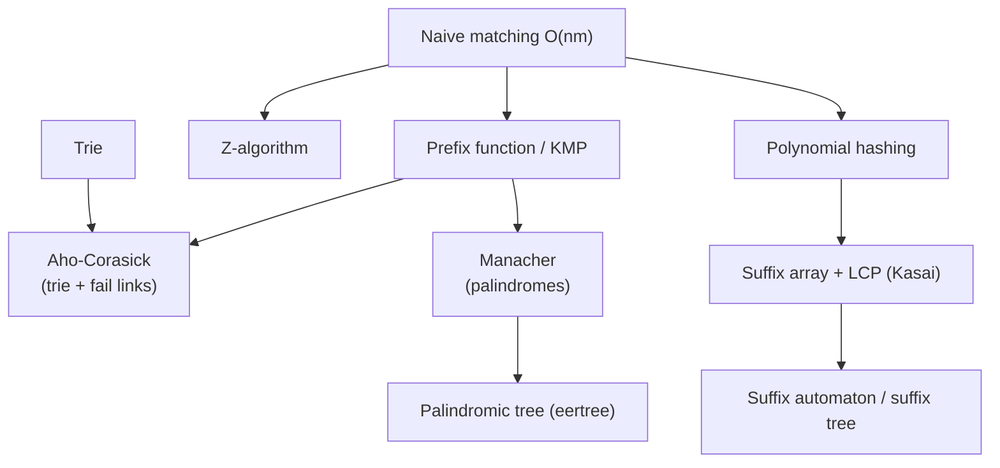

# Strings

String algorithms for interviews and competitive programming. The foundational guide covers
encodings, core operations, common patterns, and an overview of pattern matching, hashing, and
suffix structures. The numbered guides go deeper into the **advanced string algorithms** used in
contests, each with a **complete guide** plus **curated problems** solved in **both Python and
C++**.

## Structure

```
Strings/
├── guide/      # foundational complete guide + numbered advanced topic guides
└── problems/   # one file per curated problem (Python + C++, traces, diagrams, math)
```

## Foundational guide

- [Strings-Complete-Guide.md](guide/Strings-Complete-Guide.md) — encodings, mutability, core
  operations, intermediate patterns, and an overview of matching / hashing / suffix structures.

## Advanced topics & guides

| # | Concept | Guide | Key problems |
|---|---------|-------|--------------|
| 1 | Polynomial hashing (single & double) | [01-polynomial-hashing.md](guide/01-polynomial-hashing.md) | Longest Duplicate Substring, Distinct/Common Substrings, CF LCP |
| 2 | KMP / prefix function | [02-kmp-prefix-function.md](guide/02-kmp-prefix-function.md) | strStr, Repeated Substring Pattern, Longest Happy Prefix, CSES Borders |
| 3 | Z-algorithm | [03-z-algorithm.md](guide/03-z-algorithm.md) | String Matching, String Periods, Beautiful Indices |
| 4 | Trie (prefix tree & binary trie) | [04-trie.md](guide/04-trie.md) | Implement Trie, Add & Search Words, Maximum XOR |
| 5 | Aho-Corasick | [05-aho-corasick.md](guide/05-aho-corasick.md) | Stream of Characters, multi-pattern match |
| 6 | Manacher's algorithm | [06-manacher.md](guide/06-manacher.md) | Palindromic Substrings, Shortest Palindrome |
| 7 | Suffix array + LCP (Kasai) | [07-suffix-array-lcp-kasai.md](guide/07-suffix-array-lcp-kasai.md) | DISUBSTR, Longest Repeated Substring, SA pattern search |
| 8 | Suffix automaton / suffix tree | [08-suffix-automaton.md](guide/08-suffix-automaton.md) | SPOJ LCS, Distinct substrings, Occurrence counts |
| 9 | Palindromic tree (eertree) | [09-palindromic-tree-eertree.md](guide/09-palindromic-tree-eertree.md) | Distinct / total palindromes, Most frequent palindrome |

## How the pieces fit together



## Recommended study order

1. **Polynomial hashing** (1) — fast substring equality and LCP; the simplest big hammer.
2. **KMP / prefix function** (2) — borders, periods, linear single-pattern search.
3. **Z-algorithm** (3) — the prefix-matching twin of KMP.
4. **Trie** (4) — prefix sets and the binary trie for max-XOR.
5. **Aho-Corasick** (5) — multi-pattern matching = trie + KMP fail links.
6. **Manacher** (6) — all palindromic radii in $O(n)$.
7. **Suffix array + LCP (Kasai)** (7) — sorted suffixes; distinct substrings, repeats.
8. **Suffix automaton / suffix tree** (8) — encode all substrings linearly.
9. **Palindromic tree (eertree)** (9) — all distinct palindromes, the capstone.

## Complexity cheat sheet

| Technique | Build / preprocess | Query / use | Notes |
|-----------|-------------------|-------------|-------|
| Polynomial hashing | $O(n)$ | $O(1)$ substring hash | use double hashing in contests |
| KMP / prefix function | $O(n)$ | $O(n+m)$ search | borders, periods |
| Z-algorithm | $O(n)$ | $O(n+m)$ search | prefix matches at each index |
| Trie | $O(\sum L)$ | $O(L)$ per op | prefix sets; binary trie for XOR |
| Aho-Corasick | $O(\sum L)$ | $O(n + \text{matches})$ | many patterns at once |
| Manacher | $O(n)$ | $O(1)$ per center | longest / count palindromes |
| Suffix array | $O(n \log n)$ | $O(m \log n)$ search | + Kasai LCP in $O(n)$ |
| Suffix automaton | $O(n)$ over fixed $\Sigma$ | $O(m)$ walk | all substrings, $\le 2n-1$ states |
| Palindromic tree | $O(n)$ amortized | — | $\le n+2$ distinct palindromes |

---

> Every code sample appears in **both Python and C++**. Problem files follow the repo format:
> meta table → statement → approaches → Python + C++ → iteration trace → Mermaid → math →
> complexity → takeaway. Guides follow: TOC → concepts → paired code → Mermaid → math →
> complexity → pitfalls → patterns.
