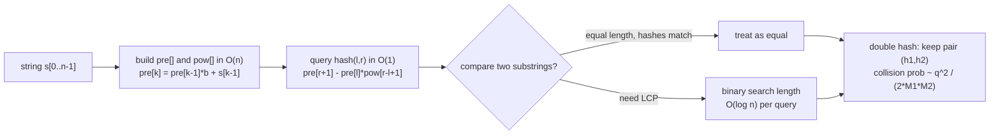

# Polynomial String Hashing (Single & Double)

Polynomial string hashing turns a string into a single number so that we can compare any
two substrings in **O(1)** after a one-time **O(n)** preprocessing. The key idea is to read a
string as a number written in some base `B` (a positional number system), and to keep that
number small by working modulo a large prime `M`. Once we have a *prefix-hash array*, the hash
of any substring is a constant-time arithmetic expression — this is the same trick as prefix
sums, but in a multiplicative (place-value) world.

Hashing is a *probabilistic* tool: two different strings can collide (map to the same value).
With a single well-chosen prime modulus the collision probability is already tiny, but adversarial
("anti-hash") test data can force collisions if your base/mod are predictable. **Double hashing** —
computing two independent hashes under two different moduli and treating the pair as the identity —
shrinks the collision probability to a level that is, for all practical purposes, negligible.

This guide builds the machinery from scratch: the polynomial definition, the prefix-hash array,
the O(1) substring formula, how to pick a base and modulus, the collision math behind double
hashing, and how to binary-search the longest common prefix (LCP) of two suffixes. Two existing
problems show the technique in action — see
[cf-string-hashing-lcp-substring-compare.md](../problems/cf-string-hashing-lcp-substring-compare.md)
for fast substring comparison / LCP, and
[cses-1753-string-matching-hashing-z.md](../problems/cses-1753-string-matching-hashing-z.md)
for Rabin–Karp pattern matching — this guide does not recreate them.

## Table of Contents
1. [The Polynomial Hash Definition](#the-polynomial-hash-definition)
2. [Prefix-Hash Array and O(1) Substring Hash](#prefix-hash-array-and-o1-substring-hash)
3. [Choosing a Base and Modulus](#choosing-a-base-and-modulus)
4. [Collision Probability and Why Double Hashing](#collision-probability-and-why-double-hashing)
5. [Comparing Substrings and Binary-Search LCP](#comparing-substrings-and-binary-search-lcp)
6. [Mermaid](#mermaid)
7. [Complexity Summary](#complexity-summary)
8. [Common Pitfalls](#common-pitfalls)
9. [Patterns](#patterns)

---

## The Polynomial Hash Definition

Treat a string $s = s_0 s_1 \dots s_{n-1}$ as a polynomial evaluated at the base $b$, reduced
modulo a large prime $M$:

$$
h(s) = \Big(\sum_{i=0}^{n-1} s_i \, b^{\,i}\Big) \bmod M
$$

Each character contributes a *digit* $s_i$ (typically `ord(c)` or `c - 'a' + 1`) weighted by a
distinct power of the base. Because powers of $b$ grow geometrically, different positions are
weighted differently, so reorderings and edits change the value. We reduce modulo $M$ after every
step to keep the number bounded.

A subtle but important convention choice: do digit weights *increase* with index ($s_i b^i$) or
*decrease* ($s_i b^{\,n-1-i}$)? Both work; you just have to be consistent. Below we use the
**increasing-weight** convention for the closed-form substring formula, and the more common
**Horner / left-to-right** convention (which gives decreasing effective weight) for the prefix
array. Pick one per codebase and stick to it.

```python
def poly_hash(s, b=131, M=(1 << 61) - 1):
    h = 0
    for ch in s:                 # Horner's method: h = h*b + digit
        h = (h * b + ord(ch)) % M
    return h
```

```cpp
#include <bits/stdc++.h>
using namespace std;

long long poly_hash(const string &s, long long b = 131,
                    long long M = (1LL << 61) - 1) {
    long long h = 0;
    for (char ch : s)            // Horner's method: h = h*b + digit
        h = ((__int128)h * b + (unsigned char)ch) % M;
    return h;
}
```

Using `__int128` for the multiplication `h * b` is essential when `M` is near `2^61`, because the
product of two ~61-bit numbers overflows 64 bits.

---

## Prefix-Hash Array and O(1) Substring Hash

Define the prefix hash `pre[k]` as the Horner hash of the first `k` characters, and a power table
`pow[k] = b^k mod M`:

$$
\text{pre}[k] = \Big(\sum_{i=0}^{k-1} s_i \, b^{\,k-1-i}\Big) \bmod M, \qquad \text{pre}[0]=0
$$

Then the hash of the substring `s[l..r]` (0-indexed, inclusive) is obtained by subtracting the
contribution of the prefix before `l`, scaled so the place values line up:

$$
\text{hash}(l, r) = \big(\text{pre}[r+1] - \text{pre}[l]\cdot \text{pow}[\,r-l+1\,]\big) \bmod M
$$

This is the multiplicative analogue of `prefix_sum(l, r) = P[r+1] - P[l]`: instead of subtracting,
we subtract *after rescaling* `pre[l]` by `pow[len]` so its digits sit in the correct columns.

```python
def build_prefix(s, b=131, M=(1 << 61) - 1):
    n = len(s)
    pre = [0] * (n + 1)
    pw = [1] * (n + 1)
    for i in range(n):
        pre[i + 1] = (pre[i] * b + ord(s[i])) % M
        pw[i + 1] = (pw[i] * b) % M
    return pre, pw

def sub_hash(pre, pw, l, r, M=(1 << 61) - 1):     # hash of s[l..r] inclusive
    return (pre[r + 1] - pre[l] * pw[r - l + 1]) % M
```

```cpp
#include <bits/stdc++.h>
using namespace std;

const long long MOD = (1LL << 61) - 1;

void build_prefix(const string &s, long long b,
                  vector<long long> &pre, vector<long long> &pw) {
    int n = (int)s.size();
    pre.assign(n + 1, 0);
    pw.assign(n + 1, 1);
    for (int i = 0; i < n; i++) {
        pre[i + 1] = ((__int128)pre[i] * b + (unsigned char)s[i]) % MOD;
        pw[i + 1]  = (__int128)pw[i] * b % MOD;
    }
}

long long sub_hash(const vector<long long> &pre, const vector<long long> &pw,
                   int l, int r) {                 // hash of s[l..r] inclusive
    long long res = (pre[r + 1] - (__int128)pre[l] * pw[r - l + 1] % MOD) % MOD;
    if (res < 0) res += MOD;                        // fix negative remainder
    return res;
}
```

Note the explicit `if (res < 0) res += MOD;` in C++: subtraction can produce a negative value, and
unlike Python, C++ `%` does **not** return a non-negative remainder for negative operands.

---

## Choosing a Base and Modulus

**Base `b`.** Pick a base larger than the alphabet size so distinct characters map to distinct
digits — `131`, `131071`, or a random value in `[256, M)` are common. Avoid tiny bases (e.g. `b=26`
with `a..z`) which behave like a literal radix encoding and collide easily on short strings.

**Modulus `M`.** Use a large prime. Two popular families:

- A prime near $2^{31}$ such as $10^9 + 7$ or $998244353$ — fits in 64-bit products without
  `__int128`, but a single 31-bit hash has higher collision risk.
- A Mersenne-style prime $2^{61} - 1$ — much stronger as a single hash, but products need
  `__int128`.

For *double* hashing we deliberately pick **two different primes**, e.g. $M_1 = 10^9+7$ and
$M_2 = 998244353$, with (ideally) two different bases.

```python
import random
MOD1 = 1_000_000_007
MOD2 = 998_244_353
B1 = random.randint(257, MOD1 - 1)    # randomize base to defeat anti-hash tests
B2 = random.randint(257, MOD2 - 1)
```

```cpp
#include <bits/stdc++.h>
using namespace std;

const long long MOD1 = 1e9 + 7;
const long long MOD2 = 998244353;
mt19937_64 rng(chrono::steady_clock::now().time_since_epoch().count());
long long B1 = 257 + rng() % (MOD1 - 257);   // randomize base to defeat anti-hash tests
long long B2 = 257 + rng() % (MOD2 - 257);
```

---

## Collision Probability and Why Double Hashing

A collision is when two *different* strings produce the *same* hash. Heuristically, for a single
modulus $M$ and roughly uniform hashing, two fixed distinct strings collide with probability about
$\tfrac{1}{M}$. But the danger grows with the number of comparisons: by the **birthday bound**,
among $q$ distinct strings the probability that *some* pair collides is approximately

$$
P_{\text{collision}} \approx \frac{q^2}{2M}
$$

With $M \approx 10^9$ and $q = 10^5$ strings, that is about $\tfrac{10^{10}}{2\cdot 10^9} = 5$ —
i.e. a collision is essentially *guaranteed*. This is exactly why a single 31-bit modulus is risky
under heavy comparison loads.

**Double hashing** uses two independent moduli $M_1, M_2$ and treats the identity of a string as
the *pair* $(h_1, h_2)$. Two distinct strings now collide only if they collide under *both*, so the
effective modulus is $M_1 \cdot M_2 \approx 10^{18}$:

$$
P_{\text{collision}} \approx \frac{q^2}{2\,M_1 M_2}
$$

For $q = 10^5$ and $M_1 M_2 \approx 10^{18}$ this is about $5\cdot 10^{-9}$ — negligible. The
double-hash builder below returns the pair, and comparison checks both components.

```python
def build_double(s, b1, b2, M1, M2):
    n = len(s)
    pre1 = [0] * (n + 1); pre2 = [0] * (n + 1)
    pw1 = [1] * (n + 1);  pw2 = [1] * (n + 1)
    for i in range(n):
        c = ord(s[i])
        pre1[i + 1] = (pre1[i] * b1 + c) % M1
        pre2[i + 1] = (pre2[i] * b2 + c) % M2
        pw1[i + 1] = (pw1[i] * b1) % M1
        pw2[i + 1] = (pw2[i] * b2) % M2
    return (pre1, pw1, M1), (pre2, pw2, M2)

def sub_double(comp1, comp2, l, r):
    pre1, pw1, M1 = comp1
    pre2, pw2, M2 = comp2
    h1 = (pre1[r + 1] - pre1[l] * pw1[r - l + 1]) % M1
    h2 = (pre2[r + 1] - pre2[l] * pw2[r - l + 1]) % M2
    return (h1, h2)                       # pair identity → negligible collisions
```

```cpp
#include <bits/stdc++.h>
using namespace std;

struct DoubleHash {
    vector<long long> pre1, pre2, pw1, pw2;
    long long b1, b2, M1, M2;
    DoubleHash(const string &s, long long b1_, long long b2_,
               long long M1_, long long M2_)
        : b1(b1_), b2(b2_), M1(M1_), M2(M2_) {
        int n = (int)s.size();
        pre1.assign(n + 1, 0); pre2.assign(n + 1, 0);
        pw1.assign(n + 1, 1);  pw2.assign(n + 1, 1);
        for (int i = 0; i < n; i++) {
            long long c = (unsigned char)s[i];
            pre1[i + 1] = ((__int128)pre1[i] * b1 + c) % M1;
            pre2[i + 1] = ((__int128)pre2[i] * b2 + c) % M2;
            pw1[i + 1]  = (__int128)pw1[i] * b1 % M1;
            pw2[i + 1]  = (__int128)pw2[i] * b2 % M2;
        }
    }
    pair<long long, long long> sub(int l, int r) const {
        long long h1 = (pre1[r + 1] - (__int128)pre1[l] * pw1[r - l + 1] % M1) % M1;
        long long h2 = (pre2[r + 1] - (__int128)pre2[l] * pw2[r - l + 1] % M2) % M2;
        if (h1 < 0) h1 += M1;
        if (h2 < 0) h2 += M2;
        return {h1, h2};                  // pair identity → negligible collisions
    }
};
```

---

## Comparing Substrings and Binary-Search LCP

Equality of two substrings of equal length is a single hash comparison. To find the **longest
common prefix (LCP)** of two suffixes (or, generally, the first position two windows differ), we
binary-search the LCP length: a candidate length `mid` is feasible iff the two length-`mid`
prefixes hash equal. The predicate is *monotone* — if a length-`L` prefix matches, every shorter
prefix matches too — so binary search applies, giving `O(log n)` per LCP query after `O(n)` build.

```python
def lcp(pre, pw, i, j, n, M=(1 << 61) - 1):
    # longest common prefix of suffixes s[i:] and s[j:]
    lo, hi = 0, n - max(i, j)
    while lo < hi:
        mid = (lo + hi + 1) // 2
        hi_i = sub_hash(pre, pw, i, i + mid - 1, M)
        hi_j = sub_hash(pre, pw, j, j + mid - 1, M)
        if hi_i == hi_j:
            lo = mid
        else:
            hi = mid - 1
    return lo
```

```cpp
#include <bits/stdc++.h>
using namespace std;

int lcp(const vector<long long> &pre, const vector<long long> &pw,
        int i, int j, int n) {
    // longest common prefix of suffixes s[i..] and s[j..]
    int lo = 0, hi = n - max(i, j);
    while (lo < hi) {
        int mid = (lo + hi + 1) / 2;
        long long hi_i = sub_hash(pre, pw, i, i + mid - 1);
        long long hi_j = sub_hash(pre, pw, j, j + mid - 1);
        if (hi_i == hi_j) lo = mid;
        else hi = mid - 1;
    }
    return lo;
}
```

---

## Mermaid



---

## Complexity Summary

| Operation | Time | Space |
|-----------|------|-------|
| Build prefix/power tables (single) | $O(n)$ | $O(n)$ |
| Build double-hash tables | $O(n)$ | $O(n)$ |
| Substring hash query | $O(1)$ | $O(1)$ |
| Substring equality check | $O(1)$ | $O(1)$ |
| LCP of two suffixes (binary search) | $O(\log n)$ | $O(1)$ |
| Collision probability (double, $q$ items) | — | $\approx \dfrac{q^2}{2 M_1 M_2}$ |

---

## Common Pitfalls

- **Off-by-one in the substring formula.** Use `pre[r+1] - pre[l]*pow[r-l+1]`; the length is
  `r - l + 1`, and `pre` is 1-indexed (`pre[0] = 0`). Mixing inclusive/exclusive bounds is the most
  common bug.
- **Negative modulo in C++.** Subtraction can go negative; C++ `%` keeps the sign, so always do
  `if (res < 0) res += MOD;`. Python's `%` already returns a non-negative remainder.
- **64-bit overflow.** With `M` near `2^61`, the product `pre[l] * pow[len]` overflows 64 bits —
  use `__int128` (or `unsigned long long` with care) for the multiply.
- **Predictable base → anti-hash tests.** Fixed small bases/mods can be broken by adversarial
  inputs that force collisions. **Randomize the base** at runtime and prefer double hashing.
- **Single 31-bit mod under heavy comparison.** The birthday bound makes collisions likely once
  $q \approx \sqrt{M}$; escalate to a `2^61-1` modulus or to double hashing.
- **Zero-valued digits.** Mapping `'a' → 0` makes `"a"`, `"aa"`, `"aaa"` all hash to 0. Map
  characters to `ord(c)` or `c - 'a' + 1` so leading characters carry weight.

---

## Patterns

- **O(1) substring equality** → prefix hashes; the building block for everything below.
- **Binary search + hashing** → longest duplicate substring, longest common substring, LCP arrays.
- **Rolling hash window** → fixed-length pattern matching (Rabin–Karp), see
  [cses-1753-string-matching-hashing-z.md](../problems/cses-1753-string-matching-hashing-z.md).
- **Suffix comparison via LCP** → lexicographic ordering of suffixes, suffix-array construction,
  see [cf-string-hashing-lcp-substring-compare.md](../problems/cf-string-hashing-lcp-substring-compare.md).
- **Double hashing as default** in adversarial settings → pair $(h_1, h_2)$ makes collisions
  negligible without character-by-character verification.
