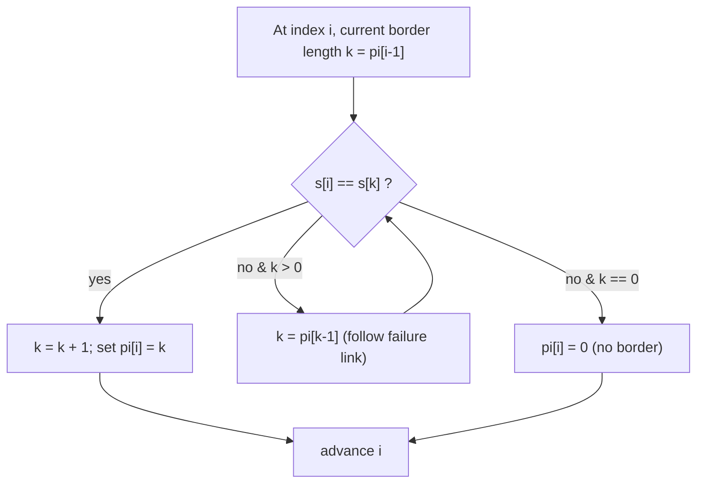

# KMP & the Prefix Function — A Complete Guide

The **prefix function** (also called the **failure function** or **failure links**) is the engine
behind the Knuth–Morris–Pratt (KMP) algorithm. Master it once and you unlock linear-time pattern
matching, border/period detection, string periodicity, and a deterministic string automaton — all
from a single `O(n)` precomputation.

This guide builds the idea from scratch: what the prefix function *means*, *why* its computation is
amortized linear, how to do pattern matching with it, and how borders and periods fall out almost
for free.

> Related problems in this repo (read after this guide, not recreated here):
> - [0028-find-first-occurrence-kmp.md](../problems/0028-find-first-occurrence-kmp.md) — first occurrence via KMP.
> - [cses-1732-finding-borders-prefix-function.md](../problems/cses-1732-finding-borders-prefix-function.md) — enumerate all borders.

---

## Table of Contents
1. [What is the Prefix Function?](#what-is-the-prefix-function)
2. [Computing $\pi$ in O(n)](#computing-pi-in-on)
3. [Why the Fallback is Amortized O(n)](#why-the-fallback-is-amortized-on)
4. [Pattern Matching with the Prefix Function](#pattern-matching-with-the-prefix-function)
5. [Borders & Periods](#borders--periods)
6. [The KMP Automaton / Transition Table](#the-kmp-automaton--transition-table)
7. [Mermaid: Failure-Link Fallback](#mermaid-failure-link-fallback)
8. [Complexity Summary](#complexity-summary)
9. [Common Pitfalls](#common-pitfalls)
10. [Patterns](#patterns)

---

## What is the Prefix Function?

For a string `s` of length `n`, the prefix function is an array $\pi$ of length `n` where:

$$\pi[i] = \text{length of the longest \emph{proper} prefix of } s[0..i] \text{ that is also a suffix of } s[0..i].$$

A **proper** prefix/suffix is one that is *not* the whole substring. So $0 \le \pi[i] \le i$, and
$\pi[0] = 0$ always (a length-1 string has no proper prefix that is also a suffix).

Concretely, $\pi[i]$ answers: *"After matching the first `i+1` characters, what is the longest
already-matched prefix I can reuse if the next character fails?"*

**Example.** For `s = "ababaca"`:

```
index :  0  1  2  3  4  5  6
char  :  a  b  a  b  a  c  a
pi    :  0  0  1  2  3  0  1
```

- $\pi[2]$: prefix `"aba"` → longest proper prefix-suffix is `"a"` → `1`.
- $\pi[4]$: prefix `"ababa"` → `"aba"` is both a prefix and suffix → `3`.
- $\pi[5]$: prefix `"ababac"` → nothing matches the trailing `c` → `0`.

The key intuition: $\pi[i]$ is the length of the longest **border** of the prefix `s[0..i]`, where a
*border* is a string that is simultaneously a proper prefix and a proper suffix.

---

## Computing $\pi$ in O(n)

We build $\pi$ left to right. Suppose we know $\pi[0..i-1]$ and want $\pi[i]$. Let `k = pi[i-1]` be
the length of the best border so far. We try to extend it:

- If `s[i] == s[k]`, the border grows by one: `pi[i] = k + 1`.
- Otherwise we must **fall back** to the next shorter border candidate, which is exactly
  `k = pi[k-1]`, and try again — repeating until either characters match or `k` hits `0`.

Why `pi[k-1]`? Because any border of the current prefix that is shorter than `k` must also be a
border of the length-`k` prefix `s[0..k-1]`. The longest such shorter border is `pi[k-1]`. This is
the **failure-link chain**.

```python
def prefix_function(s):
    n = len(s)
    pi = [0] * n
    k = 0                              # length of current longest border
    for i in range(1, n):
        while k > 0 and s[i] != s[k]:
            k = pi[k - 1]              # fall back along the border chain
        if s[i] == s[k]:
            k += 1
        pi[i] = k
    return pi
```

```cpp
#include <bits/stdc++.h>
using namespace std;

vector<int> prefix_function(const string& s) {
    int n = (int)s.size();
    vector<int> pi(n, 0);
    int k = 0;                          // length of current longest border
    for (int i = 1; i < n; i++) {
        while (k > 0 && s[i] != s[k])
            k = pi[k - 1];              // fall back along the border chain
        if (s[i] == s[k])
            k++;
        pi[i] = k;
    }
    return pi;
}
```

---

## Why the Fallback is Amortized O(n)

At first glance the inner `while` loop looks dangerous — it can run many times for a single `i`. The
trick is an **amortized argument** using `k` as a potential.

- `k` increases by **at most 1** per outer iteration (the single `k += 1`). Over the whole loop it
  rises by at most `n` total.
- Every iteration of the inner `while` loop **strictly decreases** `k` (since `pi[k-1] < k`).
- `k` never goes below `0`.

Therefore the total number of decrements (inner-loop iterations across the *entire* run) cannot
exceed the total number of increments, which is `≤ n`. The outer loop runs `n - 1` times. So the
combined work is $O(n)$ — even though any single step might do several fallbacks, the *sum* is
linear.

Think of it as a bank account: each character can deposit at most one unit into `k`, and the
`while` loop can only withdraw what was deposited. You can never withdraw more than you put in.

---

## Pattern Matching with the Prefix Function

To find a `pattern` of length `m` inside a `text` of length `n`, build the concatenation:

$$ s = \text{pattern} + \texttt{\#} + \text{text} $$

where `#` is a **separator** that appears in *neither* string (so $\pi$ values can never exceed `m`).
Compute $\pi$ over `s`. Wherever $\pi[i] = m$, the pattern ends at that position in the text — an
occurrence!

```python
def kmp_search(pattern, text, sep='#'):
    s = pattern + sep + text
    pi = prefix_function(s)
    m = len(pattern)
    res = []
    for i in range(len(s)):
        if pi[i] == m:
            # match ends at i in s; start index in text:
            start = i - 2 * m
            res.append(start)
    return res
```

```cpp
#include <bits/stdc++.h>
using namespace std;

vector<int> kmp_search(const string& pattern, const string& text, char sep = '#') {
    string s = pattern + sep + text;
    vector<int> pi = prefix_function(s);
    int m = (int)pattern.size();
    vector<int> res;
    for (int i = 0; i < (int)s.size(); i++) {
        if (pi[i] == m) {
            long long start = (long long)i - 2LL * m;   // start index in text
            res.push_back((int)start);
        }
    }
    return res;
}
```

**Streaming alternative.** You do not have to materialize the concatenation. Keep a running `k`
against the pattern and feed text characters one at a time — exactly the prefix-function update but
comparing text characters to `pattern[k]`. When `k` reaches `m`, report a match and set
`k = pi[k-1]` to keep scanning for overlapping occurrences:

```python
def kmp_stream(pattern, text):
    pi = prefix_function(pattern)
    m = len(pattern)
    k = 0
    res = []
    for j, c in enumerate(text):
        while k > 0 and c != pattern[k]:
            k = pi[k - 1]
        if c == pattern[k]:
            k += 1
        if k == m:
            res.append(j - m + 1)
            k = pi[k - 1]              # allow overlapping matches
    return res
```

```cpp
#include <bits/stdc++.h>
using namespace std;

vector<int> kmp_stream(const string& pattern, const string& text) {
    vector<int> pi = prefix_function(pattern);
    int m = (int)pattern.size();
    int k = 0;
    vector<int> res;
    for (int j = 0; j < (int)text.size(); j++) {
        char c = text[j];
        while (k > 0 && c != pattern[k])
            k = pi[k - 1];
        if (c == pattern[k])
            k++;
        if (k == m) {
            res.push_back(j - m + 1);
            k = pi[k - 1];            // allow overlapping matches
        }
    }
    return res;
}
```

The streaming form uses only $O(m)$ extra memory and never needs the text in one block — ideal for
processing a stream.

---

## Borders & Periods

A **border** of `s` is a proper prefix that equals a proper suffix. As noted, $\pi[n-1]$ is the
length of the *longest* border of the whole string. Chasing the chain
$\pi[n-1], \pi[\pi[n-1]-1], \dots$ enumerates **all** borders (a border of a border is a border).

A **period** `p` of `s` means `s[i] == s[i+p]` for all valid `i` — the string repeats with offset
`p`. Borders and periods are dual:

$$ p \text{ is a period of } s \iff n - p \text{ is a border length of } s. $$

So the **smallest period** is:

$$ p_{\min} = n - \pi[n-1]. $$

If `n % p_min == 0`, the string is a perfect repetition of a block of length `p_min`; otherwise
`p_min` is still the smallest shift that aligns the string with itself.

```python
def smallest_period(s):
    n = len(s)
    if n == 0:
        return 0
    pi = prefix_function(s)
    return n - pi[n - 1]
```

```cpp
#include <bits/stdc++.h>
using namespace std;

long long smallest_period(const string& s) {
    int n = (int)s.size();
    if (n == 0) return 0;
    vector<int> pi = prefix_function(s);
    return (long long)n - pi[n - 1];
}
```

For example, `s = "abcabcab"` has `n = 8`, `pi[n-1] = 5` (border `"abcab"`), so `p_min = 3` — the
block `"abc"` repeats (with a partial tail). Since `8 % 3 != 0`, it is not a *whole-number*
repetition, but `3` is still the smallest period.

---

## The KMP Automaton / Transition Table

We can precompute, for every prefix-length state `k` (`0..m`) and every alphabet character `c`, the
next state $\delta(k, c)$. This turns matching into a single table lookup per text character — a
**deterministic finite automaton (DFA)**:

$$
\delta(k, c) =
\begin{cases}
k + 1 & \text{if } k < m \text{ and } c = \text{pattern}[k] \\
0 & \text{if } k = 0 \text{ and } c \neq \text{pattern}[0] \\
\delta(\pi[k-1], c) & \text{otherwise}
\end{cases}
$$

```python
def build_automaton(pattern, alphabet):
    pi = prefix_function(pattern)
    m = len(pattern)
    delta = [dict() for _ in range(m + 1)]
    for k in range(m + 1):
        for c in alphabet:
            if k < m and c == pattern[k]:
                delta[k][c] = k + 1
            elif k == 0:
                delta[k][c] = 0
            else:
                delta[k][c] = delta[pi[k - 1]][c]
    return delta
```

```cpp
#include <bits/stdc++.h>
using namespace std;

vector<array<int, 26>> build_automaton(const string& pattern) {
    vector<int> pi = prefix_function(pattern);
    int m = (int)pattern.size();
    vector<array<int, 26>> delta(m + 1);
    for (int k = 0; k <= m; k++) {
        for (int c = 0; c < 26; c++) {
            char ch = (char)('a' + c);
            if (k < m && ch == pattern[k])
                delta[k][c] = k + 1;
            else if (k == 0)
                delta[k][c] = 0;
            else
                delta[k][c] = delta[pi[k - 1]][c];
        }
    }
    return delta;
}
```

The automaton costs $O(m \cdot |\Sigma|)$ to build but then matches each text character in true
$O(1)$ (no inner fallback loop at query time) — handy when scanning many texts against one pattern.

---

## Mermaid: Failure-Link Fallback

When `s[i] != s[k]`, we slide `k` down the chain of failure links until we either match or reach the
start. Each arrow points to a strictly shorter border candidate.



Each `D` step strictly decreases `k`, guaranteeing the chain terminates and giving the amortized
$O(n)$ bound discussed above.

---

## Complexity Summary

| Operation | Time | Space | Notes |
|-----------|------|-------|-------|
| Build prefix function $\pi$ | $O(n)$ | $O(n)$ | amortized; `k` potential argument |
| KMP search (`pattern#text`) | $O(n + m)$ | $O(n + m)$ | one $\pi$ pass over concatenation |
| KMP streaming search | $O(n + m)$ | $O(m)$ | text consumed online |
| Smallest period | $O(n)$ | $O(n)$ | $n - \pi[n-1]$ |
| Enumerate all borders | $O(n)$ | $O(n)$ | follow failure-link chain |
| Build DFA automaton | $O(m\cdot|\Sigma|)$ | $O(m\cdot|\Sigma|)$ | then $O(1)$ per char |

---

## Common Pitfalls

- **Wrong fallback target.** The fallback is `k = pi[k-1]`, **not** `pi[k]` or `k-1`. Using the
  wrong index silently breaks correctness on tricky inputs like `"aabaaab"`.
- **Separator collision.** When matching via `pattern + '#' + text`, the separator must not appear in
  either string, or a spurious `pi[i] = m` can occur. Use a character outside the alphabet (or the
  streaming method to sidestep the issue entirely).
- **Off-by-one in occurrence index.** With the concatenation method, the text start index is
  `i - 2*m` (account for both the pattern *and* the separator). Mixing this up shifts every result.
- **Forgetting overlaps.** After a full match in the streaming version, reset `k = pi[k-1]` (not `0`)
  so overlapping occurrences like `"aa"` in `"aaaa"` are all found.
- **Empty pattern / string.** Guard `n == 0` before reading `pi[n-1]` in period code.
- **`int` overflow in C++.** Index arithmetic like `i - 2*m` can be negative or large; prefer
  `long long` for intermediate offsets when sizes are big.

---

## Patterns

- **"Does this string repeat?"** → smallest period `n - pi[n-1]`; check `n % p == 0`.
- **"Longest prefix that is also a suffix"** → directly `pi[n-1]` (a *happy prefix*).
- **"Count / locate all occurrences"** → KMP search or streaming with overlap reset.
- **"All borders / nested periodicity"** → follow the failure-link chain from `pi[n-1]`.
- **"Match one pattern against many texts fast"** → precompute the DFA automaton once.
- **"Compare rotations / concatenations"** → prefix function on a cleverly built combined string is
  often enough where hashing would otherwise be used.
