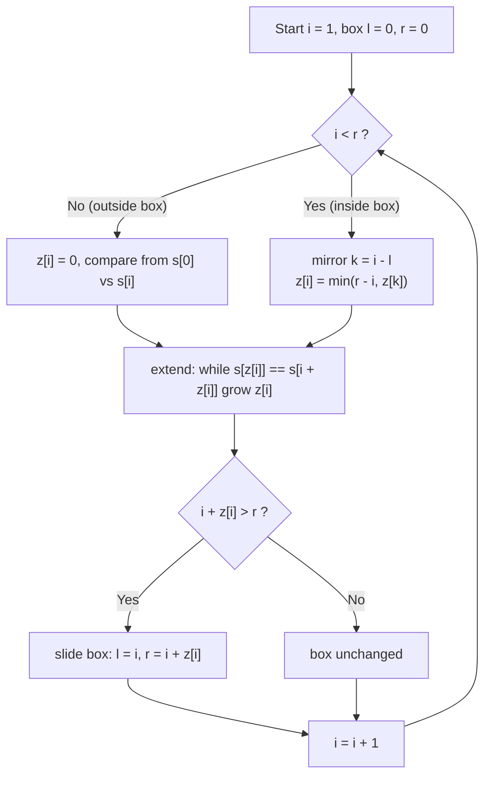

# The Z-Algorithm (Z-Function)

The **Z-function** of a string `s` is an array `z` where `z[i]` is the length of the longest
substring starting at position `i` that is **also a prefix** of `s`. It is one of the most
elegant linear-time string tools: a single left-to-right pass computes, for every position, how
far the suffix starting there agrees with the whole string. From this single array you can do
pattern matching, find periods and borders, count occurrences, and much more — all in
**O(n)**.

This guide develops the Z-function from its definition, explains the crucial **[l, r] Z-box**
trick that makes it linear, and shows the classic applications side by side in Python and C++.

> A worked competitive example using Z (and hashing) lives in
> [cses-1753-string-matching-hashing-z.md](../problems/cses-1753-string-matching-hashing-z.md);
> this guide focuses on the algorithm itself and does not recreate it.

---

## Table of Contents
1. [Definition of $z[i]$](#definition-of-zi)
2. [The Naive Idea](#the-naive-idea)
3. [The [l, r] Z-Box and Amortized O(n)](#the-l-r-z-box-and-amortized-on)
4. [Computing the Z-Function (Python + C++)](#computing-the-z-function)
5. [Pattern Matching with `pattern + '#' + text`](#pattern-matching-with-pattern--text)
6. [Z-Based Search: All Occurrences (Python + C++)](#z-based-search-all-occurrences)
7. [Periods and Borders from Z](#periods-and-borders-from-z)
8. [Period Detection (Python + C++)](#period-detection)
9. [Relation to the Prefix Function](#relation-to-the-prefix-function)
10. [Mermaid: The Z-Box Sliding](#mermaid-the-z-box-sliding)
11. [Complexity Summary](#complexity-summary)
12. [Common Pitfalls](#common-pitfalls)
13. [Patterns](#patterns)

---

## Definition of $z[i]$

Given a string $s$ of length $n$ (0-indexed), define:

$$
z[i] = \max \{\, k \ge 0 : s[0 \ldots k-1] = s[i \ldots i+k-1] \,\}
$$

In words, $z[i]$ is the length of the longest common prefix of $s$ and the **suffix** of $s$
starting at index $i$. By convention $z[0]$ is left as $0$ (or sometimes set to $n$); most
implementations keep $z[0] = 0$ and never use it.

**Example.** For `s = "aabxaayaab"`:

```
index: 0  1  2  3  4  5  6  7  8  9
s:     a  a  b  x  a  a  y  a  a  b
z:     0  1  0  0  2  1  0  3  1  0
```

- $z[1] = 1$: `s[1..] = "abxaayaab"` shares only `"a"` with the prefix `"aabx..."`.
- $z[4] = 2$: `s[4..] = "aayaab"` shares `"aa"` with the prefix `"aa..."`.
- $z[7] = 3$: `s[7..] = "aab"` shares `"aab"` with the prefix `"aab..."`.

---

## The Naive Idea

The definition itself suggests an $O(n^2)$ algorithm: for each `i`, compare `s[i..]` against
`s[0..]` character by character.

```python
def z_naive(s):
    n = len(s)
    z = [0] * n
    for i in range(1, n):
        k = 0
        while i + k < n and s[k] == s[i + k]:
            k += 1
        z[i] = k
    return z
```

```cpp
#include <bits/stdc++.h>
using namespace std;

vector<int> z_naive(const string& s) {
    int n = (int)s.size();
    vector<int> z(n, 0);
    for (int i = 1; i < n; ++i) {
        int k = 0;
        while (i + k < n && s[k] == s[i + k]) ++k;
        z[i] = k;
    }
    return z;
}
```

This recomputes overlapping comparisons. The Z-box trick reuses already-known matches to make
the whole thing linear.

---

## The [l, r] Z-Box and Amortized O(n)

As we move `i` from left to right, we maintain the **rightmost Z-box**: the interval `[l, r]`
that is the match with the largest right endpoint `r` seen so far. Concretely, `[l, r]` is an
interval such that `s[l..r]` equals the prefix `s[0..r-l]` (it is the substring `s[l..r]` that
matched a prefix of `s`).

When we reach a new index `i`:

- **Case A — `i > r` (outside the box).** We have no information; compare from scratch starting
  at `s[0]` vs `s[i]`. Extend `z[i]` as far as it goes, then set `l = i`, `r = i + z[i] - 1`.

- **Case B — `i <= r` (inside the box).** Let `k = i - l` be the mirror position inside the
  prefix. Because `s[l..r] = s[0..r-l]`, the character pattern at `i` mirrors the pattern at `k`.
  So we can **reuse** `z[k]`:
  - If `z[k] < r - i + 1`, the mirrored match fits entirely inside the box, so
    $z[i] = z[k]$ exactly — no comparisons needed.
  - Otherwise the mirror reaches (or passes) the box edge `r`; we know `z[i] >= r - i + 1`, so we
    start explicit comparisons **from `r + 1`** onward and extend.

Each explicit character comparison either fails (happens once per `i`) or advances `r`. Since `r`
only increases and is bounded by `n`, the total number of successful comparisons across all `i`
is $O(n)$. That is the amortized argument: **O(n)** total.

---

## Computing the Z-Function

The canonical linear implementation:

```python
def z_function(s):
    n = len(s)
    z = [0] * n
    l, r = 0, 0                      # current rightmost Z-box [l, r]
    for i in range(1, n):
        if i < r:                    # inside the box: reuse mirror z[i - l]
            z[i] = min(r - i, z[i - l])
        while i + z[i] < n and s[z[i]] == s[i + z[i]]:
            z[i] += 1                # extend the match explicitly
        if i + z[i] > r:             # found a box reaching further right
            l, r = i, i + z[i]
    return z
```

```cpp
#include <bits/stdc++.h>
using namespace std;

vector<int> z_function(const string& s) {
    int n = (int)s.size();
    vector<int> z(n, 0);
    int l = 0, r = 0;                      // current rightmost Z-box [l, r)
    for (int i = 1; i < n; ++i) {
        if (i < r)                         // inside the box: reuse mirror z[i - l]
            z[i] = min(r - i, z[i - l]);
        while (i + z[i] < n && s[z[i]] == s[i + z[i]])
            ++z[i];                        // extend the match explicitly
        if (i + z[i] > r) {                // found a box reaching further right
            l = i;
            r = i + z[i];
        }
    }
    return z;
}
```

> Note: here `r` is stored as a **half-open** endpoint (one past the last matched index), which
> makes the arithmetic `min(r - i, z[i - l])` clean. Be consistent: if you store `r` as the last
> matched index, the formula becomes `min(r - i + 1, z[i - l])`.

---

## Pattern Matching with `pattern + '#' + text`

To find every occurrence of `pattern` `p` in `text` `t`, build the concatenation:

$$
s = p \mathbin{+} \texttt{\#} \mathbin{+} t
$$

where `#` is a **separator** that does not appear in either string. Compute `z` over `s`. For any
index `i` that lies in the `t` part, if

$$
z[i] \ge |p|
$$

then the prefix of `s` (which is exactly `p`) matches `s[i..]`, i.e. `p` occurs in `t` at
position `i - (|p| + 1)`. The separator guarantees no match can span across `#`, so `z[i]` can
never exceed `|p|` for indices in `t`.

```
       p   #            t
s =  a b a # x a b a b a a b a
            ^ index here in t with z >= |p|  -> occurrence
```

---

## Z-Based Search: All Occurrences

```python
def z_search(text, pattern):
    if not pattern:
        return list(range(len(text) + 1))
    s = pattern + '#' + text
    z = z_function(s)
    m = len(pattern)
    res = []
    for i in range(m + 1, len(s)):       # indices that lie inside the text part
        if z[i] >= m:
            res.append(i - (m + 1))      # map back to position in text
    return res
```

```cpp
#include <bits/stdc++.h>
using namespace std;

vector<int> z_search(const string& text, const string& pattern) {
    vector<int> res;
    if (pattern.empty()) {
        for (int i = 0; i <= (int)text.size(); ++i) res.push_back(i);
        return res;
    }
    string s = pattern + '#' + text;
    vector<int> z = z_function(s);
    int m = (int)pattern.size();
    for (int i = m + 1; i < (int)s.size(); ++i)   // indices inside the text part
        if (z[i] >= m)
            res.push_back(i - (m + 1));           // map back to text position
    return res;
}
```

---

## Periods and Borders from Z

A **border** of `s` is a proper prefix that is also a suffix. A **period** `p` is a length such
that `s[i] = s[i + p]` for all valid `i`; equivalently `p = n - b` for some border length `b`.

The Z-function reads borders directly. Index `i` is the start of a **suffix that is a prefix**
exactly when the match reaches the end of the string:

$$
i + z[i] = n \quad\Longrightarrow\quad s[i \ldots n-1] \text{ is a border of length } z[i]
$$

and the corresponding **period** is `i` itself. The **smallest period** is the smallest `i` with
`i + z[i] = n`. If no such `i < n` exists, the string has no nontrivial period and its smallest
period is `n` (the string is **primitive** with respect to that period).

A string is a repetition of a block of length `p` (i.e. `s = block^(n/p)`) iff `p` is a period
**and** `p` divides `n`.

---

## Period Detection

```python
def smallest_period(s):
    n = len(s)
    z = z_function(s)
    for i in range(1, n):
        if i + z[i] == n:        # suffix s[i..] is a prefix -> border of length z[i]
            return i             # period = n - border = i
    return n                     # no nontrivial period

def all_periods(s):
    n = len(s)
    z = z_function(s)
    periods = []
    for i in range(1, n):
        if i + z[i] == n:        # border ends exactly at the end of s
            periods.append(i)    # this i is a period length
    periods.append(n)            # the trivial full-length period
    return periods               # increasing order
```

```cpp
#include <bits/stdc++.h>
using namespace std;

int smallest_period(const string& s) {
    int n = (int)s.size();
    vector<int> z = z_function(s);
    for (int i = 1; i < n; ++i)
        if (i + z[i] == n)        // suffix s[i..] is a prefix -> border of length z[i]
            return i;             // period = n - border = i
    return n;                     // no nontrivial period
}

vector<int> all_periods(const string& s) {
    int n = (int)s.size();
    vector<int> z = z_function(s);
    vector<int> periods;
    for (int i = 1; i < n; ++i)
        if (i + z[i] == n)        // border ends exactly at the end of s
            periods.push_back(i); // this i is a period length
    periods.push_back(n);         // the trivial full-length period
    return periods;               // increasing order
}
```

---

## Relation to the Prefix Function

The **prefix function** $\pi[i]$ (used in KMP) is the length of the longest proper border of the
prefix `s[0..i]`. It encodes the same structural information as the Z-function, and the two are
inter-convertible in linear time.

- **Z from $\pi$:** for each `i` with $\pi[i] > 0$, the suffix ending at `i` of length $\pi[i]$
  matches a prefix; one pass converts $\pi$ to $z$.
- **$\pi$ from Z:** for each `i`, the match `z[i]` covers positions `i .. i + z[i] - 1`, each of
  which has a border of length reaching back to the prefix.

Key conceptual difference:

| | Prefix function $\pi[i]$ | Z-function $z[i]$ |
|---|---|---|
| Anchored at | the **end** of prefix `s[0..i]` | the **start** position `i` |
| Measures | longest border of `s[0..i]` | longest prefix-match of `s[i..]` |
| Both give | borders, periods, occurrences | borders, periods, occurrences |

If you already know KMP, Z is a different lens on the same automaton structure; many people find
Z more intuitive for "match against the whole string from here."

---

## Mermaid: The Z-Box Sliding

The diagram shows how each new index `i` is resolved by reusing the rightmost box `[l, r]` and
only extending past `r` when necessary.



The amortization is visible here: the explicit `extend` loop only ever pushes `r` to the right,
and `r <= n`, so all extensions together cost $O(n)$.

---

## Complexity Summary

| Operation | Time | Space |
|-----------|------|-------|
| Naive Z-function | $O(n^2)$ | $O(n)$ |
| Linear Z-function | $O(n)$ | $O(n)$ |
| Pattern search (`p + '#' + t`) | $O(|p| + |t|)$ | $O(|p| + |t|)$ |
| All occurrences | $O(|p| + |t|)$ | $O(|p| + |t|)$ |
| Smallest / all periods | $O(n)$ | $O(n)$ |

The whole family is linear because the Z-box right endpoint `r` is monotonically nondecreasing
and bounded by `n`.

---

## Common Pitfalls

- **Half-open vs inclusive `r`.** Decide whether `r` is "one past last match" or "last matched
  index" and keep the `min(...)` formula consistent. Mixing them is the #1 bug.
- **Forgetting `z[0]`.** `z[0]` is conventionally `0` (the loop starts at `i = 1`). Do not let
  the extend loop run for `i = 0`, or it will report `n` and corrupt the box logic.
- **Separator collision.** The `#` in `pattern + '#' + text` must not occur in either string. For
  arbitrary byte input use a sentinel outside the alphabet (e.g. `chr(0)` or an integer marker).
- **Index mapping.** When reporting occurrences, the text position is `i - (|p| + 1)`, accounting
  for both the pattern and the separator.
- **Overflow.** Lengths fit in `int` for typical limits, but if you multiply lengths (e.g. in
  combined hashing checks) use `long long`.
- **Empty pattern.** Define behavior explicitly; many conventions report a match at every index.

---

## Patterns

- **"Does prefix appear starting here?"** → Z-function directly; `z[i] >= L` tests an `L`-length
  prefix match at `i`.
- **Count / locate all occurrences of `p` in `t`** → `z_function(p + '#' + t)`, threshold `>= |p|`.
- **Smallest period / detect repetition** → first `i` with `i + z[i] = n`; repetition iff that
  period divides `n`.
- **Borders enumeration** → every `i` with `i + z[i] = n` gives a border of length `z[i]`.
- **Compare suffix against prefix in O(1) after preprocessing** → `z[i]` is the longest common
  prefix of `s` and `s[i..]`.
- **Two-pattern problems (prefix before, suffix after)** → run Z for each pattern, then merge
  with two pointers / binary search (see LeetCode 3008).
