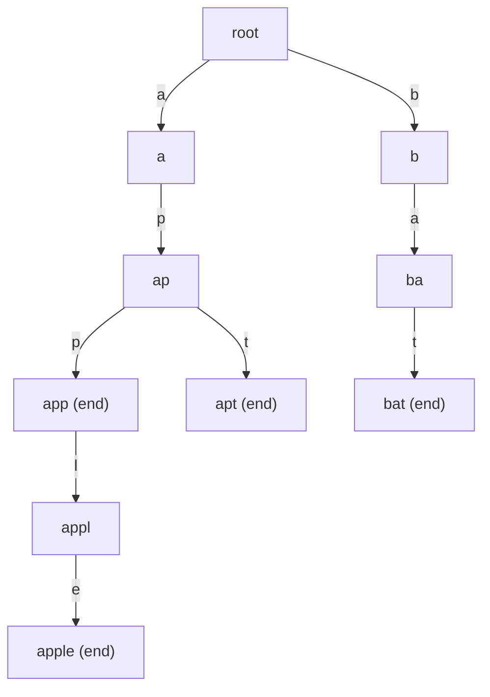

# Trie (Prefix Tree) — Complete Guide (including the Binary Trie)

> A **Trie** (pronounced "try", from re**trie**val) is a tree where each edge is labeled with a
> character. A path from the root spells a prefix, so all strings sharing a prefix share the same
> path. This turns prefix queries that would be $O(N \cdot L)$ over a list into clean $O(L)$
> operations — independent of how many strings are stored.

---

## Table of Contents
1. [The Trie Node Model](#1-the-trie-node-model)
2. [Insert, Search, startsWith in O(L)](#2-insert-search-startswith-in-ol)
3. [Prefix Counting](#3-prefix-counting)
4. [Deletion](#4-deletion)
5. [The Binary Trie (Max-XOR Queries)](#5-the-binary-trie-max-xor-queries)
6. [Memory Tradeoffs: Pointer vs Array](#6-memory-tradeoffs-pointer-vs-array)
7. [Mermaid](#7-mermaid)
8. [Complexity Summary](#8-complexity-summary)
9. [Common Pitfalls](#9-common-pitfalls)
10. [Patterns](#10-patterns)

---

## 1. The Trie Node Model

Each node represents **one prefix**. A node stores three things:

- **children** — a map (or fixed array) from a character to the next node.
- **end flag** — `is_end` marks that some inserted word terminates exactly here.
- **counts** — optional integers: `prefix_count` (how many words pass through this node) and
  `word_count` (how many words end here). Counts make prefix queries and deletion trivial.

The **root** represents the empty prefix `""` and holds no character itself.

```python
class TrieNode:
    def __init__(self):
        self.children = {}      # char -> TrieNode
        self.is_end = False     # a word ends here
        self.prefix_count = 0   # words passing through this node
        self.word_count = 0     # words ending exactly here
```

```cpp
#include <bits/stdc++.h>
using namespace std;

struct TrieNode {
    array<TrieNode*, 26> children; // 'a'..'z' -> child or nullptr
    bool is_end = false;           // a word ends here
    int prefix_count = 0;          // words passing through this node
    int word_count = 0;            // words ending exactly here
    TrieNode() { children.fill(nullptr); }
};
```

For lowercase English letters we map `c -> c - 'a'` into `[0, 25]`. For arbitrary alphabets a hash
map is more flexible but slower per step.

---

## 2. Insert, Search, startsWith in O(L)

Every operation walks **one character at a time** from the root. A word of length $L$ touches at
most $L + 1$ nodes, so each operation is $O(L)$, regardless of the number of stored words.

- **insert** — for each char, descend, creating a node if missing; mark the last node `is_end`.
- **search** — walk the path; succeed only if the path exists **and** the final node `is_end`.
- **startsWith** — walk the path; succeed if the path merely exists.

```python
class Trie:
    def __init__(self):
        self.root = TrieNode()

    def insert(self, word):
        node = self.root
        for c in word:
            if c not in node.children:
                node.children[c] = TrieNode()
            node = node.children[c]
            node.prefix_count += 1
        node.is_end = True
        node.word_count += 1

    def search(self, word):
        node = self._walk(word)
        return node is not None and node.is_end

    def starts_with(self, prefix):
        return self._walk(prefix) is not None

    def _walk(self, s):
        node = self.root
        for c in s:
            if c not in node.children:
                return None
            node = node.children[c]
        return node
```

```cpp
struct Trie {
    TrieNode* root;
    Trie() { root = new TrieNode(); }

    void insert(const string& word) {
        TrieNode* node = root;
        for (char ch : word) {
            int c = ch - 'a';
            if (node->children[c] == nullptr)
                node->children[c] = new TrieNode();
            node = node->children[c];
            node->prefix_count++;
        }
        node->is_end = true;
        node->word_count++;
    }

    TrieNode* walk(const string& s) {
        TrieNode* node = root;
        for (char ch : s) {
            int c = ch - 'a';
            if (node->children[c] == nullptr) return nullptr;
            node = node->children[c];
        }
        return node;
    }

    bool search(const string& word) {
        TrieNode* node = walk(word);
        return node != nullptr && node->is_end;
    }

    bool starts_with(const string& prefix) {
        return walk(prefix) != nullptr;
    }
};
```

The key distinction: `search("app")` requires `is_end == true`; `startsWith("app")` does not. If you
insert `"apple"` only, then `startsWith("app")` is `true` but `search("app")` is `false`.

---

## 3. Prefix Counting

To answer "**how many stored words start with prefix `p`?**" in $O(L)$, keep `prefix_count` on each
node. Every insert increments the counter on every node it passes. The answer is simply the
`prefix_count` of the node at the end of `p` (or `0` if the path breaks).

```python
def count_prefix(self, prefix):
    node = self._walk(prefix)
    return node.prefix_count if node else 0
```

```cpp
int count_prefix(const string& prefix) {
    TrieNode* node = walk(prefix);
    return node ? node->prefix_count : 0;
}
```

Without counts you would have to enumerate the subtree, which is $O(\text{nodes in subtree})$
instead of $O(L)$. The counter trades a few bytes per node for constant-extra-work queries.

---

## 4. Deletion

To delete a word we walk its path, decrement `prefix_count` along the way, then unset `is_end` /
decrement `word_count` at the terminal node. Optionally we **prune** nodes that no longer lie on any
word's path (`prefix_count == 0`) to reclaim memory. Pruning must be careful: a node may still be
needed as a prefix of another word, which the `prefix_count` check guards against.

```python
def delete(self, word):
    if not self.search(word):
        return False           # nothing to delete
    node = self.root
    path = [node]
    for c in word:
        node = node.children[c]
        node.prefix_count -= 1
        path.append(node)
    node.word_count -= 1
    if node.word_count == 0:
        node.is_end = False
    # prune dead nodes from the bottom up
    for i in range(len(word) - 1, -1, -1):
        child = path[i + 1]
        if child.prefix_count == 0 and not child.is_end:
            del path[i].children[word[i]]
        else:
            break
    return True
```

```cpp
bool erase(const string& word) {
    if (!search(word)) return false;      // nothing to delete
    TrieNode* node = root;
    vector<TrieNode*> path = {node};
    for (char ch : word) {
        node = node->children[ch - 'a'];
        node->prefix_count--;
        path.push_back(node);
    }
    node->word_count--;
    if (node->word_count == 0)
        node->is_end = false;
    // prune dead nodes from the bottom up
    for (int i = (int)word.size() - 1; i >= 0; i--) {
        TrieNode* child = path[i + 1];
        if (child->prefix_count == 0 && !child->is_end) {
            delete child;
            path[i]->children[word[i] - 'a'] = nullptr;
        } else {
            break;
        }
    }
    return true;
}
```

If you never delete, you can drop all of this and the structure stays simpler.

---

## 5. The Binary Trie (Max-XOR Queries)

A **binary trie** stores integers instead of strings: each number is treated as a fixed-width string
of bits (e.g. 32 bits, **most significant bit first**). Children are indexed by bit `0` or `1`.

Why bother? Because it answers "**given $x$, which stored number $y$ maximizes $x \oplus y$?**" in
$O(B)$ where $B$ is the bit width.

**The greedy idea.** XOR produces a `1` in a bit position exactly when the two bits **differ**. To
maximize the value, we want a `1` in the highest possible position. So, descending from the MSB, at
each level we greedily try to take the child whose bit is the **opposite** of $x$'s current bit. If
that opposite child exists, this position contributes $2^{\text{bit}}$ to the answer; otherwise we
are forced down the same-bit child and that position contributes nothing.

```python
class BinaryTrie:
    def __init__(self, bits=32):
        self.bits = bits
        self.children = [[0, 0]]   # node -> [child0, child1], 0 means "missing"
        self.cnt = [0]             # how many numbers pass through this node

    def _new_node(self):
        self.children.append([0, 0])
        self.cnt.append(0)
        return len(self.children) - 1

    def insert(self, x):
        node = 0
        for i in range(self.bits - 1, -1, -1):
            b = (x >> i) & 1
            if self.children[node][b] == 0:
                self.children[node][b] = self._new_node()
            node = self.children[node][b]
            self.cnt[node] += 1

    def max_xor(self, x):
        node = 0
        best = 0
        for i in range(self.bits - 1, -1, -1):
            b = (x >> i) & 1
            want = b ^ 1                       # opposite bit gives a 1 in this position
            if self.children[node][want] and self.cnt[self.children[node][want]] > 0:
                best |= (1 << i)
                node = self.children[node][want]
            else:
                node = self.children[node][b]  # forced to the same bit
        return best
```

```cpp
struct BinaryTrie {
    int bits;
    vector<array<int, 2>> children; // node -> {child0, child1}, 0 means "missing"
    vector<int> cnt;                // numbers passing through this node

    BinaryTrie(int bits = 32) : bits(bits) {
        children.push_back({0, 0});
        cnt.push_back(0);
    }

    int new_node() {
        children.push_back({0, 0});
        cnt.push_back(0);
        return (int)children.size() - 1;
    }

    void insert(long long x) {
        int node = 0;
        for (int i = bits - 1; i >= 0; i--) {
            int b = (x >> i) & 1;
            if (children[node][b] == 0)
                children[node][b] = new_node();
            node = children[node][b];
            cnt[node]++;
        }
    }

    long long max_xor(long long x) {
        int node = 0;
        long long best = 0;
        for (int i = bits - 1; i >= 0; i--) {
            int b = (x >> i) & 1;
            int want = b ^ 1;                  // opposite bit gives a 1 here
            if (children[node][want] != 0 && cnt[children[node][want]] > 0) {
                best |= (1LL << i);
                node = children[node][want];
            } else {
                node = children[node][b];      // forced to the same bit
            }
        }
        return best;
    }
};
```

Keeping `cnt` per node lets you also **delete** numbers (decrement along the path) so the trie can
support a sliding window or "numbers seen so far" set — handy for problems where the candidate set
changes over time.

---

## 6. Memory Tradeoffs: Pointer vs Array

There are two common node layouts:

- **Pointer / hash-map children** (`dict` in Python, `unordered_map` in C++). Uses memory
  proportional to the number of **distinct edges actually present**. Flexible for huge or unknown
  alphabets, but each step pays hashing + cache-miss overhead.
- **Fixed array children** (`int nxt[N][26]` for letters, `int nxt[N][2]` for bits). Every node
  reserves a full slot per alphabet symbol — wasteful if the alphabet is large and the trie sparse,
  but each step is a single array index, which is extremely cache-friendly and fast.

In competitive C++ the array-of-children, **index-based** trie is the standard for speed: preallocate
a flat 2D array and hand out integer node ids instead of allocating objects.

```python
# Index-based trie (Python) — flat arrays, no per-node objects
class FastTrie:
    def __init__(self, max_nodes, alpha=26):
        self.alpha = alpha
        self.nxt = [[0] * alpha for _ in range(max_nodes)]
        self.end = [0] * max_nodes
        self.sz = 1   # node 0 is the root

    def insert(self, word):
        node = 0
        for ch in word:
            c = ord(ch) - ord('a')
            if self.nxt[node][c] == 0:
                self.nxt[node][c] = self.sz
                self.sz += 1
            node = self.nxt[node][c]
        self.end[node] += 1
```

```cpp
// Index-based trie (C++) — flat arrays, no per-node allocation
const int N = 1000000;   // total characters across all inserts + 1
int nxt[N][26];          // children indices, 0 == missing
int endcnt[N];           // words ending at each node
int sz = 1;              // node 0 is the root

void insert(const string& word) {
    int node = 0;
    for (char ch : word) {
        int c = ch - 'a';
        if (nxt[node][c] == 0) {
            nxt[node][c] = sz++;   // hand out a fresh node id
        }
        node = nxt[node][c];
    }
    endcnt[node]++;
}
```

Rule of thumb: small fixed alphabet → array children; large/unknown alphabet → hash-map children.

---

## 7. Mermaid

A trie holding `{ "app", "apple", "apt", "bat" }`. Nodes marked `(end)` terminate a word.



Notice `"app"` is both a complete word **and** a prefix of `"apple"`: the same node carries an end
flag and continues to deeper nodes.

---

## 8. Complexity Summary

Let $L$ be the length of the key, $B$ the bit width for a binary trie, $\Sigma$ the alphabet size,
and $n$ the number of stored keys with total length $T = \sum L_i$.

| Operation | Time | Space |
|-----------|------|-------|
| insert (string) | $O(L)$ | up to $O(L \cdot \Sigma)$ new node slots |
| search / startsWith | $O(L)$ | — |
| countPrefix | $O(L)$ | — |
| delete (+ prune) | $O(L)$ | frees pruned nodes |
| build whole trie | $O(T)$ | $O(T \cdot \Sigma)$ worst case (array children) |
| binary trie insert | $O(B)$ | $O(B)$ new nodes |
| binary trie maxXor | $O(B)$ | — |

Compared to a hash set, the trie is **not** faster for plain membership, but it uniquely supports
prefix and max-XOR queries that a hash set cannot.

---

## 9. Common Pitfalls

- **Confusing `search` with `startsWith`.** `search` must also check `is_end`; `startsWith` only
  checks that the path exists.
- **Forgetting the root is the empty prefix.** The root holds no character; the first real character
  is an edge out of the root.
- **Reserving too few nodes** in an index-based trie. You need `total_characters + 1` nodes in the
  worst case (no sharing). Under-sizing the flat array causes silent corruption.
- **Using node id `0` as a valid child.** When `0` means "missing", the root must be node `0` and you
  must never store `0` as a real child — start handing out ids from `1`.
- **Binary trie bit order.** Always iterate from the **most significant** bit so the greedy choice
  maximizes the highest-value position first. Iterating LSB-first gives wrong answers.
- **Mismatched bit width.** Pick a `bits` large enough to cover the maximum value (e.g. 31–32 bits
  for values up to $\sim 2 \times 10^9$); too few bits drops high bits and corrupts XOR results.

---

## 10. Patterns

- **Prefix / autocomplete queries** — "does any word start with `p`?", "how many start with `p`?".
- **Dictionary with wildcards** — store words in a trie, answer `.` wildcards by DFS branching at the
  wildcard position (see LeetCode 211).
- **Max / min XOR pair and XOR with constraints** — build a binary trie of the numbers, then for each
  query greedily walk the opposite bits (see LeetCode 421). Add `cnt` to support insert/delete and
  range/online variants.
- **Counting pairs with XOR in a range** — augment the binary trie with subtree counts and walk by
  bound bits, similar to a counting BST.
- **Replacing words / shortest root** — insert dictionary roots, then for each word walk until you hit
  an `is_end` node to find the shortest matching prefix.
- **Bitwise DP / persistent versions** — make nodes immutable and version them for "k-th query over a
  prefix of the array" style problems.
