# Aho–Corasick — Multi-Pattern Matching

> **Aho–Corasick** = a **trie of all patterns** + **KMP-style failure links**. It matches *all*
> patterns against a text in **$O(n + m + z)$** time, where $n$ is the text length, $m$ is the
> total length of all patterns, and $z$ is the number of reported matches.

KMP matches **one** pattern in $O(n + |p|)$. If you have $k$ patterns, running KMP $k$ times costs
$O(kn + m)$ — the text is scanned $k$ times. Aho–Corasick scans the text **once**: it builds a
single automaton from all patterns and feeds each text character through it in amortized $O(1)$.

---

## Table of Contents
1. [The Big Idea](#1-the-big-idea)
2. [Build the Trie of Patterns](#2-build-the-trie-of-patterns)
3. [BFS to Compute Fail Links (Suffix Links)](#3-bfs-to-compute-fail-links-suffix-links)
4. [Output / Dictionary-Suffix Links](#4-output--dictionary-suffix-links)
5. [The Automaton goto Transitions](#5-the-automaton-goto-transitions)
6. [Counting and Locating All Occurrences](#6-counting-and-locating-all-occurrences)
7. [The Dictionary-Link Chain for Overlapping Matches](#7-the-dictionary-link-chain-for-overlapping-matches)
8. [Full Build + Run](#8-full-build--run)
9. [Mermaid: Trie + Fail Links](#9-mermaid-trie--fail-links)
10. [Complexity Summary](#10-complexity-summary)
11. [Common Pitfalls](#11-common-pitfalls)
12. [Patterns](#12-patterns)

---

## 1. The Big Idea

Think of the trie as a **DFA in progress**. Each node represents a prefix of one or more
patterns. As we read the text, we walk down the trie. When the next character has no edge, we
don't restart from the root — we follow a **fail link** to the longest node that is still a valid
suffix of what we've matched, exactly like KMP's LPS fallback, but generalized to many patterns
sharing one structure.

Three structures live on every node:

- **trie/goto edges** — labeled by a character, leading to a child (later upgraded to a full
  automaton transition).
- **fail link** — points to the node representing the longest proper suffix of the current
  string that is also a prefix of some pattern.
- **output / dictionary link** — points to the nearest ancestor-via-fail-chain node that is the
  *end* of a pattern, so we can report all patterns ending here without walking the whole chain.

---

## 2. Build the Trie of Patterns

Insert every pattern as a path of nodes from the root. We use **array-based** children indexed by
the alphabet (here lowercase `a..z`, size 26) so transitions are $O(1)$ array lookups, not hash
lookups. We store the index of each pattern that ends at a node.

```python
ALPHA = 26

class Aho:
    def __init__(self):
        self.nxt = [[0] * ALPHA]   # nxt[node][c] -> child node (0 = none/root)
        self.fail = [0]            # fail[node]
        self.out = [[]]            # pattern ids ending at this node
        self.dict_link = [0]       # dictionary-suffix link

    def _new_node(self):
        self.nxt.append([0] * ALPHA)
        self.fail.append(0)
        self.out.append([])
        self.dict_link.append(0)
        return len(self.nxt) - 1

    def add(self, word, pid):
        cur = 0
        for ch in word:
            c = ord(ch) - 97
            if self.nxt[cur][c] == 0:
                self.nxt[cur][c] = self._new_node()
            cur = self.nxt[cur][c]
        self.out[cur].append(pid)
```

```cpp
#include <bits/stdc++.h>
using namespace std;

const int ALPHA = 26;

struct Aho {
    vector<array<int, ALPHA>> nxt;   // nxt[node][c] -> child (0 = none/root)
    vector<int> fail;                // fail[node]
    vector<vector<int>> out;         // pattern ids ending at this node
    vector<int> dict_link;           // dictionary-suffix link

    Aho() { new_node(); }            // create root = node 0

    int new_node() {
        nxt.push_back({});           // zero-initialized array
        fail.push_back(0);
        out.push_back({});
        dict_link.push_back(0);
        return (int)nxt.size() - 1;
    }

    void add(const string& word, int pid) {
        int cur = 0;
        for (char ch : word) {
            int c = ch - 'a';
            if (nxt[cur][c] == 0)
                nxt[cur][c] = new_node();
            cur = nxt[cur][c];
        }
        out[cur].push_back(pid);
    }
};
```

> Node `0` is the root **and** the "null" child marker. That works because nothing ever points
> *to* the root via a trie edge — the root has no parent.

---

## 3. BFS to Compute Fail Links (Suffix Links)

The fail link of a node `v` reached by character `c` from parent `u` is computed as:

> Follow `u`'s fail link to `w`, then take `w`'s transition on `c`. That node is `v`'s fail link.

This **only works in BFS (level-by-level) order**, because a node's fail link always points to a
node at a strictly shallower depth — already finalized when we process the current level.

Depth-1 nodes (direct children of root) always fail to the root. We seed the BFS queue with them
and, crucially, redirect every *missing* root edge back to the root so the automaton never gets
stuck.

```python
from collections import deque

def build_fail(self):
    q = deque()
    # depth-1 nodes fail to root; missing root edges loop to root
    for c in range(ALPHA):
        v = self.nxt[0][c]
        if v:
            self.fail[v] = 0
            q.append(v)
        # else: nxt[0][c] stays 0 == root (self-loop), good
    while q:
        u = q.popleft()
        for c in range(ALPHA):
            v = self.nxt[u][c]
            if v:
                self.fail[v] = self.nxt[self.fail[u]][c]
                q.append(v)
            else:
                # automaton transition: shortcut to fail's transition
                self.nxt[u][c] = self.nxt[self.fail[u]][c]
```

```cpp
void build_fail() {
    queue<int> q;
    // depth-1 nodes fail to root; missing root edges loop to root
    for (int c = 0; c < ALPHA; c++) {
        int v = nxt[0][c];
        if (v) {
            fail[v] = 0;
            q.push(v);
        }
        // else: nxt[0][c] stays 0 == root (self-loop), good
    }
    while (!q.empty()) {
        int u = q.front(); q.pop();
        for (int c = 0; c < ALPHA; c++) {
            int v = nxt[u][c];
            if (v) {
                fail[v] = nxt[fail[u]][c];
                q.push(v);
            } else {
                // automaton transition: shortcut to fail's transition
                nxt[u][c] = nxt[fail[u]][c];
            }
        }
    }
}
```

Notice we do two jobs in one pass: set fail links for real children **and** fill missing edges
with the precomputed automaton transition (Section 5).

---

## 4. Output / Dictionary-Suffix Links

The fail link points to the longest proper suffix that is a **prefix** of some pattern — but that
node may not itself be the *end* of a pattern. To report every pattern that ends at the current
position we'd have to walk the whole fail chain. Instead we precompute a **dictionary link** that
skips directly to the next node on the fail chain that *is* a pattern end:

$$
\text{dict\_link}(v) =
\begin{cases}
\text{fail}(v) & \text{if } \text{fail}(v) \text{ ends a pattern} \\
\text{dict\_link}(\text{fail}(v)) & \text{otherwise}
\end{cases}
$$

We compute it inside the same BFS, right after setting `fail[v]`:

```python
def set_dict_link(self, v):
    f = self.fail[v]
    self.dict_link[v] = f if self.out[f] else self.dict_link[f]
```

```cpp
void set_dict_link(int v) {
    int f = fail[v];
    dict_link[v] = out[f].empty() ? dict_link[f] : f;
}
```

Now reporting matches at a node is: emit `out[v]`, then hop along `dict_link` until you reach the
root, emitting each visited node's outputs.

---

## 5. The Automaton goto Transitions

A **trie** has missing edges; an **automaton** is *complete* — every (node, character) pair has a
destination. By overwriting each missing edge `nxt[u][c]` with `nxt[fail[u]][c]` during the BFS,
we precompute the failure fallback into the table itself. The payoff: feeding a text character is
a single array read, no inner `while` loop.

```python
def go(self, node, ch):
    return self.nxt[node][ord(ch) - 97]   # always valid after build_fail
```

```cpp
int go(int node, char ch) {
    return nxt[node][ch - 'a'];            // always valid after build_fail
}
```

This is the difference between a "lazy" version that follows fail links at query time (amortized
$O(1)$ but with a constant factor) and the fully-built DFA where each step is truly $O(1)$.

---

## 6. Counting and Locating All Occurrences

To run the automaton over a text, start at the root and step on each character. At every node, the
matches ending there are `out[node]` plus everything along the `dict_link` chain.

```python
def count_matches(self, text):
    total = 0
    node = 0
    for ch in text:
        node = self.nxt[node][ord(ch) - 97]
        v = node
        while v:                       # walk dictionary-link chain
            total += len(self.out[v])
            v = self.dict_link[v]
    return total
```

```cpp
long long count_matches(const string& text) {
    long long total = 0;
    int node = 0;
    for (char ch : text) {
        node = nxt[node][ch - 'a'];
        for (int v = node; v; v = dict_link[v])  // walk dict-link chain
            total += (long long)out[v].size();
    }
    return total;
}
```

If you only need *how many positions end a pattern* (not which), you can precompute a per-node
count `cnt[v] = |out[v]| + cnt[dict_link[v]]` in BFS order and replace the inner chain walk with a
single `total += cnt[node]`.

---

## 7. The Dictionary-Link Chain for Overlapping Matches

Patterns can be suffixes of one another, so a single text position may end several patterns at
once. Example: patterns `he`, `she`, `hers`. Reading text `ushers`:

- after `...she` the node ends `she`, and its dict-link reaches the node ending `he` — **two**
  matches at the same position.
- after `...hers` the node ends `hers`.

The dict-link chain guarantees we report **all overlapping** matches in time proportional to the
number of matches, never re-scanning the text.

```python
def locate(self, text):
    occ = []                           # (end_index, pattern_id)
    node = 0
    for i, ch in enumerate(text):
        node = self.nxt[node][ord(ch) - 97]
        v = node
        while v:
            for pid in self.out[v]:
                occ.append((i, pid))
            v = self.dict_link[v]
    return occ
```

```cpp
vector<pair<int,int>> locate(const string& text) {
    vector<pair<int,int>> occ;         // (end_index, pattern_id)
    int node = 0;
    for (int i = 0; i < (int)text.size(); i++) {
        node = nxt[node][text[i] - 'a'];
        for (int v = node; v; v = dict_link[v])
            for (int pid : out[v])
                occ.push_back({i, pid});
    }
    return occ;
}
```

---

## 8. Full Build + Run

Putting build (trie + fail links via BFS) and a text scan together end to end.

```python
def solve(patterns, text):
    a = Aho()
    for pid, p in enumerate(patterns):
        a.add(p, pid)
    # BFS: fail links + dict links + automaton transitions
    from collections import deque
    q = deque()
    for c in range(ALPHA):
        v = a.nxt[0][c]
        if v:
            a.fail[v] = 0
            a.dict_link[v] = 0
            q.append(v)
    while q:
        u = q.popleft()
        for c in range(ALPHA):
            v = a.nxt[u][c]
            if v:
                a.fail[v] = a.nxt[a.fail[u]][c]
                f = a.fail[v]
                a.dict_link[v] = f if a.out[f] else a.dict_link[f]
                q.append(v)
            else:
                a.nxt[u][c] = a.nxt[a.fail[u]][c]
    return a.count_matches(text)
```

```cpp
long long solve(const vector<string>& patterns, const string& text) {
    Aho a;
    for (int pid = 0; pid < (int)patterns.size(); pid++)
        a.add(patterns[pid], pid);
    // BFS: fail links + dict links + automaton transitions
    queue<int> q;
    for (int c = 0; c < ALPHA; c++) {
        int v = a.nxt[0][c];
        if (v) {
            a.fail[v] = 0;
            a.dict_link[v] = 0;
            q.push(v);
        }
    }
    while (!q.empty()) {
        int u = q.front(); q.pop();
        for (int c = 0; c < ALPHA; c++) {
            int v = a.nxt[u][c];
            if (v) {
                a.fail[v] = a.nxt[a.fail[u]][c];
                int f = a.fail[v];
                a.dict_link[v] = a.out[f].empty() ? a.dict_link[f] : f;
                q.push(v);
            } else {
                a.nxt[u][c] = a.nxt[a.fail[u]][c];
            }
        }
    }
    return a.count_matches(text);
}
```

---

## 9. Mermaid: Trie + Fail Links

Trie for patterns `{he, she, hers, his}` with a few fail links shown as dashed arrows. The root is
node `0`; dashed links point to the longest proper suffix that is also a prefix of some pattern.

```mermaid
flowchart LR
    R(("0 root"))
    H["h"]
    HE["he &#10003;"]
    HER["her"]
    HERS["hers &#10003;"]
    HI["hi"]
    HIS["his &#10003;"]
    S["s"]
    SH["sh"]
    SHE["she &#10003;"]

    R -->|h| H
    H -->|e| HE
    HE -->|r| HER
    HER -->|s| HERS
    H -->|i| HI
    HI -->|s| HIS
    R -->|s| S
    S -->|h| SH
    SH -->|e| SHE

    SHE -.fail.-> HE
    SH -.fail.-> H
    HERS -.fail.-> S
    HIS -.fail.-> S
```



The `&#10003;` (✓) marks nodes that end a pattern. Note `she` fails to `he` — that fail link is
exactly why reading `...she` also reports `he` via the dictionary chain.

---

## 10. Complexity Summary

| Phase | Time | Space |
|-------|------|-------|
| Build trie | $O(m)$ | $O(m \cdot \Sigma)$ array edges |
| BFS fail + dict links | $O(m \cdot \Sigma)$ | $O(m)$ |
| Scan text (count only) | $O(n)$ | $O(1)$ |
| Scan + report all occurrences | $O(n + z)$ | $O(z)$ output |

Here $m$ = total pattern length, $n$ = text length, $z$ = number of matches, $\Sigma$ = alphabet
size. The $O(m\Sigma)$ memory is the cost of array-based transitions; a hash-map of children trades
speed for $O(m)$ memory.

$$
T_{\text{total}} = O\big(m\,\Sigma + n + z\big)
$$

---

## 11. Common Pitfalls

- **Fail-link BFS order.** You *must* process nodes level by level (BFS). A node's fail link
  points to a shallower node, so depth `d-1` must be finalized before depth `d`. Computing fail
  links with DFS or in insertion order gives wrong links.
- **Forgetting dictionary links.** Without them you'd walk the entire fail chain at each text
  position to find all patterns, degrading reporting to $O(n \cdot \text{depth})$. The dict link
  skips straight to the next pattern-ending node.
- **Root self-loop.** Missing edges out of the root must point back to the root, *not* to the
  null marker. Seed the BFS so `nxt[0][c]` stays `0` (root) for absent edges; otherwise the
  automaton "falls off" and stops matching.
- **Root's own fail link.** The root has no fail link (treat as itself / `0`). Don't try to set
  `fail[0]` from a parent — it has none.
- **Counting overlaps once.** When a position ends multiple patterns, each must be counted; don't
  `break` after the first hit on the dict-link chain.

---

## 12. Patterns

- **Multi-pattern search** — "does the text contain any of these forbidden/dictionary words?"
  Build once, scan once.
- **Streaming / online matching** — feed characters one at a time, keep only the current node
  (see LeetCode 1032 with a *reversed* trie).
- **Count occurrences of each pattern** — propagate per-node hit counts up the fail tree (the fail
  links form a tree rooted at `0`) with a reverse-BFS accumulation.
- **Dictionary filtering / virus scanning** — classic use: match thousands of signatures against a
  byte stream in one linear pass.
- **DP over an automaton** — combine Aho–Corasick states with DP to count strings avoiding (or
  containing) a set of patterns.
```
