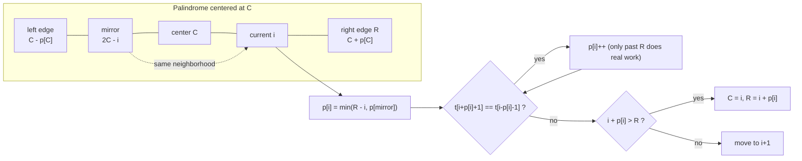

# Manacher's Algorithm — All Palindromic Radii in O(n)

> **Manacher's algorithm** computes, for *every* center of a string, the radius of the longest
> palindrome centered there — in **linear time**. The naive "expand around center" approach is
> $O(n^2)$ because each of the $2n-1$ centers can expand up to $O(n)$. Manacher reuses information
> from previously discovered palindromes (a *mirror* trick), so the **total** expansion work across
> all centers is bounded by $O(n)$.

---

## Table of Contents
1. [The Odd/Even Problem and the Transformed String](#1-the-oddeven-problem-and-the-transformed-string)
2. [The Radius Array `p[i]`](#2-the-radius-array-pi)
3. [Center `C`, Right Boundary `R`, and the Mirror Trick](#3-center-c-right-boundary-r-and-the-mirror-trick)
4. [Why Total Expansion Work is O(n)](#4-why-total-expansion-work-is-on)
5. [Manacher Returning Radii (code)](#5-manacher-returning-radii-code)
6. [Recovering the Longest Palindromic Substring](#6-recovering-the-longest-palindromic-substring)
7. [Counting All Palindromic Substrings](#7-counting-all-palindromic-substrings)
8. [Mermaid](#8-mermaid)
9. [Complexity Summary](#9-complexity-summary)
10. [Common Pitfalls](#10-common-pitfalls)
11. [Patterns](#11-patterns)

> **Note:** the *longest palindromic substring* application is also covered in
> [0005-longest-palindromic-substring.md](../problems/0005-longest-palindromic-substring.md) (via
> expand-around-center). This guide develops the full $O(n)$ Manacher machinery and the problems
> below pick *different* applications (counting, shortest palindrome, and a self-contained
> longest-substring-via-Manacher write-up).

---

## 1. The Odd/Even Problem and the Transformed String

Palindromes come in two flavors:

- **Odd length** — symmetric about a *single character*, e.g. `"aba"` (center `b`).
- **Even length** — symmetric about a *gap between two characters*, e.g. `"abba"` (center between the two `b`s).

Handling these two cases separately is annoying. The classic fix is to **insert a separator**
character (commonly `#`) between every pair of original characters and at both ends. We also add two
distinct **sentinels** `^` (start) and `$` (end) so that boundary checks never run off the array.

For `s = "abba"` the transformed string `t` is:

$$
t = \texttt{\^{} \# a \# b \# b \# a \# \$}
$$

Key facts about the transform:

- If `s` has length $n$, then `t` has length $2n + 3$ (each char becomes `#c`, plus a trailing `#`,
  plus two sentinels). The *content* portion `#a#b#...#` has length $2n+1$, which is **always odd**.
- **Every** palindrome of `t` is now centered on a single index, so we only ever deal with the odd
  case. An even palindrome of `s` becomes an odd palindrome of `t` centered on a `#`.
- The sentinels `^` and `$` differ from every real character and from `#`, so expansion always stops
  cleanly at the borders without an explicit bounds check.

```python
def transform(s):
    # "abba" -> "^#a#b#b#a#$"
    return "^#" + "#".join(s) + "#$"
```

```cpp
#include <bits/stdc++.h>
using namespace std;

string transform(const string& s) {
    // "abba" -> "^#a#b#b#a#$"
    string t = "^#";
    for (char c : s) { t += c; t += '#'; }
    t += '$';
    return t;
}
```

---

## 2. The Radius Array `p[i]`

We compute an array `p` over the transformed string `t`, where:

> `p[i]` = the **radius** of the longest palindrome of `t` centered at index `i`, measured in
> characters of `t` *excluding* the center.

So `t[i-p[i] .. i+p[i]]` is a palindrome, and `t[i-p[i]-1] != t[i+p[i]+1]`.

A beautiful property of this `#`-padded encoding: **`p[i]` equals the length of the corresponding
palindrome in the original string `s`**. Why? In `t` the palindrome `t[i-p[i] .. i+p[i]]` has
$2 \cdot p[i] + 1$ characters, exactly $p[i]$ of which are real (non-`#`) characters when the center
is a real character, and exactly $p[i]$ real characters when the center is a `#`. Either way the
original-string length is exactly $p[i]$.

```python
def radius_length_relation(p_i):
    # In t, palindrome length is 2*p_i + 1 (including center).
    # In original s, the palindrome has length exactly p_i.
    return p_i
```

```cpp
#include <bits/stdc++.h>
using namespace std;

int radius_length_relation(int p_i) {
    // In t, palindrome length is 2*p_i + 1 (including center).
    // In original s, the palindrome has length exactly p_i.
    return p_i;
}
```

---

## 3. Center `C`, Right Boundary `R`, and the Mirror Trick

The heart of the algorithm is a single observation. We sweep `i` from left to right and maintain the
**current rightmost-reaching palindrome**:

- `C` — the center of the palindrome whose right edge extends furthest right so far.
- `R` — that right edge, i.e. `R = C + p[C]`.

When we reach a new index `i` with `i < R`, the index lies *inside* the palindrome centered at `C`.
Its **mirror** about `C` is:

$$
\texttt{mirror} = 2C - i
$$

Because `t[C-p[C] .. C+p[C]]` is a palindrome, the neighborhood around `i` looks like the
neighborhood around `mirror`. So we can **initialize** `p[i]` cheaply instead of starting from zero:

$$
p[i] = \min\big(R - i,\; p[\texttt{mirror}]\big)
$$

- `p[mirror]` is the radius we already know at the mirror position.
- `R - i` caps the radius so it does not exceed the part of the palindrome we *know* is mirrored.
  Beyond `R` the palindrome at `C` says nothing, so we must verify by expansion.

If `i >= R` we have no information and start with `p[i] = 0`.

After this initialization we **attempt to expand**: while `t[i + p[i] + 1] == t[i - p[i] - 1]`,
increment `p[i]`. Finally, if `i + p[i] > R` we found a palindrome reaching further right than any
before, so we update `C = i`, `R = i + p[i]`.

```python
def init_radius(p, i, C, R):
    if i < R:
        mirror = 2 * C - i
        return min(R - i, p[mirror])
    return 0
```

```cpp
#include <bits/stdc++.h>
using namespace std;

int init_radius(const vector<int>& p, int i, int C, int R) {
    if (i < R) {
        int mirror = 2 * C - i;
        return min(R - i, p[mirror]);
    }
    return 0;
}
```

---

## 4. Why Total Expansion Work is O(n)

The mirror trick is what makes the algorithm linear. The cost has two parts:

1. **The constant-time bookkeeping per index** — computing the mirror and the `min(...)`
   initialization — is $O(1)$ for each of the $O(n)$ centers, hence $O(n)$ overall.
2. **The expansion loop** — the only part that *could* be expensive. The crucial invariant is that
   **every successful expansion step increases `R` by exactly one**, and `R` never decreases.

Why does each successful comparison push `R` further right? Expansion only does real work past the
current right boundary `R` (everything up to `R` was already guaranteed by the mirror). So each
character comparison that *succeeds* and grows the palindrome moves `R` to a position it has never
occupied before. Since `R` ranges from $0$ to $2n+2$ and only ever increases, there are at most
$O(n)$ successful comparisons across the **entire** run.

Each center also performs at most **one failing comparison** (the one that stops its loop), giving
another $O(n)$. Total comparisons: $O(n) + O(n) = O(n)$.

```python
def why_linear_note():
    # Successful expansions strictly increase R (monotone, bounded by |t|).
    # => at most O(n) successful comparisons in total.
    # Each center has at most one failing comparison => O(n) more.
    return "O(n)"
```

```cpp
#include <bits/stdc++.h>
using namespace std;

string why_linear_note() {
    // Successful expansions strictly increase R (monotone, bounded by |t|).
    // => at most O(n) successful comparisons in total.
    // Each center has at most one failing comparison => O(n) more.
    return "O(n)";
}
```

---

## 5. Manacher Returning Radii (code)

The full routine. It returns the radius array `p` over the transformed string. Callers translate
`p` into whatever they need (longest substring, counts, prefix palindromes, ...).

```python
def manacher(s):
    if s == "":
        return [], ""
    t = "^#" + "#".join(s) + "#$"
    n = len(t)
    p = [0] * n
    C = R = 0
    for i in range(1, n - 1):
        if i < R:
            mirror = 2 * C - i
            p[i] = min(R - i, p[mirror])
        # attempt to expand past the known region
        while t[i + p[i] + 1] == t[i - p[i] - 1]:
            p[i] += 1
        # update center/right boundary if we reached further right
        if i + p[i] > R:
            C, R = i, i + p[i]
    return p, t
```

```cpp
#include <bits/stdc++.h>
using namespace std;

pair<vector<int>, string> manacher(const string& s) {
    if (s.empty()) return {vector<int>(), string()};
    string t = "^#";
    for (char c : s) { t += c; t += '#'; }
    t += '$';
    int n = (int)t.size();
    vector<int> p(n, 0);
    int C = 0, R = 0;
    for (int i = 1; i < n - 1; i++) {
        if (i < R) {
            int mirror = 2 * C - i;
            p[i] = min(R - i, p[mirror]);
        }
        // attempt to expand past the known region
        while (t[i + p[i] + 1] == t[i - p[i] - 1]) {
            p[i]++;
        }
        // update center/right boundary if we reached further right
        if (i + p[i] > R) {
            C = i;
            R = i + p[i];
        }
    }
    return {p, t};
}
```

---

## 6. Recovering the Longest Palindromic Substring

Once we have `p`, the longest palindrome corresponds to the index with the largest radius. The
**index mapping back to the original string** is the part people get wrong.

If the maximum radius `p[i]` occurs at transformed index `i`, then:

- The palindrome length in `s` is exactly `p[i]`.
- The starting index in `s` is $\dfrac{i - p[i]}{2}$.

This works because each original character at position `k` sits at transformed index `2k + 2`
(thanks to the `^#` prefix), and the algebra collapses to that clean formula.

```python
def longest_palindrome(s):
    p, _ = manacher(s)
    if not p:
        return ""
    best_len = max(p)
    center = p.index(best_len)
    start = (center - best_len) // 2
    return s[start:start + best_len]
```

```cpp
#include <bits/stdc++.h>
using namespace std;

string longest_palindrome(const string& s) {
    auto [p, t] = manacher(s);
    if (p.empty()) return "";
    int best_len = 0, center = 0;
    for (int i = 0; i < (int)p.size(); i++) {
        if (p[i] > best_len) { best_len = p[i]; center = i; }
    }
    int start = (center - best_len) / 2;
    return s.substr(start, best_len);
}
```

---

## 7. Counting All Palindromic Substrings

A non-empty palindrome centered at `i` of radius `p[i]` contains *nested* palindromes of the same
parity at radii `p[i], p[i]-2, p[i]-4, ...` down to 1 (real) characters. In the transformed string,
the number of **distinct-position** palindromic substrings contributed by center `i` is exactly

$$
\left\lfloor \frac{p[i] + 1}{2} \right\rfloor
$$

Summing over all transformed centers counts **every** palindromic substring of `s` (each by its
center), so:

$$
\text{count} = \sum_{i} \left\lfloor \frac{p[i] + 1}{2} \right\rfloor
$$

Intuitively this is the `sum(p[i] // 2)`-style formula: a center with original-length radius `p[i]`
yields $\lceil p[i] / 2 \rceil = \lfloor (p[i]+1)/2 \rfloor$ palindromes of that center+parity.

```python
def count_palindromic_substrings(s):
    p, _ = manacher(s)
    return sum((r + 1) // 2 for r in p)
```

```cpp
#include <bits/stdc++.h>
using namespace std;

long long count_palindromic_substrings(const string& s) {
    auto [p, t] = manacher(s);
    long long total = 0;
    for (int r : p) total += (r + 1) / 2;
    return total;
}
```

---

## 8. Mermaid

The relationship between the center `C`, a position `i`, its `mirror`, and the right boundary `R`:



---

## 9. Complexity Summary

| Operation | Time | Space |
|-----------|------|-------|
| Build transformed string `t` | $O(n)$ | $O(n)$ |
| Compute radius array `p` | $O(n)$ | $O(n)$ |
| Longest palindromic substring | $O(n)$ | $O(n)$ |
| Count palindromic substrings | $O(n)$ | $O(n)$ |

The linearity is the whole point: the mirror trick amortizes all expansion work because the right
boundary `R` is monotonically non-decreasing and bounded by $|t| = 2n + 3$.

---

## 10. Common Pitfalls

- **Separator handling.** Forgetting the sentinels `^`/`$` forces explicit bounds checks in the
  expansion loop. With distinct sentinels the comparison `t[i+p+1] == t[i-p-1]` fails naturally at
  the borders. The sentinels must differ from every real character *and* from `#`.
- **Index mapping back to original.** The clean formula `start = (i - p[i]) // 2` only holds with the
  exact `^#...#$` layout (each original index `k` lives at `2k+2`). Change the prefix and the formula
  changes too.
- **Even vs odd confusion.** Do **not** special-case even/odd after transforming — that is the entire
  reason for the `#` padding. A `#`-centered palindrome encodes an even original palindrome and a
  letter-centered one encodes an odd palindrome, but the code treats them identically.
- **Radius vs length.** `p[i]` is a *radius* in `t` but numerically equals the *length* in `s`. Mixing
  these up (e.g. using `2*p[i]+1` as the original length) is a common off-by-something bug.
- **Off-by-one in the loop bounds.** Iterate `i` over `1 .. n-2` so the sentinels at indices `0` and
  `n-1` are never used as centers.

---

## 11. Patterns

- **Unify parities with separators.** Inserting `#` to merge odd/even cases is reusable far beyond
  palindromes (e.g. some symmetric-structure DPs).
- **Maintain a "furthest-reaching" structure + mirror.** The `C`/`R` bookkeeping is the same idea
  behind the **Z-algorithm**'s `[l, r]` window (see
  [03-z-algorithm.md](03-z-algorithm.md)). Recognizing this template lets you derive both from one
  mental model.
- **Amortize via a monotone boundary.** When each unit of work *advances* a monotone, bounded pointer,
  a naive-looking loop is secretly linear. This amortization argument recurs throughout string and
  two-pointer algorithms.
- **Translate one radius array into many answers.** Compute `p` once, then read off longest substring,
  counts, palindromic prefixes/suffixes, etc. Prefer one canonical primitive with thin adapters.
