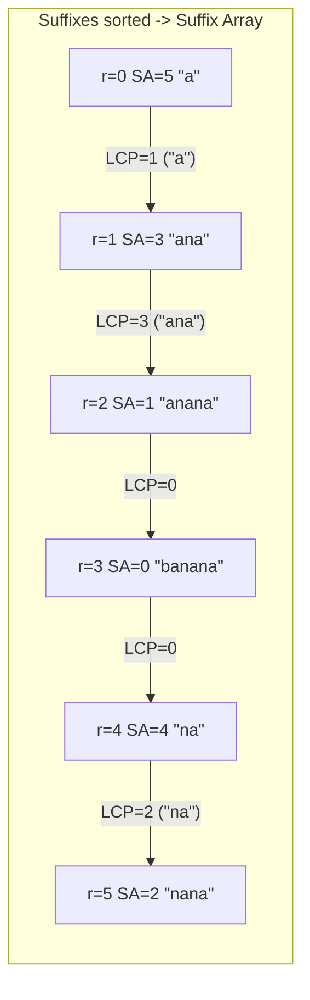
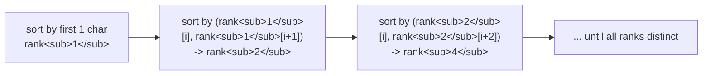

# Suffix Array + LCP Array (Kasai's Algorithm) — Complete Guide

> A **suffix array** is the sorted order of *all suffixes* of a string, stored as the array of their
> starting indices. It is the lightweight cousin of the suffix tree: the same lexicographic structure
> packed into a single integer array. Paired with the **LCP array** (longest common prefix between
> adjacent suffixes), it answers "how many distinct substrings?", "what is the longest repeated
> substring?", and "where does this pattern occur?" — all with simple arrays and binary search.

---

## Table of Contents
1. [What a Suffix Array Is](#1-what-a-suffix-array-is)
2. [Construction by Doubling — $O(n \log^2 n)$](#2-construction-by-doubling--on-log2-n)
3. [Toward $O(n \log n)$ with Radix Sort](#3-toward-on-log-n-with-radix-sort)
4. [The LCP Array](#4-the-lcp-array)
5. [Kasai's $O(n)$ Algorithm and Why $h$ Drops by at Most 1](#5-kasais-on-algorithm-and-why-h-drops-by-at-most-1)
6. [Application: Pattern Search by Binary Search](#6-application-pattern-search-by-binary-search)
7. [Application: Number of Distinct Substrings](#7-application-number-of-distinct-substrings)
8. [Application: Longest Repeated Substring](#8-application-longest-repeated-substring)
9. [Application: Longest Common Substring of Two Strings](#9-application-longest-common-substring-of-two-strings)
10. [Mermaid](#10-mermaid)
11. [Complexity Summary](#11-complexity-summary)
12. [Common Pitfalls](#12-common-pitfalls)
13. [Patterns](#13-patterns)

---

## 1. What a Suffix Array Is

For a string $s$ of length $n$, the $n$ suffixes are
$s[0\,..], s[1\,..], \dots, s[n-1\,..]$. The **suffix array** $\mathrm{SA}$ is a permutation of
$\{0, 1, \dots, n-1\}$ such that

$$s[\mathrm{SA}[0]\,..] < s[\mathrm{SA}[1]\,..] < \dots < s[\mathrm{SA}[n-1]\,..]$$

lexicographically. In words: $\mathrm{SA}[r]$ is the **starting index** of the suffix that ranks
$r$-th among all suffixes when sorted alphabetically.

Take `s = "banana"`. Its suffixes and their sorted order:

```text
index  suffix
  5     a
  3     ana
  1     anana
  0     banana
  4     na
  2     nana

SA = [5, 3, 1, 0, 4, 2]
```

The naive way to build $\mathrm{SA}$ is to sort the suffixes directly. Comparing two suffixes costs
$O(n)$, and sorting $n$ of them costs $O(n \log n)$ comparisons, for $O(n^2 \log n)$ total — far too
slow. The doubling trick below replaces the $O(n)$ comparison with an $O(1)$ comparison of integer
rank pairs.

The most important invariant: once the suffixes are sorted, **lexicographically similar suffixes sit
next to each other**, so structure like repeated substrings shows up as long shared prefixes between
*adjacent* rows. That observation is what the LCP array exploits.

---

## 2. Construction by Doubling — $O(n \log^2 n)$

**Idea.** Sort suffixes by their first $k$ characters, for $k = 1, 2, 4, 8, \dots$ doubling each
round. After the round for length $k$, every suffix carries an integer **rank** equal to the order of
its first $k$ characters (ties share a rank). To extend to length $2k$, a suffix starting at $i$ is
compared by the pair

$$\big(\,\mathrm{rank}_k[i],\ \mathrm{rank}_k[i+k]\,\big)$$

where the second component is $-1$ (or any sentinel below all real ranks) when $i + k \ge n$. The
first $2k$ characters of suffix $i$ are exactly "first $k$ chars" followed by "next $k$ chars", and
those two halves are *already* summarized by `rank_k[i]` and `rank_k[i+k]`. So one pair comparison is
equivalent to comparing $2k$ characters — in $O(1)$.

Each round sorts $n$ pairs in $O(n \log n)$, and there are $O(\log n)$ rounds (lengths double until
they reach $n$), giving $O(n \log^2 n)$.

```python
def build_suffix_array(s: str) -> list[int]:
    n = len(s)
    sa = list(range(n))
    rank = [ord(c) for c in s]
    tmp = [0] * n
    k = 1
    while True:
        # sort by (rank[i], rank[i+k]) using -1 as the out-of-range sentinel
        def key(i: int):
            second = rank[i + k] if i + k < n else -1
            return (rank[i], second)
        sa.sort(key=key)
        # recompute ranks based on the new order
        tmp[sa[0]] = 0
        for j in range(1, n):
            prev, cur = sa[j - 1], sa[j]
            tmp[cur] = tmp[prev] + (1 if key(cur) != key(prev) else 0)
        rank = tmp[:]
        if rank[sa[-1]] == n - 1:   # all ranks distinct -> fully sorted
            break
        k <<= 1
    return sa
```

```cpp
#include <bits/stdc++.h>
using namespace std;

vector<int> build_suffix_array(const string& s) {
    int n = (int)s.size();
    vector<int> sa(n), rank(n), tmp(n);
    for (int i = 0; i < n; i++) { sa[i] = i; rank[i] = s[i]; }
    for (int k = 1; ; k <<= 1) {
        auto cmp = [&](int a, int b) {
            if (rank[a] != rank[b]) return rank[a] < rank[b];
            int ra = (a + k < n) ? rank[a + k] : -1;
            int rb = (b + k < n) ? rank[b + k] : -1;
            return ra < rb;
        };
        sort(sa.begin(), sa.end(), cmp);
        tmp[sa[0]] = 0;
        for (int j = 1; j < n; j++)
            tmp[sa[j]] = tmp[sa[j - 1]] + (cmp(sa[j - 1], sa[j]) ? 1 : 0);
        rank = tmp;
        if (rank[sa[n - 1]] == n - 1) break; // all distinct -> done
    }
    return sa;
}
```

We stop early when the largest rank equals $n - 1$, meaning every suffix has a unique rank and the
array is fully sorted — often well before $k$ reaches $n$.

---

## 3. Toward $O(n \log n)$ with Radix Sort

The bottleneck above is the comparison sort each round at $O(n \log n)$. Because the sort key is a
**pair of integers in $[0, n)$**, we can sort with a two-pass **radix (counting) sort** in $O(n)$ per
round instead of $O(n \log n)$. Sort first by the second component (`rank[i+k]`), then stably by the
first component (`rank[i]`). With $O(\log n)$ rounds each costing $O(n)$, the total drops to
$O(n \log n)$.

The doubling logic — pair ranks, sentinel for out-of-range, rank recomputation — is identical; only
the per-round sorting routine changes. For contest sizes up to a few $10^5$, the $O(n \log^2 n)$
comparison version is simpler and fast enough; reach for radix sort when $n$ approaches $10^6$.

```python
def build_suffix_array_radix(s: str) -> list[int]:
    n = len(s)
    sa = sorted(range(n), key=lambda i: s[i])
    rank = [0] * n
    for j in range(1, n):
        rank[sa[j]] = rank[sa[j - 1]] + (1 if s[sa[j]] != s[sa[j - 1]] else 0)
    k = 1
    while k < n:
        # counting sort by second key (rank[i+k]); out-of-range = 0 bucket
        def second(i): return rank[i + k] + 1 if i + k < n else 0
        cnt = [0] * (n + 1)
        for i in range(n):
            cnt[second(i)] += 1
        for v in range(1, n + 1):
            cnt[v] += cnt[v - 1]
        by_second = [0] * n
        for i in reversed(range(n)):
            b = second(sa[i])              # iterate in current sa order for stability
            cnt[b] -= 1
            by_second[cnt[b]] = sa[i]
        # counting sort by first key (rank[i]), stable over by_second
        cnt = [0] * (n + 1)
        for i in range(n):
            cnt[rank[i]] += 1
        for v in range(1, n + 1):
            cnt[v] += cnt[v - 1]
        for i in reversed(range(n)):
            idx = by_second[i]
            cnt[rank[idx]] -= 1
            sa[cnt[rank[idx]]] = idx
        # recompute ranks
        tmp = [0] * n
        def key(i): return (rank[i], rank[i + k] if i + k < n else -1)
        for j in range(1, n):
            tmp[sa[j]] = tmp[sa[j - 1]] + (1 if key(sa[j]) != key(sa[j - 1]) else 0)
        rank = tmp
        if rank[sa[-1]] == n - 1:
            break
        k <<= 1
    return sa
```

```cpp
#include <bits/stdc++.h>
using namespace std;

vector<int> build_suffix_array_radix(const string& s) {
    int n = (int)s.size();
    vector<int> sa(n), rank(n), tmp(n);
    for (int i = 0; i < n; i++) { sa[i] = i; rank[i] = s[i]; }
    sort(sa.begin(), sa.end(), [&](int a, int b){ return s[a] < s[b]; });
    {
        vector<int> r(n); r[sa[0]] = 0;
        for (int j = 1; j < n; j++)
            r[sa[j]] = r[sa[j - 1]] + (s[sa[j]] != s[sa[j - 1]] ? 1 : 0);
        rank = r;
    }
    for (int k = 1; k < n; k <<= 1) {
        auto second = [&](int i) -> int { return (i + k < n) ? rank[i + k] + 1 : 0; };
        // counting sort by second key
        vector<int> cnt(n + 1, 0), by_second(n);
        for (int i = 0; i < n; i++) cnt[second(i)]++;
        for (int v = 1; v <= n; v++) cnt[v] += cnt[v - 1];
        for (int i = n - 1; i >= 0; i--) by_second[--cnt[second(sa[i])]] = sa[i];
        // counting sort by first key, stable
        fill(cnt.begin(), cnt.end(), 0);
        for (int i = 0; i < n; i++) cnt[rank[i]]++;
        for (int v = 1; v <= n; v++) cnt[v] += cnt[v - 1];
        for (int i = n - 1; i >= 0; i--) {
            int idx = by_second[i];
            sa[--cnt[rank[idx]]] = idx;
        }
        // recompute ranks
        auto key = [&](int i) {
            int sec = (i + k < n) ? rank[i + k] : -1;
            return make_pair(rank[i], sec);
        };
        tmp[sa[0]] = 0;
        for (int j = 1; j < n; j++)
            tmp[sa[j]] = tmp[sa[j - 1]] + (key(sa[j]) != key(sa[j - 1]) ? 1 : 0);
        rank = tmp;
        if (rank[sa[n - 1]] == n - 1) break;
    }
    return sa;
}
```

---

## 4. The LCP Array

The **LCP array** stores the length of the longest common prefix between **adjacent** suffixes in
sorted order. Conventionally $\mathrm{LCP}[0] = 0$ and for $r \ge 1$:

$$\mathrm{LCP}[r] = \mathrm{lcp}\big(s[\mathrm{SA}[r-1]\,..],\ s[\mathrm{SA}[r]\,..]\big)$$

Continuing `s = "banana"` with `SA = [5, 3, 1, 0, 4, 2]`:

```text
r  SA[r]  suffix    LCP[r]
0    5     a          0
1    3     ana        1     (lcp of "a" and "ana" = "a")
2    1     anana      3     (lcp of "ana" and "anana" = "ana")
3    0     banana     0
4    4     na         0
5    2     nana       2     (lcp of "na" and "nana" = "na")
```

Why only *adjacent* suffixes? Because the LCP of any two suffixes equals the **minimum** LCP over the
adjacent pairs between them in sorted order (a range-minimum). So the adjacent LCPs plus an RMQ
structure encode the LCP of *every* pair. Computing those adjacent values naively is still $O(n^2)$ —
Kasai's algorithm makes it $O(n)$.

---

## 5. Kasai's $O(n)$ Algorithm and Why $h$ Drops by at Most 1

Kasai's insight: process suffixes in **original string order** (by starting index $i = 0, 1, \dots$),
not in sorted order, and carry the previously computed LCP length $h$ from one step to the next.

Let $\mathrm{rank}[i]$ be the position of suffix $i$ in $\mathrm{SA}$ (the inverse permutation). For
suffix $i$ at rank $r = \mathrm{rank}[i]$, its predecessor in sorted order starts at
$j = \mathrm{SA}[r - 1]$. We match characters of suffixes $i$ and $j$ starting from offset $h$ and
extend $h$ as far as they agree. Then $\mathrm{LCP}[r] = h$.

**The key claim:** when we move from suffix $i$ to suffix $i + 1$, the value $h$ decreases by **at
most 1**, so $h$ can be reused instead of restarting from $0$.

**Why.** Suppose suffix $i$ shares a prefix of length $h$ with its sorted-predecessor $j$, i.e.
$s[i\,..\,i+h) = s[j\,..\,j+h)$ and $h \ge 1$. Drop the first character of both: suffix $i + 1$ and
suffix $j + 1$ share a prefix of length $h - 1$. Now suffix $j + 1$ comes **before** suffix $i + 1$ in
sorted order (removing the equal leading character preserves their relative order). The
*immediate* predecessor of suffix $i + 1$ is some suffix $j'$ that is $\ge$ suffix $j + 1$
lexicographically but $<$ suffix $i + 1$. Any suffix sandwiched between $j + 1$ and $i + 1$ shares at
least the common prefix of length $h - 1$ with $i + 1$. Therefore the LCP of suffix $i + 1$ with *its*
predecessor is at least $h - 1$. So we may start matching at offset $h - 1$ instead of $0$:

$$h_{\text{new}} \ge h_{\text{old}} - 1.$$

Across all $n$ steps, $h$ increases by at most $n$ in total (it is bounded by $n$) and decreases by at
most 1 per step, so the total work — sum of increments — is $O(n)$. That is the entire complexity
argument.

```python
def build_lcp_kasai(s: str, sa: list[int]) -> list[int]:
    n = len(s)
    rank = [0] * n
    for r in range(n):
        rank[sa[r]] = r
    lcp = [0] * n
    h = 0
    for i in range(n):
        if rank[i] > 0:
            j = sa[rank[i] - 1]           # predecessor in sorted order
            while i + h < n and j + h < n and s[i + h] == s[j + h]:
                h += 1
            lcp[rank[i]] = h
            if h > 0:
                h -= 1                     # drop by at most 1 for the next i
        else:
            h = 0                          # smallest suffix has no predecessor
    return lcp
```

```cpp
#include <bits/stdc++.h>
using namespace std;

vector<int> build_lcp_kasai(const string& s, const vector<int>& sa) {
    int n = (int)s.size();
    vector<int> rank(n), lcp(n, 0);
    for (int r = 0; r < n; r++) rank[sa[r]] = r;
    int h = 0;
    for (int i = 0; i < n; i++) {
        if (rank[i] > 0) {
            int j = sa[rank[i] - 1];       // predecessor in sorted order
            while (i + h < n && j + h < n && s[i + h] == s[j + h]) h++;
            lcp[rank[i]] = h;
            if (h > 0) h--;                // drop by at most 1 for the next i
        } else {
            h = 0;                         // smallest suffix has no predecessor
        }
    }
    return lcp;
}
```

---

## 6. Application: Pattern Search by Binary Search

Because the suffixes are sorted, every occurrence of a pattern $p$ is the prefix of some suffix, and
all such suffixes form a **contiguous block** in $\mathrm{SA}$. We find that block with two binary
searches (lower and upper bound) comparing $p$ against the suffix at each probed rank. Each comparison
costs $O(|p|)$, so a search is $O(|p| \log n)$, and the number of occurrences is the block width.

This is covered in depth, with full paired code and a trace, in
[suffix-array-pattern-search.md](../problems/suffix-array-pattern-search.md).

---

## 7. Application: Number of Distinct Substrings

Every substring of $s$ is a prefix of exactly one suffix. Suffix $\mathrm{SA}[r]$ has length
$n - \mathrm{SA}[r]$, contributing that many prefixes (its distinct substrings *as prefixes*). But the
first $\mathrm{LCP}[r]$ of those are **shared** with the previous suffix in sorted order and were
already counted. So the number of *new* distinct substrings contributed at rank $r$ is

$$(n - \mathrm{SA}[r]) - \mathrm{LCP}[r].$$

Summing gives the clean closed form

$$\#\text{distinct substrings} \;=\; \frac{n(n+1)}{2} \;-\; \sum_{r} \mathrm{LCP}[r],$$

because $\sum_r (n - \mathrm{SA}[r]) = \sum_{\ell=1}^{n} \ell = \tfrac{n(n+1)}{2}$ (total prefixes over
all suffixes) and we subtract the overcounted shared prefixes.

```python
def count_distinct_substrings(s: str) -> int:
    n = len(s)
    sa = build_suffix_array(s)
    lcp = build_lcp_kasai(s, sa)
    return n * (n + 1) // 2 - sum(lcp)
```

```cpp
#include <bits/stdc++.h>
using namespace std;

long long count_distinct_substrings(const string& s) {
    int n = (int)s.size();
    vector<int> sa = build_suffix_array(s);
    vector<int> lcp = build_lcp_kasai(s, sa);
    long long total = (long long)n * (n + 1) / 2;
    for (int v : lcp) total -= v;
    return total;
}
```

For `s = "banana"`: $\tfrac{6 \cdot 7}{2} = 21$, and $\sum \mathrm{LCP} = 0+1+3+0+0+2 = 6$, so the
answer is $21 - 6 = 15$ distinct substrings.

---

## 8. Application: Longest Repeated Substring

A substring repeats (occurs at least twice) **iff** it is a shared prefix of two different suffixes —
and the longest such shared prefix between adjacent sorted suffixes is exactly $\max \mathrm{LCP}$.
The substring itself starts at $\mathrm{SA}[r^\*]$ and has length $\mathrm{LCP}[r^\*]$ where $r^\*$
maximizes the LCP. See
[longest-repeated-substring-suffix-array.md](../problems/longest-repeated-substring-suffix-array.md).

---

## 9. Application: Longest Common Substring of Two Strings

To find the longest substring common to $a$ and $b$, concatenate them with a **separator** that
appears in neither: $t = a + \#\, + b$. Build $\mathrm{SA}$ and LCP of $t$. A common substring shows up
as a high LCP between two **adjacent** suffixes that come from *different* original strings (one starts
in the $a$-part, the other in the $b$-part). Scan adjacent pairs and take the maximum LCP among those
cross-origin pairs.

```python
def longest_common_substring(a: str, b: str) -> str:
    sep = "\x01"                      # separator below all real chars, in neither string
    t = a + sep + b
    n = len(t)
    sa = build_suffix_array(t)
    lcp = build_lcp_kasai(t, sa)
    split = len(a)                    # indices < split belong to a; > split belong to b
    best_len, best_pos = 0, 0
    for r in range(1, n):
        i, j = sa[r - 1], sa[r]
        from_a = (i < split) != (j < split)   # one in a, one in b
        if from_a and lcp[r] > best_len:
            best_len, best_pos = lcp[r], sa[r]
    return t[best_pos: best_pos + best_len]
```

```cpp
#include <bits/stdc++.h>
using namespace std;

string longest_common_substring(const string& a, const string& b) {
    char sep = 1;                     // separator below all real chars, in neither string
    string t = a + sep + b;
    int n = (int)t.size();
    vector<int> sa = build_suffix_array(t);
    vector<int> lcp = build_lcp_kasai(t, sa);
    int split = (int)a.size();        // indices < split belong to a
    int best_len = 0, best_pos = 0;
    for (int r = 1; r < n; r++) {
        int i = sa[r - 1], j = sa[r];
        bool from_a = (i < split) != (j < split);  // one in a, one in b
        if (from_a && lcp[r] > best_len) { best_len = lcp[r]; best_pos = sa[r]; }
    }
    return t.substr(best_pos, best_len);
}
```

---

## 10. Mermaid

Sorting the suffixes of `banana`, then reading LCP between vertically adjacent rows:



The doubling construction, where rank pairs at length $k$ become single ranks at length $2k$:



---

## 11. Complexity Summary

| Operation | Time | Space |
|-----------|------|-------|
| Naive suffix sort (compare suffixes) | $O(n^2 \log n)$ | $O(n)$ |
| Suffix array — doubling + comparison sort | $O(n \log^2 n)$ | $O(n)$ |
| Suffix array — doubling + radix sort | $O(n \log n)$ | $O(n)$ |
| LCP array via Kasai | $O(n)$ | $O(n)$ |
| Distinct substrings (from SA + LCP) | $O(n \log n)$ overall | $O(n)$ |
| Longest repeated substring | $O(n \log n)$ overall | $O(n)$ |
| Pattern search (single query) | $O(|p| \log n)$ | $O(1)$ extra |
| Longest common substring of two strings | $O((|a|+|b|) \log)$ | $O(|a|+|b|)$ |

---

## 12. Common Pitfalls

- **Sentinel vs. no sentinel.** Some implementations append a unique character (e.g. `$` smaller than
  all others) so no suffix is a prefix of another and ranks are always distinct. The code here avoids
  it by using $-1$ for out-of-range ranks. If you *do* append `$`, remember the SA/LCP lengths grow by
  one and the sentinel suffix occupies rank 0 — exclude it from substring counts.
- **Rank ties.** After each doubling round you must recompute ranks so that equal pairs share a rank
  and unequal pairs differ by exactly 1. Skipping the "is this key different from the previous?" check
  breaks the next round's $O(1)$ comparison.
- **0-indexing of LCP.** $\mathrm{LCP}[0]$ has no predecessor and must be $0$. Off-by-one here corrupts
  the $\sum \mathrm{LCP}$ used in distinct-substring counting.
- **Integer overflow.** $\tfrac{n(n+1)}{2}$ overflows 32-bit for $n \gtrsim 65536$; use `long long`.
- **Separator choice.** For longest-common-substring, the separator must be a character that occurs in
  **neither** string and is distinct, or genuine common substrings spanning the boundary will be
  miscounted.

---

## 13. Patterns

- **Sorted suffixes => adjacency carries structure.** Repeats, distinct counts, and pattern blocks all
  reduce to looking at neighbors in $\mathrm{SA}$ plus their LCP.
- **Amortize with a reusable counter.** Kasai's "decrease $h$ by at most 1" is the same amortization
  flavor as the two-pointer / KMP failure-function arguments — a value that only creeps up slowly and
  drops in small steps yields linear total work.
- **Concatenate with a separator** to turn two-string problems (LCS, common substring) into one
  suffix-array problem.
- **Binary search on a sorted array of strings** (the suffixes) localizes any pattern to a contiguous
  range; the LCP/RMQ structure can accelerate the comparisons further when needed.
