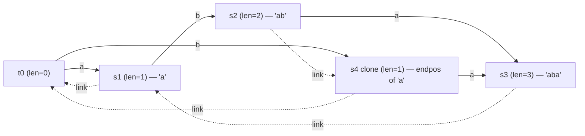

# Suffix Automaton (SAM) — Complete Guide (with a note on Suffix Trees)

> A **Suffix Automaton (SAM)** of a string `s` is the **smallest deterministic finite automaton**
> that accepts exactly the set of **all suffixes** of `s`. Remarkably, the same machine also encodes
> **every substring** of `s`: each distinct substring corresponds to a path from the initial state.
> A SAM of an `n`-character string has at most `2n - 1` states and `3n - 4` transitions (for
> `n >= 3`), and is built **online** in **linear time** over a fixed alphabet. It is one of the most
> powerful and compact string structures in competitive programming.

---

## Table of Contents
1. [States as endpos-Equivalence Classes](#1-states-as-endpos-equivalence-classes)
2. [The `len` and `link` Arrays](#2-the-len-and-link-arrays)
3. [Online Construction: `extend(c)` and the Clone Step](#3-online-construction-extendc-and-the-clone-step)
4. [The Suffix-Link Tree](#4-the-suffix-link-tree)
5. [Application: Number of Distinct Substrings](#5-application-number-of-distinct-substrings)
6. [Application: Number of Occurrences of Each Substring](#6-application-number-of-occurrences-of-each-substring)
7. [Application: Longest Common Substring of Two Strings](#7-application-longest-common-substring-of-two-strings)
8. [A Note on Suffix Trees (Ukkonen)](#8-a-note-on-suffix-trees-ukkonen)
9. [Mermaid](#9-mermaid)
10. [Complexity Summary](#10-complexity-summary)
11. [Common Pitfalls](#11-common-pitfalls)
12. [Patterns](#12-patterns)

---

## 1. States as endpos-Equivalence Classes

The whole structure is explained by one idea: **`endpos`**.

For a non-empty substring `t` of `s`, define `endpos(t)` to be the **set of ending positions** at
which `t` occurs in `s`. For example, in `s = "abcbc"` the substring `"bc"` ends at positions `3` and
`5`, so `endpos("bc") = {3, 5}`.

Two substrings are placed in the **same SAM state** if and only if they have the **same `endpos`
set**. Each state therefore represents an **equivalence class** of substrings. The key structural
facts:

- For two substrings `u` and `w` (with `|u| <= |w|`), either `endpos(u) ⊇ endpos(w)` (when `u` is a
  suffix of `w`) or `endpos(u) ∩ endpos(w) = ∅`. The `endpos` sets form a **laminar family** — a
  tree by inclusion.
- The substrings inside one state are exactly the suffixes of the **longest** one whose lengths form
  a **contiguous range** `[minlen, len]`. So a state is fully described by its longest length `len`
  and where the range starts.

This is why a SAM is so small: many substrings collapse into one state because they share endpoints.

$$
\text{# states} \le 2n - 1, \qquad \text{# transitions} \le 3n - 4 \quad (n \ge 3).
$$

---

## 2. The `len` and `link` Arrays

Each state `v` stores:

- **`len[v]`** — the length of the **longest** substring in `v`'s equivalence class.
- **`link[v]`** — the **suffix link**: a pointer to the state holding the longest suffix of `v`'s
  strings that lies in a **different** (larger) `endpos` class. Equivalently, `link[v]` is the state
  whose longest string has length `minlen(v) - 1`.
- **`next[v]`** — the transition map: `next[v][c]` is the state reached by appending character `c`.

The initial state `t0` (the empty string `""`) has `len = 0` and `link = -1`. For every other state,
`len[link[v]] < len[v]`, and the suffix links form a **tree rooted at `t0`** (Section 4).

The **minimum length** stored in state `v` is `minlen(v) = len[link[v]] + 1`. Hence the number of
**distinct substrings** ending in state `v` is `len[v] - len[link[v]]`, a fact we exploit in
Section 5.

```python
class State:
    __slots__ = ("length", "link", "next")
    def __init__(self):
        self.length = 0      # len: longest substring in this class
        self.link = -1       # suffix link
        self.next = {}       # transitions: char -> state index
```

```cpp
#include <bits/stdc++.h>
using namespace std;

struct State {
    int length = 0;          // len: longest substring in this class
    int link = -1;           // suffix link
    map<char, int> next;     // transitions: char -> state index
};
```

---

## 3. Online Construction: `extend(c)` and the Clone Step

The SAM is built **incrementally**: we add characters of `s` one at a time. We keep a variable
`last` = the state representing the **whole current prefix**. Adding a character `c` runs `extend(c)`.

The algorithm:

1. Create a new state `cur` with `len[cur] = len[last] + 1`. This is the new whole-prefix state.
2. Walk up the suffix links starting from `last`. For each state `p` that has **no** `c`-transition,
   add `next[p][c] = cur`. Stop at the first `p` that already has a `c`-transition (or fall off the
   top, `p = -1`).
3. If we fell off the top (`p == -1`), set `link[cur] = t0` (root). Done.
4. Otherwise let `q = next[p][c]`. Two sub-cases:
   - **No clone needed** — if `len[q] == len[p] + 1`, then `q` is exactly the right suffix state, so
     set `link[cur] = q`. Done.
   - **Clone needed** — otherwise the transition `p -> q` is a "long jump" that would let `q`
     represent strings of two different `endpos` classes. We **clone** `q` into a new state `clone`
     that copies `q`'s transitions and `link`, but with `len[clone] = len[p] + 1`. We then:
     redirect every `c`-transition along the suffix path from `p` upward that pointed to `q` so it now
     points to `clone`; set `link[q] = clone` and `link[cur] = clone`.
5. Set `last = cur` for the next character.

The clone step is what guarantees the automaton stays minimal and that every state's strings form a
single contiguous length range.

```python
class SuffixAutomaton:
    def __init__(self):
        self.st = [State()]      # state 0 = initial (root), len=0, link=-1
        self.last = 0

    def extend(self, c):
        st = self.st
        cur = len(st)
        st.append(State())
        st[cur].length = st[self.last].length + 1
        p = self.last
        while p != -1 and c not in st[p].next:
            st[p].next[c] = cur
            p = st[p].link
        if p == -1:
            st[cur].link = 0
        else:
            q = st[p].next[c]
            if st[p].length + 1 == st[q].length:
                st[cur].link = q
            else:
                clone = len(st)
                st.append(State())
                st[clone].length = st[p].length + 1
                st[clone].next = dict(st[q].next)
                st[clone].link = st[q].link
                while p != -1 and st[p].next.get(c) == q:
                    st[p].next[c] = clone
                    p = st[p].link
                st[q].link = clone
                st[cur].link = clone
        self.last = cur

    def build(self, s):
        for ch in s:
            self.extend(ch)
        return self
```

```cpp
#include <bits/stdc++.h>
using namespace std;

struct SuffixAutomaton {
    vector<State> st;        // st[0] = initial (root), len=0, link=-1
    int last;

    SuffixAutomaton() {
        st.push_back(State());   // initial state
        last = 0;
    }

    void extend(char c) {
        int cur = (int)st.size();
        st.push_back(State());
        st[cur].length = st[last].length + 1;
        int p = last;
        while (p != -1 && st[p].next.find(c) == st[p].next.end()) {
            st[p].next[c] = cur;
            p = st[p].link;
        }
        if (p == -1) {
            st[cur].link = 0;
        } else {
            int q = st[p].next[c];
            if (st[p].length + 1 == st[q].length) {
                st[cur].link = q;
            } else {
                int clone = (int)st.size();
                st.push_back(State());
                st[clone].length = st[p].length + 1;
                st[clone].next = st[q].next;      // copy transitions
                st[clone].link = st[q].link;
                while (p != -1 && st[p].next.count(c) && st[p].next[c] == q) {
                    st[p].next[c] = clone;
                    p = st[p].link;
                }
                st[q].link = clone;
                st[cur].link = clone;
            }
        }
        last = cur;
    }

    SuffixAutomaton& build(const string& s) {
        for (char ch : s) extend(ch);
        return *this;
    }
};
```

---

## 4. The Suffix-Link Tree

Because `len[link[v]] < len[v]` for every state, the suffix links form a **rooted tree** at `t0`.
This **suffix-link tree** (sometimes called the *parent tree*) is the structure dual to the
transitions, and almost every offline query rides on it:

- Each state's parent in the tree is the largest-`endpos` strict-suffix class of it.
- The `endpos` set of a state equals the **union** of `endpos` sets of its children, plus any
  positions where the state itself was the whole prefix (its "terminal" contribution).
- Therefore many quantities (occurrence counts, the number of distinct substrings, etc.) are
  computed by a **single bottom-up pass** over this tree, which can be done either by recursion or by
  a **counting sort on `len`** (processing states in decreasing `len` order pushes values to parents).

This last trick — sorting states by `len` and accumulating toward `link[v]` — replaces an explicit
tree traversal and is the standard idiom shown in Section 6.

---

## 5. Application: Number of Distinct Substrings

Every distinct substring corresponds to a **unique state** together with a length in that state's
range `[minlen(v), len[v]]`. Counting the lengths in each range and summing gives the answer:

$$
\text{# distinct substrings} = \sum_{v \ne t_0} \big(\,\mathrm{len}[v] - \mathrm{len}[\mathrm{link}[v]]\,\big).
$$

No traversal of transitions is needed — just one loop over the states.

```python
def count_distinct_substrings(s: str) -> int:
    sam = SuffixAutomaton().build(s)
    total = 0
    for v in range(1, len(sam.st)):          # skip root v=0
        total += sam.st[v].length - sam.st[sam.st[v].link].length
    return total
```

```cpp
#include <bits/stdc++.h>
using namespace std;

long long countDistinctSubstrings(const string& s) {
    SuffixAutomaton sam;
    sam.build(s);
    long long total = 0;
    for (int v = 1; v < (int)sam.st.size(); ++v)   // skip root v=0
        total += (long long)(sam.st[v].length - sam.st[sam.st[v].link].length);
    return total;
}
```

---

## 6. Application: Number of Occurrences of Each Substring

The number of occurrences of any substring equals `|endpos|` of the state that contains it. We seed
`cnt = 1` on each state created as a **`cur`** during construction (a clone gets `cnt = 0`), then push
counts **up the suffix-link tree**: each state adds its count to its parent. Processing states in
**decreasing `len`** order guarantees children are handled before parents.

```python
def occurrence_counts(s: str):
    sam = SuffixAutomaton()
    cnt = [0]
    for ch in s:
        sam.extend(ch)
        while len(cnt) < len(sam.st):         # grow for cur and any clone
            cnt.append(0)
        cnt[sam.last] = 1                      # cur is a real prefix endpoint
    # process states by decreasing len, pushing counts up the suffix-link tree
    order = sorted(range(len(sam.st)), key=lambda v: sam.st[v].length, reverse=True)
    for v in order:
        link = sam.st[v].link
        if link != -1:
            cnt[link] += cnt[v]
    return sam, cnt
```

```cpp
#include <bits/stdc++.h>
using namespace std;

pair<SuffixAutomaton, vector<long long>> occurrenceCounts(const string& s) {
    SuffixAutomaton sam;
    vector<long long> cnt(1, 0);
    for (char ch : s) {
        sam.extend(ch);
        while ((int)cnt.size() < (int)sam.st.size()) cnt.push_back(0);
        cnt[sam.last] = 1;                    // cur is a real prefix endpoint
    }
    // order states by decreasing len via counting sort, then push to parents
    vector<int> order(sam.st.size());
    iota(order.begin(), order.end(), 0);
    sort(order.begin(), order.end(),
         [&](int a, int b){ return sam.st[a].length > sam.st[b].length; });
    for (int v : order) {
        int link = sam.st[v].link;
        if (link != -1) cnt[link] += cnt[v];
    }
    return {sam, cnt};
}
```

> Note: clones must start with `cnt = 0`. Because we only set `cnt[cur] = 1` after each `extend`, and
> a clone is never the value of `last`, clones automatically keep `cnt = 0` here.

---

## 7. Application: Longest Common Substring of Two Strings

Build the SAM of the first string `s`. Then walk the **second** string `t` through the automaton,
maintaining the current state `v` and the matched length `l`:

- If `next[v][c]` exists, take it: `v = next[v][c]`, `l += 1`.
- Otherwise follow suffix links `v = link[v]` (resetting `l = len[v] + 1`) until a `c`-transition
  exists or we hit the root (then `l = 0`).

The maximum `l` reached over all characters of `t` is the length of the longest common substring.

```python
def longest_common_substring(s: str, t: str) -> int:
    sam = SuffixAutomaton().build(s)
    st = sam.st
    v, l, best = 0, 0, 0
    for c in t:
        while v != 0 and c not in st[v].next:
            v = st[v].link
            l = st[v].length
        if c in st[v].next:
            v = st[v].next[c]
            l += 1
        else:
            v, l = 0, 0
        best = max(best, l)
    return best
```

```cpp
#include <bits/stdc++.h>
using namespace std;

int longestCommonSubstring(const string& s, const string& t) {
    SuffixAutomaton sam;
    sam.build(s);
    auto& st = sam.st;
    int v = 0, l = 0, best = 0;
    for (char c : t) {
        while (v != 0 && st[v].next.find(c) == st[v].next.end()) {
            v = st[v].link;
            l = st[v].length;
        }
        if (st[v].next.find(c) != st[v].next.end()) {
            v = st[v].next[c];
            ++l;
        } else {
            v = 0; l = 0;
        }
        best = max(best, l);
    }
    return best;
}
```

---

## 8. A Note on Suffix Trees (Ukkonen)

A **suffix tree** is a compressed trie of all suffixes of `s` (usually with a sentinel `$`). It stores
exactly the **same information** as the SAM — in fact a deep duality holds:

> The **suffix-link tree of the SAM** of `s` is isomorphic to the **suffix tree** of the **reversed**
> string `reverse(s)`.

So SAM transitions ↔ suffix-tree of `reverse(s)` suffix links, and SAM suffix links ↔ suffix-tree of
`reverse(s)` edges. Both answer "distinct substrings", "longest common substring", "number of
occurrences", etc., in linear time. The practical differences:

- **Suffix tree (Ukkonen):** powerful, but the online construction (active point, active edge, active
  length, suffix links, edge splitting) is famously fiddly to implement correctly.
- **Suffix automaton:** the `extend` routine above is ~20 lines, has a single tricky case (the clone),
  and is far easier to code under contest pressure for the same asymptotics.

For most competitive problems, **prefer the SAM** unless you specifically need explicit edge labels
or top-down suffix-tree traversal semantics.

---

## 9. Mermaid

A small SAM for `s = "aba"`. Solid arrows are **transitions** (labeled by character); dashed arrows
are **suffix links** pointing back toward the root. States are labeled with their `len`.



Reading it: the path `t0 -a-&gt; s1 -b-&gt; s2 -a-&gt; s3` spells `"aba"`; suffix links climb toward
`t0`. The clone `s4` arose because `'a'` occurs both as a prefix (`endpos` contains `1`) and after
`'b'` (`endpos` contains `3`), forcing a split so each class keeps a single contiguous length range.

---

## 10. Complexity Summary

| Operation | Time | Space |
|-----------|------|-------|
| Build SAM (fixed alphabet, array `next`) | $O(n)$ | $O(n \cdot \sigma)$ |
| Build SAM (general alphabet, `map` `next`) | $O(n \log \sigma)$ | $O(n)$ |
| Number of distinct substrings | $O(n)$ after build | $O(1)$ extra |
| Occurrence counts (suffix-link tree) | $O(n)$ after build | $O(n)$ |
| Longest common substring with `t` | $O(\lvert t \rvert \log \sigma)$ | $O(1)$ extra |
| State count / transition count | $\le 2n-1$ / $\le 3n-4$ | — |

With a fixed alphabet and an `array<int, K>` for `next`, every step is amortized $O(1)$ and the whole
build is **linear**. Using a hash/ordered map costs a $\log \sigma$ (ordered) factor per step but
saves memory and handles arbitrary alphabets.

---

## 11. Common Pitfalls

- **Forgetting the clone.** Without the clone step the automaton becomes incorrect (a state would
  represent strings from two different `endpos` classes). The clone copies `q`'s `next` and `link`
  but takes `len = len[p] + 1`.
- **Wrong `link` of the clone vs. of `q`.** After cloning, set `link[q] = clone` **and**
  `link[cur] = clone`. The clone inherits `q`'s old `link`, not the other way around.
- **Not redirecting all `p -> q` transitions.** Continue walking up suffix links from `p`, redirecting
  every `c`-transition that still points to `q` to point to `clone`, until it no longer does.
- **Initializing `last`.** `last` must start at the **root** (state 0), and be updated to `cur`
  (never to a clone) at the end of every `extend`.
- **Clone counts.** When computing occurrences, a clone must start with `cnt = 0`; only real prefix
  endpoints (`cur`) get `cnt = 1`.
- **Off-by-one in length ranges.** The distinct-substring contribution of a state is
  `len[v] - len[link[v]]`; remember `len[link[root]]` is undefined, so skip the root.

---

## 12. Patterns

- **"All substrings" questions** (distinct count, k-th substring, distinct substrings of each length)
  → build SAM, exploit `len[v] - len[link[v]]` per state.
- **"How many times does `t` occur in `s`"** → build SAM of `s`, precompute `endpos` sizes via the
  suffix-link tree, then walk `t` and read the size at the landing state.
- **"Longest common substring / longest common of many strings"** → build SAM of one string, walk the
  others with the link-fallback loop; intersect matched lengths across all strings.
- **"Smallest/largest cyclic rotation, lexicographic substring navigation"** → use the SAM (or SAM of
  `s + s`) and follow transitions greedily.
- **When you reach for a suffix tree**, ask whether a SAM (or a SAM of the reversed string) gives the
  same answer with simpler code — it usually does.
