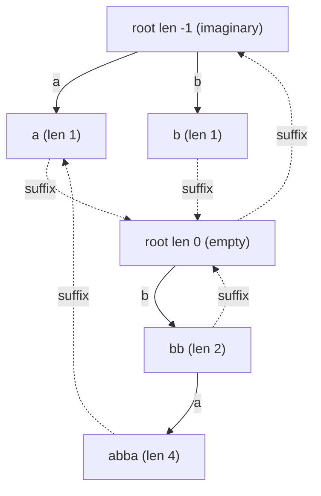

# Palindromic Tree (Eertree) — Complete Guide

> The **palindromic tree**, or **eertree**, is a remarkable structure that stores **every distinct
> palindromic substring** of a string using only **O(n) nodes** — even though a string of length `n`
> can contain up to `n` distinct palindromes and quadratically many palindrome *occurrences*. It is
> built **online** (character by character), each node carries its palindrome's **length**, a
> **suffix link** to its longest proper palindromic suffix, and **child edges** labeled by a single
> character that extends a palindrome on *both* sides at once.

The whole trick rests on a non-obvious fact: **a string of length `n` has at most `n` distinct
palindromic substrings.** Each time we append a character, *at most one* new distinct palindrome can
appear (the longest palindromic suffix of the new prefix). The eertree exploits exactly this, giving
linear node count and amortized linear construction.

---

## Table of Contents
1. [The Two Imaginary Roots and Why Length −1 Helps](#1-the-two-imaginary-roots-and-why-length-1-helps)
2. [The `add(c)` Online Insertion](#2-the-addc-online-insertion)
3. [Counting Distinct Palindromes](#3-counting-distinct-palindromes)
4. [Counting Total Palindromic Occurrences](#4-counting-total-palindromic-occurrences)
5. [Per-Node Occurrence Counts](#5-per-node-occurrence-counts)
6. [Paired Implementations](#6-paired-implementations)
7. [Mermaid](#7-mermaid)
8. [Complexity Summary](#8-complexity-summary)
9. [Common Pitfalls](#9-common-pitfalls)
10. [Patterns](#10-patterns)

---

## 1. The Two Imaginary Roots and Why Length −1 Helps

The eertree begins life with **two special root nodes**, neither of which represents a real
palindrome:

- **Root `0` — the imaginary root**, with length **`-1`**.
- **Root `1` — the empty root**, with length **`0`** (the empty string `""`).

Real palindrome nodes are created later with index `2, 3, 4, …`.

Why an imaginary length of `-1`? Because a palindrome of length `L` is built by wrapping a single
character `c` around a smaller palindrome `P` of length `L - 2`:

$$\texttt{c} + P + \texttt{c} \quad\Longrightarrow\quad \text{len} = \text{len}(P) + 2.$$

- A palindrome of length **2** (like `"bb"`) wraps the **empty** palindrome (length `0`).
- A palindrome of length **1** (like `"a"`) must wrap something of length `-1`.

That "something" is the **imaginary root**. Treating it as length `-1` makes the single formula
`new_len = parent_len + 2` work uniformly for **both** odd- and even-length palindromes. Without it,
length-1 palindromes would need a special case at every step.

The imaginary root also satisfies the extension test trivially: when we try to wrap character `c` at
position `i` around a node of length `l`, we check whether the character at index `i - l - 1` equals
`s[i]`. For the imaginary root `l = -1`, that index is `i - (-1) - 1 = i`, i.e. `s[i] == s[i]` — always
true. So **every** character can always extend the imaginary root into a length-1 palindrome, which is
precisely the base case we want.

The **suffix link** of a node points to its **longest proper palindromic suffix**. Both roots link to
the imaginary root (`suff[0] = 0`, `suff[1] = 0`), terminating all suffix-link walks safely.

---

## 2. The `add(c)` Online Insertion

We process the string left to right. We keep a variable `last` = the node of the **longest
palindromic suffix of the current prefix**. To append `s[i] = c`:

1. **Find the extendable suffix-palindrome.** Walk suffix links from `last` until we find a node `X`
   whose palindrome can be wrapped by `c` — i.e. the character just before that palindromic suffix
   equals `c`: `s[i - len[X] - 1] == s[i]`. The imaginary root always passes this test, so the walk
   terminates.
2. **Reuse or create.** The new palindrome is `c + P_X + c`. If `X` already has a child edge labeled
   `c`, that palindrome already exists — move `last` to it and bump its occurrence count. Otherwise
   create a **new node** `cur` with `len[cur] = len[X] + 2`.
3. **Set the suffix link of the new node.** The longest proper palindromic suffix of `c + P_X + c` is
   `c + Q + c` where `Q` is the longest palindromic suffix of `P_X` that is *also* preceded by `c`.
   Continue the suffix-link walk **from `suff[X]`** to find that node `Y`, then `suff[cur] = `child of
   `Y` by `c` (falling back to the empty root `1` for length-1 palindromes, whose proper suffix is
   `""`).
4. **Attach the edge** `X --c--> cur` and set `last = cur`.

Because each `add` creates at most one node, the total node count is `≤ n + 2`. The suffix-link walks
are amortized `O(1)` per character (the total walk length is bounded by how much `last`'s depth can
grow, which is `O(n)` overall), giving **linear** construction over a fixed alphabet.

---

## 3. Counting Distinct Palindromes

This is the easiest query and the deepest fact about the structure. **Each non-root node corresponds
to exactly one distinct palindromic substring**, and every distinct palindrome has exactly one node.
Therefore:

$$\#\{\text{distinct palindromic substrings}\} = \text{num} - 2,$$

where `num` is the total number of created nodes (the `-2` removes the two roots). No traversal is
needed — the answer is read off the node count after the build.

---

## 4. Counting Total Palindromic Occurrences

The **total number of palindromic substrings counted with multiplicity** equals the sum, over all
distinct palindromes `P`, of how many times `P` occurs in `s`. During the build, each `add` makes one
palindromic suffix the "current" longest one, so it naturally registers **one** new occurrence of
*that* palindrome. But appending a character also creates an occurrence of **every** palindromic
*suffix* of the new prefix — and those are exactly the nodes reachable by following suffix links from
`last`.

Walking suffix links on every step would be `O(n^2)`. Instead we **defer and propagate**: give each
node a counter `cnt`, initialized to the number of times it was the *direct* longest palindromic
suffix. Then process nodes in **decreasing index order** (a node's suffix link always points to a
shorter palindrome, created earlier, hence with a smaller index) and push each `cnt[v]` up to
`cnt[suff[v]]`:

$$\texttt{cnt[suff[v]]} \mathrel{+}= \texttt{cnt[v]}.$$

After this single linear pass, `cnt[v]` equals the **true number of occurrences** of palindrome `v` in
`s`. The total palindromic-substring count is then `sum(cnt[v])` over all real nodes.

---

## 5. Per-Node Occurrence Counts

After the propagation pass of Section 4, every node `v` stores:

- `len[v]` — the length of its palindrome,
- `cnt[v]` — the exact number of occurrences of that palindrome in `s`.

These two numbers unlock a family of queries with no extra structure:

- **Most frequent palindrome** — `max(cnt[v])`.
- **Maximum (occurrences × length)** — `max(cnt[v] * len[v])`, the classic "longest × frequency"
  measure of the most "valuable" palindrome.
- **Number of palindromes occurring ≥ k times** — count of nodes with `cnt[v] >= k`.

All are a single linear scan over the `num - 2` real nodes.

---

## 6. Paired Implementations

### Eertree build / `add`

```python
def build_eertree(s):
    n = len(s)
    SZ = n + 5
    length = [0] * SZ          # palindrome length of each node
    suff   = [0] * SZ          # suffix link: longest proper palindromic suffix
    cnt    = [0] * SZ          # times this node was the direct longest pal. suffix
    to     = [dict() for _ in range(SZ)]   # child edges by character

    # node 0 = imaginary root (length -1), node 1 = empty root (length 0)
    length[0] = -1; suff[0] = 0
    length[1] = 0;  suff[1] = 0
    num = 2          # number of created nodes (next free index)
    last = 1         # node of the longest palindromic suffix so far

    def get_link(x, i):
        # walk suffix links until s[i-len-1] == s[i]; imaginary root always passes
        while True:
            l = length[x]
            if i - l - 1 >= 0 and s[i - l - 1] == s[i]:
                return x
            x = suff[x]

    for i in range(n):
        ch = s[i]
        x = get_link(last, i)
        if ch in to[x]:
            last = to[x][ch]
            cnt[last] += 1
            continue
        cur = num; num += 1
        length[cur] = length[x] + 2
        if length[cur] == 1:
            suff[cur] = 1                       # proper suffix of "a" is ""
        else:
            y = get_link(suff[x], i)
            suff[cur] = to[y].get(ch, 1)
        to[x][ch] = cur
        cnt[cur] = 1
        last = cur

    return num, length, suff, cnt
```

```cpp
#include <bits/stdc++.h>
using namespace std;

struct Eertree {
    static const int K = 26;
    vector<array<int, K>> to;   // child edges by character (0 = no edge)
    vector<int> len, suff;      // palindrome length, suffix link
    vector<long long> cnt;      // direct-longest-suffix counts
    string s;
    int num, last;

    Eertree(const string &str) : s(str) {
        int n = (int)s.size();
        to.assign(n + 2, {});
        for (auto &row : to) row.fill(0);
        len.assign(n + 2, 0);
        suff.assign(n + 2, 0);
        cnt.assign(n + 2, 0);
        // node 0 = imaginary root (length -1), node 1 = empty root (length 0)
        len[0] = -1; suff[0] = 0;
        len[1] = 0;  suff[1] = 0;
        num = 2; last = 1;
        for (int i = 0; i < n; i++) add(i);
    }

    int getLink(int x, int i) {
        // walk suffix links until s[i-len-1] == s[i]; imaginary root always passes
        while (true) {
            int l = len[x];
            if (i - l - 1 >= 0 && s[i - l - 1] == s[i]) return x;
            x = suff[x];
        }
    }

    void add(int i) {
        int c = s[i] - 'a';
        int x = getLink(last, i);
        if (to[x][c] != 0) {
            last = to[x][c];
            cnt[last]++;
            return;
        }
        int cur = num++;
        len[cur] = len[x] + 2;
        if (len[cur] == 1) {
            suff[cur] = 1;                       // proper suffix of "a" is ""
        } else {
            int y = getLink(suff[x], i);
            suff[cur] = (to[y][c] != 0) ? to[y][c] : 1;
        }
        to[x][c] = cur;
        cnt[cur] = 1;
        last = cur;
    }
};
```

### Count distinct palindromes

```python
def count_distinct_palindromes(s):
    num, length, suff, cnt = build_eertree(s)
    # every non-root node is one distinct palindrome
    return num - 2
```

```cpp
long long countDistinctPalindromes(const string &s) {
    Eertree t(s);
    // every non-root node is one distinct palindrome
    return (long long)t.num - 2;
}
```

### Count total palindromic substrings (occurrences)

```python
def count_total_palindromes(s):
    num, length, suff, cnt = build_eertree(s)
    # propagate occurrence counts along suffix links, high index -> low
    for v in range(num - 1, 1, -1):
        cnt[suff[v]] += cnt[v]
    total = 0
    for v in range(2, num):
        total += cnt[v]
    return total
```

```cpp
long long countTotalPalindromes(const string &s) {
    Eertree t(s);
    // propagate occurrence counts along suffix links, high index -> low
    for (int v = t.num - 1; v >= 2; v--)
        t.cnt[t.suff[v]] += t.cnt[v];
    long long total = 0;
    for (int v = 2; v < t.num; v++)
        total += t.cnt[v];
    return total;
}
```

---

## 7. Mermaid

Eertree for `s = "abba"`. Solid edges add a character on both sides; dashed edges are suffix links to
the longest proper palindromic suffix. Both roots link back to the imaginary root.



Distinct palindromes here: `a`, `b`, `bb`, `abba` → exactly `num - 2 = 6 - 2 = 4` nodes.

---

## 8. Complexity Summary

| Operation | Time | Space |
|-----------|------|-------|
| Build (all `add`) | $O(n)$ amortized (fixed alphabet $\sigma$) | $O(n \cdot \sigma)$ array edges, or $O(n)$ with hash-map edges |
| Single `add(c)` | $O(1)$ amortized | — |
| Count distinct palindromes | $O(1)$ after build | — |
| Count total occurrences | $O(n)$ propagation | $O(n)$ |
| Per-node occurrence scan | $O(n)$ | $O(n)$ |

The amortized linearity of construction follows because `getLink` can only decrease the depth of
`last`, and each `add` increases that depth by at most one — so the total work across all suffix-link
walks is $O(n)$. With array edges of size $\sigma$ each step is true $O(1)$; with map edges it is
$O(\log \sigma)$ or $O(1)$ expected.

---

## 9. Common Pitfalls

- **Forgetting the imaginary root (length −1).** Without it, length-1 palindromes have no parent and
  the `new_len = parent_len + 2` formula breaks. It must exist *before* any character is added.
- **Using node `0` as a real "no edge" value.** With array edges, `0` doubles as "no child". This is
  safe only because the imaginary root (index `0`) is never a *child* of anything. Keep that invariant.
- **Wrong suffix-link traversal for the new node.** The suffix link of `cur` is found by continuing the
  walk from `suff[x]`, **not** from `x`, and falls back to the empty root `1` when `len[cur] == 1`.
- **Counting occurrences before propagation.** Right after the build, `cnt[v]` only counts the times
  `v` was the *direct* longest palindromic suffix. You must push counts up the suffix links (high index
  to low) to get true occurrence counts.
- **Off-by-one in the extension test.** The character compared is `s[i - len[x] - 1]`; guard the
  index `>= 0` before reading it.
- **Resetting `last` between strings.** When reusing the structure, reset `last = 1`, `num = 2`, and
  re-seed both roots' lengths and links.

---

## 10. Patterns

- **"How many distinct palindromes?"** → build the eertree, answer is `num - 2`. Beats hashing/Manacher
  enumeration which can be $O(n^2)$.
- **"How many palindromic substrings total / with multiplicity?"** → propagate `cnt` along suffix links,
  sum over real nodes.
- **"Most valuable palindrome" (max occurrences, or max `occ × len`)** → keep `len[v]` and propagated
  `cnt[v]`, take the max in one scan (APIO-style "longest × frequency").
- **"Palindromes ending at each position"** → after each `add`, the chain `last → suff[last] → …` lists
  every palindromic suffix ending there; their *number* per position is computable with a `series-link`
  refinement in $O(n \log n)$.
- **Double eertree** — running an eertree from both ends or over two interleaved strings answers common
  / bordered palindrome questions.
- **Generalized eertree** — feed multiple strings with separators to count palindromes shared across a
  set of strings.
