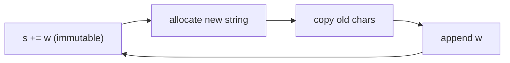
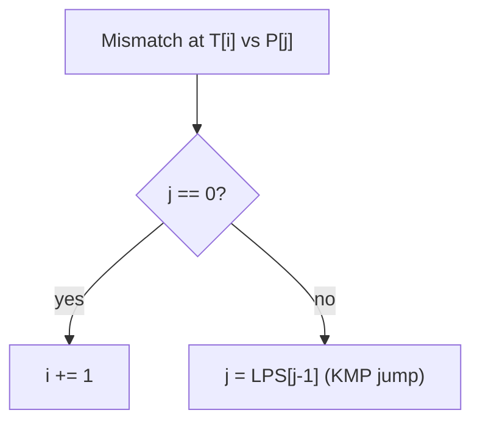

# Strings — Complete Guide (Beginner → Advanced)

> A string is just an **array of characters** — but it carries enough special structure and
> algorithms (pattern matching, hashing, tries, suffix structures) to deserve its own field.

---

## Table of Contents
1. [What is a String?](#1-what-is-a-string)
2. [Character Encodings (ASCII & Unicode)](#2-character-encodings-ascii--unicode)
3. [Mutability & Why Naive Concatenation is O(n²)](#3-mutability--why-naive-concatenation-is-on²)
4. [Core Operations & Complexity](#4-core-operations--complexity)
5. [Common Patterns (Intermediate)](#5-common-patterns-intermediate)
6. [Pattern Matching Algorithms (Advanced)](#6-pattern-matching-algorithms-advanced)
7. [String Hashing](#7-string-hashing)
8. [Tries & Suffix Structures](#8-tries--suffix-structures)
9. [Pitfalls & Cheat Sheet](#9-pitfalls--cheat-sheet)

---

## 1. What is a String?

A string is an ordered sequence of characters. Internally it is an array:

```
"HELLO"
Index:  0    1    2    3    4
       'H'  'E'  'L'  'L'  'O'
```

Each character is stored as an integer **code point** under some encoding.

---

## 2. Character Encodings (ASCII & Unicode)

- **ASCII** — 7 bits, 128 characters. `'A' = 65`, `'a' = 97`, `'0' = 48`.
  - Useful trick: `'a' - 'a' = 0 … 'z' - 'a' = 25` maps lowercase letters to `[0, 25]`,
    perfect for a 26-slot frequency array.
- **Unicode / UTF-8** — variable-length (1–4 bytes) to represent every script and emoji.
  Beware: in UTF-8, **string length in bytes ≠ number of characters**.

```
ch_to_index = ord(c) - ord('a')   # 'c' -> 2
index_to_ch = chr(i + ord('a'))   # 2 -> 'c'
```

---

## 3. Mutability & Why Naive Concatenation is O(n²)

In many languages (Java, Python, JS, C#) strings are **immutable**: every "modification"
creates a brand-new string. So building a string by repeated `+=` copies the whole prefix each
time:

$$
\text{Total cost} = 1 + 2 + 3 + \dots + n = \frac{n(n+1)}{2} = O(n^2)
$$

**Fix:** collect parts in a list / `StringBuilder` and join once → O(n).

```python
# BAD  O(n^2)
s = ""
for w in words: s += w

# GOOD O(n)
s = "".join(words)
```

```cpp
// BAD  O(n^2) when strings are immutable
string s = "";
for (auto& w : words) s += w;

// GOOD O(n): reserve once, then append
string out;
size_t total = 0;
for (auto& w : words) total += w.size();
out.reserve(total);
for (auto& w : words) out += w;
```



---

## 4. Core Operations & Complexity

| Operation | Time |
|-----------|------|
| Access `s[i]` | O(1) |
| Length | O(1) (usually cached) |
| Concatenate two strings of length a,b | O(a+b) |
| Substring of length m | O(m) |
| Compare two strings | O(min length) |
| Naive search of pattern (len m) in text (len n) | O(n·m) |
| KMP / Z / Rabin-Karp search | O(n+m) |

---

## 5. Common Patterns (Intermediate)

### 5.1 Frequency Counting
A 26- (or 128-) element array, or a hash map, counts character occurrences in O(n). Core to
anagrams, permutations, and "can form" problems.

### 5.2 Two Pointers
Palindrome checks, reversing in place, comparing from both ends.

### 5.3 Sliding Window
Longest substring without repeats, minimum window substring, anagram windows.

### 5.4 Sorting / Canonical Form
Two strings are anagrams iff their **sorted** versions match, or their frequency maps match.

---

## 6. Pattern Matching Algorithms (Advanced)

Find all occurrences of pattern `P` (length `m`) inside text `T` (length `n`).

### 6.1 Naive — O(n·m)
Slide `P` over `T`, compare at each offset.

### 6.2 KMP (Knuth–Morris–Pratt) — O(n+m)
Precompute the **longest proper prefix that is also a suffix (LPS)** for each prefix of `P`.
On a mismatch, instead of restarting, jump back using the LPS array, never re-reading text
characters.

```
P = "ababaca"
LPS = [0,0,1,2,3,0,1]
```

The LPS at index `i` tells you: after matching `i+1` chars and then mismatching, how many
characters you can safely *keep* because they form a prefix already matched.

### 6.3 Z-Algorithm — O(n+m)
`Z[i]` = length of the longest substring starting at `i` that matches a prefix of the string.
Concatenate `P + '#' + T` and look for `Z[i] = m`.

### 6.4 Rabin–Karp — O(n+m) average
Hash the pattern and each window; compare hashes (rolling hash) and only verify on hash match.



---

## 7. String Hashing

Treat a string as a number in base `b` modulo a large prime `M` (**polynomial hashing**):

$$
H(s) = \big(s_0 b^{0} + s_1 b^{1} + \dots + s_{m-1} b^{m-1}\big) \bmod M
$$

A **rolling hash** updates `H` in O(1) when the window slides, enabling fast substring
comparison. Use **two different mods** to avoid collisions (double hashing) in competitive
settings.

---

## 8. Tries & Suffix Structures

- **Trie (prefix tree)** — stores a set of strings sharing prefixes; lookup/insert in O(length).
  Great for autocomplete, dictionary, word search.
- **Suffix Array** — sorted array of all suffixes; powers substring search and longest common
  substring in O(n log n) build.
- **Suffix Automaton / Suffix Tree** — linear-size structures encoding *all* substrings; advanced.

```
Trie of {"cat","car","dog"}:
        root
       /    \
      c      d
      |      |
      a      o
     / \     |
    t   r    g
```

---

## 9. Pitfalls & Cheat Sheet

| Pitfall | Fix |
|---------|-----|
| `+=` in a loop (O(n²)) | Use list + join / StringBuilder |
| Confusing bytes with characters (Unicode) | Use code-point-aware APIs |
| Off-by-one in substring bounds | Define `[l, r)` half-open consistently |
| Case sensitivity | Normalize with lower()/upper() |
| Hash collisions | Double hashing, big prime mod |

```
Frequency array (lowercase): cnt[ord(c) - ord('a')]
Anagram test ................ sorted(a) == sorted(b)  OR  freq equal
Search (fast) ............... KMP / Z / Rabin-Karp  O(n+m)
Prefix set .................. Trie  O(len) per op
```

> **Mental model:** Treat a string as an array of small integers. Most "hard" string problems
> reduce to *counting characters*, *sliding a window*, or *matching a pattern efficiently*.
