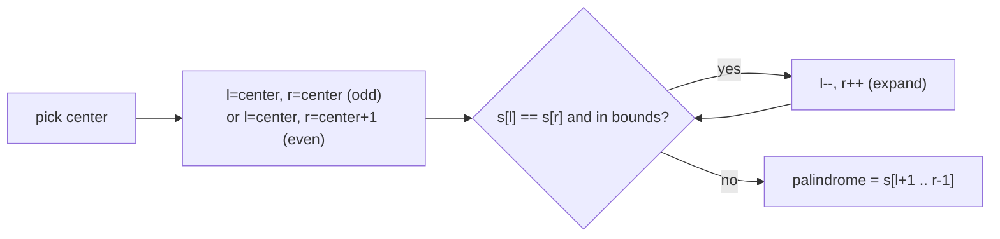

# Longest Palindromic Substring

| Meta | Value |
|------|-------|
| Source | LeetCode #5 |
| Difficulty | Medium |
| Topics | String, Dynamic Programming, Expand Around Center |
| Link | https://leetcode.com/problems/longest-palindromic-substring/ |

---

## Problem Statement
Given a string `s`, return the **longest contiguous substring** that reads the same forwards
and backwards.

**Example**
```
Input:  s = "babad"
Output: "bab"   (or "aba" — either valid)
```

---

## Key Insight — Expand Around Center

Every palindrome is symmetric about a **center**. The center can be:
- a **single character** (odd-length palindrome, e.g. `"aba"`, center `b`), or
- a **gap between two characters** (even-length palindrome, e.g. `"abba"`, center between the two `b`s).

For a string of length `n`, there are exactly `2n − 1` possible centers (`n` single chars +
`n − 1` gaps). From each center, expand outward while characters match.



---

## Code

```python
def longest_palindrome(s):
    if not s:
        return ""
    start, end = 0, 0

    def expand(l, r):
        while l >= 0 and r < len(s) and s[l] == s[r]:
            l -= 1
            r += 1
        return l + 1, r - 1        # last valid [l, r]

    for center in range(len(s)):
        l1, r1 = expand(center, center)       # odd length
        l2, r2 = expand(center, center + 1)   # even length
        # keep the longer of the two
        if r1 - l1 > end - start:
            start, end = l1, r1
        if r2 - l2 > end - start:
            start, end = l2, r2

    return s[start:end + 1]
```

```cpp
string longest_palindrome(const string& s) {
    if (s.empty())
        return "";
    int start = 0, end = 0;

    // expand around center [l, r] while chars match; return last valid [l, r]
    auto expand = [&](int l, int r) -> pair<int,int> {
        while (l >= 0 && r < (int)s.size() && s[l] == s[r]) {
            l -= 1;
            r += 1;
        }
        return {l + 1, r - 1};        // last valid [l, r]
    };

    for (int center = 0; center < (int)s.size(); center++) {
        auto [l1, r1] = expand(center, center);       // odd length
        auto [l2, r2] = expand(center, center + 1);   // even length
        // keep the longer of the two
        if (r1 - l1 > end - start) {
            start = l1; end = r1;
        }
        if (r2 - l2 > end - start) {
            start = l2; end = r2;
        }
    }

    return s.substr(start, end - start + 1);
}
```

---

## Iteration Trace — `s = "babad"`

| center | odd expand | even expand | best so far |
|--------|-----------|-------------|-------------|
| 0 `b`  | "b"       | s[0]≠s[1] → "" | "b" |
| 1 `a`  | l=0,r=2 `bab` ✓ then s[-1] stop → "bab" | s[1]≠s[2] → "" | **"bab"** (len 3) |
| 2 `b`  | l=1,r=3 `aba` ✓ → "aba" | s[2]≠s[3] → "" | "bab" (tie, keep first) |
| 3 `a`  | "a" | s[3]≠s[4] → "" | "bab" |
| 4 `d`  | "d" | out of bounds → "" | "bab" |

At center 1, expanding odd: `s[1]=a`, check `s[0]=b` vs `s[2]=b` → match → `"bab"`, then
`s[-1]` out of bounds → stop. Final answer **"bab"**.

---

## Complexity

| Approach | Time | Space |
|----------|------|-------|
| Brute force (check all substrings) | O(n³) | O(1) |
| DP table | O(n²) | O(n²) |
| **Expand around center** | **O(n²)** | **O(1)** |
| Manacher's algorithm | O(n) | O(n) |

Expand-around-center is the sweet spot: O(n²) time but **O(1) space** and easy to code.

### Why O(n²)?
There are `2n − 1` centers, and each expansion is at most O(n). So total
$(2n-1)\cdot O(n) = O(n^2)$.

---

## Advanced: Manacher's Algorithm — O(n)
Manacher reuses previously computed palindrome radii (mirror symmetry around the current
rightmost palindrome) to avoid re-expanding, achieving linear time. It transforms the string
by inserting separators (e.g. `#`) so odd/even cases unify. Worth learning once you're
comfortable with the center idea, but rarely required in interviews.

## Edge Cases
- Empty string → `""`.
- All same characters (`"aaaa"`) → the whole string.
- No palindrome longer than 1 (`"abc"`) → any single character.

## Takeaway
**Symmetry about a center** turns a seemingly quadratic-substring search into a clean linear
scan per center. The "expand outward while it matches" idea recurs in palindrome counting too.
