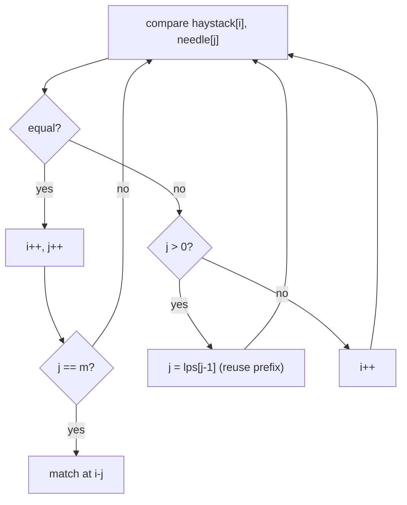

# Find the Index of the First Occurrence (strStr / KMP)

| Meta | Value |
|------|-------|
| Source | LeetCode #28 |
| Difficulty | Medium (Easy tag, but KMP is the real lesson) |
| Topics | String, Pattern Matching, KMP |
| Link | https://leetcode.com/problems/find-the-index-of-the-first-occurrence-in-a-string/ |

---

## Problem Statement
Given `haystack` and `needle`, return the index of the first occurrence of `needle` in
`haystack`, or `-1` if not present.

**Example**
```
haystack = "sadbutsad", needle = "sad"  ->  0
haystack = "leetcode",  needle = "leeto" -> -1
```

---

## Naive Approach — O(n·m)

Try every starting offset `i` in the text, compare character by character.

```python
def strStr_naive(h, n):
    H, N = len(h), len(n)
    for i in range(H - N + 1):
        if h[i:i + N] == n:
            return i
    return -1
```

```cpp
int strStr_naive(const string& h, const string& n) {
    int H = h.size(), N = n.size();
    for (int i = 0; i + N <= H; i++) {
        if (h.substr(i, N) == n)
            return i;
    }
    return -1;
}
```

Worst case (e.g. `h = "aaaaaa"`, `n = "aaab"`) does `O(n·m)` comparisons because every offset
matches a long prefix before failing.

---

## KMP — O(n + m)

KMP eliminates redundant re-comparisons. The trick is the **LPS array** (Longest Proper Prefix
which is also Suffix) of the pattern.

### Step 1: Build the LPS array

`lps[i]` = length of the longest proper prefix of `needle[0..i]` that is also a suffix of it.
"Proper" means not the whole substring.

```
needle = "a b a b c a"
index  =  0 1 2 3 4 5
lps    =  0 0 1 2 0 1
```

- `lps[2]`: prefix "aba" → longest prefix=suffix is "a" → 1
- `lps[3]`: "abab" → "ab" matches at both ends → 2
- `lps[4]`: "ababc" → none → 0

```python
def build_lps(p):
    lps = [0] * len(p)
    length = 0          # length of current prefix-suffix
    i = 1
    while i < len(p):
        if p[i] == p[length]:
            length += 1
            lps[i] = length
            i += 1
        elif length > 0:
            length = lps[length - 1]   # fall back, don't reset to 0
        else:
            lps[i] = 0
            i += 1
    return lps
```

```cpp
vector<int> build_lps(const string& p) {
    vector<int> lps(p.size(), 0);
    int length = 0;          // length of current prefix-suffix
    int i = 1;
    while (i < (int)p.size()) {
        if (p[i] == p[length]) {
            length += 1;
            lps[i] = length;
            i += 1;
        } else if (length > 0) {
            length = lps[length - 1];   // fall back, don't reset to 0
        } else {
            lps[i] = 0;
            i += 1;
        }
    }
    return lps;
}
```

### Step 2: Scan the text

When `haystack[i] != needle[j]` after some matches, we don't move `i` back. Instead we set
`j = lps[j-1]`, reusing the already-matched prefix.

```python
def strStr(haystack, needle):
    if not needle:
        return 0
    lps = build_lps(needle)
    i = j = 0
    while i < len(haystack):
        if haystack[i] == needle[j]:
            i += 1
            j += 1
            if j == len(needle):
                return i - j        # full match
        elif j > 0:
            j = lps[j - 1]          # KMP jump — i stays put
        else:
            i += 1
    return -1
```

```cpp
int strStr(const string& haystack, const string& needle) {
    if (needle.empty())
        return 0;
    vector<int> lps = build_lps(needle);
    int i = 0, j = 0;
    while (i < (int)haystack.size()) {
        if (haystack[i] == needle[j]) {
            i += 1;
            j += 1;
            if (j == (int)needle.size())
                return i - j;        // full match
        } else if (j > 0) {
            j = lps[j - 1];          // KMP jump — i stays put
        } else {
            i += 1;
        }
    }
    return -1;
}
```

---

## Why the LPS jump is correct

Suppose we matched `needle[0..j-1]` then mismatched at `needle[j]`. The last `lps[j-1]`
characters we matched form a substring that is *both* a prefix and a suffix of the matched
portion. So those characters are **already aligned** with the start of the pattern — we can
resume comparing from `needle[lps[j-1]]` without re-reading any text character.



### Iteration sketch — `haystack="ababcababa"`, `needle="ababc"`

The pattern matches `ababc` starting at index 0 directly (each char matches `a,b,a,b,c`),
returning index **0**. If instead the first attempt mismatched at the 5th char, KMP would set
`j = lps[3] = 2` and continue from `i` unchanged — never rescanning the `ab` already matched.

---

## Complexity

| Approach | Time | Space |
|----------|------|-------|
| Naive | O(n·m) | O(1) |
| **KMP** | **O(n + m)** | O(m) for LPS |

`i` never decreases, and total `j` decrements are bounded by total `j` increments, so the text
scan is amortized O(n); LPS build is O(m).

## Takeaway
KMP's lesson: **precompute structure of the pattern (LPS) to avoid re-reading the text.** The
same "failure function" idea underlies Aho–Corasick (multi-pattern matching).
