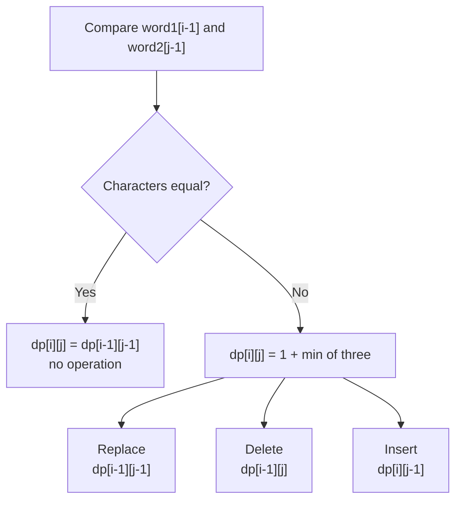

# Edit Distance

| Field | Value |
|-------|-------|
| **Source** | LeetCode #72 |
| **Difficulty** | Hard |
| **Topics** | String, Dynamic Programming |
| **Link** | https://leetcode.com/problems/edit-distance/ |

## Problem Statement

Given two strings `word1` and `word2`, return the **minimum number of operations** required to convert `word1` into `word2`. You are allowed three operations on a character:

- **Insert** a character
- **Delete** a character
- **Replace** a character

This minimum count is the classic **Levenshtein distance**.

### Worked Example

```
word1 = "horse"
word2 = "ros"

Answer = 3

Step-by-step transformation:
  horse  ->  rorse   (replace 'h' with 'r')
  rorse  ->  rose    (delete 'r')
  rose   ->  ros     (delete 'e')

3 operations total.
```

## Approach Progression

We build the solution from the most intuitive (and slowest) recursion up to an
`O(n)`-space iterative version. Understanding **why** each step improves on the
previous one is the whole point.

### Defining the subproblem

Let `dp[i][j]` be the edit distance between the **prefix** `word1[0..i-1]`
(first `i` characters) and `word2[0..j-1]` (first `j` characters).

Look at the **last** characters of each prefix:

- If `word1[i-1] == word2[j-1]`, they already match — no cost, recurse on
  `dp[i-1][j-1]`.
- Otherwise we pay `1` operation and take the cheapest of three choices:
  - **Replace** `word1[i-1]` -> recurse on `dp[i-1][j-1]`
  - **Delete** `word1[i-1]` -> recurse on `dp[i-1][j]`
  - **Insert** to match `word2[j-1]` -> recurse on `dp[i][j-1]`

The recurrence:

$$
dp[i][j] =
\begin{cases}
j & \text{if } i = 0 \\[4pt]
i & \text{if } j = 0 \\[4pt]
dp[i-1][j-1] & \text{if } word1[i-1] = word2[j-1] \\[4pt]
1 + \min\bigl(dp[i-1][j-1],\; dp[i-1][j],\; dp[i][j-1]\bigr) & \text{otherwise}
\end{cases}
$$

Base cases: turning a string of length $i$ into the empty string costs $i$
deletions, and building a string of length $j$ from empty costs $j$ insertions.

---

### 1. Plain Recursion (why it is too slow)

The direct translation of the recurrence. It is correct but recomputes the same
`(i, j)` pairs exponentially often, giving roughly $O(3^{m+n})$ time.

```python
def minDistance(word1: str, word2: str) -> int:
    # Solve for the prefixes word1[:i] and word2[:j].
    def solve(i: int, j: int) -> int:
        # One prefix is empty: the answer is the length of the other.
        if i == 0:
            return j
        if j == 0:
            return i
        # Last characters match: no operation needed here.
        if word1[i - 1] == word2[j - 1]:
            return solve(i - 1, j - 1)
        # Otherwise pay 1 and take the best of replace / delete / insert.
        return 1 + min(
            solve(i - 1, j - 1),  # replace
            solve(i - 1, j),      # delete from word1
            solve(i, j - 1),      # insert into word1
        )

    return solve(len(word1), len(word2))
```

```cpp
class Solution {
public:
    int minDistance(string word1, string word2) {
        return solve(word1, word2, word1.size(), word2.size());
    }

private:
    // Solve for the prefixes word1[:i] and word2[:j].
    int solve(const string& a, const string& b, int i, int j) {
        // One prefix is empty: the answer is the length of the other.
        if (i == 0) return j;
        if (j == 0) return i;
        // Last characters match: no operation needed here.
        if (a[i - 1] == b[j - 1])
            return solve(a, b, i - 1, j - 1);
        // Otherwise pay 1 and take the best of replace / delete / insert.
        return 1 + min({
            solve(a, b, i - 1, j - 1),  // replace
            solve(a, b, i - 1, j),      // delete from word1
            solve(a, b, i, j - 1)       // insert into word1
        });
    }
};
```

---

### 2. Top-Down Memoization (why it fixes the blow-up)

There are only `(m+1) * (n+1)` distinct `(i, j)` states. Caching each result the
first time we compute it collapses the exponential tree into `O(m * n)` work.

```python
from functools import lru_cache

def minDistance(word1: str, word2: str) -> int:
    @lru_cache(maxsize=None)              # cache every (i, j) state once
    def solve(i: int, j: int) -> int:
        if i == 0:
            return j                       # insert j chars
        if j == 0:
            return i                       # delete i chars
        if word1[i - 1] == word2[j - 1]:
            return solve(i - 1, j - 1)     # free match
        return 1 + min(
            solve(i - 1, j - 1),           # replace
            solve(i - 1, j),               # delete
            solve(i, j - 1),               # insert
        )

    return solve(len(word1), len(word2))
```

```cpp
class Solution {
public:
    int minDistance(string word1, string word2) {
        int m = word1.size(), n = word2.size();
        // memo[i][j] == -1 means "not computed yet".
        vector<vector<int>> memo(m + 1, vector<int>(n + 1, -1));
        return solve(word1, word2, m, n, memo);
    }

private:
    int solve(const string& a, const string& b, int i, int j,
              vector<vector<int>>& memo) {
        if (i == 0) return j;              // insert j chars
        if (j == 0) return i;              // delete i chars
        if (memo[i][j] != -1) return memo[i][j];

        int result;
        if (a[i - 1] == b[j - 1]) {
            result = solve(a, b, i - 1, j - 1, memo);  // free match
        } else {
            result = 1 + min({
                solve(a, b, i - 1, j - 1, memo),       // replace
                solve(a, b, i - 1, j, memo),           // delete
                solve(a, b, i, j - 1, memo)            // insert
            });
        }
        return memo[i][j] = result;
    }
};
```

---

### 3. Bottom-Up DP (why iteration beats recursion here)

Memoization still pays recursion overhead and risks stack overflow on long
strings. Since every state depends only on smaller `(i, j)`, we can fill a 2-D
table in increasing order — no recursion, predictable memory.

```python
def minDistance(word1: str, word2: str) -> int:
    m, n = len(word1), len(word2)
    # dp[i][j] = edit distance between word1[:i] and word2[:j].
    dp = [[0] * (n + 1) for _ in range(m + 1)]

    # Base cases: transforming to/from the empty string.
    for i in range(m + 1):
        dp[i][0] = i                       # delete i chars
    for j in range(n + 1):
        dp[0][j] = j                       # insert j chars

    for i in range(1, m + 1):
        for j in range(1, n + 1):
            if word1[i - 1] == word2[j - 1]:
                dp[i][j] = dp[i - 1][j - 1]            # free match
            else:
                dp[i][j] = 1 + min(
                    dp[i - 1][j - 1],                  # replace
                    dp[i - 1][j],                      # delete
                    dp[i][j - 1],                      # insert
                )
    return dp[m][n]
```

```cpp
class Solution {
public:
    int minDistance(string word1, string word2) {
        int m = word1.size(), n = word2.size();
        // dp[i][j] = edit distance between word1[:i] and word2[:j].
        vector<vector<int>> dp(m + 1, vector<int>(n + 1, 0));

        // Base cases: transforming to/from the empty string.
        for (int i = 0; i <= m; ++i) dp[i][0] = i;   // delete i chars
        for (int j = 0; j <= n; ++j) dp[0][j] = j;   // insert j chars

        for (int i = 1; i <= m; ++i) {
            for (int j = 1; j <= n; ++j) {
                if (word1[i - 1] == word2[j - 1]) {
                    dp[i][j] = dp[i - 1][j - 1];      // free match
                } else {
                    dp[i][j] = 1 + min({
                        dp[i - 1][j - 1],             // replace
                        dp[i - 1][j],                 // delete
                        dp[i][j - 1]                  // insert
                    });
                }
            }
        }
        return dp[m][n];
    }
};
```

---

### 4. Space-Optimized Rolling Array (why we only need two rows)

Row `i` of the table reads only from row `i-1` and the current row. So we never
need the whole matrix — two rows of length `n+1` are enough, dropping memory from
$O(m \cdot n)$ to $O(n)$. We keep `prev` and `curr` rows and swap them.

```python
def minDistance(word1: str, word2: str) -> int:
    m, n = len(word1), len(word2)
    # prev = dp row for i-1, curr = dp row for i.
    prev = list(range(n + 1))              # i == 0: insert j chars
    curr = [0] * (n + 1)

    for i in range(1, m + 1):
        curr[0] = i                        # j == 0: delete i chars
        for j in range(1, n + 1):
            if word1[i - 1] == word2[j - 1]:
                curr[j] = prev[j - 1]                 # free match
            else:
                curr[j] = 1 + min(
                    prev[j - 1],                      # replace
                    prev[j],                          # delete
                    curr[j - 1],                      # insert
                )
        prev, curr = curr, prev            # roll the rows
    return prev[n]
```

```cpp
class Solution {
public:
    int minDistance(string word1, string word2) {
        int m = word1.size(), n = word2.size();
        // prev = dp row for i-1, curr = dp row for i.
        vector<int> prev(n + 1), curr(n + 1);
        for (int j = 0; j <= n; ++j) prev[j] = j;    // i == 0: insert j chars

        for (int i = 1; i <= m; ++i) {
            curr[0] = i;                             // j == 0: delete i chars
            for (int j = 1; j <= n; ++j) {
                if (word1[i - 1] == word2[j - 1]) {
                    curr[j] = prev[j - 1];           // free match
                } else {
                    curr[j] = 1 + min({
                        prev[j - 1],                 // replace
                        prev[j],                     // delete
                        curr[j - 1]                  // insert
                    });
                }
            }
            swap(prev, curr);                        // roll the rows
        }
        return prev[n];
    }
};
```

## DP Table Trace

Filling `dp[i][j]` for `word1 = "horse"` (rows) and `word2 = "ros"` (columns).
Row/column `0` are the empty-prefix base cases. The bottom-right cell is the
answer, **3**.

|       | "" | r | o | s |
|-------|----|---|---|---|
| **""**| 0  | 1 | 2 | 3 |
| **h** | 1  | 1 | 2 | 3 |
| **o** | 2  | 2 | 1 | 2 |
| **r** | 3  | 2 | 2 | 2 |
| **s** | 4  | 3 | 3 | 2 |
| **e** | 5  | 4 | 4 | 3 |

Reading the final cell `dp[5][3] = 3` confirms three operations, matching the
worked transformation `horse -> rorse -> rose -> ros`.

## Decision Diagram



## Complexity

| Approach | Time | Space |
|----------|------|-------|
| Plain recursion | $O(3^{m+n})$ | $O(m + n)$ recursion stack |
| Top-down memoization | $O(m \cdot n)$ | $O(m \cdot n)$ |
| Bottom-up DP | $O(m \cdot n)$ | $O(m \cdot n)$ |
| Space-optimized rolling array | $O(m \cdot n)$ | $O(n)$ |

Here $m = $ `len(word1)` and $n = $ `len(word2)`.

## Takeaway

- Define the state as edit distance over **prefixes**; the entire problem hinges
  on what to do with the **last characters**.
- The three operations map cleanly to three neighbor cells:
  diagonal = replace, up = delete, left = insert. Matching characters take the
  diagonal for free.
- The recurrence $dp[i][j] = 1 + \min(dp[i-1][j-1], dp[i-1][j], dp[i][j-1])$
  (or the free diagonal on a match) is the Levenshtein template you will reuse
  for many string-alignment problems.
- Each row depends only on the previous row, so a **rolling two-row array**
  cuts space to $O(n)$ without changing the $O(m \cdot n)$ time.
