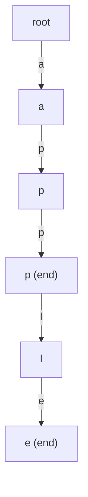

# Implement Trie (Prefix Tree)

| Meta | Value |
|------|-------|
| Source | LeetCode #208 |
| Difficulty | Medium |
| Topics | Trie, Hash Table, String, Design |
| Link | https://leetcode.com/problems/implement-trie-prefix-tree/ |

---

## Problem Statement
Implement a `Trie` class supporting:

- `insert(word)` — add `word` to the trie.
- `search(word)` — return `true` if `word` was inserted **exactly** (it must end at a marked node).
- `startsWith(prefix)` — return `true` if any inserted word **begins with** `prefix`.

All inputs consist of lowercase English letters.

**Example**
```text
Trie trie = new Trie();
trie.insert("apple");
trie.search("apple");     // returns true
trie.search("app");       // returns false  (inserted "apple", not "app")
trie.startsWith("app");   // returns true   (some word starts with "app")
trie.insert("app");
trie.search("app");       // returns true   (now "app" itself is inserted)
```

---

## WHY a Trie?

A hash set answers **exact membership** in $O(L)$, but it cannot answer "does any stored word start
with this prefix?" without scanning every key. A trie shares common prefixes along a single path, so
both exact lookup **and** prefix lookup become a simple $O(L)$ walk down the tree — independent of how
many words are stored. The only structural difference between `search` and `startsWith` is whether we
additionally require the final node to be flagged as the end of a word.

---

## Approach — One Walk Per Operation

Each node has up to 26 children (one per letter) and a boolean `is_end`. Insert descends, creating
nodes as needed, and flags the terminal node. Search and startsWith share the same walk; only the
final check differs.

```python
class TrieNode:
    def __init__(self):
        self.children = {}     # char -> TrieNode
        self.is_end = False

class Trie:
    def __init__(self):
        self.root = TrieNode()

    def insert(self, word: str) -> None:
        node = self.root
        for c in word:
            if c not in node.children:
                node.children[c] = TrieNode()
            node = node.children[c]
        node.is_end = True

    def _walk(self, s: str):
        node = self.root
        for c in s:
            if c not in node.children:
                return None
            node = node.children[c]
        return node

    def search(self, word: str) -> bool:
        node = self._walk(word)
        return node is not None and node.is_end

    def startsWith(self, prefix: str) -> bool:
        return self._walk(prefix) is not None
```

```cpp
#include <bits/stdc++.h>
using namespace std;

class Trie {
    struct Node {
        array<Node*, 26> children;
        bool is_end = false;
        Node() { children.fill(nullptr); }
    };
    Node* root;

    Node* walk(const string& s) {
        Node* node = root;
        for (char ch : s) {
            int c = ch - 'a';
            if (node->children[c] == nullptr) return nullptr;
            node = node->children[c];
        }
        return node;
    }

public:
    Trie() { root = new Node(); }

    void insert(const string& word) {
        Node* node = root;
        for (char ch : word) {
            int c = ch - 'a';
            if (node->children[c] == nullptr)
                node->children[c] = new Node();
            node = node->children[c];
        }
        node->is_end = true;
    }

    bool search(const string& word) {
        Node* node = walk(word);
        return node != nullptr && node->is_end;
    }

    bool startsWith(const string& prefix) {
        return walk(prefix) != nullptr;
    }
};
```

For maximum speed in C++ you can replace per-node allocation with a flat index-based array
`int nxt[N][26]`, but the pointer version above is clearer and easily fast enough for LeetCode.

---

## Trace — the Example Above

Start empty. Insert `"apple"`, then run the queries.

| Step | Operation | Walk | Final node | Result |
|------|-----------|------|------------|--------|
| 1 | `insert("apple")` | create `a→p→p→l→e` | flag `e` as end | — |
| 2 | `search("apple")` | `a→p→p→l→e` exists | `is_end` of `e` = true | **true** |
| 3 | `search("app")` | `a→p→p` exists | `is_end` of second `p` = false | **false** |
| 4 | `startsWith("app")` | `a→p→p` exists | path exists | **true** |
| 5 | `insert("app")` | walk `a→p→p` (reuse) | flag second `p` as end | — |
| 6 | `search("app")` | `a→p→p` exists | `is_end` now true | **true** |

Step 5 reuses the existing `a→p→p` nodes — no new nodes are created, it only sets a flag. That shared
prefix is exactly what makes the trie space-efficient.

---

## Mermaid

State after inserting `"apple"` and `"app"`. The second `p` is now an end node.



`p2` carries both an end flag (for `"app"`) and a child `l` (continuing to `"apple"`) — a node can be
simultaneously a complete word and a prefix.

---

## Math & Complexity

Let $L$ be the length of the key for an operation and $n$ the number of inserted words with total
length $T = \sum L_i$.

$$
T_{\text{insert}} = T_{\text{search}} = T_{\text{startsWith}} = O(L)
$$

Crucially this is **independent of $n$** — adding more words never slows down a single operation.
Total space is bounded by the number of distinct nodes, at most $O(T)$ with prefix sharing and at
most $O(T \cdot 26)$ child slots if using fixed arrays.

---

## Takeaway

The trie is the canonical structure whenever you need **prefix-aware** lookups. Remember the one rule
that separates the two queries: `search` requires the path to exist **and** end on a flagged node,
while `startsWith` only requires the path to exist.
