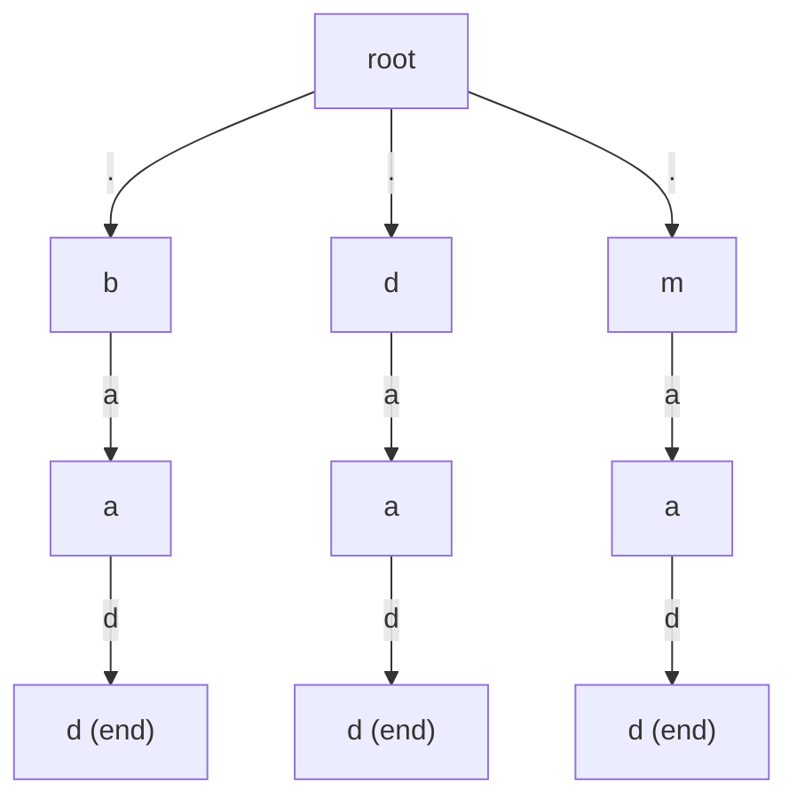

# Design Add and Search Words Data Structure

| Meta | Value |
|------|-------|
| Source | LeetCode #211 |
| Difficulty | Medium |
| Topics | Trie, DFS, Backtracking, String, Design |
| Link | https://leetcode.com/problems/design-add-and-search-words-data-structure/ |

---

## Problem Statement
Design a data structure supporting:

- `addWord(word)` — store `word`.
- `search(word)` — return `true` if **any** stored word matches `word`. The query may contain the
  wildcard character `'.'`, which matches **any single letter**.

All non-wildcard characters are lowercase English letters.

**Example**
```text
addWord("bad");
addWord("dad");
addWord("mad");
search("pad");   // false  (no stored word is "pad")
search("bad");   // true   (exact match)
search(".ad");   // true   ("bad", "dad", "mad" all match)
search("b..");   // true   ("bad" matches)
```

---

## WHY a Trie + DFS?

Without wildcards this is plain trie membership. The twist is the `'.'`, which matches any letter. At
a `'.'` we do not know which edge to follow, so we **branch into every existing child** and recurse —
a depth-first search over the trie. Because the trie merges shared prefixes, the wildcard only fans
out where words actually diverge, which is far cheaper than testing the pattern against every stored
word independently.

The recursion peels one pattern character per level. A normal letter follows a single edge (or fails
immediately); a `'.'` tries all children. We succeed when the pattern is exhausted **and** we land on
a node flagged as the end of a word.

---

## Approach — Wildcard DFS Over the Trie

```python
class TrieNode:
    def __init__(self):
        self.children = {}     # char -> TrieNode
        self.is_end = False

class WordDictionary:
    def __init__(self):
        self.root = TrieNode()

    def addWord(self, word: str) -> None:
        node = self.root
        for c in word:
            if c not in node.children:
                node.children[c] = TrieNode()
            node = node.children[c]
        node.is_end = True

    def search(self, word: str) -> bool:
        def dfs(node, i):
            if i == len(word):
                return node.is_end
            c = word[i]
            if c == '.':
                for child in node.children.values():
                    if dfs(child, i + 1):
                        return True
                return False
            if c not in node.children:
                return False
            return dfs(node.children[c], i + 1)

        return dfs(self.root, 0)
```

```cpp
#include <bits/stdc++.h>
using namespace std;

class WordDictionary {
    struct Node {
        array<Node*, 26> children;
        bool is_end = false;
        Node() { children.fill(nullptr); }
    };
    Node* root;

    bool dfs(Node* node, const string& word, int i) {
        if (i == (int)word.size())
            return node->is_end;
        char ch = word[i];
        if (ch == '.') {
            for (int c = 0; c < 26; c++) {
                if (node->children[c] != nullptr && dfs(node->children[c], word, i + 1))
                    return true;
            }
            return false;
        }
        int c = ch - 'a';
        if (node->children[c] == nullptr)
            return false;
        return dfs(node->children[c], word, i + 1);
    }

public:
    WordDictionary() { root = new Node(); }

    void addWord(const string& word) {
        Node* node = root;
        for (char ch : word) {
            int c = ch - 'a';
            if (node->children[c] == nullptr)
                node->children[c] = new Node();
            node = node->children[c];
        }
        node->is_end = true;
    }

    bool search(const string& word) {
        return dfs(root, word, 0);
    }
};
```

A non-wildcard character prunes to a single branch, so most of the cost concentrates at wildcards —
exactly where branching is unavoidable.

---

## Trace — `search(".ad")` after adding `bad`, `dad`, `mad`

The trie root has three children: `b`, `d`, `m`. Pattern `".ad"`.

| Depth | Pattern char | Node | Action | Outcome |
|-------|--------------|------|--------|---------|
| 0 | `'.'` | root | wildcard → try children `b`, `d`, `m` | branch |
| 1 | `'a'` | `b` | follow edge `a` → node `ba` | ok |
| 2 | `'d'` | `ba` | follow edge `d` → node `bad` | ok |
| 3 | (end) | `bad` | `is_end` = true | **return true** |

The very first wildcard branch (`b`) already leads to `"bad"`, so the search short-circuits to `true`
without trying `d` or `m`. Had it failed, the DFS would backtrack and try the next child.

For `search("b..")`: depth 0 follows `b` (single edge), depth 1 wildcard tries `b`'s only child `a`,
depth 2 wildcard tries `a`'s only child `d`, and the node `bad` is flagged — `true`.

---

## Mermaid

Trie after `addWord("bad"), addWord("dad"), addWord("mad")`. The DFS for `".ad"` explores the `b`
branch first (highlighted path).



The `'.'` edges out of the root illustrate the three branches the wildcard expands into; ordinary
letters then follow single edges.

---

## Math & Complexity

Let $L$ be the pattern length, $\Sigma = 26$ the alphabet, and $w$ the number of wildcards.

- **addWord** is a plain insert: $O(L)$.
- **search** with no wildcards: $O(L)$ — a single path.
- **search** worst case (all wildcards): each `'.'` may branch into up to $\Sigma$ children, so the
  bound is

$$
O\!\left(\Sigma^{\,w} \cdot L\right) \subseteq O\!\left(26^{L}\right)
$$

In practice the trie's shared structure means a wildcard only branches where stored words actually
differ, so real runtimes are dramatically below this worst case. Space is $O(T)$ over total inserted
length $T$.

---

## Takeaway

A wildcard pattern over a dictionary becomes a **DFS over a trie**: ordinary characters follow a
single edge, while `'.'` branches into all children and backtracks. Build the trie once, and every
search reuses the shared prefixes instead of re-scanning every word.
