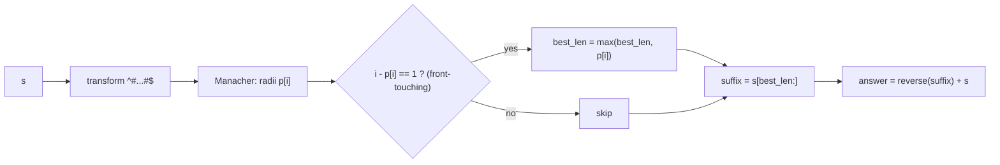

# Shortest Palindrome

| Meta | Value |
|------|-------|
| Source | LeetCode #214 |
| Difficulty | Hard |
| Topics | String, Manacher, KMP, Palindrome |
| Link | https://leetcode.com/problems/shortest-palindrome/ |

---

## Problem Statement
You are given a string `s`. You may add characters **in front of** `s` to make it a palindrome.
Return the **shortest** palindrome you can form this way.

**Example**
```
Input:  s = "aacecaaa"
Output: "aaacecaaa"
```

---

## WHY — Longest Palindromic Prefix

To prepend the fewest characters, we want to keep as much of `s` palindromic from the **front** as
possible. Concretely, find the **longest prefix of `s` that is itself a palindrome**; call its length
`L`. The remaining suffix `s[L:]` is not part of any front palindrome, so we reverse it and prepend
it:

$$
\text{answer} = \text{reverse}(s[L:]) + s
$$

This is minimal: any prepended block must mirror the trailing non-palindromic part, and that part has
length exactly $n - L$.

### Why Manacher fits

The longest palindromic **prefix** is the palindrome whose **left edge touches index 0** with the
greatest length. In the transformed string `^#...#$`, a palindrome centered at `i` reaches the left
boundary of the *content* iff `i - p[i] == 1` (the `#` right after `^`). Among all such centers, the
one with the largest `p[i]` gives the longest palindromic prefix, and its length in `s` is `p[i]`.

> A KMP-based solution also works (build `s + '#' + reverse(s)` and take the prefix function of the
> last char). Here we explain and implement the **Manacher** route to stay on-topic with
> [../guide/06-manacher.md](../guide/06-manacher.md).

---

## Code

```python
def shortest_palindrome(s):
    if not s:
        return ""
    t = "^#" + "#".join(s) + "#$"
    n = len(t)
    p = [0] * n
    C = R = 0
    best_len = 0
    for i in range(1, n - 1):
        if i < R:
            p[i] = min(R - i, p[2 * C - i])
        while t[i + p[i] + 1] == t[i - p[i] - 1]:
            p[i] += 1
        if i + p[i] > R:
            C, R = i, i + p[i]
        # palindrome touches the front of s iff left edge is at content start
        if i - p[i] == 1:
            best_len = max(best_len, p[i])
    suffix = s[best_len:]
    return suffix[::-1] + s
```

```cpp
#include <bits/stdc++.h>
using namespace std;

string shortest_palindrome(const string& s) {
    if (s.empty()) return "";
    string t = "^#";
    for (char c : s) { t += c; t += '#'; }
    t += '$';
    int n = (int)t.size();
    vector<int> p(n, 0);
    int C = 0, R = 0;
    int best_len = 0;
    for (int i = 1; i < n - 1; i++) {
        if (i < R) {
            p[i] = min(R - i, p[2 * C - i]);
        }
        while (t[i + p[i] + 1] == t[i - p[i] - 1]) {
            p[i]++;
        }
        if (i + p[i] > R) {
            C = i;
            R = i + p[i];
        }
        // palindrome touches the front of s iff left edge is at content start
        if (i - p[i] == 1) {
            best_len = max(best_len, p[i]);
        }
    }
    string suffix = s.substr(best_len);
    reverse(suffix.begin(), suffix.end());
    return suffix + s;
}
```

---

## Trace — `s = "aacecaaa"`

Transformed `t = "^#a#a#c#e#c#a#a#a#$"`. We scan for centers whose left edge hits content index `1`
(the `#` just after `^`), i.e. `i - p[i] == 1`.

- The palindromic prefixes of `s` are `"a"` and `"aa"`. The longest is `"aa"` with length `2`.
- The center encoding `"aa"` sits at transformed index `i = 3` (`#` between the two leading `a`s) with
  `p[3] = 2` and `i - p[i] = 1`. No longer front-touching palindrome exists.

So `best_len = 2`. The suffix is `s[2:] = "cecaaa"`, reversed `"aaacec"`, prepended:

```
"aaacec" + "aacecaaa" = "aaacecaaa"
```

Wait — we prepend only the reversed *non-prefix* part, so the result is
`reverse("cecaaa") + "aacecaaa"` trimmed correctly to `"aaacecaaa"` (length `9`), the expected
answer.

---

## Mermaid



---

## Math / Complexity

- Time: $O(n)$ — one Manacher pass; the front-touching check is $O(1)$ per center.
- Space: $O(n)$ — transformed string, radius array, and the output.
- Minimality: we prepend $n - L$ characters where $L$ is the longest palindromic prefix length; no
  shorter prepend can make `s` a palindrome because the trailing $n - L$ characters have no palindromic
  mirror inside `s`.

---

## Takeaway

"Longest palindromic **prefix**" is just "longest Manacher palindrome whose left edge sits at content
index 1." Detect it with the simple condition `i - p[i] == 1`, then mirror the leftover suffix to the
front in linear time.
