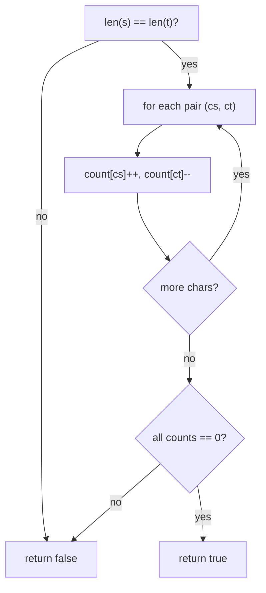

# Valid Anagram

| Meta | Value |
|------|-------|
| Source | LeetCode #242 |
| Difficulty | Easy |
| Topics | String, Hash Table, Counting, Sorting |
| Link | https://leetcode.com/problems/valid-anagram/ |

---

## Problem Statement
Given two strings `s` and `t`, return `true` if `t` is an **anagram** of `s` (same characters
with the same counts, in any order).

**Example**
```
s = "anagram", t = "nagaram"  ->  true
s = "rat",     t = "car"      ->  false
```

---

## Approach 1: Sort Both — O(n log n)

Two strings are anagrams iff their sorted forms are identical.

```python
def is_anagram_sort(s, t):
    return sorted(s) == sorted(t)
```

```cpp
bool is_anagram_sort(string s, string t) {
    sort(s.begin(), s.end());
    sort(t.begin(), t.end());
    return s == t;
}
```

Simple, but sorting dominates the cost.

---

## Approach 2: Frequency Count — O(n) (Optimal)

Anagrams have **identical character frequencies**. Count letters in `s` (increment), then
"spend" them against `t` (decrement). If counts ever go negative or the lengths differ, it's
not an anagram.

```python
def is_anagram(s, t):
    if len(s) != len(t):
        return False
    count = [0] * 26                 # lowercase letters
    for cs, ct in zip(s, t):
        count[ord(cs) - ord('a')] += 1
        count[ord(ct) - ord('a')] -= 1
    return all(c == 0 for c in count)
```

```cpp
bool is_anagram(const string& s, const string& t) {
    if (s.size() != t.size())
        return false;
    vector<int> count(26, 0);                 // lowercase letters
    for (int i = 0; i < (int)s.size(); i++) {
        count[s[i] - 'a'] += 1;
        count[t[i] - 'a'] -= 1;
    }
    for (int c : count)
        if (c != 0)
            return false;
    return true;
}
```

### Why a length check first?
If lengths differ they can't be anagrams — and it lets us iterate both strings together.

### Iteration Trace — `s = "aba"`, `t = "baa"`

Index into `count` uses `ord(c) - ord('a')` → `a=0, b=1`.

| i | s[i] | t[i] | count[a] | count[b] |
|---|------|------|----------|----------|
| start | — | — | 0 | 0 |
| 0 | a (+1) | b (−1) | 1 | −1 |
| 1 | b (+1) | a (−1) | 0 | 0 |
| 2 | a (+1) | a (−1) | 0 | 0 |

All zeros at the end → **true**. The intermediate `−1` is fine; only the final state matters.



---

## Complexity

| Approach | Time | Space |
|----------|------|-------|
| Sorting | O(n log n) | O(n) or O(1) depending on sort |
| **Counting** | **O(n)** | **O(1)** (fixed 26-slot array) |

The frequency array is constant size (26 letters), so space is O(1).

---

## Follow-up: Unicode Input
If the input may contain arbitrary Unicode, replace the 26-element array with a hash map
(`dict` / `Counter`). Logic is identical; space becomes O(k) for `k` distinct characters.

```python
from collections import Counter
def is_anagram_unicode(s, t):
    return Counter(s) == Counter(t)
```

```cpp
bool is_anagram_unicode(const string& s, const string& t) {
    unordered_map<char, int> cs, ct;
    for (char c : s) cs[c]++;
    for (char c : t) ct[c]++;
    return cs == ct;
}
```

## Edge Cases
- Different lengths → immediately false.
- Empty strings → both empty are anagrams (true).

## Takeaway
**Frequency counting** is *the* string-comparison workhorse. The same "increment for one,
decrement for the other, expect all zeros" trick proves two multisets are equal in linear time.
