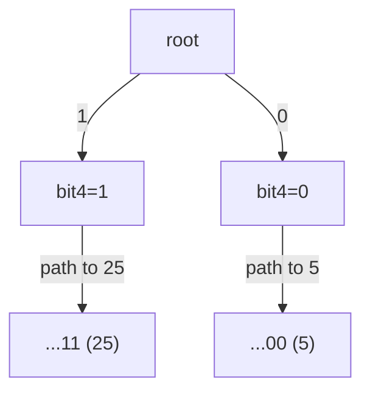

# Maximum XOR of Two Numbers in an Array

| Meta | Value |
|------|-------|
| Source | LeetCode #421 |
| Difficulty | Medium |
| Topics | Bit Manipulation, Trie (Binary), Array, Hash Table |
| Link | https://leetcode.com/problems/maximum-xor-of-two-numbers-in-an-array/ |

---

## Problem Statement
Given an integer array `nums`, return the maximum value of `nums[i] XOR nums[j]` over all pairs
`0 <= i, j < n`.

**Example**
```text
Input:  nums = [3, 10, 5, 25, 2, 8]
Output: 28
Explanation: the best pair is 5 XOR 25 = 28.
   5  = 00101
  25  = 11001
  XOR = 11100 = 28
```

---

## WHY a Binary Trie?

The brute force checks every pair: $O(n^2)$. With $n$ up to $2 \times 10^5$ that is $4 \times 10^{10}$
operations — far too slow.

The insight: $a \oplus b$ has a `1` in a bit position exactly when $a$ and $b$ **differ** there. To
maximize the result we want a `1` as high as possible. So if we store every number as a 32-bit string
(MSB first) in a **binary trie**, then for a fixed `x` we can greedily walk down, at each level
preferring the child whose bit is the **opposite** of `x`'s bit. That opposite child guarantees a
differing bit — a `1` — in the most significant remaining position. Each query is $O(32)$, so the
whole answer is $O(32n)$.

---

## Approach — Insert All, Then Query Each Greedily

Insert every number into the binary trie. Then for each number `x`, compute the best XOR partner by
greedily choosing opposite bits from the MSB down. The overall answer is the max over all `x`.

```python
class Solution:
    def findMaximumXOR(self, nums: list[int]) -> int:
        BITS = 32
        children = [[0, 0]]   # node -> [child0, child1], 0 means "missing"

        def new_node():
            children.append([0, 0])
            return len(children) - 1

        def insert(x):
            node = 0
            for i in range(BITS - 1, -1, -1):
                b = (x >> i) & 1
                if children[node][b] == 0:
                    children[node][b] = new_node()
                node = children[node][b]

        def max_xor(x):
            node = 0
            best = 0
            for i in range(BITS - 1, -1, -1):
                b = (x >> i) & 1
                want = b ^ 1                      # opposite bit -> a 1 in this position
                if children[node][want] != 0:
                    best |= (1 << i)
                    node = children[node][want]
                else:
                    node = children[node][b]      # forced to the same bit
            return best

        for x in nums:
            insert(x)
        return max(max_xor(x) for x in nums)
```

```cpp
#include <bits/stdc++.h>
using namespace std;

class Solution {
    static const int BITS = 32;
    vector<array<int, 2>> children; // node -> {child0, child1}, 0 means "missing"

    int new_node() {
        children.push_back({0, 0});
        return (int)children.size() - 1;
    }

    void insert(long long x) {
        int node = 0;
        for (int i = BITS - 1; i >= 0; i--) {
            int b = (x >> i) & 1;
            if (children[node][b] == 0)
                children[node][b] = new_node();
            node = children[node][b];
        }
    }

    long long max_xor(long long x) {
        int node = 0;
        long long best = 0;
        for (int i = BITS - 1; i >= 0; i--) {
            int b = (x >> i) & 1;
            int want = b ^ 1;                     // opposite bit -> a 1 here
            if (children[node][want] != 0) {
                best |= (1LL << i);
                node = children[node][want];
            } else {
                node = children[node][b];         // forced to the same bit
            }
        }
        return best;
    }

public:
    int findMaximumXOR(vector<int>& nums) {
        children.clear();
        children.push_back({0, 0});   // root is node 0
        for (int x : nums) insert(x);
        long long ans = 0;
        for (int x : nums) ans = max(ans, max_xor(x));
        return (int)ans;
    }
};
```

Because XOR is symmetric, querying every `x` against all inserted numbers covers every unordered pair
(and `x` against itself yields `0`, which never beats a genuine pair).

---

## Trace — `max_xor(5)` against `[3,10,5,25,2,8]`

Restrict to the 5 low bits for readability (high bits are all `0` here). `5 = 00101`. We descend from
the MSB, each time trying the opposite bit.

| Bit (value) | bit of 5 | want (opposite) | opposite child exists? | step | best so far |
|-------------|----------|-----------------|------------------------|------|-------------|
| 4 (16) | 0 | 1 | yes (25 = `11001`) | take `1` | `10000` = 16 |
| 3 (8)  | 0 | 1 | yes (25 has `1`) | take `1` | `11000` = 24 |
| 2 (4)  | 1 | 0 | yes (25 has `0`) | take `0` | `11100` = 28 |
| 1 (2)  | 0 | 1 | no (25 has `0`)  | forced `0` | `11100` = 28 |
| 0 (1)  | 1 | 0 | no (25 has `1`)  | forced `1`→ but want=0 missing | `11100` = 28 |

The greedy walk lands on `25`, giving $5 \oplus 25 = 28$ — the global maximum. At each level it
grabbed a `1` whenever an opposite-bit branch existed, locking in the highest possible value first.

---

## Mermaid

A small binary trie holding just `5 = 101` and `25 = 11001`, restricted to 5 bits. The greedy query
for `x = 5` follows the **opposite** bit at every level (the `25` path).



Starting at the root with `x`'s top bit `0`, the greedy rule prefers the `1` edge (toward `25`),
immediately securing the highest bit of the answer.

---

## Math & Complexity

Let $n = |nums|$ and $B = 32$ the bit width.

- **Build**: insert $n$ numbers, each $O(B)$ → $O(nB)$.
- **Query**: $n$ greedy walks, each $O(B)$ → $O(nB)$.

$$
T_{\text{total}} = O(nB) = O(32n) \quad\text{vs. brute force } O(n^2)
$$

Space is $O(nB)$ trie nodes in the worst case. The greedy choice is provably optimal because XOR is
evaluated bit by bit from the most significant position, and a `1` in a higher bit always outweighs
any combination of lower bits:

$$
2^{k} > \sum_{j=0}^{k-1} 2^{j} = 2^{k} - 1
$$

so locking in the highest available differing bit can never be suboptimal.

---

## Takeaway

Max-XOR over an array is the signature use of a **binary trie**: store numbers MSB-first, then for
each value greedily descend toward the **opposite** bit to force a `1` into the highest position. This
collapses an $O(n^2)$ pairing into $O(32n)$.
