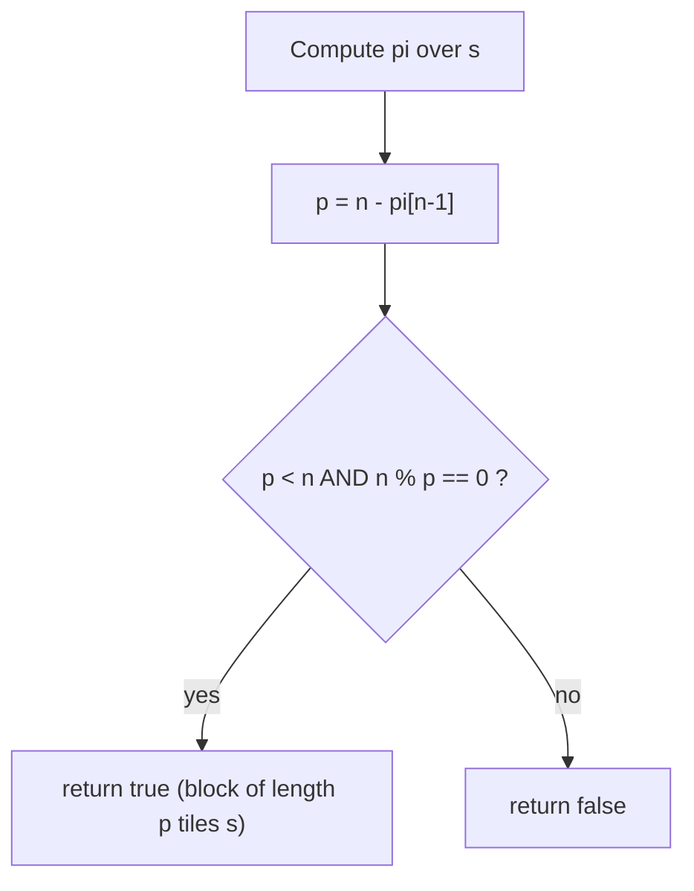

# Repeated Substring Pattern

| Meta | Value |
|------|-------|
| Source | LeetCode #459 |
| Difficulty | Easy (the prefix-function insight is the lesson) |
| Topics | String, Prefix Function (KMP), Periodicity |
| Link | https://leetcode.com/problems/repeated-substring-pattern/ |

---

## Problem Statement
Given a string `s`, return `true` if it can be constructed by taking some substring of it and
appending **multiple copies** of that substring together. In other words, `s` is a whole-number
repetition of one of its proper prefixes.

**Example**
```
s = "abab"     -> true   ("ab" repeated 2 times)
s = "aba"      -> false  (no block tiles it exactly)
s = "abcabcabcabc" -> true ("abc" x4, or "abcabc" x2)
```

---

## Why the Prefix Function Solves It

Recall the **smallest period** of a string is `p = n - pi[n-1]`, where `pi` is the prefix function
and `pi[n-1]` is the length of the longest border (longest proper prefix that is also a suffix).

A string is a whole-number repetition of a block **iff** its smallest period `p` divides `n` *and*
`p < n` (the block must be a *proper* prefix, otherwise `"abc"` would trivially "repeat" once).

The reasoning: if `s` is built from `k ≥ 2` copies of a block `B` of length `p`, then dropping the
last copy leaves a prefix equal to dropping the first copy (a suffix) — i.e. `s` has a border of
length `n - p`, so `pi[n-1] ≥ n - p` and `p` divides `n`. Conversely, if `p = n - pi[n-1]` divides
`n` and `p < n`, the border forces every position to satisfy `s[i] == s[i+p]`, tiling the string.

So the whole problem reduces to: compute `pi[n-1]`, let `p = n - pi[n-1]`, and check
`p < n and n % p == 0`.

---

## Solution — Paired Python + C++

```python
def repeatedSubstringPattern(s: str) -> bool:
    n = len(s)
    pi = [0] * n
    k = 0
    for i in range(1, n):
        while k > 0 and s[i] != s[k]:
            k = pi[k - 1]
        if s[i] == s[k]:
            k += 1
        pi[i] = k
    p = n - pi[n - 1]            # smallest period
    return p < n and n % p == 0
```

```cpp
#include <bits/stdc++.h>
using namespace std;

bool repeatedSubstringPattern(const string& s) {
    int n = (int)s.size();
    vector<int> pi(n, 0);
    int k = 0;
    for (int i = 1; i < n; i++) {
        while (k > 0 && s[i] != s[k])
            k = pi[k - 1];
        if (s[i] == s[k])
            k++;
        pi[i] = k;
    }
    long long p = (long long)n - pi[n - 1];   // smallest period
    return p < n && n % p == 0;
}
```

---

## Trace: `s = "abcabcabc"`

```
index :  0  1  2  3  4  5  6  7  8
char  :  a  b  c  a  b  c  a  b  c
pi    :  0  0  0  1  2  3  4  5  6
```

- `pi[8] = 6` → longest border is `"abcabc"` (length 6).
- `p = n - pi[n-1] = 9 - 6 = 3`.
- `p < n` (3 < 9) and `n % p == 0` (9 % 3 == 0) → **true**, block `"abc"` repeated 3×.

Contrast `s = "aba"`: `pi = [0,0,1]`, `p = 3 - 1 = 2`, but `3 % 2 != 0` → **false**.

---

## Mermaid: Decision Flow



---

## Math & Complexity

Smallest period: $p = n - \pi[n-1]$. The string tiles exactly when

$$ p < n \quad\text{and}\quad n \bmod p = 0. $$

| Aspect | Value |
|--------|-------|
| Time | $O(n)$ (single prefix-function pass) |
| Space | $O(n)$ (the $\pi$ array) |

---

## Takeaway
Repetition is just **periodicity**: a string repeats exactly when its smallest period
`n - pi[n-1]` divides its length and is strictly smaller than it. The prefix function turns a
seemingly combinatorial "can I tile it?" question into one division check.
