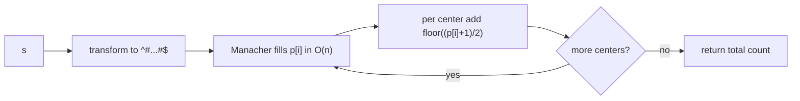

# Palindromic Substrings (Count) via Manacher

| Meta | Value |
|------|-------|
| Source | LeetCode #647 |
| Difficulty | Medium |
| Topics | String, Manacher, Palindrome |
| Link | https://leetcode.com/problems/palindromic-substrings/ |

---

## Problem Statement
Given a string `s`, return the **number of palindromic substrings** in it. Substrings that occur at
different start/end positions are counted separately even if their content is identical.

**Example**
```
Input:  s = "aaa"
Output: 6
Explanation: "a", "a", "a", "aa", "aa", "aaa"
```

---

## WHY Manacher

The naive count expands around each of the $2n-1$ centers, which is $O(n^2)$. Manacher computes the
radius array `p` over the transformed string `^#...#$` in **$O(n)$**, and the count falls straight
out of `p`.

A palindrome centered at transformed index `i` with radius `p[i]` nests smaller palindromes of the
same center, contributing exactly $\lfloor (p[i]+1)/2 \rfloor$ original palindromic substrings. Every
palindromic substring of `s` has a unique center in `t`, so summing over all `i` counts each exactly
once.

$$
\text{answer} = \sum_{i} \left\lfloor \frac{p[i] + 1}{2} \right\rfloor
$$

See [../guide/06-manacher.md](../guide/06-manacher.md) for the derivation.

---

## Code

```python
def count_substrings(s):
    if not s:
        return 0
    t = "^#" + "#".join(s) + "#$"
    n = len(t)
    p = [0] * n
    C = R = 0
    for i in range(1, n - 1):
        if i < R:
            p[i] = min(R - i, p[2 * C - i])
        while t[i + p[i] + 1] == t[i - p[i] - 1]:
            p[i] += 1
        if i + p[i] > R:
            C, R = i, i + p[i]
    return sum((r + 1) // 2 for r in p)
```

```cpp
#include <bits/stdc++.h>
using namespace std;

int count_substrings(const string& s) {
    if (s.empty()) return 0;
    string t = "^#";
    for (char c : s) { t += c; t += '#'; }
    t += '$';
    int n = (int)t.size();
    vector<int> p(n, 0);
    int C = 0, R = 0;
    for (int i = 1; i < n - 1; i++) {
        if (i < R) {
            p[i] = min(R - i, p[2 * C - i]);
        }
        while (t[i + p[i] + 1] == t[i - p[i] - 1]) {
            p[i]++;
        }
        if (i + p[i] > R) {
            C = i;
            R = i + p[i];
        }
    }
    long long total = 0;
    for (int r : p) total += (r + 1) / 2;
    return (int)total;
}
```

---

## Trace — `s = "aaa"`

Transformed `t = "^#a#a#a#$"` (indices `0..8`).

| `i` | `t[i]` | `p[i]` (after expand) | contribution $\lfloor (p+1)/2 \rfloor$ |
|----:|:------:|----------------------:|----------------------------------------:|
| 1 | `#` | 0 | 0 |
| 2 | `a` | 1 | 1 |
| 3 | `#` | 2 | 1 |
| 4 | `a` | 3 | 2 |
| 5 | `#` | 2 | 1 |
| 6 | `a` | 1 | 1 |
| 7 | `#` | 0 | 0 |

Sum $= 0+1+1+2+1+1+0 = 6$. Matches the expected output.

Note how center `i=4` (the middle `a`) has radius `3` = length of `"aaa"`, and contributes
$\lfloor 4/2 \rfloor = 2$ palindromes (`"a"` and `"aaa"` of odd parity centered there).

---

## Mermaid



---

## Math / Complexity

- Time: $O(n)$ — single Manacher pass plus a linear sum.
- Space: $O(n)$ — transformed string and radius array.
- Correctness: every palindromic substring maps to a unique transformed center, and that center
  contributes $\lfloor (p[i]+1)/2 \rfloor$, so the sum is exact and double-counts nothing.

---

## Takeaway

Counting palindromic substrings is a one-line consumer of the Manacher radius array. Compute `p`
once, then read off $\sum \lfloor (p[i]+1)/2 \rfloor$ — no parity special-casing, linear time.
