# Stream of Characters (Aho–Corasick on a Reversed Trie)

| Meta | Value |
|------|-------|
| Source | LeetCode #1032 |
| Difficulty | Hard |
| Topics | String, Trie, Aho–Corasick, Streaming |
| Link | https://leetcode.com/problems/stream-of-characters/ |

---

## Problem Statement
Design a `StreamChecker` initialized with an array of `words`. It exposes one method,
`query(letter)`, called repeatedly with one lowercase letter at a time. `query` returns `true` if
**some word in `words` is a suffix of the stream of characters queried so far**.

**Example**
```text
words = ["cd", "f", "kl"]

query('a') -> false   stream = "a"
query('b') -> false   stream = "ab"
query('c') -> false   stream = "abc"
query('d') -> true    stream = "abcd"   ("cd" is a suffix)
query('e') -> false   stream = "abcde"
query('f') -> true    stream = "abcdef" ("f" is a suffix)
```

---

## Why Aho–Corasick / Reversed Trie?

The naive idea — after each query, check every word against the tail of the stream — costs
$O(\sum |w|)$ **per query**, far too slow for $4 \times 10^4$ queries.

The matching condition is "**a word ends here**", i.e. a word is a *suffix* of the current stream.
That is exactly what an Aho–Corasick automaton reports as we feed it the stream: at every step the
current node (plus its dictionary-link chain) tells us which patterns end at this position. So we
build the automaton over `words` once, keep a single `node` pointer, and each `query` is one $O(1)$
transition plus a check of whether any pattern ends at the new node.

There is a classic alternative: a **reversed trie** of the words, where each query walks the
*recent* stream backwards. We present the Aho–Corasick version because it makes each query truly
$O(1)$ amortized and reuses the guide's machinery directly. We precompute a boolean `ends[node]` =
"does any pattern end on this node's dict-link chain" so a query needs no chain walk at all.

---

## Solution — Paired Python + C++

### Build the automaton

```python
from collections import deque

ALPHA = 26

class StreamChecker:
    def __init__(self, words):
        self.nxt = [[0] * ALPHA]
        self.fail = [0]
        self.term = [False]      # a pattern ends exactly here
        self.ends = [False]      # a pattern ends here OR via dict-link chain
        for w in words:
            self._add(w)
        self._build()
        self.node = 0            # current automaton state

    def _new_node(self):
        self.nxt.append([0] * ALPHA)
        self.fail.append(0)
        self.term.append(False)
        self.ends.append(False)
        return len(self.nxt) - 1

    def _add(self, word):
        cur = 0
        for ch in word:
            c = ord(ch) - 97
            if self.nxt[cur][c] == 0:
                self.nxt[cur][c] = self._new_node()
            cur = self.nxt[cur][c]
        self.term[cur] = True
```

```cpp
#include <bits/stdc++.h>
using namespace std;

const int ALPHA = 26;

class StreamChecker {
    vector<array<int, ALPHA>> nxt;
    vector<int> fail;
    vector<char> term;       // a pattern ends exactly here
    vector<char> ends;       // a pattern ends here OR via dict-link chain
    int node = 0;            // current automaton state

    int new_node() {
        nxt.push_back({});
        fail.push_back(0);
        term.push_back(false);
        ends.push_back(false);
        return (int)nxt.size() - 1;
    }

    void add(const string& word) {
        int cur = 0;
        for (char ch : word) {
            int c = ch - 'a';
            if (nxt[cur][c] == 0)
                nxt[cur][c] = new_node();
            cur = nxt[cur][c];
        }
        term[cur] = true;
    }

public:
    StreamChecker(vector<string>& words) {
        new_node();          // root
        for (auto& w : words) add(w);
        build();
    }
    // ... build() and query() below
};
```

### BFS fail links + roll up `ends`

```python
    def _build(self):
        q = deque()
        for c in range(ALPHA):
            v = self.nxt[0][c]
            if v:
                self.fail[v] = 0
                self.ends[v] = self.term[v]
                q.append(v)
        while q:
            u = q.popleft()
            for c in range(ALPHA):
                v = self.nxt[u][c]
                if v:
                    f = self.nxt[self.fail[u]][c]
                    self.fail[v] = f
                    # ends rolls the dict-link chain into one flag
                    self.ends[v] = self.term[v] or self.ends[f]
                    q.append(v)
                else:
                    self.nxt[u][c] = self.nxt[self.fail[u]][c]
```

```cpp
    void build() {
        queue<int> q;
        for (int c = 0; c < ALPHA; c++) {
            int v = nxt[0][c];
            if (v) {
                fail[v] = 0;
                ends[v] = term[v];
                q.push(v);
            }
        }
        while (!q.empty()) {
            int u = q.front(); q.pop();
            for (int c = 0; c < ALPHA; c++) {
                int v = nxt[u][c];
                if (v) {
                    int f = nxt[fail[u]][c];
                    fail[v] = f;
                    // ends rolls the dict-link chain into one flag
                    ends[v] = term[v] || ends[f];
                    q.push(v);
                } else {
                    nxt[u][c] = nxt[fail[u]][c];
                }
            }
        }
    }
```

### query — one O(1) step

```python
    def query(self, letter):
        self.node = self.nxt[self.node][ord(letter) - 97]
        return self.ends[self.node]
```

```cpp
    bool query(char letter) {
        node = nxt[node][letter - 'a'];
        return ends[node];
    }
```

Because `ends[v]` already absorbed the whole dictionary-link chain during the BFS, each query is a
single transition and a single boolean read — no loop.

---

## Trace

`words = ["cd", "f", "kl"]`. After building, mark `term` on the nodes ending `cd`, `f`, `kl`, and
roll those into `ends`.

| query | char | transition lands on | `ends`? | return |
|-------|------|---------------------|---------|--------|
| `a` | a | root (no `a` edge → self-loop) | false | false |
| `b` | b | root | false | false |
| `c` | c | node `c` | false | false |
| `d` | d | node `cd` (term) | true | **true** |
| `e` | e | root | false | false |
| `f` | f | node `f` (term) | true | **true** |

After `d`, the automaton is at the `cd` node whose `ends` flag is true. After `e` there is no
useful edge, so the precomputed automaton transition sends us back toward the root.

---

## Mermaid

Automaton for `{cd, f, kl}` (trie edges solid, a sample fail link dashed). `&#10003;` marks
pattern-ending nodes.

```mermaid
flowchart LR
    R(("root"))
    C["c"]
    CD["cd &#10003;"]
    F["f &#10003;"]
    K["k"]
    KL["kl &#10003;"]

    R -->|c| C
    C -->|d| CD
    R -->|f| F
    R -->|k| K
    K -->|l| KL

    CD -.fail.-> R
    KL -.fail.-> R
```



---

## Math & Complexity

Let $m = \sum |w_i|$ be the total length of all words, $\Sigma = 26$, and $Q$ the number of
queries.

$$
T_{\text{build}} = O(m\,\Sigma), \qquad T_{\text{query}} = O(1), \qquad T_{\text{total}} = O(m\,\Sigma + Q)
$$

Space is $O(m\,\Sigma)$ for the array-based transition table. The key win over re-scanning is that
the failure structure and the `ends` roll-up turn each query into a constant-time DFA step.

---

## Takeaway

A "does any word end at the current stream position?" query is precisely what an Aho–Corasick
automaton answers. Build the automaton once, keep a single state pointer, and precompute a per-node
`ends` flag (the dictionary-link chain folded into one boolean) so every streaming query is true
$O(1)$.
