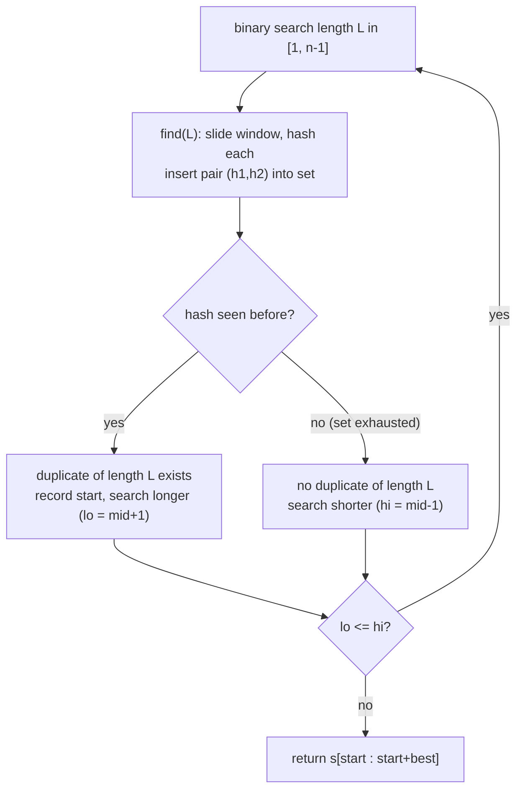

# Longest Duplicate Substring (LeetCode 1044)

| Meta | Value |
|------|-------|
| Source | LeetCode 1044 |
| Difficulty | Hard |
| Topics | Polynomial Hashing, Binary Search on Answer, Rolling Hash |
| Link | https://leetcode.com/problems/longest-duplicate-substring/ |

---

## Problem Statement
Given a string `s`, a **duplicate substring** is a contiguous substring that occurs (possibly
overlapping) at **two or more** different positions. Return **any** longest duplicate substring; if
none exists, return the empty string `""`.

With `|s|` up to `3·10^5`, we cannot enumerate all `O(n^2)` substrings. We binary-search the
**length** of the answer and use hashing to test, in `O(n)`, whether any duplicate of a given
length exists.

**Example**
```text
s = "banana"
Answer = "ana"      // "ana" appears at index 1 and 3 (overlapping)
```

---

## Approach (WHY)

**Monotonicity.** If a duplicate substring of length `L` exists, then a duplicate of every length
`< L` also exists (any prefix of a repeated block is itself repeated). So "does a duplicate of
length `L` exist?" is a monotone predicate in `L` — perfect for **binary search on the answer**.

**Feasibility test in O(n).** For a fixed length `L`, slide a window of length `L` and compute each
window's hash with the prefix-hash O(1) formula. Insert hashes into a set; the first time a hash
repeats, we (optionally) confirm and record a duplicate start. This is `O(n)` per length, so the
whole algorithm is `O(n log n)`.

**Why double hashing.** There are up to `~3·10^5` windows; under the birthday bound a single
`10^9`-range hash would very likely produce a *false* duplicate. Using a **pair** `(h1, h2)` under
two primes makes collisions negligible, so we can trust the set membership without re-checking
characters.

```python
def longestDupSubstring(s: str) -> str:
    n = len(s)
    MOD1, MOD2 = 1_000_000_007, 998_244_353
    B1, B2 = 131, 137
    pre1 = [0]*(n+1); pre2 = [0]*(n+1)
    pw1 = [1]*(n+1);  pw2 = [1]*(n+1)
    for i in range(n):
        c = ord(s[i])
        pre1[i+1] = (pre1[i]*B1 + c) % MOD1
        pre2[i+1] = (pre2[i]*B2 + c) % MOD2
        pw1[i+1] = (pw1[i]*B1) % MOD1
        pw2[i+1] = (pw2[i]*B2) % MOD2

    def find(L):                       # returns start index of a dup of length L, or -1
        seen = set()
        for i in range(0, n - L + 1):
            h1 = (pre1[i+L] - pre1[i]*pw1[L]) % MOD1
            h2 = (pre2[i+L] - pre2[i]*pw2[L]) % MOD2
            key = (h1, h2)
            if key in seen:
                return i
            seen.add(key)
        return -1

    lo, hi, start, best = 1, n - 1, -1, 0
    while lo <= hi:
        mid = (lo + hi) // 2
        pos = find(mid)
        if pos != -1:
            start, best = pos, mid
            lo = mid + 1
        else:
            hi = mid - 1
    return s[start:start+best] if start != -1 else ""
```

```cpp
#include <bits/stdc++.h>
using namespace std;

string longestDupSubstring(string s) {
    int n = (int)s.size();
    const long long MOD1 = 1e9 + 7, MOD2 = 998244353;
    const long long B1 = 131, B2 = 137;
    vector<long long> pre1(n+1, 0), pre2(n+1, 0), pw1(n+1, 1), pw2(n+1, 1);
    for (int i = 0; i < n; i++) {
        long long c = (unsigned char)s[i];
        pre1[i+1] = ((__int128)pre1[i]*B1 + c) % MOD1;
        pre2[i+1] = ((__int128)pre2[i]*B2 + c) % MOD2;
        pw1[i+1]  = (__int128)pw1[i]*B1 % MOD1;
        pw2[i+1]  = (__int128)pw2[i]*B2 % MOD2;
    }
    auto find = [&](int L) -> int {     // start index of a dup of length L, or -1
        unordered_set<unsigned long long> seen;
        seen.reserve(2*n);
        for (int i = 0; i + L <= n; i++) {
            long long h1 = (pre1[i+L] - (__int128)pre1[i]*pw1[L] % MOD1) % MOD1;
            long long h2 = (pre2[i+L] - (__int128)pre2[i]*pw2[L] % MOD2) % MOD2;
            if (h1 < 0) h1 += MOD1;
            if (h2 < 0) h2 += MOD2;
            unsigned long long key = (unsigned long long)h1 * MOD2 + h2;
            if (seen.count(key)) return i;
            seen.insert(key);
        }
        return -1;
    };
    int lo = 1, hi = n - 1, start = -1, best = 0;
    while (lo <= hi) {
        int mid = (lo + hi) / 2;
        int pos = find(mid);
        if (pos != -1) { start = pos; best = mid; lo = mid + 1; }
        else hi = mid - 1;
    }
    return start != -1 ? s.substr(start, best) : "";
}
```

---

## Trace (`s = "banana"`)

| `mid` (length) | windows of that length | duplicate found? | action |
|----------------|------------------------|------------------|--------|
| 3 | ban, ana, nan, ana | yes — "ana" repeats → start=3 | record best=3, `lo=4` |
| 4 | bana, anan, nana | no | `hi=3` |
| `lo>hi` | — | — | stop, answer = `s[3:6]` = "ana" |

Binary search converges with `best = 3`, returning `"ana"`.

---

## Mermaid



---

## Math / Complexity

Binary search over the length runs $O(\log n)$ iterations; each feasibility test slides $O(n)$
windows with $O(1)$ hashing, so total time is

$$
O(n \log n)
$$

Space is $O(n)$ for prefix/power tables plus the hash set. Double hashing keeps the collision
probability around

$$
\frac{n^2}{2\,M_1 M_2} \approx \frac{(3\cdot10^5)^2}{2\cdot 10^{18}} \approx 4.5\cdot 10^{-8},
$$

so false duplicates are effectively impossible.

---

## Takeaway
When an answer has a **monotone length predicate** ("a duplicate/match of length `L` exists ⇒ one of
length `L-1` exists"), binary-search the length and verify each length in $O(n)$ with rolling /
prefix hashing. Use a **double hash** so the set-membership test is trustworthy without character
re-verification.
