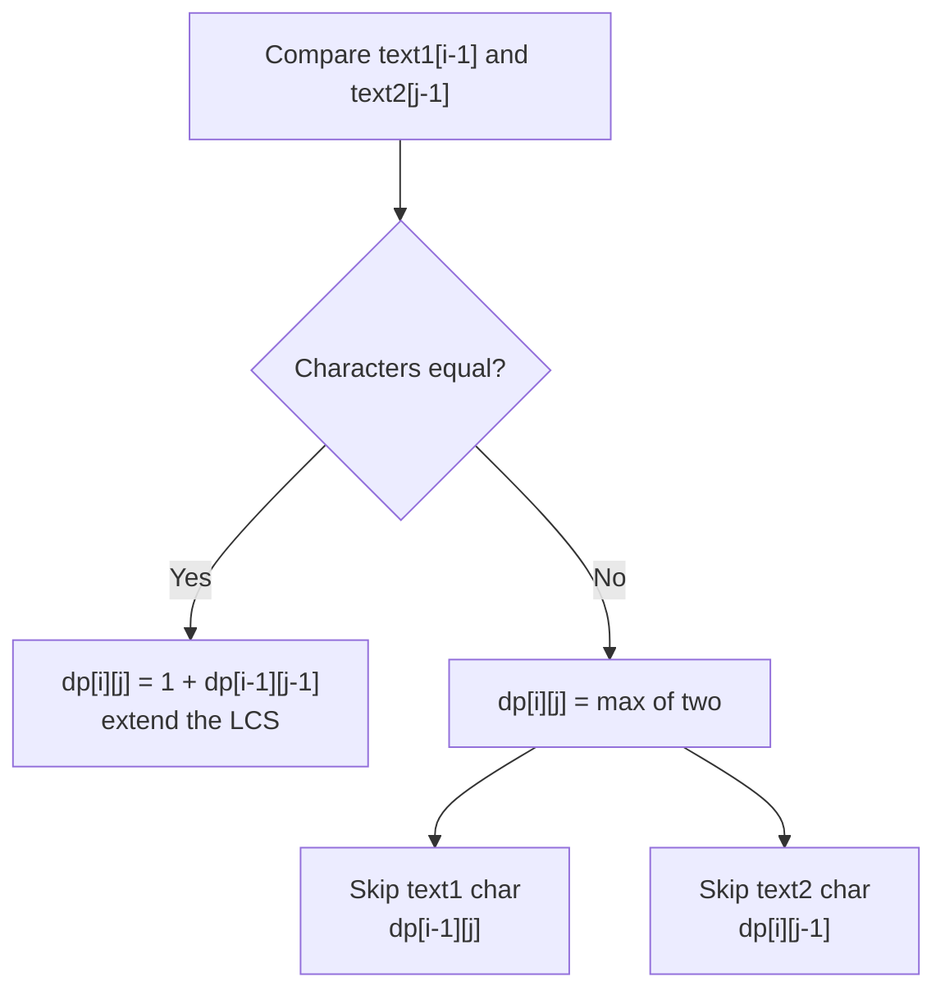

# Longest Common Subsequence

| Field | Value |
|-------|-------|
| **Source** | LeetCode #1143 |
| **Difficulty** | Medium |
| **Topics** | String, Dynamic Programming |
| **Link** | https://leetcode.com/problems/longest-common-subsequence/ |

## Problem Statement

Given two strings `text1` and `text2`, return the **length of their longest
common subsequence** (LCS). If there is no common subsequence, return `0`.

A **subsequence** is a sequence derived from the original by deleting some (or
no) characters **without changing the relative order** of the remaining
characters. A **common** subsequence is a subsequence of both strings.

### Worked Example

```
text1 = "abcde"
text2 = "ace"

Answer = 3

The longest common subsequence is "ace":
  a b c d e
  ^   ^   ^
  a   c   e   -> length 3

Note "ace" is NOT contiguous in text1; subsequences allow gaps.
```

## Approach Progression

We move from naive recursion to an `O(n)`-space iterative DP. Each step is
justified by the weakness of the previous one.

### Defining the subproblem

Let `dp[i][j]` be the LCS length of the **prefixes** `text1[0..i-1]` (first `i`
characters) and `text2[0..j-1]` (first `j` characters).

Compare the **last** characters of the two prefixes:

- If `text1[i-1] == text2[j-1]`, that shared character extends the LCS:
  `1 + dp[i-1][j-1]`.
- Otherwise the last characters cannot both be in the LCS, so we drop one of
  them and take the better option: `max(dp[i-1][j], dp[i][j-1])`.

The recurrence:

$$
dp[i][j] =
\begin{cases}
0 & \text{if } i = 0 \text{ or } j = 0 \\[4pt]
1 + dp[i-1][j-1] & \text{if } text1[i-1] = text2[j-1] \\[4pt]
\max\bigl(dp[i-1][j],\; dp[i][j-1]\bigr) & \text{otherwise}
\end{cases}
$$

Base case: if either prefix is empty, the LCS length is $0$.

---

### 1. Plain Recursion (why it is too slow)

A direct translation. Correct, but it explores an exponential number of
overlapping subproblems — roughly $O(2^{m+n})$ in the worst case.

```python
def longestCommonSubsequence(text1: str, text2: str) -> int:
    # LCS length of prefixes text1[:i] and text2[:j].
    def solve(i: int, j: int) -> int:
        # Empty prefix: nothing in common.
        if i == 0 or j == 0:
            return 0
        # Last characters match: take them and shrink both prefixes.
        if text1[i - 1] == text2[j - 1]:
            return 1 + solve(i - 1, j - 1)
        # Otherwise drop one character and keep the better choice.
        return max(solve(i - 1, j), solve(i, j - 1))

    return solve(len(text1), len(text2))
```

```cpp
class Solution {
public:
    int longestCommonSubsequence(string text1, string text2) {
        return solve(text1, text2, text1.size(), text2.size());
    }

private:
    // LCS length of prefixes text1[:i] and text2[:j].
    int solve(const string& a, const string& b, int i, int j) {
        // Empty prefix: nothing in common.
        if (i == 0 || j == 0) return 0;
        // Last characters match: take them and shrink both prefixes.
        if (a[i - 1] == b[j - 1])
            return 1 + solve(a, b, i - 1, j - 1);
        // Otherwise drop one character and keep the better choice.
        return max(solve(a, b, i - 1, j), solve(a, b, i, j - 1));
    }
};
```

---

### 2. Top-Down Memoization (why it fixes the blow-up)

Only `(m+1) * (n+1)` distinct states exist. Caching each one the first time it is
computed turns the exponential recursion into `O(m * n)`.

```python
from functools import lru_cache

def longestCommonSubsequence(text1: str, text2: str) -> int:
    @lru_cache(maxsize=None)              # cache every (i, j) state once
    def solve(i: int, j: int) -> int:
        if i == 0 or j == 0:
            return 0                       # empty prefix
        if text1[i - 1] == text2[j - 1]:
            return 1 + solve(i - 1, j - 1) # shared last character
        return max(solve(i - 1, j), solve(i, j - 1))

    return solve(len(text1), len(text2))
```

```cpp
class Solution {
public:
    int longestCommonSubsequence(string text1, string text2) {
        int m = text1.size(), n = text2.size();
        // memo[i][j] == -1 means "not computed yet".
        vector<vector<int>> memo(m + 1, vector<int>(n + 1, -1));
        return solve(text1, text2, m, n, memo);
    }

private:
    int solve(const string& a, const string& b, int i, int j,
              vector<vector<int>>& memo) {
        if (i == 0 || j == 0) return 0;            // empty prefix
        if (memo[i][j] != -1) return memo[i][j];

        int result;
        if (a[i - 1] == b[j - 1]) {
            result = 1 + solve(a, b, i - 1, j - 1, memo); // shared char
        } else {
            result = max(solve(a, b, i - 1, j, memo),
                         solve(a, b, i, j - 1, memo));
        }
        return memo[i][j] = result;
    }
};
```

---

### 3. Bottom-Up DP (why iteration beats recursion here)

Recursion still has call overhead and can overflow the stack on long inputs.
Because each state depends only on smaller `(i, j)`, we can fill a 2-D table in
increasing order without recursion.

```python
def longestCommonSubsequence(text1: str, text2: str) -> int:
    m, n = len(text1), len(text2)
    # dp[i][j] = LCS length of text1[:i] and text2[:j]. Row/col 0 stay 0.
    dp = [[0] * (n + 1) for _ in range(m + 1)]

    for i in range(1, m + 1):
        for j in range(1, n + 1):
            if text1[i - 1] == text2[j - 1]:
                dp[i][j] = 1 + dp[i - 1][j - 1]       # extend the LCS
            else:
                dp[i][j] = max(dp[i - 1][j], dp[i][j - 1])
    return dp[m][n]
```

```cpp
class Solution {
public:
    int longestCommonSubsequence(string text1, string text2) {
        int m = text1.size(), n = text2.size();
        // dp[i][j] = LCS length of text1[:i] and text2[:j]. Row/col 0 stay 0.
        vector<vector<int>> dp(m + 1, vector<int>(n + 1, 0));

        for (int i = 1; i <= m; ++i) {
            for (int j = 1; j <= n; ++j) {
                if (text1[i - 1] == text2[j - 1]) {
                    dp[i][j] = 1 + dp[i - 1][j - 1];  // extend the LCS
                } else {
                    dp[i][j] = max(dp[i - 1][j], dp[i][j - 1]);
                }
            }
        }
        return dp[m][n];
    }
};
```

---

### 4. Space-Optimized Rolling Array (why we only need two rows)

Row `i` reads only from row `i-1` and the cell to its left in the current row.
Two rows of length `n+1` therefore suffice, reducing memory from
$O(m \cdot n)$ to $O(n)$.

```python
def longestCommonSubsequence(text1: str, text2: str) -> int:
    m, n = len(text1), len(text2)
    # prev = dp row for i-1, curr = dp row for i.
    prev = [0] * (n + 1)
    curr = [0] * (n + 1)

    for i in range(1, m + 1):
        for j in range(1, n + 1):
            if text1[i - 1] == text2[j - 1]:
                curr[j] = 1 + prev[j - 1]             # extend the LCS
            else:
                curr[j] = max(prev[j], curr[j - 1])
        prev, curr = curr, prev            # roll the rows
        # curr will be overwritten next iteration; its stale values are
        # always replaced before being read, so no reset is needed.
    return prev[n]
```

```cpp
class Solution {
public:
    int longestCommonSubsequence(string text1, string text2) {
        int m = text1.size(), n = text2.size();
        // prev = dp row for i-1, curr = dp row for i.
        vector<int> prev(n + 1, 0), curr(n + 1, 0);

        for (int i = 1; i <= m; ++i) {
            for (int j = 1; j <= n; ++j) {
                if (text1[i - 1] == text2[j - 1]) {
                    curr[j] = 1 + prev[j - 1];        // extend the LCS
                } else {
                    curr[j] = max(prev[j], curr[j - 1]);
                }
            }
            swap(prev, curr);                         // roll the rows
        }
        return prev[n];
    }
};
```

## DP Table Trace

Filling `dp[i][j]` for `text1 = "abcde"` (rows) and `text2 = "ace"` (columns).
Row/column `0` are the empty-prefix base cases (all zero). The bottom-right cell
is the answer, **3**.

|       | "" | a | c | e |
|-------|----|---|---|---|
| **""**| 0  | 0 | 0 | 0 |
| **a** | 0  | 1 | 1 | 1 |
| **b** | 0  | 1 | 1 | 1 |
| **c** | 0  | 1 | 2 | 2 |
| **d** | 0  | 1 | 2 | 2 |
| **e** | 0  | 1 | 2 | 3 |

The diagonal jumps happen exactly where characters match (`a`, `c`, `e`),
building the subsequence `"ace"` of length `dp[5][3] = 3`.

## Decision Diagram



## Complexity

| Approach | Time | Space |
|----------|------|-------|
| Plain recursion | $O(2^{m+n})$ | $O(m + n)$ recursion stack |
| Top-down memoization | $O(m \cdot n)$ | $O(m \cdot n)$ |
| Bottom-up DP | $O(m \cdot n)$ | $O(m \cdot n)$ |
| Space-optimized rolling array | $O(m \cdot n)$ | $O(n)$ |

Here $m = $ `len(text1)` and $n = $ `len(text2)`.

## Takeaway

- Model the state as LCS length over **prefixes** and decide based on the
  **last characters**: a match extends the LCS along the diagonal; a mismatch
  drops one character and keeps the better of two neighbors.
- The recurrence is $dp[i][j] = 1 + dp[i-1][j-1]$ on a match, otherwise
  $\max(dp[i-1][j], dp[i][j-1])$ — the template behind diff tools, DNA
  alignment, and many CP problems.
- LCS and Edit Distance are siblings: both are prefix-vs-prefix grid DPs that
  reduce to a handful of neighbor cells.
- Since each row depends only on the previous row, a **rolling two-row array**
  cuts space to $O(n)$ while keeping $O(m \cdot n)$ time.
