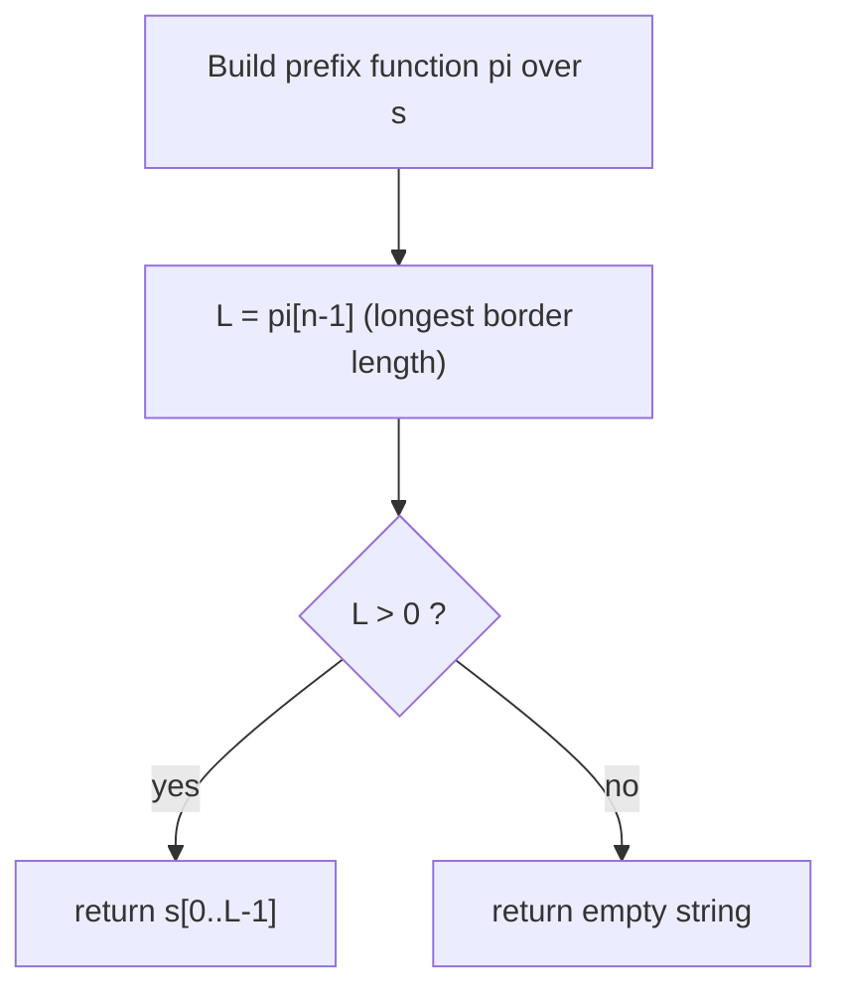

# Longest Happy Prefix

| Meta | Value |
|------|-------|
| Source | LeetCode #1392 |
| Difficulty | Hard (mechanically easy with the prefix function) |
| Topics | String, Prefix Function (KMP), Borders |
| Link | https://leetcode.com/problems/longest-happy-prefix/ |

---

## Problem Statement
A **happy prefix** is a non-empty prefix of a string that is also a **suffix** (excluding the whole
string itself). Given a string `s`, return the **longest** happy prefix; return `""` if none exists.

**Example**
```
s = "level"   -> "l"     ("l" is both a prefix and a suffix)
s = "ababab"  -> "abab"  (longest proper prefix that is also a suffix)
s = "abcd"    -> ""      (no proper prefix equals a suffix)
```

---

## Why the Prefix Function Solves It

A "happy prefix" is exactly a **border**: a proper prefix that is also a proper suffix. By
definition, `pi[n-1]` — the last value of the prefix function — is the length of the **longest
border** of the entire string.

So the longest happy prefix is simply `s[0 : pi[n-1]]`. No extra work needed: build `pi`, read its
final entry, slice. The amortized $O(n)$ construction of `pi` gives the whole answer in linear time.

---

## Solution — Paired Python + C++

```python
def longestPrefix(s: str) -> str:
    n = len(s)
    pi = [0] * n
    k = 0
    for i in range(1, n):
        while k > 0 and s[i] != s[k]:
            k = pi[k - 1]
        if s[i] == s[k]:
            k += 1
        pi[i] = k
    return s[:pi[n - 1]]            # longest border = longest happy prefix
```

```cpp
#include <bits/stdc++.h>
using namespace std;

string longestPrefix(const string& s) {
    int n = (int)s.size();
    vector<int> pi(n, 0);
    int k = 0;
    for (int i = 1; i < n; i++) {
        while (k > 0 && s[i] != s[k])
            k = pi[k - 1];
        if (s[i] == s[k])
            k++;
        pi[i] = k;
    }
    return s.substr(0, pi[n - 1]);  // longest border = longest happy prefix
}
```

---

## Trace: `s = "ababab"`

```
index :  0  1  2  3  4  5
char  :  a  b  a  b  a  b
pi    :  0  0  1  2  3  4
```

- Building left to right, each new pair `"ab"` extends the matched border by 2.
- `pi[5] = 4` → the longest border has length 4.
- Answer: `s[0:4] = "abab"`. Indeed `"abab"` is both a prefix and a suffix of `"ababab"`.

Contrast `s = "abcd"`: `pi = [0,0,0,0]`, `pi[n-1] = 0`, so the answer is `""`.

---

## Mermaid: From String to Happy Prefix



---

## Math & Complexity

The longest happy prefix length is the longest border length:

$$ \text{answer} = s[0 \,..\, \pi[n-1]-1], \qquad \text{length} = \pi[n-1]. $$

| Aspect | Value |
|--------|-------|
| Time | $O(n)$ (one prefix-function pass) |
| Space | $O(n)$ (the $\pi$ array; output aside) |

---

## Takeaway
"Longest prefix that is also a suffix" is the literal definition of `pi[n-1]`. Once you recognize a
*happy prefix* as a *border*, the answer is a one-line read of the prefix function's last cell.
