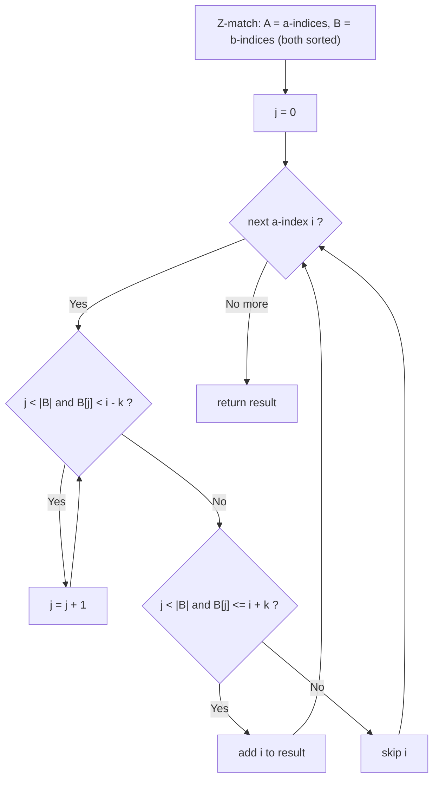

# LeetCode 3008 — Find Beautiful Indices in the Given Array II

| Meta | Value |
|------|-------|
| Source | LeetCode 3008 (Hard) |
| Difficulty | Hard |
| Topics | Strings, Z-Function / KMP, Two Pointers, Binary Search |
| Time | $O(n + |a| + |b|)$ |
| Space | $O(n + |a| + |b|)$ |
| Link | https://leetcode.com/problems/find-beautiful-indices-in-the-given-array-ii/ |

---

## Problem Statement
You are given a string `s`, two pattern strings `a` and `b`, and an integer `k`. An index `i` is
**beautiful** if:

1. `0 <= i <= |s| - |a|` and `s[i .. i + |a| - 1] == a` (an occurrence of `a` starts at `i`), and
2. there **exists** an index `j` with `s[j .. j + |b| - 1] == b` (an occurrence of `b` starts at
   `j`) such that `|i - j| <= k`.

Return all beautiful indices in **sorted** (increasing) order.

Constraints make this the "II" (hard) version: `|s|`, `|a|`, `|b|` up to `10^5`, so an
$O(|s|\cdot|a|)$ scan is too slow — we need linear pattern matching plus an efficient proximity
test.

**Example**
```
s = "isawsquirrelnearmysquirrelhouseohmy"
a = "my"
b = "squirrel"
k = 15

Occurrences of a ("my"): indices 16, 33
Occurrences of b ("squirrel"): indices 4, 18

i = 16: nearest b index is 18, |16 - 18| = 2 <= 15  -> beautiful
i = 33: nearest b index is 18, |33 - 18| = 15 <= 15 -> beautiful
Answer: [16, 33]
```

---

## Why the Z-Function (+ Two Pointers)?

Two sub-problems:

- **Find all occurrences** of `a` in `s`, and all occurrences of `b` in `s`. This is exactly the
  Z-function pattern-matching trick: compute `z` over `a + '#' + s` and over `b + '#' + s`, and
  collect indices where `z[i] >= |a|` (resp. `>= |b|`). KMP works equally well; Z is shown here.

- **Proximity test.** For each `a`-index `i`, decide whether *some* `b`-index `j` lies within
  distance `k`. Because both occurrence lists are produced in **increasing order**, we never need
  a full search: a **two-pointer** sweep (or a binary search) finds, for each `i`, the closest
  `j` in $O(1)$ amortized.

Combining linear matching with a linear merge yields overall linear time, which is what the
$10^5$ constraints demand.

---

## Solution (Paired Python + C++)

```python
def z_function(s):
    n = len(s)
    z = [0] * n
    l, r = 0, 0
    for i in range(1, n):
        if i < r:
            z[i] = min(r - i, z[i - l])
        while i + z[i] < n and s[z[i]] == s[i + z[i]]:
            z[i] += 1
        if i + z[i] > r:
            l, r = i, i + z[i]
    return z

def find_occurrences(text, pat):
    if not pat or len(pat) > len(text):
        return []
    s = pat + '#' + text
    z = z_function(s)
    m = len(pat)
    return [i - (m + 1) for i in range(m + 1, len(s)) if z[i] >= m]

def beautiful_indices(s, a, b, k):
    A = find_occurrences(s, a)        # sorted indices where a occurs
    B = find_occurrences(s, b)        # sorted indices where b occurs
    res = []
    j = 0
    for i in A:
        # advance j while B[j] is too far to the left of i
        while j < len(B) and B[j] < i - k:
            j += 1
        # now B[j] (if any) is the first b-index >= i - k;
        # it is beautiful iff it is also <= i + k
        if j < len(B) and B[j] <= i + k:
            res.append(i)
    return res
```

```cpp
#include <bits/stdc++.h>
using namespace std;

vector<int> z_function(const string& s) {
    int n = (int)s.size();
    vector<int> z(n, 0);
    int l = 0, r = 0;
    for (int i = 1; i < n; ++i) {
        if (i < r)
            z[i] = min(r - i, z[i - l]);
        while (i + z[i] < n && s[z[i]] == s[i + z[i]])
            ++z[i];
        if (i + z[i] > r) {
            l = i;
            r = i + z[i];
        }
    }
    return z;
}

vector<int> find_occurrences(const string& text, const string& pat) {
    vector<int> res;
    if (pat.empty() || pat.size() > text.size())
        return res;
    string s = pat + '#' + text;
    vector<int> z = z_function(s);
    int m = (int)pat.size();
    for (int i = m + 1; i < (int)s.size(); ++i)
        if (z[i] >= m)
            res.push_back(i - (m + 1));
    return res;
}

vector<int> beautiful_indices(const string& s, const string& a,
                              const string& b, int k) {
    vector<int> A = find_occurrences(s, a);   // sorted a-occurrences
    vector<int> B = find_occurrences(s, b);   // sorted b-occurrences
    vector<int> res;
    int j = 0;
    for (int i : A) {
        // advance j while B[j] is too far to the left of i
        while (j < (int)B.size() && (long long)B[j] < (long long)i - k)
            ++j;
        // B[j] is the first b-index >= i - k; beautiful iff also <= i + k
        if (j < (int)B.size() && (long long)B[j] <= (long long)i + k)
            res.push_back(i);
    }
    return res;
}
```

> The two-pointer `j` is **monotone**: because the `a`-indices `i` increase, the lower bound
> `i - k` only increases, so `j` never moves backward. That keeps the merge linear. (A
> `lower_bound` binary search per `i` is an equally valid $O(|A|\log|B|)$ alternative.)

---

## Trace — Example above

`s = "isawsquirrelnearmysquirrelhouseohmy"`, `a = "my"`, `b = "squirrel"`, `k = 15`.

Matching results (both in increasing order):

```
A (occurrences of "my"):       [16, 33]
B (occurrences of "squirrel"): [4, 18]
```

Two-pointer sweep with `j = 0`:

- `i = 16`: window `[i-k, i+k] = [1, 31]`. Advance `j` while `B[j] < 1`: `B[0]=4` not `< 1`, stop.
  `B[0]=4 <= 31` ✓ → `16` is beautiful.
- `i = 33`: window `[18, 48]`. Advance `j` while `B[j] < 18`: `B[0]=4 < 18` → `j=1`; `B[1]=18` not
  `< 18`, stop. `B[1]=18 <= 48` ✓ → `33` is beautiful.

Result: `[16, 33]` ✓.

---

## Mermaid: Two-Pointer Merge



---

## Math & Complexity

Let `n = |s|`. Building `a + '#' + s` and `b + '#' + s` gives Z-arrays of size
`O(|a| + n)` and `O(|b| + n)`.

$$
T = O\big(n + |a| + |b|\big), \qquad S = O\big(n + |a| + |b|\big)
$$

- Z-function matching: linear in each concatenation.
- Two-pointer merge: each of `A` and `B` is traversed once, so $O(|A| + |B|) \le O(n)$.

Note on overflow: index distances can be compared safely with `int` here (indices `< 10^5`), but
the C++ comparisons use `long long` for `i - k` / `i + k` to stay safe against any signed
arithmetic edge cases — exactly the discipline needed when `k` can be large.

---

## Takeaway
Decompose the problem: **(1)** linear pattern matching with the Z-function (`pat + '#' + s`,
threshold `z >= |pat|`) produces sorted occurrence lists for `a` and `b`; **(2)** a **monotone
two-pointer** sweep checks, for each `a`-index, whether a `b`-index lies within `k`. Both halves
are linear, giving an $O(n + |a| + |b|)$ solution that scales to the hard constraints.
