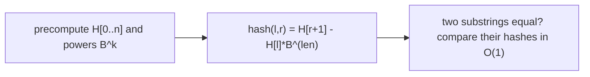

# Longest Common Prefix of Suffixes via Hashing (Codeforces-style)

| Meta | Value |
|------|-------|
| Source | Codeforces — classic string hashing pattern (e.g. CF EDU String Hashing) |
| Difficulty | Medium–Hard |
| Topics | Polynomial Hashing, Binary Search, Substring Comparison |
| Link | https://codeforces.com/edu/course/2/lesson/9 |

---

## Problem Statement (Representative)
Given a string `s`, answer many queries: for two indices `i` and `j`, find the length of the
**longest common prefix (LCP)** of the suffixes starting at `i` and `j`. Equivalently, compare
arbitrary substrings of `s` for equality in **O(1)**.

This "compare any two substrings fast" capability is a workhorse in competitive programming
(palindrome queries, suffix comparison for suffix arrays, distinct substrings, etc.).

---

## Core Tool — Prefix Hashes for O(1) Substring Hash

Precompute prefix hashes so the hash of **any** substring `s[l..r]` is available in O(1).

Define base `B`, modulus `M`, and:

$$
H[k] = \big(s_0 B^{k-1} + s_1 B^{k-2} + \dots + s_{k-1}\big) \bmod M
$$

Then the hash of substring `s[l..r]` (0-indexed, inclusive) is:

$$
\text{hash}(l, r) = \big(H[r+1] - H[l] \cdot B^{\,r-l+1}\big) \bmod M
$$

This mirrors how `prefix_sum(l, r) = P[r+1] − P[l]`, but in a *multiplicative* (positional)
number system, so we scale `H[l]` by `B^(length)` to align place values.



```python
class StringHash:
    def __init__(self, s, B=131, M=(1 << 61) - 1):
        n = len(s)
        self.B, self.M = B, M
        self.H = [0] * (n + 1)
        self.pw = [1] * (n + 1)
        for i in range(n):
            self.H[i + 1] = (self.H[i] * B + ord(s[i])) % M
            self.pw[i + 1] = (self.pw[i] * B) % M

    def sub(self, l, r):                # hash of s[l..r] inclusive
        return (self.H[r + 1] - self.H[l] * self.pw[r - l + 1]) % self.M
```

```cpp
struct StringHash {
    long long B, M;
    vector<long long> H, pw;
    StringHash(const string& s, long long B = 131, long long M = (1LL << 61) - 1)
        : B(B), M(M) {
        int n = s.size();
        H.assign(n + 1, 0);
        pw.assign(n + 1, 1);
        for (int i = 0; i < n; i++) {
            H[i + 1] = ((__int128)H[i] * B + (unsigned char)s[i]) % M;
            pw[i + 1] = (__int128)pw[i] * B % M;
        }
    }

    long long sub(int l, int r) const {                // hash of s[l..r] inclusive
        long long res = (H[r + 1] - (__int128)H[l] * pw[r - l + 1] % M) % M;
        return res < 0 ? res + M : res;
    }
};
```

---

## Answering LCP Queries — Binary Search on Length

The LCP of two suffixes is **monotonic**: if the first `k` characters match, the first `k−1` also
match. That monotonicity lets us **binary search** the LCP length, using O(1) hash comparisons to
test each candidate length.

```python
def lcp(sh, i, j, n):
    lo, hi = 0, n - max(i, j)          # can't exceed remaining length
    while lo < hi:
        mid = (lo + hi + 1) // 2       # upper-mid to avoid infinite loop
        if sh.sub(i, i + mid - 1) == sh.sub(j, j + mid - 1):
            lo = mid                   # first `mid` chars match -> try longer
        else:
            hi = mid - 1               # too long -> shorten
    return lo
```

```cpp
int lcp(const StringHash& sh, int i, int j, int n) {
    int lo = 0, hi = n - max(i, j);          // can't exceed remaining length
    while (lo < hi) {
        int mid = (lo + hi + 1) / 2;         // upper-mid to avoid infinite loop
        if (sh.sub(i, i + mid - 1) == sh.sub(j, j + mid - 1))
            lo = mid;                        // first `mid` chars match -> try longer
        else
            hi = mid - 1;                    // too long -> shorten
    }
    return lo;
}
```

Each query is `O(log n)` (binary search) × `O(1)` (hash compare) = **O(log n)**.

---

## Trace — `s = "ababab"`, LCP of suffixes at `i=0` ("ababab") and `j=2` ("abab")

`n = 6`, max start = 2, so `hi = 6 − 2 = 4`.

| lo | hi | mid | sub(0, mid-1) vs sub(2, 2+mid-1) | equal? | action |
|----|----|-----|----------------------------------|--------|--------|
| 0 | 4 | 2 | "ab" vs "ab" | yes | lo = 2 |
| 2 | 4 | 3 | "aba" vs "aba" | yes | lo = 3 |
| 3 | 4 | 4 | "abab" vs "abab" | yes | lo = 4 |
| 4 | 4 | — | stop | | return **4** |

LCP = 4 ("abab"), correct: suffix `"ababab"` and `"abab"` share the first 4 chars.

---

## Why Double Hashing in Contests

A single 64-bit modulus is usually safe, but adversarial judges craft **anti-hash** inputs that
force collisions. Defense: compute **two** independent hashes (different `B`/`M`) and treat
substrings as equal only if **both** match. The collision probability becomes negligibly small:

$$
P(\text{collision}) \approx \frac{1}{M_1 \cdot M_2}
$$

---

## Complexity

| Operation | Time | Space |
|-----------|------|-------|
| Precompute hashes | O(n) | O(n) |
| Substring hash | O(1) | — |
| LCP / substring compare query | O(log n) (or O(1) for equality) | — |

---

## Applications of O(1) Substring Hashing
- **Suffix array construction** (compare suffixes during sort).
- **Number of distinct substrings.**
- **Longest palindromic substring** (hash forward & reversed).
- **Pattern matching** (Rabin–Karp special case).
- **Longest common substring of two strings** (binary search the length).

## Takeaway
**Prefix polynomial hashing** turns "compare any two substrings" into an O(1) operation — the
multiplicative analogue of prefix sums. Combined with binary search and monotonicity, it answers
LCP and substring-equality queries blazingly fast. Always double-hash against adversarial inputs.
