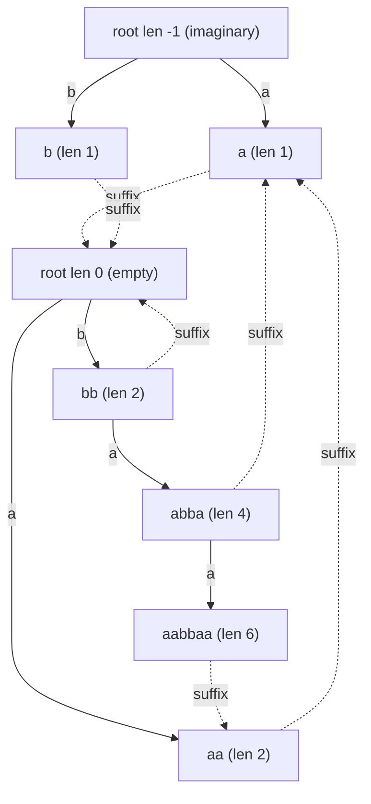

# Count Distinct Palindromic Substrings (Eertree)

| Meta | Value |
|------|-------|
| Source | Classic string problem (self-contained) |
| Difficulty | Medium–Hard |
| Topics | Palindromic Tree (Eertree), Palindromes, Suffix Links |
| Link | — (canonical exercise; cf. SPOJ NUMOFPAL, eertree applications) |

---

## Problem Statement
Given a lowercase string `s`, count the number of **distinct** non-empty palindromic substrings of
`s`. A palindromic substring reads the same forwards and backwards; two equal palindromes occurring at
different positions are counted **once**.

We solve it with the **palindromic tree (eertree)**, where *every distinct palindrome is exactly one
node*. The answer is then simply the number of non-root nodes — read off in `O(1)` after a linear
build.

**Example**
```text
s = "aabbaab"
Distinct palindromes: "a", "b", "aa", "bb", "aba"?  -> check substrings:
  a, b, aa, bb, abba, aabbaa  -> distinct set = {a, b, aa, bb, abba, aabbaa}
Answer = 6
```

---

## Approach (WHY)

**Why a node = a distinct palindrome.** The deep theorem behind the eertree is that a string of length
`n` has **at most `n` distinct palindromic substrings**: appending one character to a prefix can create
**at most one new** distinct palindrome — its longest palindromic suffix. The eertree creates a node
exactly when (and only when) that new palindrome first appears, so there is a perfect bijection between
non-root nodes and distinct palindromes.

**Why two roots.** We seed an **imaginary root** of length `-1` and an **empty root** of length `0`.
The `-1` length makes the wrap formula `new_len = parent_len + 2` valid even for length-1 palindromes,
and guarantees every character can start a fresh palindrome.

**Why it's linear.** Each `add` creates at most one node and the suffix-link walks are amortized
`O(1)`, so the whole build is `O(n)` over a fixed alphabet. After building, the answer is `num - 2`
(subtracting the two roots) — no enumeration, no hashing, no `O(n^2)`.

```python
def count_distinct_palindromic_substrings(s):
    n = len(s)
    SZ = n + 5
    length = [0] * SZ
    suff   = [0] * SZ
    to     = [dict() for _ in range(SZ)]

    length[0] = -1; suff[0] = 0      # imaginary root
    length[1] = 0;  suff[1] = 0      # empty root
    num = 2
    last = 1

    def get_link(x, i):
        while True:
            l = length[x]
            if i - l - 1 >= 0 and s[i - l - 1] == s[i]:
                return x
            x = suff[x]

    for i in range(n):
        ch = s[i]
        x = get_link(last, i)
        if ch in to[x]:
            last = to[x][ch]
            continue
        cur = num; num += 1
        length[cur] = length[x] + 2
        if length[cur] == 1:
            suff[cur] = 1
        else:
            y = get_link(suff[x], i)
            suff[cur] = to[y].get(ch, 1)
        to[x][ch] = cur
        last = cur

    return num - 2                   # exclude the two roots


if __name__ == "__main__":
    print(count_distinct_palindromic_substrings("aabbaab"))  # 6
```

```cpp
#include <bits/stdc++.h>
using namespace std;

long long countDistinctPalindromicSubstrings(const string &s) {
    int n = (int)s.size();
    const int K = 26;
    vector<array<int, K>> to(n + 2);
    for (auto &row : to) row.fill(0);
    vector<int> len(n + 2, 0), suff(n + 2, 0);

    len[0] = -1; suff[0] = 0;        // imaginary root
    len[1] = 0;  suff[1] = 0;        // empty root
    int num = 2, last = 1;

    auto getLink = [&](int x, int i) {
        while (true) {
            int l = len[x];
            if (i - l - 1 >= 0 && s[i - l - 1] == s[i]) return x;
            x = suff[x];
        }
    };

    for (int i = 0; i < n; i++) {
        int c = s[i] - 'a';
        int x = getLink(last, i);
        if (to[x][c] != 0) {
            last = to[x][c];
            continue;
        }
        int cur = num++;
        len[cur] = len[x] + 2;
        if (len[cur] == 1) {
            suff[cur] = 1;
        } else {
            int y = getLink(suff[x], i);
            suff[cur] = (to[y][c] != 0) ? to[y][c] : 1;
        }
        to[x][c] = cur;
        last = cur;
    }

    return (long long)num - 2;       // exclude the two roots
}

int main() {
    cout << countDistinctPalindromicSubstrings("aabbaab") << "\n"; // 6
    return 0;
}
```

---

## Trace — `s = "aabbaab"`

| `i` | `s[i]` | `last` before | extendable node `x` | action | new node (`len`) | `num` |
|-----|--------|---------------|---------------------|--------|------------------|-------|
| 0 | a | 1 | 0 (imaginary) | create `a` | 2 (1) | 3 |
| 1 | a | 2 | 1 (empty, `s[0]==a`) | create `aa` | 3 (2) | 4 |
| 2 | b | 3 | 0 (imaginary) | create `b` | 4 (1) | 5 |
| 3 | b | 4 | 1 (empty) | create `bb` | 5 (2) | 6 |
| 4 | a | 5 | node `bb` (`s[1]==a`) | create `abba` | 6 (4) | 7 |
| 5 | a | 6 | node `a` (`s[4]==a`) | reuse `aa` | — | 7 |
| 6 | b | 3 (`aa`) | node `aabbaa`'s parent path | create `aabbaa` | 7 (6) | 8 |

Final `num = 8`, so distinct palindromes `= num - 2 = 6`:
`{a, b, aa, bb, abba, aabbaa}`. ✓

---

## Mermaid

Eertree for `s = "aabbaab"`. Solid edges add a character on both sides; dashed edges are suffix links.



---

## Math & Complexity

A string of length `n` has at most `n` distinct palindromic substrings, so the eertree has at most
`n + 2` nodes. Build is `O(n)` amortized over a fixed alphabet $\sigma$; the answer is

$$\#\{\text{distinct palindromes}\} = \text{num} - 2.$$

| Resource | Cost |
|----------|------|
| Time | $O(n)$ amortized |
| Space | $O(n \cdot \sigma)$ array edges (or $O(n)$ with map edges) |
| Query | $O(1)$ after build |

---

## Takeaway
The eertree turns "count distinct palindromes" from an `O(n^2)` enumeration into a single linear build:
**every distinct palindrome is one node**, so the answer is just `num - 2`. The imaginary length-`-1`
root is what makes the `+2` wrap uniform across odd and even palindromes.
