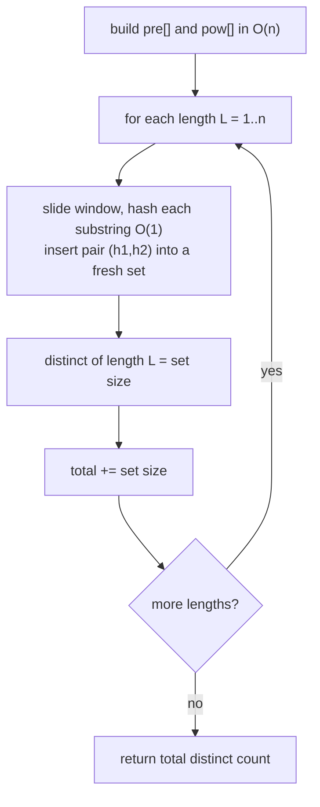

# Count Distinct Substrings via Hashing

| Meta | Value |
|------|-------|
| Source | Classic string problem (self-contained) |
| Difficulty | Medium |
| Topics | Polynomial Hashing, Sets, Substring Enumeration |
| Link | — (canonical exercise; cf. SPOJ DISUBSTR, suffix-automaton variants) |

---

## Problem Statement
Given a string `s`, count the number of **distinct** (unique) non-empty substrings of `s`.
Substrings are contiguous; identical substrings occurring at different positions are counted once.

We will solve it with **polynomial hashing**: group substrings by length, hash every substring of
each length in `O(1)` using a prefix-hash array, and use a set to deduplicate. The classic optimal
solutions use suffix automata / suffix arrays in `O(n)`; the hashing approach is `O(n^2)` but is
short, general, and a great showcase of the O(1) substring-hash machinery.

**Example**
```text
s = "aab"
Distinct substrings: "a", "b", "aa", "ab", "aab"   → answer = 5
(note "a" appears twice but is counted once)
```

---

## Approach (WHY)

**Total vs. distinct.** A string of length `n` has `n(n+1)/2` substrings counting positions; the
*distinct* count subtracts repeats. We need a fast equality test to detect repeats — that is exactly
what prefix hashing provides in `O(1)`.

**Group by length.** Two substrings can be equal only if they have the **same length**. So for each
length `L = 1..n`, slide a window and collect the hash of every length-`L` substring into a set; the
set's size is the number of *distinct* substrings of that length. Summing over all `L` gives the
answer. Each length costs `O(n)`, so the total is `O(n^2)` time (and `O(n)` extra per length if we
clear the set between lengths).

**Why double hashing.** There are up to `n(n+1)/2 ≈ 5·10^7` substrings for `n = 10^4`. A single
`10^9` hash would, by the birthday bound, collide and **undercount** (two different substrings sharing
a hash are mistakenly merged). The pair `(h1, h2)` under two primes makes that vanishingly unlikely,
so the set size is the true distinct count.

```python
def count_distinct_substrings(s: str) -> int:
    n = len(s)
    MOD1, MOD2 = 1_000_000_007, 998_244_353
    B1, B2 = 131, 137
    pre1 = [0]*(n+1); pre2 = [0]*(n+1)
    pw1 = [1]*(n+1);  pw2 = [1]*(n+1)
    for i in range(n):
        c = ord(s[i])
        pre1[i+1] = (pre1[i]*B1 + c) % MOD1
        pre2[i+1] = (pre2[i]*B2 + c) % MOD2
        pw1[i+1] = (pw1[i]*B1) % MOD1
        pw2[i+1] = (pw2[i]*B2) % MOD2

    total = 0
    for L in range(1, n + 1):
        seen = set()
        for i in range(0, n - L + 1):
            h1 = (pre1[i+L] - pre1[i]*pw1[L]) % MOD1
            h2 = (pre2[i+L] - pre2[i]*pw2[L]) % MOD2
            seen.add((h1, h2))
        total += len(seen)
    return total
```

```cpp
#include <bits/stdc++.h>
using namespace std;

long long count_distinct_substrings(const string &s) {
    int n = (int)s.size();
    const long long MOD1 = 1e9 + 7, MOD2 = 998244353;
    const long long B1 = 131, B2 = 137;
    vector<long long> pre1(n+1, 0), pre2(n+1, 0), pw1(n+1, 1), pw2(n+1, 1);
    for (int i = 0; i < n; i++) {
        long long c = (unsigned char)s[i];
        pre1[i+1] = ((__int128)pre1[i]*B1 + c) % MOD1;
        pre2[i+1] = ((__int128)pre2[i]*B2 + c) % MOD2;
        pw1[i+1]  = (__int128)pw1[i]*B1 % MOD1;
        pw2[i+1]  = (__int128)pw2[i]*B2 % MOD2;
    }
    long long total = 0;
    for (int L = 1; L <= n; L++) {
        unordered_set<unsigned long long> seen;
        seen.reserve(2*(n - L + 1) + 1);
        for (int i = 0; i + L <= n; i++) {
            long long h1 = (pre1[i+L] - (__int128)pre1[i]*pw1[L] % MOD1) % MOD1;
            long long h2 = (pre2[i+L] - (__int128)pre2[i]*pw2[L] % MOD2) % MOD2;
            if (h1 < 0) h1 += MOD1;
            if (h2 < 0) h2 += MOD2;
            seen.insert((unsigned long long)h1 * MOD2 + h2);
        }
        total += (long long)seen.size();
    }
    return total;
}
```

---

## Trace (`s = "aab"`)

| `L` | windows | distinct set | count this length |
|-----|---------|--------------|-------------------|
| 1 | "a", "a", "b" | {a, b} | 2 |
| 2 | "aa", "ab" | {aa, ab} | 2 |
| 3 | "aab" | {aab} | 1 |
| | | **total** | **5** |

Summing `2 + 2 + 1 = 5`, matching the hand count.

---

## Mermaid



---

## Math / Complexity

There are $n - L + 1$ substrings of length $L$, and we process each in $O(1)$. Summing over all
lengths:

$$
\sum_{L=1}^{n} (n - L + 1) = \frac{n(n+1)}{2} = O(n^2)
$$

So time is $O(n^2)$ and extra space is $O(n)$ (the per-length set, cleared each round; plus the
$O(n)$ prefix tables). The optimal suffix-automaton solution is $O(n)$ but far more code — hashing
trades a factor of `n` for simplicity and generality.

---

## Takeaway
Distinct-substring counting reduces to **equality testing grouped by length**. Prefix hashing gives
$O(1)$ substring hashes, so a set per length yields the distinct count directly. Reach for **double
hashing** here: under heavy comparison loads a single modulus collides and silently **undercounts**.
