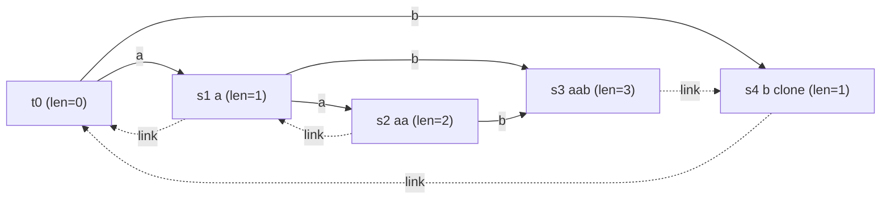

# Count Distinct Substrings via Suffix Automaton

| Meta | Value |
|------|-------|
| Source | Classic string problem (self-contained) |
| Difficulty | Medium–Hard |
| Topics | Suffix Automaton, endpos Classes, Suffix Links |
| Link | — (canonical exercise; cf. SPOJ SUBST1, CSES "Distinct Substrings") |

---

## Problem Statement
Given a string `s`, count the number of **distinct** non-empty substrings of `s`. Identical
substrings appearing at different positions are counted **once**.

We solve it in **linear time** with a **suffix automaton (SAM)**. Each state of the SAM groups
substrings sharing the same set of end positions; the substrings in one state form a contiguous range
of lengths, so we can count them per state in $O(1)$ and sum.

**Example**
```text
s = "aab"
Distinct substrings: "a", "b", "aa", "ab", "aab"   → answer = 5
("a" appears twice but is counted once)
```

---

## Approach (WHY)

**Why the SAM counts substrings exactly.** A SAM has a directed path from the initial state for
**every** substring of `s`, and **distinct substrings correspond to distinct paths**. So the number
of distinct substrings equals the number of distinct (non-empty) paths starting at the initial state.

**Why `len[v] - len[link[v]]` per state.** Each state `v` represents an `endpos`-equivalence class
whose strings are exactly the suffixes of its longest string with lengths in the contiguous range
`[len[link[v]] + 1, len[v]]`. That range has exactly `len[v] - len[link[v]]` integers, i.e. that many
**distinct substrings** live in state `v`. No two states share a substring (the classes partition all
substrings), so summing over all states (excluding the root) gives the total without double counting:

$$
\text{answer} = \sum_{v \ne t_0} \big(\mathrm{len}[v] - \mathrm{len}[\mathrm{link}[v]]\big).
$$

**Why this beats `O(n^2)` hashing.** Hashing groups by length and dedups with a set in $O(n^2)$. The
SAM gets the same count in $O(n)$ (fixed alphabet), with a single loop over `<= 2n - 1` states — no
sets, no traversal of transitions.

```python
class State:
    __slots__ = ("length", "link", "next")
    def __init__(self):
        self.length = 0
        self.link = -1
        self.next = {}

def build_sam(s):
    st = [State()]
    last = 0
    for c in s:
        cur = len(st)
        st.append(State())
        st[cur].length = st[last].length + 1
        p = last
        while p != -1 and c not in st[p].next:
            st[p].next[c] = cur
            p = st[p].link
        if p == -1:
            st[cur].link = 0
        else:
            q = st[p].next[c]
            if st[p].length + 1 == st[q].length:
                st[cur].link = q
            else:
                clone = len(st)
                st.append(State())
                st[clone].length = st[p].length + 1
                st[clone].next = dict(st[q].next)
                st[clone].link = st[q].link
                while p != -1 and st[p].next.get(c) == q:
                    st[p].next[c] = clone
                    p = st[p].link
                st[q].link = clone
                st[cur].link = clone
        last = cur
    return st

def count_distinct_substrings(s):
    st = build_sam(s)
    total = 0
    for v in range(1, len(st)):              # skip root v=0
        total += st[v].length - st[st[v].link].length
    return total

if __name__ == "__main__":
    print(count_distinct_substrings("aab"))  # 5
```

```cpp
#include <bits/stdc++.h>
using namespace std;

struct State {
    int length = 0;
    int link = -1;
    map<char, int> next;
};

vector<State> buildSam(const string& s) {
    vector<State> st;
    st.push_back(State());
    int last = 0;
    for (char c : s) {
        int cur = (int)st.size();
        st.push_back(State());
        st[cur].length = st[last].length + 1;
        int p = last;
        while (p != -1 && st[p].next.find(c) == st[p].next.end()) {
            st[p].next[c] = cur;
            p = st[p].link;
        }
        if (p == -1) {
            st[cur].link = 0;
        } else {
            int q = st[p].next[c];
            if (st[p].length + 1 == st[q].length) {
                st[cur].link = q;
            } else {
                int clone = (int)st.size();
                st.push_back(State());
                st[clone].length = st[p].length + 1;
                st[clone].next = st[q].next;
                st[clone].link = st[q].link;
                while (p != -1 && st[p].next.count(c) && st[p].next[c] == q) {
                    st[p].next[c] = clone;
                    p = st[p].link;
                }
                st[q].link = clone;
                st[cur].link = clone;
            }
        }
        last = cur;
    }
    return st;
}

long long countDistinctSubstrings(const string& s) {
    vector<State> st = buildSam(s);
    long long total = 0;
    for (int v = 1; v < (int)st.size(); ++v)   // skip root v=0
        total += (long long)(st[v].length - st[st[v].link].length);
    return total;
}

int main() {
    cout << countDistinctSubstrings("aab") << "\n";  // 5
    return 0;
}
```

---

## Trace

Build the SAM of `s = "aab"`. After construction the states (besides root `t0`) are:

| state | longest string | `len` | `link` | `len[link]` | contribution `len - len[link]` |
|-------|----------------|-------|--------|-------------|-------------------------------|
| 1 | `"a"` | 1 | t0 (0) | 0 | 1 |
| 2 | `"aa"` | 2 | 1 | 1 | 1 |
| 3 | `"aab"` | 3 | 4 | 1 | 2 |
| 4 | `"b"` (clone) | 1 | t0 (0) | 0 | 1 |

Sum of contributions = `1 + 1 + 2 + 1 = 5`, matching the five distinct substrings
`{"a", "aa", "b", "ab", "aab"}`. State 3 contributes `2` because it holds both `"ab"` and `"aab"`
(lengths 2 and 3, range size `3 - 1 = 2`).

---

## Mermaid



Each non-root node contributes `len[v] - len[link[v]]` distinct substrings; the sum over all nodes is
the answer. Notice `link[3] = 4` (not `1`): the longest proper suffix of `"aab"` in a *different*
`endpos` class is `"b"`, which lives in the clone.

---

## Math & Complexity

- **States/transitions:** `<= 2n - 1` states and `<= 3n - 4` transitions.
- **Build:** $O(n)$ with array transitions over a fixed alphabet, or $O(n \log \sigma)$ with `map`.
- **Counting:** one pass over the states, $O(n)$, $O(1)$ extra memory beyond the SAM.

$$
\text{answer} = \sum_{v \ne t_0} \big(\mathrm{len}[v] - \mathrm{len}[\mathrm{link}[v]]\big),
\qquad \text{Total time} = O(n \log \sigma), \quad \text{Space} = O(n).
$$

A useful identity: the **total number of substrings counting multiplicity** is $\frac{n(n+1)}{2}$;
the SAM's distinct count subtracts the repeats automatically because repeats collapse into the same
path.

---

## Takeaway
The number of distinct substrings is just `sum(len[v] - len[link[v]])` over the SAM states — one loop,
no traversal. This single formula is the gateway to many SAM applications (k-th substring, distinct
substrings per length), all powered by the contiguous length range each `endpos` class owns.
