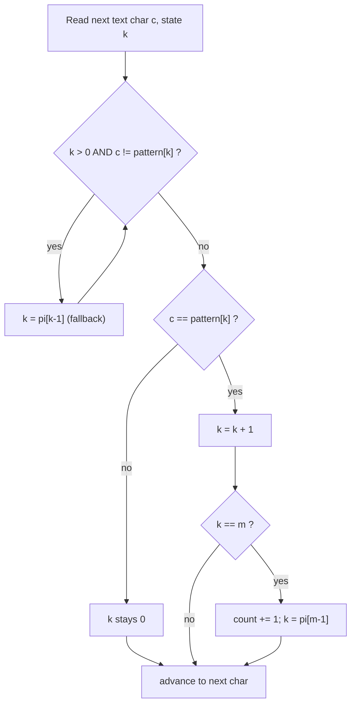

# Count Occurrences of a Pattern (KMP)

| Meta | Value |
|------|-------|
| Source | Classic / self-contained |
| Difficulty | Medium |
| Topics | String, Pattern Matching, Prefix Function (KMP) |
| Link | — (self-contained problem) |

---

## Problem Statement
Given a `text` of length `n` and a `pattern` of length `m`, count how many times `pattern` occurs in
`text`. Occurrences may **overlap**.

**Example**
```
text    = "aaaaa"
pattern = "aa"
Occurrences: positions 0,1,2,3  ->  count = 4   (overlaps counted)

text    = "abababab"
pattern = "aba"
Occurrences: positions 0,2,4    ->  count = 3
```

A naive scan compares the pattern at every offset for `O(n·m)` worst case. KMP does it in `O(n + m)`.

---

## Why KMP Works Here

KMP runs the **prefix function** of the pattern as a state machine over the text. We track `k`, the
number of pattern characters currently matched. For each text character `c`:

- While `c` mismatches `pattern[k]` and `k > 0`, fall back via `k = pi[k-1]` (reuse the longest
  matched border instead of restarting).
- If `c == pattern[k]`, advance `k`.
- When `k == m`, we have a full match ending here — increment the count and set `k = pi[m-1]` so
  overlapping occurrences are still detected.

The fallback never re-reads a text character, so the whole scan is amortized linear (same potential
argument as the prefix-function build: `k` rises by at most 1 per character and the `while` loop only
spends what was deposited).

---

## Solution — Paired Python + C++

First, the prefix function of the pattern:

```python
def prefix_function(p):
    n = len(p)
    pi = [0] * n
    k = 0
    for i in range(1, n):
        while k > 0 and p[i] != p[k]:
            k = pi[k - 1]
        if p[i] == p[k]:
            k += 1
        pi[i] = k
    return pi
```

```cpp
#include <bits/stdc++.h>
using namespace std;

vector<int> prefix_function(const string& p) {
    int n = (int)p.size();
    vector<int> pi(n, 0);
    int k = 0;
    for (int i = 1; i < n; i++) {
        while (k > 0 && p[i] != p[k])
            k = pi[k - 1];
        if (p[i] == p[k])
            k++;
        pi[i] = k;
    }
    return pi;
}
```

Then the counting scan:

```python
def count_occurrences(text, pattern):
    m = len(pattern)
    if m == 0 or m > len(text):
        return 0
    pi = prefix_function(pattern)
    k = 0
    count = 0
    for c in text:
        while k > 0 and c != pattern[k]:
            k = pi[k - 1]
        if c == pattern[k]:
            k += 1
        if k == m:
            count += 1
            k = pi[k - 1]          # continue for overlapping matches
    return count
```

```cpp
#include <bits/stdc++.h>
using namespace std;

long long count_occurrences(const string& text, const string& pattern) {
    int m = (int)pattern.size();
    if (m == 0 || m > (int)text.size())
        return 0;
    vector<int> pi = prefix_function(pattern);
    int k = 0;
    long long count = 0;
    for (char c : text) {
        while (k > 0 && c != pattern[k])
            k = pi[k - 1];
        if (c == pattern[k])
            k++;
        if (k == m) {
            count++;
            k = pi[k - 1];         // continue for overlapping matches
        }
    }
    return count;
}
```

---

## Trace: `text = "abababab"`, `pattern = "aba"`

Pattern prefix function: `pi = [0, 0, 1]` (so after a full match we reset `k = pi[2] = 1`).

| j | text[j] | k before | action | k after | match? |
|---|---------|----------|--------|---------|--------|
| 0 | a | 0 | match `a` | 1 | |
| 1 | b | 1 | match `b` | 2 | |
| 2 | a | 2 | match `a` → k==3 | reset to `pi[2]=1` | ✅ at start 0 |
| 3 | b | 1 | match `b` | 2 | |
| 4 | a | 2 | match `a` → k==3 | reset to 1 | ✅ at start 2 |
| 5 | b | 1 | match `b` | 2 | |
| 6 | a | 2 | match `a` → k==3 | reset to 1 | ✅ at start 4 |
| 7 | b | 1 | match `b` | 2 | |

Total **count = 3** (starts 0, 2, 4) — overlaps preserved thanks to `k = pi[k-1]` after each match.

---

## Mermaid: Per-Character State Update



---

## Math & Complexity

Each text character triggers at most one increment of `k` and the fallback loop withdraws only what
was deposited, so total work is bounded by

$$ \underbrace{O(m)}_{\text{build } \pi} + \underbrace{O(n)}_{\text{scan text}} = O(n + m). $$

| Aspect | Value |
|--------|-------|
| Time | $O(n + m)$ |
| Space | $O(m)$ (only the pattern's $\pi$ array) |
| Overlaps | counted (reset `k = pi[m-1]`, not `0`) |

---

## Takeaway
Counting matches is the same KMP scan as finding the first occurrence — you just **don't stop** at
the first hit. The single crucial detail for overlapping counts is resetting `k = pi[m-1]` after a
full match rather than zeroing it.
