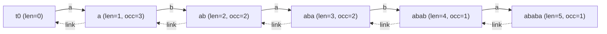

# Count Occurrences of Each Substring via Suffix Automaton + Suffix-Link Tree

| Meta | Value |
|------|-------|
| Source | Classic string problem (self-contained) |
| Difficulty | Hard |
| Topics | Suffix Automaton, Suffix-Link Tree, endpos Sizes |
| Link | — (canonical exercise; cf. CSES "Counting Patterns", Codeforces SAM occurrence problems) |

---

## Problem Statement
Given a text `s` and one or more **query strings** `p`, report how many times each `p` occurs in `s`
(overlapping occurrences counted). Equivalently, compute the **`endpos` size** of every substring of
`s`, then answer each query in $O(|p|)$ by locating the state that recognizes `p` and reading its
`endpos` size.

We build a **suffix automaton (SAM)** of `s`. Each state's `endpos` size equals the number of ending
positions of its substrings = the number of occurrences. We compute all sizes with **one bottom-up
pass over the suffix-link tree**.

**Example**
```text
s = "ababa"
query "aba" → occurs at end positions 3 and 5  → 2 occurrences
query "ab"  → occurs at end positions 2 and 4  → 2 occurrences
query "c"   → not present                       → 0 occurrences
```

---

## Approach (WHY)

**Why `endpos` size = occurrence count.** Every occurrence of a substring `p` is uniquely identified
by its **end position**. So the number of occurrences of `p` equals `|endpos(p)|`, and `p` is
recognized by exactly one SAM state whose `endpos` set is shared by all strings in that state. Find
the state, read its `endpos` size — done.

**Why we seed counts on the prefix states.** During construction, each time we add a character the new
state `cur` represents the **whole current prefix**, whose end position is the position we just added.
Seeding `cnt[cur] = 1` (and `cnt[clone] = 0` for clones) marks exactly one real end position per
prefix.

**Why pushing up the suffix-link tree finishes the job.** The `endpos` set of a state is the
**disjoint union** of its children's `endpos` sets in the suffix-link tree (plus its own seeded
position if it was a prefix endpoint). So `|endpos(v)| = cnt[v] + sum of |endpos(child)|`. Processing
states in **decreasing `len`** guarantees every child is summed before its parent, turning the whole
computation into a single linear accumulation — no recursion needed.

**Why locate a query by following transitions.** To answer a query `p`, start at the root and follow
the transition for each character of `p`. If a transition is missing, `p` is not a substring → answer
`0`. Otherwise the landing state's `cnt` is the occurrence count.

```python
class State:
    __slots__ = ("length", "link", "next")
    def __init__(self):
        self.length = 0
        self.link = -1
        self.next = {}

def build_sam_with_counts(s):
    st = [State()]
    last = 0
    cnt = [0]
    for c in s:
        cur = len(st)
        st.append(State()); cnt.append(0)
        st[cur].length = st[last].length + 1
        cnt[cur] = 1                          # real prefix endpoint
        p = last
        while p != -1 and c not in st[p].next:
            st[p].next[c] = cur
            p = st[p].link
        if p == -1:
            st[cur].link = 0
        else:
            q = st[p].next[c]
            if st[p].length + 1 == st[q].length:
                st[cur].link = q
            else:
                clone = len(st)
                st.append(State()); cnt.append(0)   # clone seeded with 0
                st[clone].length = st[p].length + 1
                st[clone].next = dict(st[q].next)
                st[clone].link = st[q].link
                while p != -1 and st[p].next.get(c) == q:
                    st[p].next[c] = clone
                    p = st[p].link
                st[q].link = clone
                st[cur].link = clone
        last = cur
    # push counts up the suffix-link tree, in order of decreasing len
    order = sorted(range(len(st)), key=lambda v: st[v].length, reverse=True)
    for v in order:
        link = st[v].link
        if link != -1:
            cnt[link] += cnt[v]
    return st, cnt

def occurrences(st, cnt, p):
    v = 0
    for c in p:
        if c not in st[v].next:
            return 0
        v = st[v].next[c]
    return cnt[v]

if __name__ == "__main__":
    st, cnt = build_sam_with_counts("ababa")
    print(occurrences(st, cnt, "aba"))   # 2
    print(occurrences(st, cnt, "ab"))    # 2
    print(occurrences(st, cnt, "c"))     # 0
```

```cpp
#include <bits/stdc++.h>
using namespace std;

struct State {
    int length = 0;
    int link = -1;
    map<char, int> next;
};

pair<vector<State>, vector<long long>> buildSamWithCounts(const string& s) {
    vector<State> st;
    st.push_back(State());
    vector<long long> cnt(1, 0);
    int last = 0;
    for (char c : s) {
        int cur = (int)st.size();
        st.push_back(State()); cnt.push_back(0);
        st[cur].length = st[last].length + 1;
        cnt[cur] = 1;                        // real prefix endpoint
        int p = last;
        while (p != -1 && st[p].next.find(c) == st[p].next.end()) {
            st[p].next[c] = cur;
            p = st[p].link;
        }
        if (p == -1) {
            st[cur].link = 0;
        } else {
            int q = st[p].next[c];
            if (st[p].length + 1 == st[q].length) {
                st[cur].link = q;
            } else {
                int clone = (int)st.size();
                st.push_back(State()); cnt.push_back(0);   // clone seeded with 0
                st[clone].length = st[p].length + 1;
                st[clone].next = st[q].next;
                st[clone].link = st[q].link;
                while (p != -1 && st[p].next.count(c) && st[p].next[c] == q) {
                    st[p].next[c] = clone;
                    p = st[p].link;
                }
                st[q].link = clone;
                st[cur].link = clone;
            }
        }
        last = cur;
    }
    // push counts up the suffix-link tree, in order of decreasing len
    vector<int> order(st.size());
    iota(order.begin(), order.end(), 0);
    sort(order.begin(), order.end(),
         [&](int a, int b){ return st[a].length > st[b].length; });
    for (int v : order) {
        int link = st[v].link;
        if (link != -1) cnt[link] += cnt[v];
    }
    return {st, cnt};
}

long long occurrences(const vector<State>& st, const vector<long long>& cnt,
                      const string& p) {
    int v = 0;
    for (char c : p) {
        auto it = st[v].next.find(c);
        if (it == st[v].next.end()) return 0;
        v = it->second;
    }
    return cnt[v];
}

int main() {
    auto [st, cnt] = buildSamWithCounts("ababa");
    cout << occurrences(st, cnt, "aba") << "\n";  // 2
    cout << occurrences(st, cnt, "ab")  << "\n";  // 2
    cout << occurrences(st, cnt, "c")   << "\n";  // 0
    return 0;
}
```

---

## Trace

Build the SAM of `s = "ababa"`. Prefix endpoints get `cnt = 1`: the states for `"a"`, `"ab"`, `"aba"`,
`"abab"`, `"ababa"`. After ordering by decreasing `len` and pushing up the suffix links:

| substring | landing state `len` | seeded `cnt` | after push-up = `|endpos|` |
|-----------|--------------------|--------------|----------------------------|
| `"ababa"` | 5 | 1 | 1 |
| `"abab"` | 4 | 1 | 1 |
| `"aba"` | 3 | 1 | 2 (gets `+1` from `"ababa"`'s class) |
| `"ab"` | 2 | 1 | 2 |
| `"a"` | 1 | 1 | 3 |

Query `"aba"` lands on the `len = 3` state with `cnt = 2` → **2 occurrences** (end positions 3 and 5).
Query `"ab"` → `cnt = 2`. Query `"c"` has no transition from the root → **0**.

---

## Mermaid



Counts (`occ`) flow **up the dashed suffix links**: a child adds its `cnt` to its parent, so shorter
substrings accumulate the occurrences of all longer substrings that contain them as a suffix-class.

---

## Math & Complexity

Let `n = |s|` and `q` query strings of total length `M`.

- **Build + counts:** $O(n \log \sigma)$ with `map` transitions (or $O(n)$ with arrays). The push-up
  is a counting/merge sort on `len`, $O(n)$ or $O(n \log n)$ with `std::sort`.
- **Each query:** $O(|p| \log \sigma)$ to walk the transitions.

$$
|\mathrm{endpos}(v)| = \mathrm{cnt}[v] + \!\!\sum_{\substack{u : \mathrm{link}[u] = v}}\!\! |\mathrm{endpos}(u)|,
\qquad \text{Total} = O\big(n \log \sigma + M \log \sigma\big).
$$

Clones must keep `cnt = 0` so that an end position is never double-counted; only genuine prefix
endpoints contribute the initial `1`.

---

## Takeaway
Occurrence counting is "`endpos` size", and `endpos` size is computed by seeding `cnt = 1` on real
prefix states and **summing up the suffix-link tree** in decreasing-`len` order. Once sizes are known,
every "how many times does `p` occur?" query is a simple $O(|p|)$ walk down the transitions.
