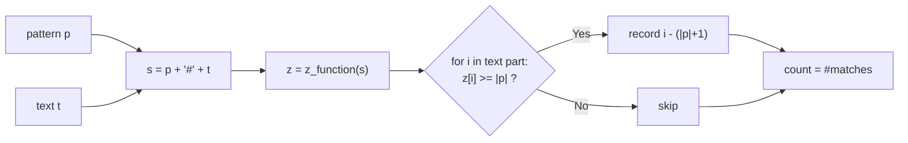

# Count Pattern Occurrences with the Z-Function

| Meta | Value |
|------|-------|
| Source | Classic / Self-contained |
| Difficulty | Easy–Medium |
| Topics | Strings, Z-Function, Pattern Matching |
| Time | $O(|p| + |t|)$ |
| Space | $O(|p| + |t|)$ |
| Link | — (self-contained) |

---

## Problem Statement
Given a `text` `t` and a `pattern` `p`, count how many times `p` occurs in `t` as a (possibly
overlapping) substring. Return the count and, optionally, the list of starting indices.

**Example**
```
text    = "ababababa"
pattern = "aba"
Occurrences start at indices: 0, 2, 4, 6
Count = 4            (overlaps are counted)
```

---

## Why the Z-Function?

The naive scan compares the pattern at every offset: $O(|t| \cdot |p|)$ worst case (think
`t = "aaaa...a"`, `p = "aaa"`). The Z-function lets us preprocess once and answer in linear time.

Key idea: build

$$
s = p \mathbin{+} \texttt{\#} \mathbin{+} t
$$

with a separator `#` that appears in neither string. Compute the Z-array of `s`. For any index
`i` falling inside the `t` portion, `s[i..]` matches the prefix `p` for `z[i]` characters. Since
the separator blocks any match from crossing into the pattern region, we get the clean test:

$$
z[i] \ge |p| \iff p \text{ occurs in } t \text{ at position } i - (|p| + 1)
$$

Every occurrence — including overlapping ones — is detected, because `z[i]` is evaluated
independently at each starting position.

---

## Solution (Paired Python + C++)

```python
def z_function(s):
    n = len(s)
    z = [0] * n
    l, r = 0, 0
    for i in range(1, n):
        if i < r:
            z[i] = min(r - i, z[i - l])
        while i + z[i] < n and s[z[i]] == s[i + z[i]]:
            z[i] += 1
        if i + z[i] > r:
            l, r = i, i + z[i]
    return z

def count_occurrences(text, pattern):
    if not pattern or len(pattern) > len(text):
        return 0, []
    s = pattern + '#' + text
    z = z_function(s)
    m = len(pattern)
    starts = []
    for i in range(m + 1, len(s)):       # indices inside the text part
        if z[i] >= m:                     # full pattern matches here
            starts.append(i - (m + 1))    # map index back to text
    return len(starts), starts
```

```cpp
#include <bits/stdc++.h>
using namespace std;

vector<int> z_function(const string& s) {
    int n = (int)s.size();
    vector<int> z(n, 0);
    int l = 0, r = 0;
    for (int i = 1; i < n; ++i) {
        if (i < r)
            z[i] = min(r - i, z[i - l]);
        while (i + z[i] < n && s[z[i]] == s[i + z[i]])
            ++z[i];
        if (i + z[i] > r) {
            l = i;
            r = i + z[i];
        }
    }
    return z;
}

pair<long long, vector<int>> count_occurrences(const string& text, const string& pattern) {
    if (pattern.empty() || pattern.size() > text.size())
        return {0LL, {}};
    string s = pattern + '#' + text;
    vector<int> z = z_function(s);
    int m = (int)pattern.size();
    vector<int> starts;
    for (int i = m + 1; i < (int)s.size(); ++i)    // indices inside the text part
        if (z[i] >= m)                             // full pattern matches here
            starts.push_back(i - (m + 1));         // map index back to text
    return {(long long)starts.size(), starts};
}
```

---

## Trace — `text = "ababababa"`, `pattern = "aba"`

Build `s = "aba#ababababa"` (length 13). Compute `z`:

```
index: 0  1  2  3  4  5  6  7  8  9 10 11 12
s:     a  b  a  #  a  b  a  b  a  b  a  b  a
z:     0  0  1  0  3  0  5  0  3  0  3  0  1
```

Pattern length `m = 3`. Scan indices `i >= m + 1 = 4` (the text part):

- `i = 4`: `z = 3 >= 3` → occurrence at `4 - 4 = 0` ✓
- `i = 6`: `z = 5 >= 3` → occurrence at `6 - 4 = 2` ✓
- `i = 8`: `z = 3 >= 3` → occurrence at `8 - 4 = 4` ✓
- `i = 10`: `z = 3 >= 3` → occurrence at `10 - 4 = 6` ✓
- `i = 12`: `z = 1 < 3` → no.

Starts = `[0, 2, 4, 6]`, count = **4**. Overlaps captured correctly.

---

## Mermaid: Pipeline



---

## Math & Complexity

Let $n = |s| = |p| + 1 + |t|$.

- Z-function over `s`: $O(n)$ because the box endpoint `r` only increases and `r \le n`.
- Single scan to collect matches: $O(|t|)$.

$$
T = O(|p| + |t|), \qquad S = O(|p| + |t|)
$$

This dominates the naive $O(|p|\cdot|t|)$ on adversarial inputs.

---

## Takeaway
Concatenating `pattern + '#' + text` turns substring search into a **prefix-match query** that
the Z-function answers for free: any text position with `z[i] >= |p|` is an occurrence. Linear
time, overlaps included, with a one-line threshold test.
