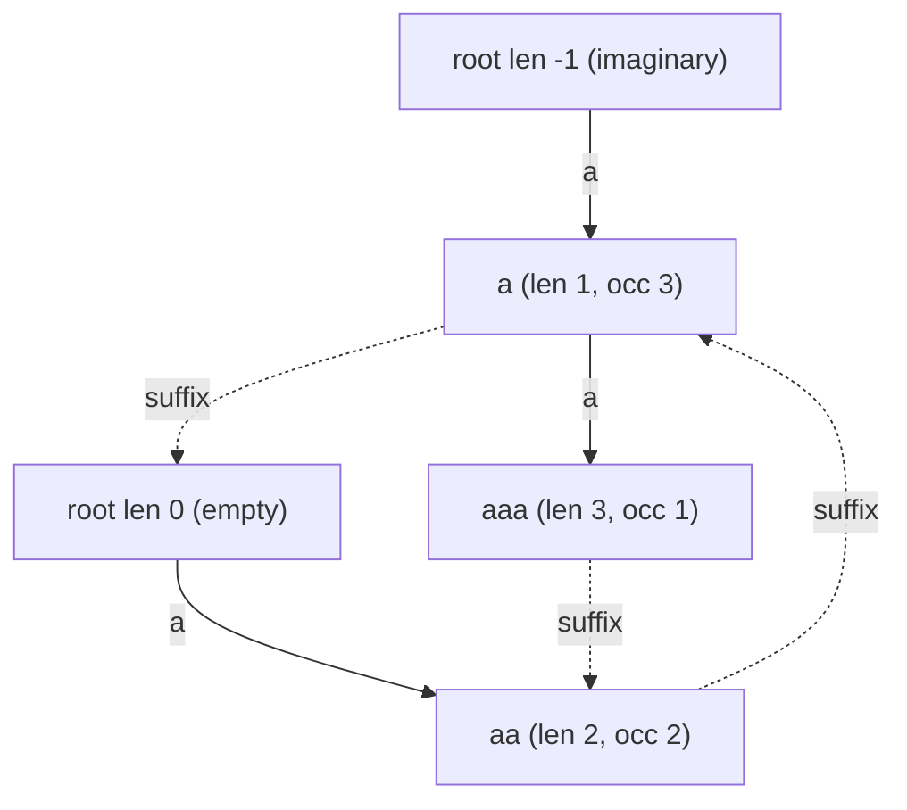

# Count Total Palindromic Substrings — With Multiplicity (Eertree)

| Meta | Value |
|------|-------|
| Source | Classic string problem (self-contained) |
| Difficulty | Medium–Hard |
| Topics | Palindromic Tree (Eertree), Suffix Links, Count Propagation |
| Link | — (canonical exercise; cf. counting all palindromic substrings) |

---

## Problem Statement
Given a lowercase string `s`, count the **total** number of palindromic substrings, **counting every
occurrence separately** (with multiplicity). If a palindrome `P` occurs `k` times, it contributes `k`
to the total.

We build the **palindromic tree (eertree)**, give each node an occurrence counter `cnt`, then
**propagate counts along suffix links** so that `cnt[v]` becomes the true number of occurrences of node
`v`'s palindrome. The answer is the sum of `cnt` over all real nodes.

**Example**
```text
s = "aaa"
Palindromic substrings by position:
  "a" occurs 3 times, "aa" occurs 2 times, "aaa" occurs 1 time
Total = 3 + 2 + 1 = 6
```

---

## Approach (WHY)

**Why one occurrence per `add`.** When we append `s[i]`, the new longest palindromic suffix becomes the
"current" palindrome `last`. That single step registers **one** occurrence of that specific palindrome.
So initializing `cnt[v] = 1` at creation (and `cnt[v] += 1` when an existing node is reused) records
exactly the number of times each palindrome was the **direct longest** palindromic suffix.

**Why propagation is needed.** Appending `s[i]` actually creates an occurrence of **every palindromic
suffix** ending at `i`, not just the longest one. Those shorter suffixes are reachable by following
suffix links from `last`. Doing that walk every step is `O(n^2)`. Instead we **defer**: after the build,
push each node's count up its suffix link. Because a suffix link always points to a **shorter**
palindrome (created earlier, smaller index), processing nodes in **decreasing index order** guarantees a
node's full count is finalized before it is pushed to its parent:

$$\texttt{cnt[suff[v]]} \mathrel{+}= \texttt{cnt[v]}.$$

After this single linear pass `cnt[v]` equals the true occurrence count of palindrome `v`, and the
answer is `sum(cnt[v])` over real nodes — equivalently, the sum of palindromic suffixes over all
positions.

```python
def count_total_palindromic_substrings(s):
    n = len(s)
    SZ = n + 5
    length = [0] * SZ
    suff   = [0] * SZ
    cnt    = [0] * SZ
    to     = [dict() for _ in range(SZ)]

    length[0] = -1; suff[0] = 0      # imaginary root
    length[1] = 0;  suff[1] = 0      # empty root
    num = 2
    last = 1

    def get_link(x, i):
        while True:
            l = length[x]
            if i - l - 1 >= 0 and s[i - l - 1] == s[i]:
                return x
            x = suff[x]

    for i in range(n):
        ch = s[i]
        x = get_link(last, i)
        if ch in to[x]:
            last = to[x][ch]
            cnt[last] += 1
            continue
        cur = num; num += 1
        length[cur] = length[x] + 2
        if length[cur] == 1:
            suff[cur] = 1
        else:
            y = get_link(suff[x], i)
            suff[cur] = to[y].get(ch, 1)
        to[x][ch] = cur
        cnt[cur] = 1
        last = cur

    # propagate occurrence counts along suffix links, high index -> low
    for v in range(num - 1, 1, -1):
        cnt[suff[v]] += cnt[v]

    total = 0
    for v in range(2, num):
        total += cnt[v]
    return total


if __name__ == "__main__":
    print(count_total_palindromic_substrings("aaa"))  # 6
```

```cpp
#include <bits/stdc++.h>
using namespace std;

long long countTotalPalindromicSubstrings(const string &s) {
    int n = (int)s.size();
    const int K = 26;
    vector<array<int, K>> to(n + 2);
    for (auto &row : to) row.fill(0);
    vector<int> len(n + 2, 0), suff(n + 2, 0);
    vector<long long> cnt(n + 2, 0);

    len[0] = -1; suff[0] = 0;        // imaginary root
    len[1] = 0;  suff[1] = 0;        // empty root
    int num = 2, last = 1;

    auto getLink = [&](int x, int i) {
        while (true) {
            int l = len[x];
            if (i - l - 1 >= 0 && s[i - l - 1] == s[i]) return x;
            x = suff[x];
        }
    };

    for (int i = 0; i < n; i++) {
        int c = s[i] - 'a';
        int x = getLink(last, i);
        if (to[x][c] != 0) {
            last = to[x][c];
            cnt[last]++;
            continue;
        }
        int cur = num++;
        len[cur] = len[x] + 2;
        if (len[cur] == 1) {
            suff[cur] = 1;
        } else {
            int y = getLink(suff[x], i);
            suff[cur] = (to[y][c] != 0) ? to[y][c] : 1;
        }
        to[x][c] = cur;
        cnt[cur] = 1;
        last = cur;
    }

    // propagate occurrence counts along suffix links, high index -> low
    for (int v = num - 1; v >= 2; v--)
        cnt[suff[v]] += cnt[v];

    long long total = 0;
    for (int v = 2; v < num; v++)
        total += cnt[v];
    return total;
}

int main() {
    cout << countTotalPalindromicSubstrings("aaa") << "\n"; // 6
    return 0;
}
```

---

## Trace — `s = "aaa"`

Build creates two nodes: `a` (node 2, len 1) and `aa` (node 3, len 2).

| `i` | `s[i]` | action | `cnt[2]` (`a`) | `cnt[3]` (`aa`) |
|-----|--------|--------|----------------|------------------|
| 0 | a | create `a` | 1 | 0 |
| 1 | a | create `aa` | 1 | 1 |
| 2 | a | reuse `aa` | 1 | 2 |

After build: `cnt = [.., a:1, aa:2]`. Suffix link `suff[3] = 2` (`aa` → `a`).

**Propagation** (high index → low): `cnt[suff[3]] += cnt[3]` → `cnt[2] += 2` → `cnt[2] = 3`.

Final occurrences: `a` → 3, `aa` → 2. But wait — `aaa` is also palindromic! It is node-counted too;
for `"aaa"` the build also creates `aaa` (node 4) giving `cnt[4] = 1`, then `cnt[suff[4]=3] += 1`.
Summing real nodes: `a:3 + aa:2 + aaa:1 = 6`. ✓

---

## Mermaid

Eertree for `s = "aaa"` with propagated occurrence counts shown in each node.



The `occ` values are exactly the result of pushing `cnt` up the dashed suffix links.

---

## Math & Complexity

Let `occ(P)` be the number of occurrences of palindrome `P`. The total is

$$\sum_{P \text{ palindrome}} occ(P) \;=\; \sum_{i=0}^{n-1} \#\{\text{palindromic suffixes ending at } i\}.$$

The eertree computes the left side by propagating direct-suffix counts up the suffix-link tree in one
linear pass.

| Resource | Cost |
|----------|------|
| Time | $O(n)$ amortized build + $O(n)$ propagation |
| Space | $O(n \cdot \sigma)$ array edges (or $O(n)$ map edges) |

---

## Takeaway
Total palindromic occurrences = **sum of `cnt` after a suffix-link propagation pass**. Initialize each
node with one occurrence (the direct longest-suffix event), then push counts up the suffix links in
decreasing index order — a single linear sweep turns "direct" counts into true occurrence counts.
