# Count Total Pattern Matches (Aho–Corasick)

| Meta | Value |
|------|-------|
| Source | Self-contained (classic multi-pattern counting) |
| Difficulty | Medium |
| Topics | String, Trie, Aho–Corasick |
| Link | — |

---

## Problem Statement
You are given $k$ patterns $p_1, p_2, \dots, p_k$ (lowercase `a..z`, duplicates allowed) and a text
$t$. Count the **total number of occurrences** of all patterns in $t$. Occurrences may overlap, and
if two patterns are equal both are counted; a single text position may simultaneously end several
patterns.

Formally, count the number of pairs $(i, j)$ such that pattern $p_i$ occurs in $t$ ending at
position $j$.

**Example**
```text
patterns = ["he", "she", "hers", "his"]
text     = "ushers"

Occurrences:
  "she" ends at index 3   (u s h e ...)   -> wait, "she" = s,h,e at indices 1,2,3
  "he"  ends at index 3   (h,e at 2,3)
  "hers" ends at index 5  (h,e,r,s at 2,3,4,5)
Total = 3
```

---

## Why Aho–Corasick?

Running KMP once per pattern costs $O(k\,|t| + m)$ — the text is scanned $k$ times. With many short
patterns sharing prefixes that is wasteful. Aho–Corasick builds a **single automaton** over all
patterns and scans the text **once**, and the overlapping/multiple-end issue is handled naturally by
the **dictionary-link chain**: at each text position we add up how many patterns end there.

To make the per-position work $O(1)$ instead of walking the chain, we precompute, for every node,
`cnt[v]` = number of patterns ending on the node *and* on its entire dictionary-link chain:

$$
\text{cnt}(v) = (\text{\# patterns ending exactly at } v) + \text{cnt}(\text{dict\_link}(v))
$$

Computed in BFS order, this lets the text scan do `total += cnt[node]` per character.

---

## Solution — Paired Python + C++

### Build trie + fail links + `cnt` roll-up

```python
from collections import deque

ALPHA = 26

class Aho:
    def __init__(self):
        self.nxt = [[0] * ALPHA]
        self.fail = [0]
        self.end_cnt = [0]   # # patterns ending exactly at this node
        self.cnt = [0]       # end_cnt + cnt[dict_link] (chain folded in)

    def _new_node(self):
        self.nxt.append([0] * ALPHA)
        self.fail.append(0)
        self.end_cnt.append(0)
        self.cnt.append(0)
        return len(self.nxt) - 1

    def add(self, word):
        cur = 0
        for ch in word:
            c = ord(ch) - 97
            if self.nxt[cur][c] == 0:
                self.nxt[cur][c] = self._new_node()
            cur = self.nxt[cur][c]
        self.end_cnt[cur] += 1   # duplicate patterns increment the same node

    def build(self):
        q = deque()
        for c in range(ALPHA):
            v = self.nxt[0][c]
            if v:
                self.fail[v] = 0
                self.cnt[v] = self.end_cnt[v]
                q.append(v)
        while q:
            u = q.popleft()
            for c in range(ALPHA):
                v = self.nxt[u][c]
                if v:
                    f = self.nxt[self.fail[u]][c]
                    self.fail[v] = f
                    self.cnt[v] = self.end_cnt[v] + self.cnt[f]
                    q.append(v)
                else:
                    self.nxt[u][c] = self.nxt[self.fail[u]][c]
```

```cpp
#include <bits/stdc++.h>
using namespace std;

const int ALPHA = 26;

struct Aho {
    vector<array<int, ALPHA>> nxt;
    vector<int> fail;
    vector<int> end_cnt;     // # patterns ending exactly at this node
    vector<long long> cnt;   // end_cnt + cnt[dict_link] (chain folded in)

    Aho() { new_node(); }

    int new_node() {
        nxt.push_back({});
        fail.push_back(0);
        end_cnt.push_back(0);
        cnt.push_back(0);
        return (int)nxt.size() - 1;
    }

    void add(const string& word) {
        int cur = 0;
        for (char ch : word) {
            int c = ch - 'a';
            if (nxt[cur][c] == 0)
                nxt[cur][c] = new_node();
            cur = nxt[cur][c];
        }
        end_cnt[cur] += 1;   // duplicate patterns increment the same node
    }

    void build() {
        queue<int> q;
        for (int c = 0; c < ALPHA; c++) {
            int v = nxt[0][c];
            if (v) {
                fail[v] = 0;
                cnt[v] = end_cnt[v];
                q.push(v);
            }
        }
        while (!q.empty()) {
            int u = q.front(); q.pop();
            for (int c = 0; c < ALPHA; c++) {
                int v = nxt[u][c];
                if (v) {
                    int f = nxt[fail[u]][c];
                    fail[v] = f;
                    cnt[v] = (long long)end_cnt[v] + cnt[f];
                    q.push(v);
                } else {
                    nxt[u][c] = nxt[fail[u]][c];
                }
            }
        }
    }
};
```

### Scan the text and total the counts

```python
def count_total(patterns, text):
    a = Aho()
    for p in patterns:
        a.add(p)
    a.build()
    total = 0
    node = 0
    for ch in text:
        node = a.nxt[node][ord(ch) - 97]
        total += a.cnt[node]    # chain already folded into cnt
    return total
```

```cpp
long long count_total(const vector<string>& patterns, const string& text) {
    Aho a;
    for (const string& p : patterns)
        a.add(p);
    a.build();
    long long total = 0;
    int node = 0;
    for (char ch : text) {
        node = a.nxt[node][ch - 'a'];
        total += a.cnt[node];   // chain already folded into cnt
    }
    return total;
}
```

---

## Trace

`patterns = ["he","she","hers","his"]`, `text = "ushers"` (indices `u=0 s=1 h=2 e=3 r=4 s=5`).

| i | char | node after step | `cnt[node]` | running total |
|---|------|-----------------|-------------|---------------|
| 0 | u | root | 0 | 0 |
| 1 | s | `s` | 0 | 0 |
| 2 | h | `sh` | 0 | 0 |
| 3 | e | `she` (ends `she`; dict-link → `he`) | 2 | 2 |
| 4 | r | `her` | 0 | 2 |
| 5 | s | `hers` (ends `hers`) | 1 | 3 |

Final total **3**. At `i = 3` the single position ends both `she` and `he`, captured by
`cnt[she] = end_cnt[she] + cnt[he] = 1 + 1 = 2`.

---

## Mermaid

Trie for `{he, she, hers, his}` with two fail links dashed.

```mermaid
flowchart LR
    R(("root"))
    H["h"]
    HE["he &#10003;"]
    HER["her"]
    HERS["hers &#10003;"]
    HI["hi"]
    HIS["his &#10003;"]
    S["s"]
    SH["sh"]
    SHE["she &#10003;"]

    R -->|h| H
    H -->|e| HE
    HE -->|r| HER
    HER -->|s| HERS
    H -->|i| HI
    HI -->|s| HIS
    R -->|s| S
    S -->|h| SH
    SH -->|e| SHE

    SHE -.fail.-> HE
    HERS -.fail.-> S
```



---

## Math & Complexity

With $m = \sum |p_i|$, $n = |t|$, $\Sigma = 26$:

$$
T = O(m\,\Sigma + n), \qquad S = O(m\,\Sigma)
$$

The text scan is strictly $O(n)$ because the dictionary-link chain was pre-summed into `cnt`. The
answer can be large (up to $n \cdot k$), so accumulate it in a 64-bit `long long`.

---

## Takeaway

To count *all* occurrences of *many* patterns in one pass, build an Aho–Corasick automaton and fold
the dictionary-suffix chain into a per-node `cnt` during the BFS. The text scan then adds a single
precomputed number per character — overlaps and duplicate patterns are handled for free.
