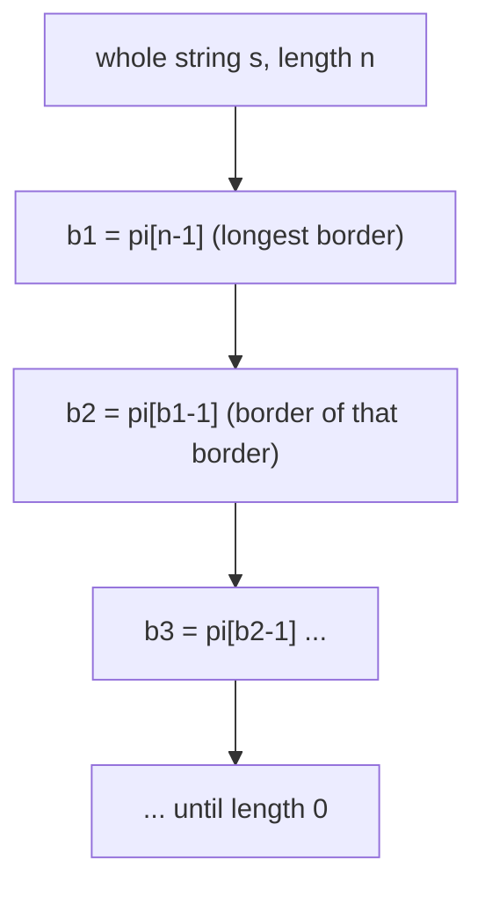

# Finding Borders (Prefix Function / Z-Function)

| Meta | Value |
|------|-------|
| Source | CSES Problem Set — String Algorithms |
| Difficulty | Medium |
| Topics | Prefix Function (KMP failure), Borders, Strings |
| Link | https://cses.fi/problemset/task/1732 |

---

## Problem Statement
A **border** of a string is a non-empty substring that is **both a proper prefix and a proper
suffix**. Given a string `s`, output the lengths of **all** its borders in increasing order.

**Example**
```
s = "abcababcab"
Borders: "ab" (len 2) and "abcab" (len 5)
Output: 2 5
```

---

## Borders and the Prefix Function

The **prefix function** `pi[i]` (the heart of KMP) is the length of the longest proper border of
the prefix `s[0..i]`. So `pi[n-1]` gives the **longest border of the whole string**.

But the problem wants **all** borders. Here's the beautiful structural fact:

> The borders of `s` are exactly:
> the longest border `b₁ = pi[n-1]`, then the longest border of that border
> `b₂ = pi[b₁ - 1]`, then `b₃ = pi[b₂ - 1]`, … until 0.

In other words, **a border of a border is itself a border** — chasing the prefix-function chain
enumerates every border from longest to shortest.



---

## Step 1: Compute the Prefix Function

`pi[i]` = longest proper prefix of `s[0..i]` that is also a suffix of it.

```python
def prefix_function(s):
    n = len(s)
    pi = [0] * n
    k = 0                              # length of current longest border
    for i in range(1, n):
        while k > 0 and s[i] != s[k]:
            k = pi[k - 1]              # fall back along border chain
        if s[i] == s[k]:
            k += 1
        pi[i] = k
    return pi
```

```cpp
vector<int> prefix_function(const string& s) {
    int n = s.size();
    vector<int> pi(n, 0);
    int k = 0;                              // length of current longest border
    for (int i = 1; i < n; i++) {
        while (k > 0 && s[i] != s[k])
            k = pi[k - 1];                  // fall back along border chain
        if (s[i] == s[k])
            k += 1;
        pi[i] = k;
    }
    return pi;
}
```

The `while k > 0 ... k = pi[k-1]` line is the same "shrink to the next-best border on mismatch"
idea that powers KMP search.

---

## Step 2: Collect Borders via the Chain

```python
def all_borders(s):
    pi = prefix_function(s)
    borders = []
    b = pi[-1]                         # longest border length
    while b > 0:
        borders.append(b)
        b = pi[b - 1]                  # longest border of the current border
    borders.reverse()                  # increasing order
    return borders
```

```cpp
vector<int> all_borders(const string& s) {
    vector<int> pi = prefix_function(s);
    vector<int> borders;
    int b = pi.back();                      // longest border length
    while (b > 0) {
        borders.push_back(b);
        b = pi[b - 1];                      // longest border of the current border
    }
    reverse(borders.begin(), borders.end()); // increasing order
    return borders;
}
```

---

## Trace — `s = "abcababcab"` (n = 10)

Compute `pi`:
```
index: 0  1  2  3  4  5  6  7  8  9
s:     a  b  c  a  b  a  b  c  a  b
pi:    0  0  0  1  2  1  2  3  4  5
```

- `pi[9] = 5`: the prefix `"abcab"` is both a prefix and a suffix → border length **5**.
- Chase the chain from `b = 5`: `pi[5-1] = pi[4] = 2` → border length **2**.
- Next: `pi[2-1] = pi[1] = 0` → stop.

Borders collected: `[5, 2]` → reversed → `2 5` ✓.

Verify: `"ab"` (len 2) is a prefix and suffix of `s`; `"abcab"` (len 5) is too. No others.

---

## Why "Border of a Border" Holds

If `B` is a border of `s` (prefix = suffix of length `b`), and `B'` is a border of `B`, then
`B'` is a prefix of `B` (hence of `s`) **and** a suffix of `B` (hence of `s`). So `B'` is also a
border of `s`. Conversely every border of `s` shorter than `b` is a border of `B`. Thus the set
of borders is precisely the prefix-function chain `pi[n-1], pi[pi[n-1]-1], …`.

---

## Complexity

| Metric | Value |
|--------|-------|
| Prefix function | O(n) (amortized; `k` increases ≤ n total, so decreases ≤ n total) |
| Border chain | O(n) (each step strictly shrinks `b`) |
| **Total** | **O(n)** |

---

## Related CSES / Competitive Problems
- **Finding Periods** (CSES 1733): the periods of `s` are `n − border` for each border —
  directly derived from this chain.
- **Pattern Positions / String Matching:** same prefix-function machinery.

## Takeaway
The **prefix function** encodes far more than KMP search: its **fail-link chain** enumerates all
borders, all periods, and supports automaton construction. "A border of a border is a border" is
the elegant recursion at its core.
