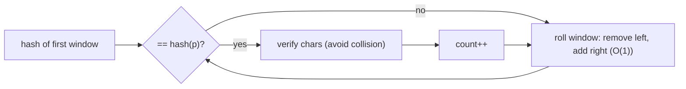

# String Matching (Rabin–Karp & Z-Algorithm)

| Meta | Value |
|------|-------|
| Source | CSES Problem Set — String Algorithms |
| Difficulty | Medium |
| Topics | String Hashing, Rolling Hash, Z-Algorithm, KMP |
| Link | https://cses.fi/problemset/task/1753 |

---

## Problem Statement
Given a string `s` and a pattern `p`, count how many times `p` occurs as a substring of `s`
(occurrences may overlap). With `|s|` up to `10⁶`, the naive `O(|s|·|p|)` is too slow — we need
**O(|s| + |p|)**.

**Example**
```
s = "saippuakauppias", p = "pp"
Output: 2        // "...ip[pp]... wait: positions of "pp": index 4 and 9
```

---

## Approach 1: Rabin–Karp (Polynomial Rolling Hash)

Treat a string as a number in base `B` modulo a large prime `M`:

$$
H(t) = \Big(\sum_{i=0}^{m-1} t_i \cdot B^{\,m-1-i}\Big) \bmod M
$$

Compute `H(p)` once. Then slide a window of length `m = |p|` across `s`, maintaining the window
hash in **O(1)** per step via the **rolling** update:

$$
H_{\text{new}} = \big( (H_{\text{old}} - s_{\text{out}} \cdot B^{\,m-1}) \cdot B + s_{\text{in}} \big) \bmod M
$$

On a hash match, (optionally) verify character-by-character to rule out the rare collision.



```python
def rabin_karp(s, p):
    n, m = len(s), len(p)
    if m > n:
        return 0
    B, M = 257, (1 << 61) - 1          # base and a large prime modulus
    hp = 0
    hs = 0
    power = 1                          # B^(m-1) mod M
    for i in range(m):
        hp = (hp * B + ord(p[i])) % M
        hs = (hs * B + ord(s[i])) % M
        if i < m - 1:
            power = (power * B) % M
    count = 0
    for i in range(n - m + 1):
        if hs == hp and s[i:i + m] == p:   # verify on hash hit
            count += 1
        if i < n - m:                       # roll to next window
            hs = (hs - ord(s[i]) * power) % M
            hs = (hs * B + ord(s[i + m])) % M
            hs %= M
    return count
```

```cpp
long long rabin_karp(const string& s, const string& p) {
    int n = s.size(), m = p.size();
    if (m > n)
        return 0;
    long long B = 257, M = (1LL << 61) - 1;    // base and a large prime modulus
    long long hp = 0, hs = 0;
    long long power = 1;                        // B^(m-1) mod M
    for (int i = 0; i < m; i++) {
        hp = ((__int128)hp * B + (unsigned char)p[i]) % M;
        hs = ((__int128)hs * B + (unsigned char)s[i]) % M;
        if (i < m - 1)
            power = (__int128)power * B % M;
    }
    long long count = 0;
    for (int i = 0; i + m <= n; i++) {
        if (hs == hp && s.substr(i, m) == p)   // verify on hash hit
            count += 1;
        if (i < n - m) {                        // roll to next window
            hs = (hs - (__int128)(unsigned char)s[i] * power % M) % M;
            if (hs < 0) hs += M;
            hs = ((__int128)hs * B + (unsigned char)s[i + m]) % M;
        }
    }
    return count;
}
```

> Use a big modulus (e.g. `2⁶¹−1`) or **double hashing** (two mods) to make collisions
> astronomically unlikely in adversarial inputs — competitive judges include anti-hash tests.

---

## Approach 2: Z-Algorithm (Deterministic O(n+m))

Build the string `t = p + '#' + s` (with a separator not in either). Compute the **Z-array**,
where `Z[i]` = length of the longest substring starting at `i` that matches a **prefix** of `t`.
Wherever `Z[i] == m` (the pattern length), an occurrence of `p` starts there.

### What the Z-array means
```
t = a a b # a a b a a b
Z =  - 1 0 0 3 1 0 3 1 0
```
`Z[i] = k` says `t[0..k-1] == t[i..i+k-1]`. If that equals `|p|`, the whole pattern matched.

```python
def z_function(t):
    n = len(t)
    z = [0] * n
    l = r = 0                          # [l, r] = current rightmost Z-box
    for i in range(1, n):
        if i < r:
            z[i] = min(r - i, z[i - l])    # reuse mirror value
        while i + z[i] < n and t[z[i]] == t[i + z[i]]:
            z[i] += 1                  # extend match
        if i + z[i] > r:
            l, r = i, i + z[i]         # update the Z-box
    return z

def count_occurrences_z(s, p):
    t = p + '\x00' + s                 # separator guaranteed not in input
    z = z_function(t)
    m = len(p)
    return sum(1 for v in z if v == m)
```

```cpp
vector<int> z_function(const string& t) {
    int n = t.size();
    vector<int> z(n, 0);
    int l = 0, r = 0;                          // [l, r] = current rightmost Z-box
    for (int i = 1; i < n; i++) {
        if (i < r)
            z[i] = min(r - i, z[i - l]);       // reuse mirror value
        while (i + z[i] < n && t[z[i]] == t[i + z[i]])
            z[i] += 1;                          // extend match
        if (i + z[i] > r) {
            l = i;
            r = i + z[i];                       // update the Z-box
        }
    }
    return z;
}

long long count_occurrences_z(const string& s, const string& p) {
    string t = p + '\0' + s;                    // separator guaranteed not in input
    vector<int> z = z_function(t);
    int m = p.size();
    long long cnt = 0;
    for (int v : z)
        if (v == m)
            cnt += 1;
    return cnt;
}
```

### Why O(n+m)?
The `r` pointer only moves **forward** across the whole string. The inner `while` loop's total
iterations are bounded by how far `r` advances — at most `n`. So the algorithm is linear, never
re-scanning matched regions (the same amortized argument as KMP).

---

## Trace — Z-array detecting a match

For `p = "aab"`, `t = "aab#aabaab"`:
- At `i = 4` (the `s`-side `"aab..."`), the match extends to length 3 = `|p|` → `Z[4] = 3` →
  occurrence at `s` position `4 − (m+1) = 0`.
- At `i = 7`, `Z[7] = 3` again → another occurrence.

Each `Z[i] == 3` flags one match — counted in O(1).

---

## Complexity

| Approach | Time | Space | Notes |
|----------|------|-------|-------|
| Naive | O(n·m) | O(1) | too slow |
| Rabin–Karp | O(n+m) avg | O(1) | tiny collision risk; verify or double-hash |
| **Z-algorithm** | **O(n+m)** | O(n+m) | deterministic, no collisions |
| KMP | O(n+m) | O(m) | prefix-function based |

---

## When to Use Which
- **Z / KMP:** deterministic, safe for adversarial inputs, single pattern.
- **Rabin–Karp:** elegant for **multiple** patterns of the same length, 2-D pattern search, or
  comparing arbitrary substrings (precompute prefix hashes for O(1) substring hash).

## Takeaway
Linear pattern matching comes in two flavors: **hashing** (Rabin–Karp, probabilistic but
flexible) and **automaton/prefix** methods (Z, KMP, deterministic). Both exploit *reusing
previously computed information* to avoid re-scanning the text.
